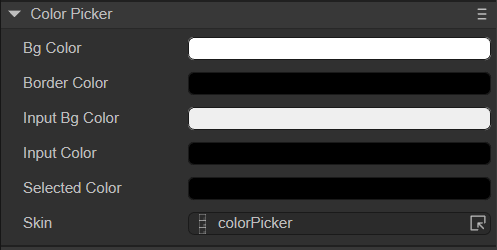
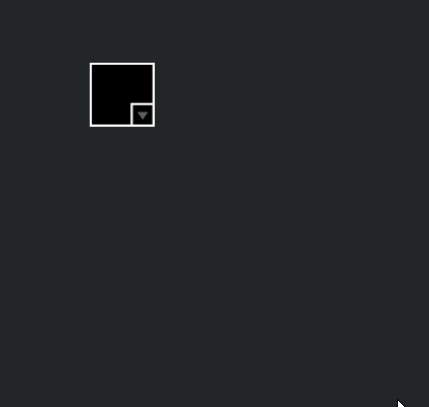

# Color picker component (ColorPicker)

ColorPicker inherits from UIComponent. The ColorPicker component will display a list of multiple color samples from which the user can select a color. For detailed usage of ColorPicker, please refer to [ColorPicker API](https://layaair.com/3.x/api/Chinese/index.html?version=3.0.0&type=2D&category=UI&class=laya.ui.ColorPicker).


## 1. Create ColorPicker through LayaAir IDE

### 1.1 Create ColorPicker

As shown in Figure 1-1, click to select the ColorPicker component in the widget panel, drag and drop it into the page editing area, or create it by right-clicking in the hierarchy window to add the ColorPicker component to the page.


(Picture 1-1)


### 1.2 ColorPicker properties

The unique properties of ColorPicker are as follows:



(Figure 1-2)

| Properties	| Function	|
| ------------- | ---------------------------------------------------- |
| bgColor   	| Color picker panel background color	|
| borderColor | Color picker panel border color	|
| inputBgColor | The background color of the color picker panel text box	|
| inputColor	| The color of the text font in the color picker panel text box	|
| selectedColor | ColorPicker currently selected color	|
| skin      	| The skin texture resource of the component will change according to the selected color at runtime |

After the ColorPicker component gets the color value, it can be assigned in the project. It is very simple under the visual operation of the IDE. Just click on the color that needs to be adjusted and select it in the color panel.


## 2. Create ColorPicker through code

When writing code, it is inevitable to control the UI through code, create the `UI_ColorPicker` class, and set ColorPicker related properties through code. The sample code is as follows:

```typescript
const { regClass, property } = Laya;

@regClass()
export class UI_ColorPicker extends Laya.Script {

    private skin: string = "atlas/comp/colorPicker.png";

	constructor() {
    	super();
	}

	// Executed after the component is activated. At this time, all nodes and components have been created. This method is only executed once.
	onAwake(): void {
   	 Laya.loader.load(this.skin).then( ()=>{
        	this.onColorPickerSkinLoaded();
    	} );
    }

    private onColorPickerSkinLoaded(e: any = null): void {
   	 let colorPicker: Laya.ColorPicker = new Laya.ColorPicker();
   	 colorPicker.selectedColor = "#ff0033";
   	 colorPicker.skin = this.skin;
   	 colorPicker.pos(100, 100);
   	 colorPicker.changeHandler = new Laya.Handler(this, this.onChangeColor, [colorPicker]);
   	 this.owner.addChild(colorPicker);

   	 this.onChangeColor(colorPicker);
    }

    private onChangeColor(colorPicker: Laya.ColorPicker, e: any = null): void {
   	 console.log(colorPicker.selectedColor);
    }
}
```

The running effect is shown in the following animation:



(Animation 2-1)


