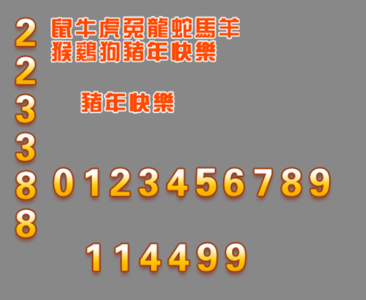

# Font slice component (FontClip)

The FontClip component essentially cuts the bitmap proportionally from the direction. FontClip inherits from Clip. For the component script interface of FontClip, please refer to [FontClip API](https://layaair.com/3.x/api/Chinese/index.html?version=3.0.0&type=2D&category=UI&class=laya.ui.FontClip).


## 1. Use LayaAir IDE to create FontClip

### 1.1 Create FontClip

Creating FontClip is very simple and can be achieved through the visual operation of the IDE with just the mouse. As shown in Figure 1-1, you can right-click in the `Hierarchy' window to create it, or you can drag and drop from the `Widgets' window to add it.


(Picture 1-1)

In LayaAir, it comes with a font slice image resource (fontClip.png), as shown in Figure 1-2.


(Figure 1-2)


### 1.2 Introduction to FontClip properties

The unique properties of FontClip are as follows:


(Figure 1-3)

| Properties	| Function description	|
| --------- | ------------------------------------------------------------ |
| skin  	| The texture of the font slice component requires adding image resources.	|
| sizeGrid | Valid scaling grid data (nine-square grid information) of the bitmap: top margin, right margin, bottom margin, left margin, whether to repeat filling. |
| group 	| Load groups. After setting, resources can be managed by groups.	|
| align 	| There are three horizontal alignment methods. left: aligned to the left, center: aligned to the center, right: aligned to the right. |
| sheet 	| Bitmap content range. When the bitmap content has a line break, spaces need to be added at the line break position. |
| value 	| Bitmap digital content.	|
| spacex	| X direction item spacing, in pixels.	|
| spacey	|Y direction item interval, in pixels.	|
| direction | Bitmap content arrangement direction, there are two options. horizontal: arranged in the horizontal direction, vertical: arranged in the vertical direction. |

FontClip is more suitable for font slicing than Clip, so it is called FontClip. FontClip is used more and more widely than Clip in games. FontClip is also recommended by us. FontClip will be used for some special texts or fonts.

#### 1. How to use sheet and value attributes

FontClip If the bitmap content is a graphic, it can be cut into equal parts into independent units and processed according to index.

Demonstrate the use of the sheet attribute, as shown in Figure 1-4. The sheet value is filled in with the 15 characters shown in Figure 1-2 according to the bitmap content. The word "sheep" and the word "monkey" are divided into segments, so a space must be added between these two words to let the engine know that the bitmap text is arranged in multiple lines. Then enter the content you want to display in value to display it.


(Figure 1-4)

In short, the sheet is equivalent to a bitmap slicing template, and the value will be directly compared with the content in the sheet. The value is very convenient and flexible.


#### 2. How to use SpaceX and SpaceY attributes

SpaceX is used to adjust the interval in the X direction. It needs to be used in conjunction with Direction. As shown in Figure 1-5, set the Direction to horizontal.


(Figure 1-5)

SpaceY is used to adjust the interval in the Y direction. It needs to be used in conjunction with Direction. As shown in Figure 1-6, set the Direction to vertical.


(Figure 1-6)


### 1.3 Script control FontClip

In the Scene2D property settings panel, add a custom component script. Then, drag the FontClip into its exposed property entry. Here is a sample code to implement script control of FontClip:

```typescript
const { regClass, property } = Laya;

@regClass()
export class NewScript extends Laya.Script {

	@property( { type : Laya.FontClip } )
	public fontclp: Laya.FontClip;

	constructor() {
    	super();
	}

	// Executed after the component is activated. At this time, all nodes and components have been created. This method is only executed once.
	onAwake(): void {
    	this.fontclp.pos(Laya.stage.width >> 1, Laya.stage.height >> 1); //Position
    	this.fontclp.size(500, 60); //Size
    	this.fontclp.pivot(this.fontclp.width/2, this.fontclp.height/2); //Pivot Point

    	this.fontclp.skin = "atlas/comp/fontClip_num.png";
    	this.fontclp.sheet = "0123456789";
    	this.fontclp.value = "5201314";

    	this.fontclp.direction = "horizontal"; //Bitmap arrangement direction
    	this.fontclp.spaceX = 50; //Horizontal spacing

    	// this.fontclp.direction = "vertical"; //Bitmap arrangement direction
    	// this.fontclp.spaceY = 10; //Vertical spacing

	}
}
```


## 2. Code to create FontClip

Sometimes, you don't want the FontClip component to be on the stage from the beginning, but add it when you need it. This needs to be created through code. In the property settings panel of Scene2D, add a custom component script and run the code example:



(Figure 2-1)

The sample code is as follows:

```typescript
const { regClass, property } = Laya;

@regClass()
export class UI_FontClip extends Laya.Script {

	private TestClipNum: string = "atlas/comp/fontClip_num.png";
	private _ClipNum: string = "atlas/comp/fontClip_num.png";
	private _ClipNum1: string = "atlas/comp/fontClip_num.png";
	private TestFontClip: string = "atlas/comp/fontClip.png";
	private _FontClip: string = "atlas/comp/fontClip.png";

	//Execute after the component is activated. At this time, all nodes and components have been created. This method is only executed once.
	onAwake(): void {
    	Laya.loader.load([this.TestClipNum, this.TestFontClip, this._ClipNum, this._FontClip, this._ClipNum1]).then( ()=>{
        	this.ShowContent();
    	} );
	}

	private ShowContent(): void {
    	var clipnum: Laya.FontClip = new Laya.FontClip(this._ClipNum);
    	var fontClip: Laya.FontClip = new Laya.FontClip(this._FontClip);
    	var testFontClip: Laya.FontClip = new Laya.FontClip(this.TestFontClip);
    	var testClipNum: Laya.FontClip = new Laya.FontClip(this.TestClipNum);
    	var clipnum1: Laya.FontClip = new Laya.FontClip(this._ClipNum1);

    	clipnum.pos(240, 400);
    	clipnum.size(250, 50);
    	clipnum.sheet = "0123456789";
    	clipnum.value = "114499";
    	clipnum.spaceY = 10;

    	testClipNum.pos(200, 300);
    	testClipNum.sheet = "0123456789";
    	testClipNum.value = "0123456789";

    	clipnum1.pos(150, 100);
    	clipnum1.direction = "vertical";
    	clipnum1.sheet = "0123456789";
    	clipnum1.value = "223388";

    	fontClip.pos(240, 200);
    	fontClip.sheet = "Happy Year of Rat, Ox, Tiger, Rabbit, Dragon, Snake, Horse and Goat, Monkey, Rooster, Dog and Pig";
    	fontClip.value = "Happy Year of the Pig";
    	fontClip.spaceY = 10;

    	testFontClip.pos(200, 100);
    	testFontClip.sheet = "Happy Year of Rat, Ox, Tiger, Rabbit, Dragon, Snake, Horse, Sheep, Monkey, Rooster, Dog and Pig";
    	testFontClip.value = "Happy Year of the Rat, Ox, Tiger, Rabbit, Dragon, Snake, Horse, Sheep, Monkey, Rooster, Dog and Pig";
    	testFontClip.spaceY = 10;

    	this.owner.addChild(clipnum);
    	this.owner.addChild(fontClip);
    	this.owner.addChild(testFontClip);
    	this.owner.addChild(testClipNum);
    	this.owner.addChild(clipnum1);
	}
}
```


> Usually FontClip can already meet the basic needs of developers. If there are special circumstances, it can be achieved through BitmapFont bitmap font.
>
> For the content of bitmap fonts, please refer to ["Advanced Use of Text"](../../../../2D/advanced/useText/readme.md).

