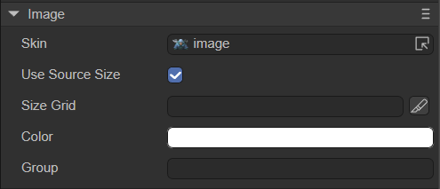
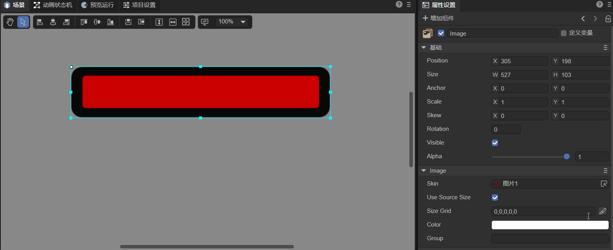

# Image component (Image)

## 1. Create Image component through LayaAir IDE

###    	1.1 Create image

Image is the most common component for displaying images in UI, and is used to display bitmap images. You can set the skin property of the Image component to change the image rendered by the Image component. The Image component supports nine-square data setting, which is used to achieve the effect of image display without distortion after image enlargement. For the script interface of the Image component, please refer to [Image API](https://layaair.com/3.x/api/Chinese/index.html?version=3.0.0&type=2D&category=UI&class=laya.ui.Image).

As shown in Figure 1-1, you can right-click in the `Hierarchy' window to create it, or you can drag and drop from the `Widgets' window to add it.


(Picture 1-1)

After the Image component is dragged and dropped into the editing area, the display effect is shown in Figure 1-2:


(Figure 1-2)


### 1.2 Common attributes

The unique properties of the Image component are as follows:



(Figure 1-3)

| **Properties**	| **Function description**	|
| --------------- | ------------------------------------------------------------ |
| skin        	| The texture of the image component requires adding bitmap resources.	|
| use source size | Use the original size of the bitmap resource.	|
| sizeGrid    	| Valid scaling grid data of the bitmap (nine-square grid information): top margin, right margin, bottom margin, left margin, whether to repeat filling. |
| color       	| Change picture color.	|
| Group       	| Load groups. After setting, resources can be managed by groups.	|

Here is a detailed explanation of the settings of the Nine Palace Grid. Suppose there is a bitmap, as shown in Figure 1-4. Its border color exactly meets the requirements of a pop-up window (this is just an example, the specific color matching should be selected according to the needs), but the length of the picture is too short. To do The pop-up window needs to be elongated.


(Figure 1-4)

The effect after stretching is shown in Figure 1-5. You can see that the black border will be stretched accordingly.


(Figure 1-5)

If you only want to enlarge the red area and keep the black border at its original thickness, then you need to use sizeGrid. The specific settings are shown in the animation 1-6. Finally, you can see that the thickness of the enlarged pop-up window border remains unchanged, and the red part in the middle is the effective zoom area.



(Animation 1-6)

Repeat filling means that if checked, when the image is enlarged, the effective zoom area will repeatedly fill the enlarged area without enlarging it. The effect is shown in Figure 1-7.


(Figure 1-7)


### 1.3 Script control Image

Sometimes, to set Image-related properties through code, you need to use a script. In the Scene2D property settings panel, add a custom component script. Then, drag the Image component into its exposed property entry. Here is a sample code to implement script control of Image:

```typescript
const { regClass, property } = Laya;

@regClass()
export class NewScript extends Laya.Script {

	@property({ type: Laya.Image })
	public img: Laya.Image;

	constructor() {
    	super();
	}

	/**
 	* Executed after the component is activated. At this time, all nodes and components have been created. This method is only executed once.
 	*/
	onAwake(): void {
    	this.img.skin = "resources/layaAir.png";//Set the skin
    	this.img.useSourceSize = true;//Set the image size to the source size
    	this.img.color = "#0000FF";//Set the color to blue
	}

}
```


## 2. Create Image component through code

Sometimes, you don't want the image component to be on the stage from the beginning, but add it when you need it. This needs to be created through code. In the property settings panel of Scene2D, add a custom component script and create the Image in the code. The sample code is as follows:

```typescript
const { regClass, property } = Laya;

@regClass()
export class UI_Image extends Laya.Script {

	constructor() {
    	super();
	}

	/**
 	* Executed after the component is activated. At this time, all nodes and components have been created. This method is only executed once.
 	*/
	onAwake(): void {
   	 this.setup();
    }

    private setup(): void {
   	 let img: Laya.Image = new Laya.Image("resources/layaAir.png");
   	 img.pos(165, 62.5);
   	 this.owner.addChild(img);
    }
}
```


