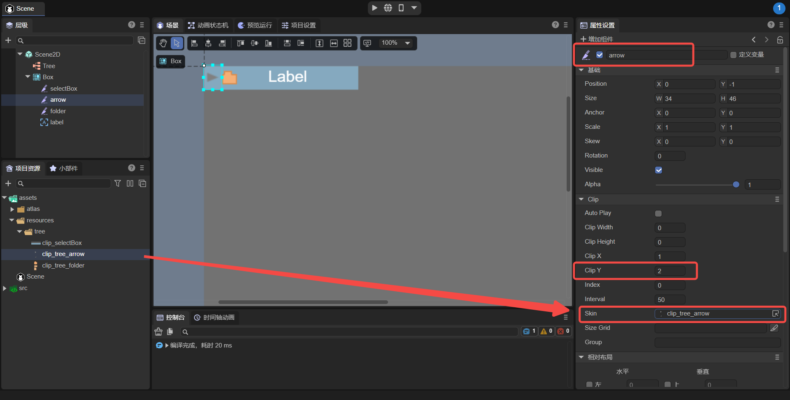
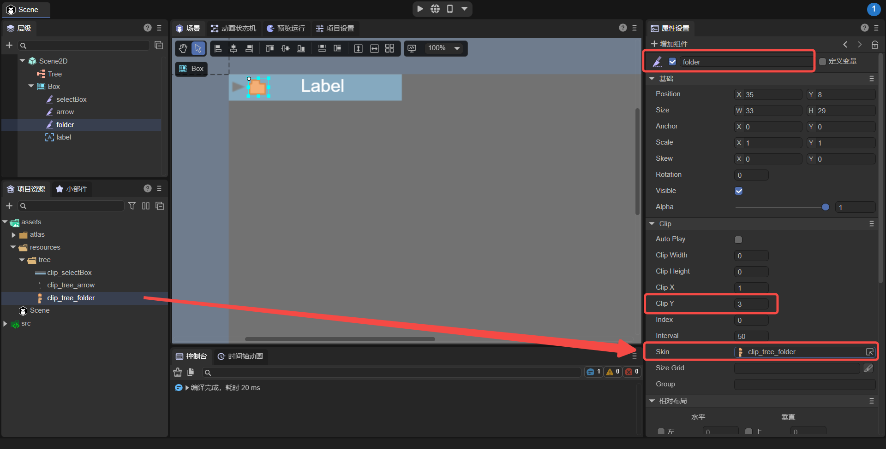
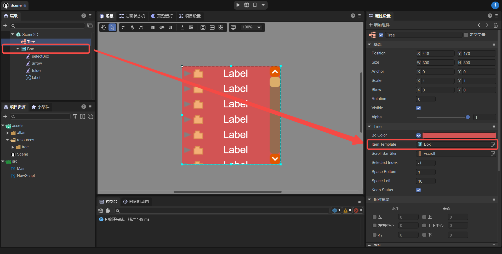

# Tree list component (Tree)

## 1. Create Tree component through LayaAir IDE

The Tree component is used to display a tree structure. Users can view hierarchical data arranged as an expandable tree. For the script interface of the Tree component, please refer to [Tree API](https://layaair.com/3.x/api/Chinese/index.html?version=3.0.0&type=2D&category=UI&class=laya.ui.Tree).

### 1.1 Composition of Tree

#### 1.1.1 Tree component mainly consists of two parts:

**1. Item cell** (can be Box, custom page)

Item cells usually consist of four parts:

(1) A cell selection status slice animation Clip;

(2) A folding arrow slice animation Clip;

(3) A file status slice animation Clip;

(4) Other content elements of the cell;

**2. Vertical scroll bar** VScrollBar


#### 1.1.2 Image resource example of Tree component

- Cell selection state slice animation Clip resource (clip_selectBox.png):

  The number of slices is 2, and the slice index starts from 0 and represents: cell hover state chart (white), cell unselected state chart.


(Picture 1-1)

- Folding arrow slice animation Clip resource (clip_tree_arrow.png):

  The number of slices is 2, and the slice index starts from 0 and represents in order: the folder node folded state diagram, and the folder node expanded state diagram.


(Figure 1-2)

- File status slice animation Clip resource (clip_tree_folder.png):

  The number of slices is 3, and the slice index starts from 0 and represents in order: the folder node collapsed state diagram, the folder node expanded state diagram, and the non-folder node state diagram;


(Figure 1-3)


### 1.2 Create Tree component

#### 1.2.1 Edit the list items of the Tree component

(1) First create a Clip component in Snce2D, set the name attribute value of this Clip component object to selectBox, set the value of the attribute ClipY to 2, and then animate the slice of a cell selection state from the project resource panel (clip_selectBox. png), drag it into the Skin property of the Clip component you just created, as shown in Figure 1-4.

> Note: The name attribute value of the selection state slice animation (Clip component) object here must be set to selectBox. Only in this way can the program recognize it and realize the function of the display state of this Clip component object changing following the selection state of the unit item. , otherwise this Clip object will be recognized as a normal display object of this unit item.


(Figure 1-4)

(2) Create a Clip component in Snce2D, set the name attribute value of this Clip component object to arrow, set the value of the attribute ClipY to 2, and then animate the folding arrow slice of a cell from the project resource panel (clip_tree_arrow.png ) and drag it into the Skin property of the Clip component just created, as shown in Figure 1-5.

> Note: The name attribute value of the folding arrow slice animation (Clip component) here must be set to arrow, only in this way can the program recognize it and realize the function of clicking this Clip object to open or collapse the tree node. Otherwise the Clip object will be recognized as a normal display object for this cell item.



(Figure 1-5)

(3) Create a Clip component in Scene2D, set the name attribute value of this Clip component object to folder, set the value of the attribute ClipY to 3, and then slicing the file status of a cell from the project resource panel (clip_tree_folder.png ) and drag it into the Skin property of the Clip component just created, as shown in Figure 1-6.

> Note: The name attribute value of the file status slice animation (Clip component) here must be set to folder. Only in this way can the program recognize it and realize that the display state of this Clip component object follows the folding, expansion, and node type of the unit item ( whether there are child nodes). Otherwise the Clip object will be recognized as a normal display object for this cell item.



(Figure 1-6)

(4) Drag in the normal display object of this unit item. Here we take Label as an example. Select and drag a Label component object from the resource panel. Here, set the attribute name value of this Label object to label (note that "l" is lowercase) to facilitate assigning it in the script. Then set the display-related properties of the Label object to make it look more beautiful.

> Note: The value of this name attribute can be customized (but it must be the same as the name assigned to the Tree object).


(Figure 1-7)

Then, drag the nodes created in steps (1) to (4) into a Box container component, and arrange them reasonably, as shown in Figure 1-8.


(Figure 1-8)


#### 1.2.2 Specify the list rendering items of the Tree component

Create a Tree component and set the Item Template property of the Tree component to the Box just created in 1.2.1, as shown in Figure 1-9.



(Figure 1-9)


#### 1.2.3 Add scroll bars to the Tree component

When the Tree has too many list items, you need to add a scroll bar. As shown in Figure 1-10, add a scroll bar skin to the Tree component property scrollBarSkin.


(Figure 1-10)

> Attributes such as background color are also set here. For detailed description of attributes, see Section 1.3.


#### 1.2.4 Assigning values ​​to Tree objects in code

In the Scene2D property settings panel, add a custom component script. Then drag the Tree node into its exposed property entrance. An example of assigning a value to the Tree object in the code is as follows:

```typescript
const { regClass, property } = Laya;

@regClass()
export class NewScript extends Laya.Script {

	@property({ type: Laya.Tree })
	public tree: Laya.Tree;

	//Execute after the component is activated. At this time, all nodes and components have been created. This method is only executed once.
	onAwake(): void {
    	//Initialize the data source of the tree list
    	let treeData: string = "<data>";
    	//Assign values ​​to the Tree list
    	treeData +=
        	"<dir label='box1' isOpen='true'>" +
        	"<file label='child1 ' />" +
        	"<file label='child2 ' />" +
        	"<file label='child3 ' />" +
        	"<file label='child4 ' />" +
        	"<file label='child5 ' />" +
        	"</dir>" +
        	"<dir label='box2' isOpen='false'>" +
        	"<file label='child1 ' />" +
        	"<file label='child2 ' />" +
        	"<file label='child3 ' />" +
        	"<file label='child4 ' />" +
        	"<file label='child5 ' />" +
        	"</dir>" +
        	"<dir label='box3' isOpen='true'>" +
        	"<file label='child1 ' />" +
        	"<file label='child2 ' />" +
        	"<file label='child3 ' />" +
        	"<file label='child4 ' />" +
        	"<file label='child5 ' />" +
        	"</dir>" ;
    	//Data source data tag needs to be spliced ​​with an end tag
    	treeData += "</data>";

    	//Parse the string into an xml object and return it
    	this.tree.xml = new Laya.XML(treeData);

	}
}
```
The values ​​assigned to the Tree list here are hard-coded simulation data. Among them, splicing simulation data can only have a two-layer structure at most, and deep-level structures are not supported.

In the above code, the `<dir></dir>` tag represents a folder, and `<file />` represents a file. `isOpen='true'` indicates whether the initial state of the folder is open. `label='XXX'` is to assign value to the label component in step (4) in 1.2.1.

> Note: Developers can refer to the code in Section 2 for the simulated data created by the program to deepen their understanding of xml data rules.


#### 1.2.5 Run in IDE to see the effect

The effect of operation is as follows:


(Animation 1-11)

It can be seen that the display selection status slice changes with the selection status of the unit item, the folding arrow slice changes with the opening or collapsing of the tree node, and the file status slice changes with the folding or expansion of the unit item.


### 1.3 Common properties of Tree component

The unique properties of the Tree component are as follows:


(Figure 1-12)

| **Properties**	| **Function description**	|
| ------------- | ------------------------------------------------------------ |
| bgColor   	| Background color. After checking, you can directly enter the color value, for example: `#ffffff`, or click the color picker on the right side of the input bar to select a color. |
| itemTemplate | Rendering unit, specific usage has been given in the steps in Section 1.2.	|
| scrollBarSkin | Scroll bar skin.	|
| selectedIndex | The index of the currently selected item. -1 means there is no selection in the initial state.	|
| spaceBottom | The distance between each item. The unit is pixels.	|
| spaceLeft 	| The left indent distance of the child items. The unit is pixels.	|
| keepstatus	| After the data source changes, whether to keep the previous open state, the default is true. true: Keep the previous open state. false: Do not keep the previously opened state. |


## 2. Create Tree component through code

When developers write code, they inevitably control the UI through code. In LayaAir IDE, create a custom component script, name it UI_Tree, and then set Tree-related properties through code.

**Example running effect:**


(Animation 2-1)

**Sample code:**

```typescript
const { regClass, property } = Laya;

@regClass()
export class UI_Tree extends Laya.Script {

	constructor() {
    	super();
	}

	// Executed after the component is activated. At this time, all nodes and components have been created. This method is only executed once.
	onAwake(): void {

    	var res: any[] = ["atlas/comp/vscroll.png",
        	"atlas/comp/vscroll$bar.png",
        	"atlas/comp/vscroll$down.png",
        	"atlas/comp/vscroll$up.png",
        	"resources/tree/clip_selectBox.png",
        	"resources/tree/clip_tree_folder.png",
        	"resources/tree/clip_tree_arrow.png"];

    	Laya.loader.load(res).then(() => {
        	this.onLoadComplete();
    	});
	}

	private onLoadComplete(e: any = null): void {
    	//Initialize the data source of the tree list
    	var treeData: string = "<data>";

    	//Simulation data created by the program, simulation tree list data, data source of splicing list
    	for (let i: number = 0; i < 5; i++) {
        	//Splice the directory data structure (you can define the label name yourself in the item label, and end with whatever you start with, but the title here must correspond to the label text node name of the list rendering unit)
        	treeData += "<item title='Directory" + (i + 1) + "' isOpen='true'>";
        	for (let j: number = 0; j < 5; j++) {
            	//The structure of splicing sub-items (that is, there will be no more expansion), (the subpage label here can also be arbitrarily defined by its own name. The title here must correspond to the label text node name of the list rendering unit)
            	treeData += "<subpage title='sub-item title" + (j + 1) + "' />";
        	}
        	//The outer layer of each sub-item must have a complete closing tag. The tag name used at the beginning of the directory should be used at the end.
        	treeData += "</item>";
    	}

    	//Data source data tag needs to be spliced ​​with an end tag
    	treeData += "</data>";
   	 

    	var tree: Laya.Tree = new Laya.Tree();
    	tree.scrollBarSkin = "atlas/comp/vscroll.png";
    	//Add list rendering items
    	tree.itemRender = Item;
    	// Parse tree data
    	tree.xml = new Laya.XML(treeData);
    	tree.size(300, 300);
    	tree.x = (Laya.stage.width - tree.width) / 2;
    	tree.y = (Laya.stage.height - tree.height) / 2;
    	tree.bgColor = "#d25454";
    	this.owner.addChild(tree);
	}
}


class Item extends Laya.Box {
	constructor() {
    	super();
    	this.right = 0;
    	this.left = 0;

    	var selectBox: Laya.Clip = new Laya.Clip("resources/tree/clip_selectBox.png", 1, 2);
    	selectBox.name = "selectBox";//When setting the name of selectBox to "selectBox", it will be recognized as the background of the item in the tree structure.
    	selectBox.height = 32;
    	selectBox.x = 13;
    	selectBox.left = 12;
    	this.addChild(selectBox);

    	var folder: Laya.Clip = new Laya.Clip("resources/tree/clip_tree_folder.png", 1, 3);
    	folder.name = "folder";//When setting the name of folder to "folder", the folder opening status chart will be recognized as a tree structure.
    	folder.x = 14;
    	folder.y = 4;
    	this.addChild(folder);

    	var label: Laya.Label = new Laya.Label;
    	label.name = "title";//When setting the name of label to "title", this value will be used for tree structure data assignment.
    	label.fontSize = 20;
    	label.color = "#FFFFFF";
    	label.padding = "6,0,0,13";
    	label.width = 150;
    	label.height = 30;
    	label.x = 33;
    	label.y = 1;
    	label.left = 33;
    	label.right = 0;
    	this.addChild(label);

    	var arrow: Laya.Clip = new Laya.Clip("resources/tree/clip_tree_arrow.png", 1, 2);
    	arrow.name = "arrow";//When setting the name of arrow to "arrow", the folder opening status chart that is recognized as a tree structure will be opened.
    	arrow.x = 0;
    	arrow.y = 5;
    	this.addChild(arrow);
	}
}
```


 

