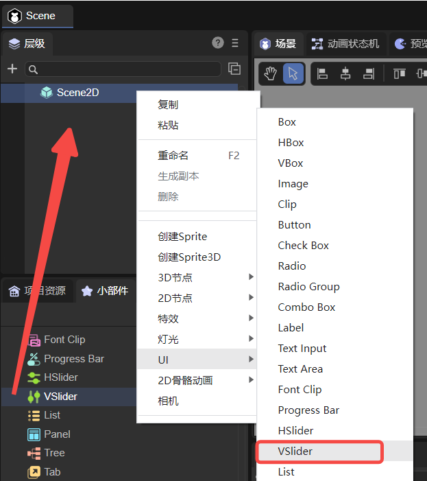
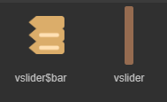
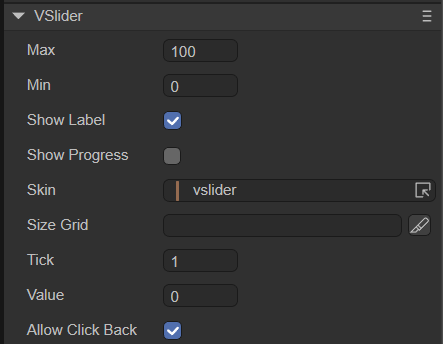
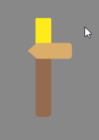
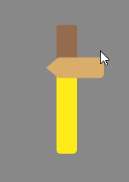

# Vertical slider component (VSlider)

## 1. Create VSlider component through LayaAir IDE

The HSlider and VSlider components are both subclasses of the Slider component. They represent horizontal slide bars and vertical slide bars respectively. Users can select values ​​by moving the slider between slider tracks. Commonly used for example, player progress control, volume control, numerical adjustment on some UI, etc. The detailed properties of VSlider can be viewed in [API](https://layaair.com/3.x/api/Chinese/index.html?version=3.0.0&type=2D&category=UI&class=laya.ui.VSlider).

### 1.1 Create VSlider

As shown in Figure 1-1, you can right-click in the `'Hierarchy'` window to create it, or you can drag and drop from the `'Widgets'` window to add it.



(Picture 1-1)

Sliders can be made of two or three parts. If it is two parts, it includes the basemap resource `vslider.png` and the slider resource `vslider$bar.png`, as shown in Figure 1-2. Resources should have at least these two, otherwise the sliding function cannot be implemented.



(Figure 1-2)

If it is a three-part slide bar, it includes the slider resource `vslider$bar.png`, the progress bar resource `vslider$progress.png`, and the basemap resource `vslider.png`, as shown in Figure 1-3. If the progress bar resource component is missing, no error will be reported, but the progress will not be displayed.


(Figure 1-3)

>The progress bar resource `vslider$progress.png` can be interchanged with the base map resource `vslider.png`. After the exchange, the progress can be displayed in reverse.

The VSlider component created by LayaAir by default is composed of two parts. As shown in the animation 1-4, the VSlider component is arranged vertically. The slider track expands from top to bottom, and dragging the slider with the mouse will display numerical labels.


(Animation 1-4)


### 1.2 VSlider properties

The unique properties of VSlider are as follows:



(Figure 1-5)

| **Properties**	| **Function description**	|
| -------------- | ------------------------------------------------------------ |
| max        	| The value when the slider is dragged to the bottom, the default value is 100	|
| min        	| The value when the slider is dragged to the top, the default value is 0	|
| showLabel  	| Whether to display labels. The default is true. Dragging the slider during runtime will display the value.	|
| showProgress | Whether to display the progress bar. The default is false. If there is a progress bar resource `vslider$progress.png`, you can check this item |
| skin       	| Basemap resource for slider	|
| skinGrid	| Valid scaling grid data (nine-square grid data) of the slider basemap resource	|
| tick       	| The minimum unit of the slider scale value. The amount the value changes each time the slider is dragged. The default value is 1 |
| value      	| The current scale, that is, the current value of the slider, should be equal to max or min, or a value between them |
| allowClickBack | Whether to allow changing the value by clicking the slider. The default is false, which prohibits changing the value by clicking the slider. At this time, the only way to change the value is by dragging the slider. When it is true, you can click the target area of ​​the slider to quickly jump to the current scale and change the value |

After setting the value of attribute max of VSlider to 20, the value of attribute min to 0, and the value of attribute value to 5, the display effect is as follows:


(Figure 1-6)

Set the attribute showLabel to true, the attribute showProgress to true, and the attribute tick value to 3. The effect is as shown in the following animation:



(Animation 1-7)

The progress bar resource `vslider$progress.png` can be interchanged with the basemap resource `vslider.png`. The effect is as follows:



(Animation 1-8)


### 1.3 Script control VSlider

In the Scene2D property settings panel, add a custom component script. Then, drag the VSlider into its exposed property entry. You need to add the following sample code to implement script control VSlider:

```typescript
const { regClass, property } = Laya;

@regClass()
export class NewScript extends Laya.Script {

	@property({type:Laya.VSlider})
	public vslider: Laya.VSlider;

	//Execute after the component is activated. At this time, all nodes and components have been created. This method is only executed once.
	onAwake(): void {
    	this.vslider.pos(300,300);//slider position
    	this.vslider.skin = "resources/vslider.png";//slider basemap skin
    	this.vslider.value = 0.5;
    	this.vslider.max = 50;
    	this.vslider.min = 0;
    	this.vslider.tick = 1;
    	this.vslider.showProgress = true;//The resource vslider$progress.png must exist, otherwise an error will be reported
	}
}
```


## 2. Create VSlider component through code

Sometimes, you need to control UI components with code, create the UI_VSlider class, and set the VSlider through code. The following example creates a VSlider component using code and outputs its value on the console.

Sample code:

```typescript
const { regClass, property } = Laya;

@regClass()
export class UI_VSlider extends Laya.Script {

	constructor() {
    	super();
	}

	onAwake(): void {
   	 let skins: any[] = [];
   	 skins.push("vslider.png", "vslider$bar.png"); //Image resources come from "Engine API Usage Example"
   	 Laya.loader.load(skins, Laya.Handler.create(this, this.placeVSlider));
    }

    private placeVSlider(): void {
   	 let vs: Laya.Slider = new Laya.VSlider();
   	 vs.skin = "vslider.png";

   	 vs.height = 300;
   	 vs.pos(400, 50);
   	 vs.min = 0;
   	 vs.max = 100;
   	 vs.value = 50;
   	 vs.tick = 1;

   	 vs.changeHandler = new Laya.Handler(this, this.onChange);
   	 this.owner.addChild(vs);
    }

    private onChange(value: number): void {
   	 console.log("Slider position: " + value);
    }
}
```

running result:


(Animation 2-1)


