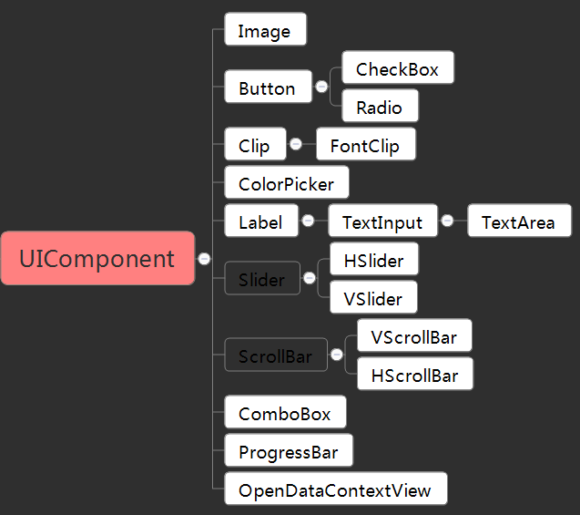
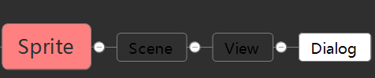
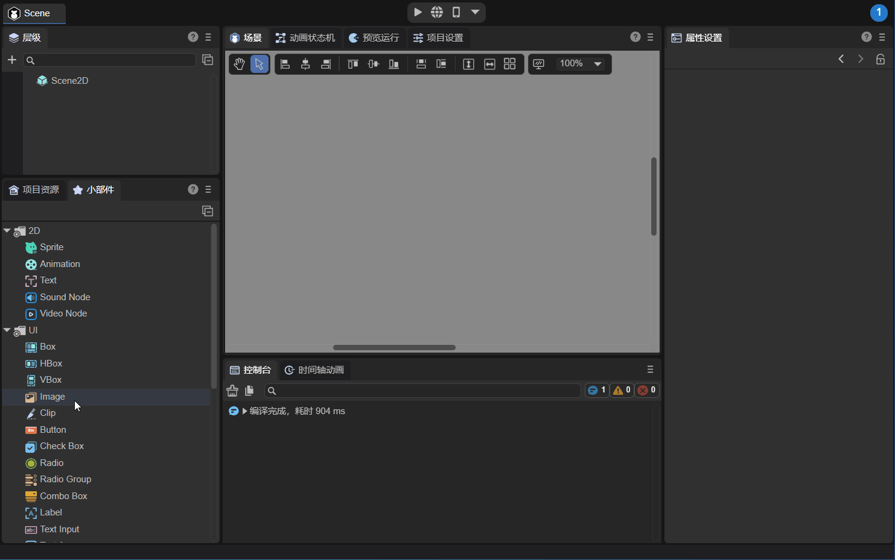

# Detailed explanation of UI components

> Author: Charley  

UI components are the basic components in 2D editing. The editing of the 2D UI interface we develop daily is based on UI components.

## 1. What are UI components?

From the structure of the engine class, the `UIComponent` class is the base class of UI components, which means that UI components have one thing in common, they are all components implemented by inheriting from the `UIComponent` class.

UI components are divided into basic UI components and container UI components. The easier way to understand and identify is that Box and those inherited from Box are container components. Others are basic UI components.

### 1.1 Basic UI components

There are 17 basic UI component display objects in total, which are directly or indirectly inherited from `UIComponent`, as shown in the highlighted part of Figure 1-1.

(Picture 1-1)

### 1.2 Container component

There are 9 container objects in total including the components inherited from Box and the Box container itself. As shown in the highlighted part of Figure 1-2.

(Figure 1-2)

These containers are meaningless on their own. They must include basic UI components as child nodes to make the components fully functional.

For example, List must have a basic UI component as the rendering unit of the list, and a radio group (RadioGroup) is a container for multiple radio components.

### 1.3 Pop-up view component

From the structure of the engine class, the pop-up view component Dialog **does not belong** to the UI component. Its inheritance relationship is shown in Figure 1-3.

(Figure 1-3)

> This component is generally used for pop-up panels, is closely related to scene management, and is part of the UI widgets, so it is no longer listed as a separate category, only an explanation is given here.

## 2. Creation of UI components

There are three ways to create UI components: drag and drop UI components from the Widgets panel, create them from the right-click menu of the Hierarchy panel, name the resources through the component resource naming rules, and then directly recognize them by the IDE. .

### 2.1 Use components directly

The Widgets panel includes basic nodes and UI components, which can be directly dragged into the hierarchy panel or scene editing window. The effect is shown in the animation 2-1.

(Animation 2-1)

### 2.2 Right-click menu

Under the 2D node of the Hierarchy panel, you can also directly create UI components in the right-click menu, as shown in Figure 2-2.

(Figure 2-2)

### 2.3 Directly recognized by IDE through component resource naming rules

For some commonly used UI components, the LayaAir engine and IDE provide resource naming rules.

When the image resource file is named according to the LayaAir engine UI component naming rules, it will be directly recognized by the IDE as a basic UI component.

There are two types of naming for component resources:

One type is that a resource corresponds to a regular resource of a UI component, for example, `img_layabox.png`, which will be recognized as an Image component.

The other type is a combination of multiple resources corresponding to one UI component. For example, `progress_loading.png` and `progress_loading$bar.png` are combined to form a progress component. `progress_loading.png` is the component name and is the background of the progress bar. Resources, another one with a `$bar` after `progress_loading` is the progress resource of the progress bar.

To summarize the above, we will find two rules:

- No matter what kind of resource it is, the underscore `_` is preceded by the component rule name and must be placed at the beginning of the file name.
- Combined resources, after the main resource name, separated by the dollar sign `$`, have an auxiliary identification name to facilitate identification by the IDE and engine.

#### The general resource naming rules are as follows:

| component name	| Chinese component name | Resource file name prefix | Resource file name prefix abbreviation |
| ---------- | ------------ | -------------- | ------------------ |
| Image  	| Image	| image_     	| img_           	|
| Button 	| button	| button_    	| btn_           	|
| ComboBox | Drop-down box	| comboBox_  	| combo_         	|
| TextInput | Text input	| textInput_ 	| input_         	|
| TextArea | Text area	| textArea_  	| area_          	|
| CheckBox | Multiple check box	| checkBox_  	| check_         	|
| Label  	| display text	| label_     	| No abbreviation	|
| RadioGroup | Radio group	| radioGroup_	| No abbreviation	|
| Radio  	| radio button	| radio_     	| No abbreviation	|
| Tab    	| Navigation tab group | tab_	| No abbreviation	|
| Clip   	| bitmap slice	| clip_      	| No abbreviation	|
| FontClip | Bitmap font slice | fontClip_	| No abbreviation	|

> Resource prefixes are not case sensitive

#### The naming rules for combined resources are as follows:

| component name	| Chinese component name | Resource file name prefix | Resource file name prefix abbreviation | Auxiliary identification name	|
| ----------- | ---------- | -------------- | ------------------ | ----------------------------------------------------- |
| VScrollBar | Vertical scroll bar | vscrollbar_	| vscroll_       	| Vertical sliding bar `$bar`, up click button `$up`, down click button `$down` |
| HScrollBar | Horizontal scroll bar | hscrollbar_	| hscroll_       	| Horizontal sliding bar `$bar`, left-click button `$up`, right-click button `$down` |
| ProgressBar | Progress bar	| progressbar_   | progress_      	| Progress bar `$bar`	|
| VSlider 	| Vertical slider | vslider_	| No abbreviation	| Vertical swipe button `$bar`, progress bar resource `$progress` (optional)	|
| HSlider 	| Horizontal slider | hslider_	| No abbreviation	| Horizontal swipe button `$bar`, progress bar resource `$progress` (optional)	|

> Resource prefixes are not case sensitive

Example description:

- Vertical scroll bar aa, composed of four resource files. They are `vscroll_aa.png, vscroll_aa$bar.png, vsroll_aa$up.png, vscroll_aa$down.png` respectively.
- The progress bar bb is composed of two resource files. They are `progress_bb.png, progress_bb$bar.png` respectively.
- Horizontal sliding bar cc, composed of two or three resource files. They are `hslider_cc.png, hslider_cc$bar.png, hslider_cc$progress.png (optional)`. If the progress bar resource hslider_cc$progress.png is missing, an error will not be reported, but the progress will not be displayed.

### 2.4 Creation and deletion of container components

After understanding the resource naming rules, I found that in addition to the RadioGroup and Tab components inherited from the UI group (UIGroup), they can be identified through the naming of resource prefix rules. Other container components do not support direct identification and creation through resource names.

In addition to creating using methods 2.1 and 2.2, you can also convert one or more selected basic components into container components in the IDE using the `Ctrl+B` shortcut key. If you no longer want the container component, you can also use `Ctrl+U` to deactivate the currently selected container.

> Just have an impression here. When introducing specific container components, the creation method and process will also be described in detail.

## 3. Relative layout

Relative layout is a unique attribute of UI components. As shown in Figure 3-1, every UI component has such relative layout attributes. However, basic display objects such as Sprite do not have relative layout, only absolute layout.

(Figure 3-1)

In a relative layout, UI components (such as buttons, text boxes, etc.) are positioned relative to their parent nodes. This layout brings great flexibility and ensures consistent UI layout across different screen sizes and orientations.

> At this point, we have a basic understanding of UI components, and we will start to introduce all UI components in detail. In order to avoid the document title being too long, UI components are classified and introduced according to the characteristics of use, not according to the inheritance relationship of component classes.

Next, click on the UI component document through the left navigation to learn more~

