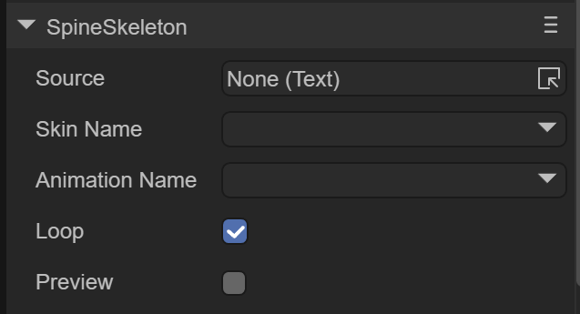

# Built-in skeletal animation


## 1. Overview

Spine skeletal animation and DragonBones (dragon bone) skeletal animation are commonly used skeletal animations in games. Using LayaAir's built-in skeletal conversion tool, these two formats can be converted into skeletal animation formats supported by the LayaAir engine.

LayaAir IDE supports adding, previewing and running skeletal animation. Before use, you need to check the laya.ani class library in the IDE, as shown in Figure 1-1


(Picture 1-1)


## 2. Use built-in skeletal animation in IDE

### 2.1 Copy animation resources to the project

As shown in Figure 2-1, we put the completed animation resources into the assets directory.


(Figure 2-1)


### 2.2 Add built-in skeletal animation components to the scene

There are two ways in the IDE to add built-in skeletal animation components to the scene.

1. Drag the skeletal animation component directly, as shown in animation 2-2


(Animation 2-2)

2. Create a skeletal animation component through Scene2D or any node, as shown in animation 2-3


(Animation 2-3)

At this point the skeletal animation component is ready. The next step is to drag in the animation resources.


### 2.3 Set animation resources

Let’s first take a look at the skeletal animation components and what properties they have, as shown in Figure 2-4



 (Figure 2-4)

`Source`: skeletal animation configuration file, that is, .sk file

`Skin Name`: skeleton animation name

`Animation Name`: Play animation name

`Loop`: Whether to loop playback

`Preview`: Preview in IDE

First, we drag the .sk file into the `Source` property, and we will see the animation in the IDE, as shown in animation 2-5


 (Animation 2-5)


### 2.4 Preview animation in IDE

By checking the Preview option, we can preview the skeletal animation effect directly in the IDE, as shown in animation 2-6


 (Animation 2-6)

At the same time, you can check Loop to set whether to loop the animation, or you can select the animation name to switch the animation.


### 2.5 Basic animation operations

In the IDE, you can perform basic operations on the position, size, and scaling of the animation, as shown in animation 2-7.


 (Animation 2-7)


## 3. Built-in skeletal animation in the code

When used in code, we need to reference and specify the `Laya.Skeleton` and `Laya.Templet` classes when using skeletal animation

Among them, `Laya.Skeleton` is a class that must be referenced for skeletal animation, and `Laya.Templet` is used to process resources.

Code example:

```typescript
const { regClass, property } = Laya;

@regClass()
export class Main extends Laya.Script {

    private mCurrIndex: number = 0;
    private mArmature: Laya.Skeleton;

	onStart() {
    	console.log("Game start");
   	 //Load built-in skeletal animation resources
   	 Laya.loader.load("skeleton/Dragon/Dragon.sk").then((templet: Laya.Templet) => {
   		 //Creation mode is 1, you can enable dress-up
   		 this.mArmature = templet.buildArmature(0);
   		 this.mArmature.x = 300;
   		 this.mArmature.y = 350;
   		 this.mArmature.scale(0.5, 0.5);
   		 this.owner.addChild(this.mArmature);
   		 //After setting the animation to complete, call completeHandler to continue playing the next animation.
   		 this.mArmature.on(Laya.Event.STOPPED, this, this.completeHandler);
   		 this.play();
   	 });
	}

    
    private completeHandler(): void {
   	 this.play();
    }

    //Play skeleton animation
    private play(): void {
   	 //Each time to the next animation
   	 this.mCurrIndex++;
   	 if (this.mCurrIndex >= this.mArmature.getAnimNum()) {
   		 this.mCurrIndex = 0;
   	 }
   	 this.mArmature.play(this.mCurrIndex, false);
    }
}
```

The operation effect is as follows


(Animation 3-1)


You can view the specific effects in the LayaAir 2D Getting Started Example.

