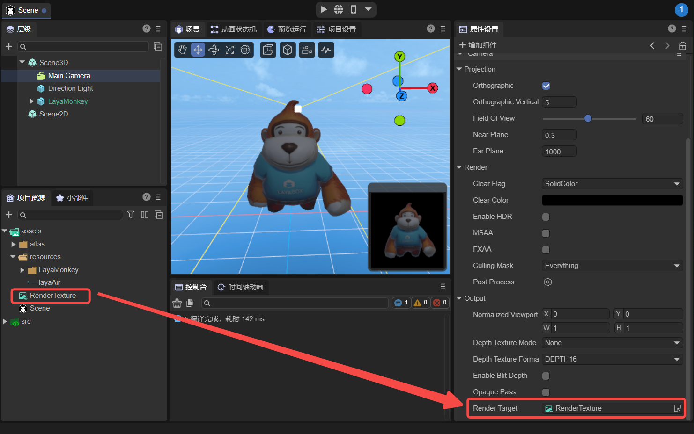
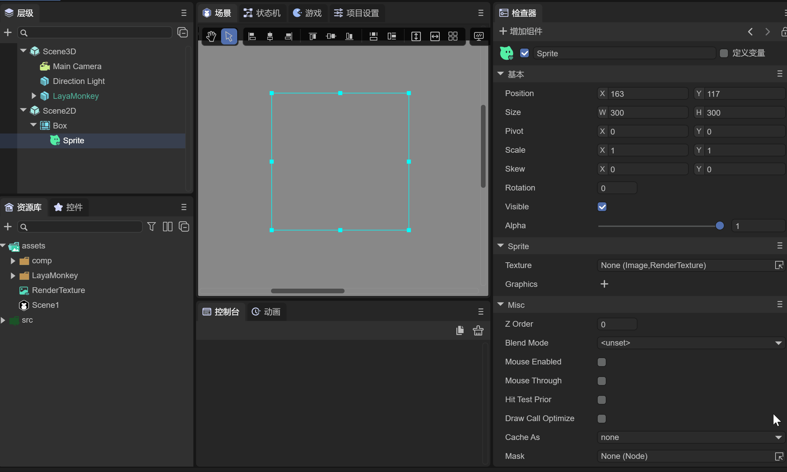

# Mix with 3D

## 1. Overview

During the development process of 2D projects, developers often need to display 3D scenes or 3D objects on the UI interface. For example, in game development, 3D characters run on the 2D background map, and the 3D hero model will be displayed in the hero attribute interface, etc., such as As shown in animation 1-1,


(Animation 1-1)

GIF 1-1 is a "Hybrid 3D" example in the 2D Getting Started example created by LayaAir.

First of all, this function can be easily implemented using `RenderTexture` in the LayaAir engine. RenderTexture is a special type of texture that is constantly updated and rendered at runtime. A typical use of a render texture is to set it as the camera's "Target Texture" property, which will cause the camera to render to the texture instead of rendering to the screen. It can then be used in the Sprite object under 2D UI like a normal texture.

Now we will explain how to use rendering textures to mix 3D in the IDE and code.


## 2. Mixing 3D in IDE

### 2.1 Create RenderTexture file in IDE

As shown in Figure 2-1, first create a render texture (RenderTexture) file in the assets resource of the IDE.


(Figure 2-1)

Click on the newly created RenderTexture file. In the properties panel, the property information will be displayed, as shown in Figure 2-2.


(Figure 2-2)

Width: The pixel width of the rendering texture.

Height: The pixel height of the rendering texture.

Color Format: The color format of the rendering texture.

Depth Format: The depth format of the rendering texture.

Generate Mipmap: If checked, multi-level progressive texture levels will be automatically generated.

Multi Samples: Multiple sampling.

sRGB: Whether this render texture uses sRGB read/write conversion (read-only).

AnisoLevel: Anisotropy value.

FilterMode: Sampling filter mode.

WrapModeU: U direction sampling mode.

WrapModeV: V direction sampling mode.

> For this article, the width, height, color format and depth format of the rendering texture have a certain impact on the effect. The default settings are used for the time being.


### 2.2 Add rendering objects to 3D scene

In the 3D scene in the IDE, add the 3D object you want to display. In this example, add LayaMonkey to the 3D scene, as shown in Figure 2-3.


(Figure 2-3)

The camera is facing LayaMonkey, and the Clear Flag in the Render component of the camera is defined as "SolidColor", and the Clear Color is defined as "#000000".

Then, as shown in Figure 2-4, change the camera to orthogonal projection and adjust the camera's display ratio.


(Figure 2-4)


### 2.3 Set the camera’s target texture

Drag the previously created render texture file (RenderTexture) into the camera's target texture (Render Target) property. At this point the camera will render to the texture instead of the screen. As shown in Figure 2-5,



(Figure 2-5)


### 2.4 Set the Texture of Sprite

Create a Sprite in Scene2D as a carrier for displaying 3D objects. Drag the previously created rendering texture into the Sprite's Texture property, as shown in animation 2-6.



(Animation 2-6)

As you can see, LayaMonkey has been displayed in the 2D Sprite, but the background is black. The color format of the rendering texture needs to be modified again to support transparent colors.


### 2.5 Modify rendering texture attributes

As shown in the animation 2-7, modify the color format (Color Format) of the rendering texture to "R16G16B16A16", and the background will change from black to transparent.

(Note that in Section 2.2, the A value of Clear Color in the camera Render component is set to 0).


(Animation 2-7)

Observe LayaMonkey carefully. The image is rough. The main reason is that the resolution of the rendering texture (Width×Height) is 256x256 which is too low. The resolution is modified to 1024x1024 below, as shown in the animation 2-8.


(Animation 2-8)

In this way, LayaMonkey suddenly becomes clear, and now we mix the 3D objects into the UI interface by rendering textures. The running effect is shown in Figure 2-9:


(Animation 2-9)


## 3. Mixed use of 3D in code

The "2D Getting Started Example" provided by the LayaAir engine has a complete 3D mixed usage code example. The core code is to use `Laya.RenderTexture` to create a rendering texture and apply the rendering texture to the camera object and Sprite object respectively:

```typescript
// Draw the 3D camera view onto a 256 width and height texture
_camera.renderTarget = new Laya.RenderTexture(256, 256, Laya.RenderTargetFormat.R8G8B8A8, Laya.RenderTargetFormat.DEPTHSTENCIL_24_8);
// Then draw the off-screen 3D to the 2D node. At this point, the basic rendering process of drawing 3D to 2D is completed.
sp.texture = new Laya.Texture(_camera.renderTarget);
```

The running effect is shown in the animation 1-1 at the beginning of this article.


