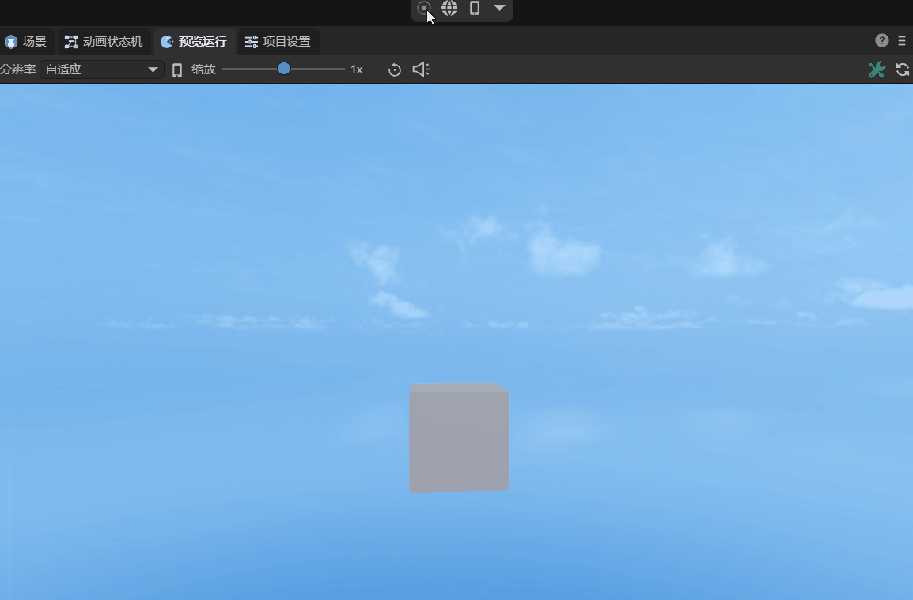
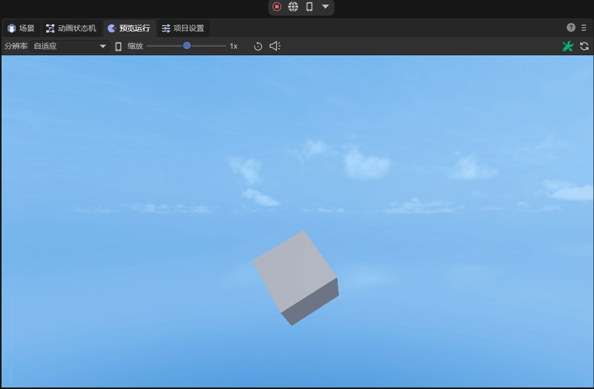
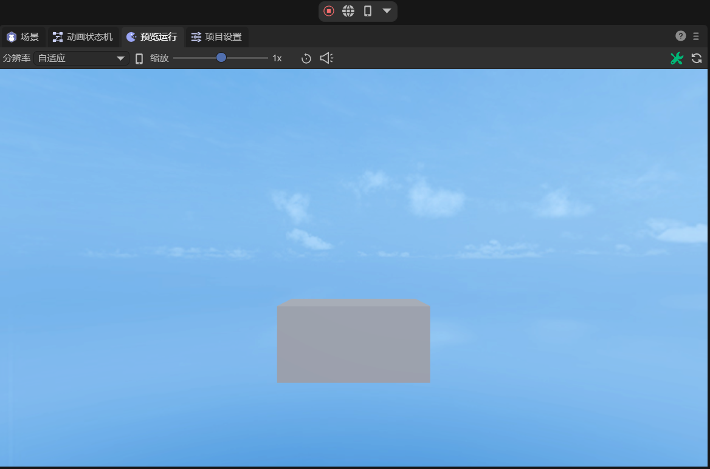
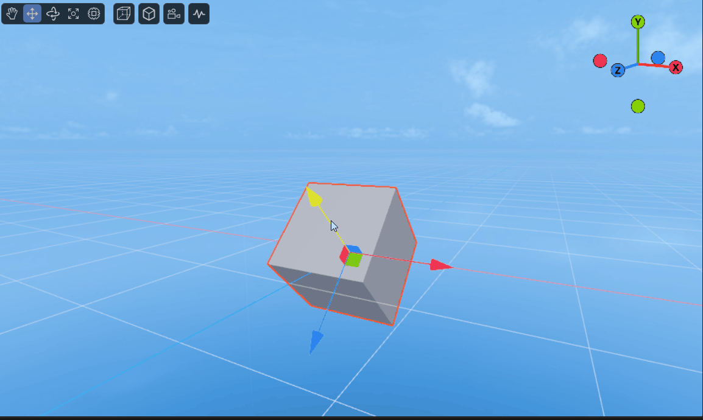
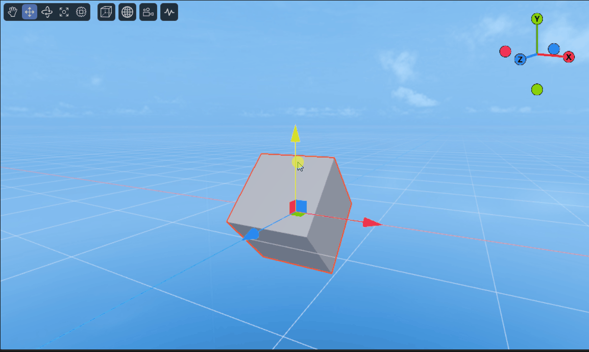
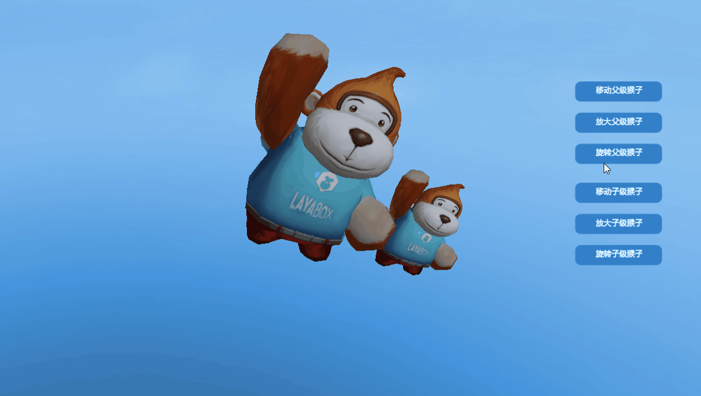
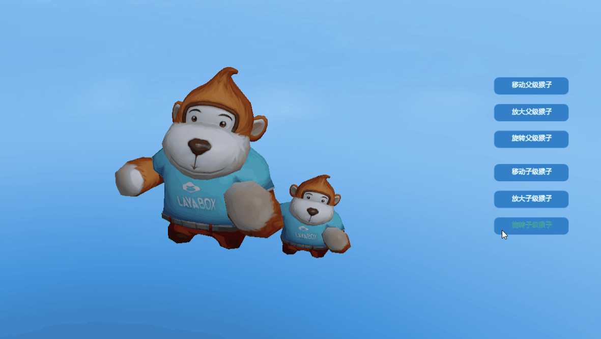

# 3D transform

Previously [*Introduction to 3D Concepts*](../beginner/readme.md) I talked about the coordinate system and several basic mathematical tools in LayaAir. An important application of these basic concepts is three-dimensional transformation, which is also three-dimensional. The foundation of the graphic world. The Transform3D class is used to implement three-dimensional transformation in LayaAir, which includes translation transformation, rotation transformation, scaling transformation, etc.

This section demonstrates these transformations using a cube model. Create a "3D empty project" in LayaAir IDE. After opening the project, the IDE has created a cube by default. In the property panel of Scene2D, create a new component script and add a decorator to expose the properties of the cube. The code is as follows:

```typescript
@property({ type: Laya.Sprite3D })
public cube: Laya.Sprite3D;
```

Then in the IDE, drag the Cube node into the property entrance exposed by the decorator, and you can control the Cube node with code.


## 1. Translation transformation

The translation transformation is defined as follows:

```typescript
    /**
     * Translation transformation.
     * @param translation moving distance.
     * @param isLocal Whether it is local space.
     */
    translate(translation: Vector3, isLocal: boolean = true): void {
   	 if ( isLocal ) {
   		 Matrix4x4.createFromQuaternion(this.localRotation, Transform3D._tempMatrix0);
   		 Vector3.transformCoordinate(translation, Transform3D._tempMatrix0, Transform3D._tempVector30);
   		 Vector3.add(this.localPosition, Transform3D._tempVector30, this._localPosition);
   		 this.localPosition = this._localPosition;
   	 } else {
   		 Vector3.add(this.position, translation, this._position);
   		 this.position = this._position;
   	 }
    }
```

The translation transformation method translate() has two parameters. The first translation represents the moving distance. It is a Vector3 type variable that contains both the moving distance and the moving direction. The second isLocal determines whether it is local space. The default value is true, which is local space. If false is passed in, it is world space.

> If the starting position of the object in local space and world space is the same, and it has not undergone transformations such as rotation, then the result of its movement in the two spaces is the same. The difference between the two will be explained in Section 5.

Use translation transformation to move the cube by a distance of 1 in the x, y and z directions respectively. The sample code is as follows:

```typescript
const { regClass, property } = Laya;

@regClass()
export class NewScript extends Laya.Script {

	@property({ type: Laya.Sprite3D })
	public cube: Laya.Sprite3D;

	// translation distance
	private translate: Laya.Vector3 = new Laya.Vector3(1, 1, 1);

	constructor() {
    	super();
	}

	/**
 	* Executed after the component is activated. At this time, all nodes and components have been created. This method is only executed once.
 	*/
	onAwake(): void {
    	// Translate cube
    	this.cube.transform.translate(this.translate, false);
	}

}
```

The effect is shown in Figure 1-1, where 1 is the original position and 2 is the position after translation.


(Picture 1-1)


## 2. Rotation transformation

Regarding rotation, two rotation interfaces are provided in Transform3D:

### 2.1 rotate()

The first is angle/radical rotation rotate(), defined as follows:

```typescript
    /**
     * Rotation transformation.
     * @param rotation rotation amplitude.
     * @param isLocal Whether it is local space.
     * @param isRadian Whether the radian system.
     */
    rotate(rotation: Vector3, isLocal: boolean = true, isRadian: boolean = true): void {
   	 var rot: Vector3;
   	 if (isRadian) {
   		 rot = rotation;
   	 } else {
   		 Vector3.scale(rotation, Math.PI / 180.0, Transform3D._tempVector30);
   		 rot = Transform3D._tempVector30;
   	 }

   	 Quaternion.createFromYawPitchRoll(rot.y, rot.x, rot.z, Transform3D._tempQuaternion0);
   	 if ( isLocal ) {
   		 Quaternion.multiply(this._localRotation, Transform3D._tempQuaternion0, this._localRotation);
   		 this.localRotation = this._localRotation;
   	 } else {
   		 Quaternion.multiply(Transform3D._tempQuaternion0, this.rotation, this._rotation);
   		 this.rotation = this._rotation;
   	 }
    }
```

The rotation method rotate() has three parameters. The first rotation represents the rotation amplitude, which is the angle of rotation around the x, y, and z directions. The second isLocal determines whether it is local space. The default value is true, which is local space. If false is passed in, it is world space. The third isRadian determines whether it is in radian system. The default value is true, which is radian system. If false is passed in, it represents the angle value.

Use the rotation transformation rotate() to rotate the cube around the y-axis and use the angle value. The sample code is as follows:

```typescript
const { regClass, property } = Laya;

@regClass()
export class NewScript extends Laya.Script {

	@property({ type: Laya.Sprite3D })
	public cube: Laya.Sprite3D;

	// Rotation angle
	private rot: Laya.Vector3 = new Laya.Vector3(0, 1, 0);

	constructor() {
    	super();
	}

	/**
 	* Executed after the component is activated. At this time, all nodes and components have been created. This method is only executed once.
 	*/
	onAwake(): void {
    	//Set timer execution, scheduled repeated execution (based on frame rate)
    	Laya.timer.frameLoop(1, this, this.animate);
	}

	private animate(): void {
    	// Rotate cube (quaternion)
    	this.cube.transform.rotate(this.rot, false, false);
	}

}
```

The effect of rotation is shown in the animation 2-1:



(Animation 2-1)

### 2.2 localRotationEuler()

The second is Euler angle rotation localRotationEuler():Vector3. Its use is very simple. You only need to assign a value to the rotation angle. Rotate the cube 45 degrees around the x, y, and z directions respectively, using the angle value. The sample code is as follows:

```typescript
const { regClass, property } = Laya;

@regClass()
export class NewScript extends Laya.Script {

	@property({ type: Laya.Sprite3D })
	public cube: Laya.Sprite3D;

	// Rotation angle
	private rot: Laya.Vector3 = new Laya.Vector3(45, 45, 45);
    
	constructor() {
    	super();
	}

	/**
 	* Executed after the component is activated. At this time, all nodes and components have been created. This method is only executed once.
 	*/
	onAwake(): void {
    	// Rotate cube (Euler angles)
    	this.cube.transform.localRotationEuler = this.rot;
	}

}
```

The effect after rotation is shown in Figure 2-2:



(Figure 2-2)

If you want to achieve the effect shown in Figure 2-1, that is, rotate the animation around the Y axis, you need to increase the value of localRotationEulerY every frame. The sample code is as follows:

```typescript
const { regClass, property } = Laya;

@regClass()
export class NewScript extends Laya.Script {

	@property({ type: Laya.Sprite3D })
	public cube: Laya.Sprite3D;

	// Rotation angle
	private rot: Laya.Vector3 = new Laya.Vector3(0, 1, 0);

	constructor() {
    	super();
	}

	/**
 	* Executed after the component is activated. At this time, all nodes and components have been created. This method is only executed once.
 	*/
	onAwake(): void {
    	//Set timer execution, scheduled repeated execution (based on frame rate)
    	Laya.timer.frameLoop(1, this, this.animate);
	}

	private animate(): void {
    	// Rotate cube (Euler angles)
    	this.cube.transform.localRotationEulerY += this.rot.y;
	}

}
```


## 3. Scale transformation

The scaling transformation can be done using the method localScale(): Vector3. If the incoming Vector3 has the same values ​​in the x, y, and z directions like (2, 2, 2), (3, 3, 3), then the scaling transformation will be a proportional scaling, that is, a proportional enlargement of 2 times. ,3 times.

If it is non-proportional scaling, for example, the cube is enlarged to 2 times its original size in the x-axis direction, while the y and z directions remain unchanged. The sample code is as follows:

```typescript
const { regClass, property } = Laya;

@regClass()
export class NewScript extends Laya.Script {

	@property({ type: Laya.Sprite3D })
	public cube: Laya.Sprite3D;

	//zoom factor
	private scale: Laya.Vector3 = new Laya.Vector3(2, 1, 1);

	constructor() {
    	super();
	}

	/**
 	* Executed after the component is activated. At this time, all nodes and components have been created. This method is only executed once.
 	*/
	onAwake(): void {
    	// Scale the cube
    	this.cube.transform.localScale = this.scale;
	}

}
```

The effect is shown in Figure 3-1:



(Figure 3-1)


## 4. Other transformations

In addition to the three common transformations introduced above, there are some other commonly used methods and properties in Transform3D:

`lookAt(target: Vector3, up: Vector3, isLocal: boolean = false, isCamera: boolean = true): void`: Observe the target position.

`localPosition:Vector3`: local position.

`localMatrix:Matrix4x4`: local matrix.

`position:Vector3`: world position.

`worldMatrix:Matrix4x4`: World matrix.

`getRight(right: Vector3): void`: Get the right direction.

`getUp(up: Vector3): void`: Get the upward direction.

`getForward(forward: Vector3)`: Get the forward direction.


## 5. Local space and world space

Local space, also called object space, is the coordinate system relative to the object itself. In local space, the object's own position is regarded as the origin (0, 0, 0), and each object has its own independent local space. World space refers to a common, global coordinate system used to describe the positions of all objects. Local space allows the behavior of objects (such as movement and rotation) to become independent and not directly affected by other objects or global space.

To give an example, when the cube is rotated 45 degrees around the x-axis, moving the cube in the local space means moving in the direction of its own coordinate system, as shown in the animation in Figure 5-1:



(Animation 5-1)

Correspondingly, moving the cube in the world space means moving in the direction of the global, fixed coordinate system, as shown in animated picture 5-2:



(Animation 5-2)

> This article only uses a simple cube to illustrate usage. The transformation of complex models is similar to that of a cube. For detailed examples, please refer to the TransformDemo scene in "Engine API Usage Example".


## 6. Parent-child relationship in the 3D world

When the parent node transforms in the 3D world, its child nodes will transform accordingly. However, transformations of child nodes will not affect the parent node.

For example, the Sprite3DParent scene in "Engine API Usage Example" is shown in the animation in Figure 6-1. When the parent node is rotated, the child nodes will rotate accordingly.



(Animation 6-1)

Rotate the child nodes, and the parent node is not affected by the child nodes, as shown in animated figure 6-2.



(Animation 6-2)

