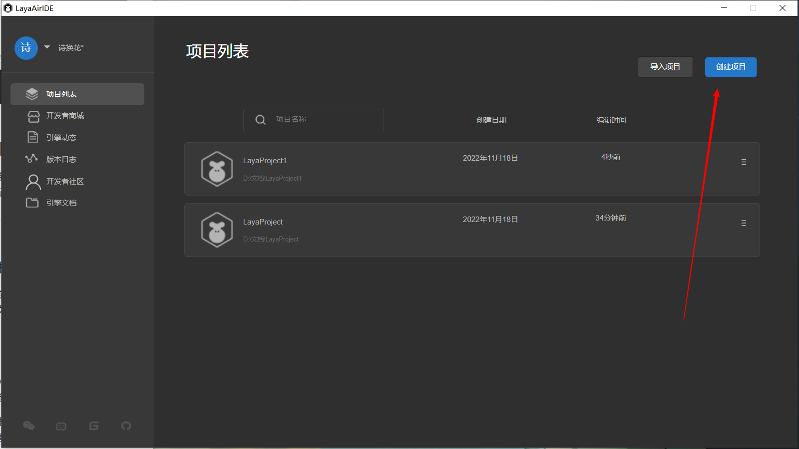

# IDE development workflow module overview

> Author: Charley && Shi Huanhua

## 1. IDE account login

LayaAir3.x uses resource store, community, IDE core configuration cloud storage and other highly network-dependent functions within the IDE, so you must log in to your account before you can use the IDE.

There are three ways to log in to your account. The Chinese version of the account supports WeChat scan code login and mobile phone account login. The English version account supports email registration and login.

The login interface is shown in Figure 1-1.

(Picture 1-1)

> Before the public beta, only WeChat login was supported.

## 2. IDE home page

The IDE homepage after logging in integrates account module, project list, create project, delete project reference, project description settings, resource store, web links (engine updates, version logs, developer community, engine documentation) and other functions.

### 2.1 Project List

The default module after logging in is the project list. Here is the list of imported or created projects. Click the highlighted area selected by the mouse to open the project and enter the editor mode.

The effect is shown in Figure 2-1.

(Figure 2-1)

The default project sorting order is based on the most recent editing time. If there are a large number of projects, you can also enter the project keyword in the search box to find the corresponding project.

The effect is shown in Figure 2-2.

(Figure 2-2)

In the right menu of the project list unit, there are project-related setting functions, namely: setting the project icon, setting the project description, opening the project directory, and removing the project from the list. The effect is shown in the animation 2-3.

(Animation 2-3)

### 2.2 Import project

Click Import Project to import 3.x projects created on other computers or projects that have been removed from the list into the project list. The operation is shown in Figure 2-4.

(Figure 2-4)

### 2.3 Create project

If we want to create a new project, we can click Create Project, as shown in Figure 3-1, to create a new project.

(Figure 3-1)

#### 2.3.1 Select template

In the interface for creating new projects, we have three types of templates for developers to choose from, as shown in Figure 3-2.

(Figure 3-2)

Core templates refer to 2D and 3D empty project templates, which are suitable for developers who have already started to create a pure template environment.

Example templates are examples of functional modules with relatively simple and independent functions, suitable for understanding certain specific functions.

Learning templates refer to project functions in the template that are relatively complete and rich, and are suitable for introductory learning and reference for project development.

#### 2.3.2 Project name

As shown in Figure 3-3.

(Figure 3-3)

#### 2.3.3 Project location

As shown in Figure 3-4.

(Figure 3-4)

2.3.4 Create project

After completing the above options, click Create Project, as shown in Figure 3-5. You can complete the creation of the project and enter the IDE editing interface. As shown in Figure 3-5.

(Figure 3-5)

### 2.4 Developer Mall

The developer mall is under construction and will be launched later.

### 2.5 Web link

The link function is under construction and will be launched later.

### 2.6 Account settings

The account setting function currently only supports logging out. Other features are under construction. As shown in Figure 4-6.

(Figure 4-6)

## 3. Editor initial interface

The initial interface of the editor includes the hierarchical management panel, project management project, UI layout widget panel, scene window, preview window, animation state machine panel, project settings panel, console, timeline animation panel, and properties panel.

### 3.1 Hierarchical management panel

The hierarchical management panel mainly includes 2D nodes and 3D nodes. If it is a purely 2D project, it can also only include 2D nodes. The panel is shown in Figure 5-1.

(Figure 5-1)

The hierarchical relationship represents the relationship between parent and child nodes. Child nodes will be affected by the parent node. For example, if the parent node changes its position or rotates its angle, the child nodes will also change synchronously.

The root node of 3D nodes is Scene3D, and the root node of 2D nodes is Scene2D. 2D and 3D nodes cannot be mixed to form a parent-child hierarchical relationship.

### 3.2 Project Management Panel

The project management panel includes all the resources and code of the project. The resources are located in the assets directory and the code is located in the src directory. The panel is shown in Figure 5-2.

(Figure 5-2)

### 3.3 UI layout widget panel

 The UI layout widget panel includes three parts: 2D basic display objects, UI components, and bone nodes, which are used for UI typesetting and layout. The panel is shown in Figure 5-3.

(Figure 5-3)

### 3.4 Scene window

The scene window is a place for editing 2D scenes and 3D scenes. It is a window for developers to visually edit the virtual world. The panel is shown in Figure 5-4.

(Animation 5-4)

### 3.5 Preview window

The preview window is a visual effect preview window displayed to the user through developer layout editing and code logic. The panel is shown in Figure 5-5.

(Figure 5-5)

### 3.6 Animation State Machine Panel

Animation state machine is a tool for controlling timeline animation logic. The animation state machine panel includes functions related to animation layers and state machines. The panel is shown in Figure 5-6.

(Figure 5-6)

### 3.7 Project settings panel

The project settings panel includes screen adaptation settings, engine initialization settings, project startup settings, etc. The panel is shown in Figure 5-7.

(Figure 5-7)

### 3.8 Console Panel

The console panel is used to print log information, and the printed log information can be copied and cleared. The panel is shown in Figure 5-8.

(Figure 5-8)

### 3.9 Timeline animation panel

The timeline animation panel is used for editing 2D and 3D animations. It has two modes, namely keyframe mode and curve mode. As shown in Figure 5-9.

(Figure 5-9)

### 3.10 Property setting panel

The properties panel is the place used to set the properties of objects or files.

For example, 2D and 3D object properties in the IDE hierarchy panel, property settings or preview viewing of resource files. and the addition of components.

**Object attribute settings, as shown in Figure 6-1:**

(Figure 6-1)

 **Resource attribute settings, as shown in Figure 6-2:**

(Figure 6-2)

 **Code preview, as shown in Figure 6-3:**

(Figure 6-3)

 **Add components (custom attributes), as shown in Figure 6-4:**

  

(Figure 6-4)

## 4. Other editing panels

In addition to the panels displayed on the initial interface, there are also prefab panel tabs opened through prefab files, and blueprint editing panels opened through blueprint files.

### 4.1 Prefab panel label

The tags used to open scene files are all the same. Clicking on the prefab file will form an independent prefab panel label. The effect is shown in Figure 7-1.

(Animation 7-1)

Prefab panel tags actually do not have their own unique panels. Only the root node of the hierarchical management panel is different from the root node of the scene file.

### 4.2 Blueprint editing panel

The blueprint editing panel allows you to quickly write custom materials without writing code, greatly lowering the threshold for developers.

Open the Shader blueprint file or Shader blueprint function file to enter the blueprint editing panel. As shown in Figure 7-2.

(Animation 7-2)

## 5. Project preview and release

### 5.1 Project Preview

Project preview is used to view the running effect of the project in different environments.

Project preview is divided into three modes, namely in-IDE preview, browser preview, and mobile preview. As shown in Figure 8.

  

(Figure 8)

After opening the preview in the IDE, two buttons will appear, namely restart and open developer tools.

#### 5.1.1 Restart

Restart, as the name suggests, restarts the current preview running scene, as shown in Figure 8-1.

(Figure 8-1)

#### 5.1.2 Open developer tools

Clicking to open the developer tools will bring up the Developer Tools, which is convenient for developers to debug. You can also open the developer tools through the `Ctrl + Alt + I` shortcut key.

(Figure 8-2)

### 5.2 Project Release

Project release is to release the development version into a web version, a mini game version, and a Naitve APP version.

Call up the publishing interface through Build in the File menu, as shown in Figure 9.

(Figure 9)

