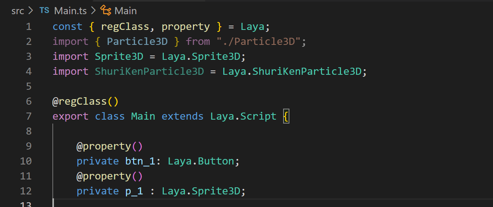

# Custom script component

Starting from LayaAir 2.0, it supports custom scripts in the editor to facilitate the expansion of the functions of existing components. The custom script inherits from the Laya.Script class and defines the component's events and its own life cycle methods. You don't need to bind events yourself to quickly implement logic. Any component can use the same custom script to implement the same function. For example, the same component needs to implement the same function on different pages.

In addition, when different pages use the same script, you can specify different components for the same attribute. You can specify it in the editor by exposing the attribute to the editor.

## Exposed properties of custom scripts


If you want to display script-defined properties in the editor, you can do so through special annotations, such as the following script class:



(figure 1)

in:

```
const { regClass, property } = Laya;
```

Written at the top of the script class, declare that this class supports properties in the exposed class

```
@regClass()
export class Main extends Laya.Script
```

In the previous line of the custom script class, add @regClass()

```
@property()
private btn_1: Laya.Button;
```

In the previous line of the custom property, add @property(), you can expose this property in the editor, and you can drag the corresponding node in the scene


(figure 2)


(image 3)

## Component events

When using a custom script class, the following events can be implemented to facilitate rapid development of business logic

```
	/**
 	* Executed when collision starts
 	*/
	onTriggerEnter?(other: PhysicsComponent | ColliderBase, self?: ColliderBase, contact?: any): void;

	/**
 	* Executed when collision continues
 	*/
	onTriggerStay?(other: PhysicsComponent | ColliderBase, self?: ColliderBase, contact?: any): void;

	/**
 	* Executed when the collision ends
 	*/
	onTriggerExit?(other: PhysicsComponent | ColliderBase, self?: ColliderBase, contact?: any): void;

	/**
 	* Executed when collision starts
 	*/
	onCollisionEnter?(collision: Collision): void;

	/**
 	* Executed when collision continues
 	*/
	onCollisionStay?(collision: Collision): void;

	/**
 	* Executed when the collision ends
 	*/
	onCollisionExit?(collision: Collision): void;

	/**
 	* Execute this method when the joint is damaged
 	*/
	onJointBreak?(): void;

	/**
 	* Executed when mouse is pressed
 	*/
	onMouseDown?(evt: Event): void;

	/**
 	* Executed when the mouse is raised
 	*/
	onMouseUp?(evt: Event): void;

	/**
 	* Executed when the right or middle mouse button is pressed
 	*/
	onRightMouseDown?(evt: Event): void;

	/**
 	* Executed when the right or middle mouse button is raised
 	*/
	onRightMouseUp?(evt: Event): void;

	/**
 	* Executed when the mouse moves on the node
 	*/
	onMouseMove?(evt: Event): void;

	/**
 	* Executed when the mouse enters the node
 	*/
	onMouseOver?(evt: Event): void;

	/**
 	* Executed when the mouse leaves the node
 	*/
	onMouseOut?(evt: Event): void;

	/**
 	* After the mouse is pressed on an object, it is executed when dragging
 	*/
	onMouseDrag?(evt: Event): void;

	/**
 	* Press and hold an object with the mouse, drag it a certain distance, and execute after releasing the mouse button.
 	*/
	onMouseDragEnd?(evt: Event): void;

	/**
 	* Executed when mouse clicks
 	*/
	onMouseClick?(evt: Event): void;

	/**
 	* Executed when double-clicking the mouse
 	*/
	onMouseDoubleClick?(evt: Event): void;

	/**
 	* Executed when right-clicking the mouse
 	*/
	onMouseRightClick?(evt: Event): void;

	/**
 	* Executed when the keyboard is pressed
 	*/
	onKeyDown?(evt: Event): void;

	/**
 	* Executed when the keyboard generates a character
 	*/
	onKeyPress?(evt: Event): void;

	/**
 	* Executed when the keyboard is raised
 	*/
	onKeyUp?(evt: Event): void;
```


## Component life cycle methods

When using a custom script class, you can implement the following life cycle methods to facilitate rapid development of business logic

```
	/**
 	* Called after being added to the node. Unlike Awake, onAdded will be called even if the node is not activated.
 	*/
	onAdded(): void {
	}

	/**
 	* Reset component parameters to default values. If this function is implemented, the component will be reset and automatically recycled to the object pool to facilitate reuse next time.
 	* If there is no reset, no recycling will be performed

 	*/
	onReset?(): void;

	/**
 	* Executed after the component is activated. At this time, all nodes and components have been created. This method is only executed once.
 	*/
	onAwake(): void {
	}

	/**
 	* Executed after the component is enabled, such as after the node is added to the stage
 	*/
	onEnable(): void {
	}

	/**
 	* Executed before executing update for the first time, it will only be executed once
 	*/
	onStart?(): void;

	/**
 	* Executed when each frame is updated, try not to write large loop logic here or use the getComponent method
 	*/
	onUpdate?(): void;

	/**
 	* Executed when each frame is updated and executed after update. Try not to write large loop logic or use the getComponent method here.
 	*/
	onLateUpdate?(): void;

	/**
 	* Executed before rendering
 	*/
	onPreRender?(): void;

	/**
 	* Executed after rendering
 	*/
	onPostRender?(): void;

	/**
 	* Executed when the component is disabled, such as after the slave node is removed from the stage
 	*/
	onDisable(): void {
	}

	/**
 	* Executed when manually calling node destruction
 	*/
	onDestroy(): void {
	}
```

## Reference Code

The code implements the identifier of the exposed attribute of the custom script, the implementation of the life cycle method onStart() and the event mouseDown()


(Figure 4)

```
const { regClass, property } = Laya;
import { Particle3D } from "./Particle3D";
import Sprite3D = Laya.Sprite3D;
import Button = Laya.Button;
import Event = Laya.Event;

@regClass()
export class Main extends Laya.Script {

	@property()
	private btn_1: Button;  
	@property()
	private p_1 : Sprite3D;      	 
	@property()
	private btn_2: Button;    
	@property()
	private p_2 : Sprite3D; 	 
	@property()
	private btn_3: Button;  
	@property()
	private p_3 : Sprite3D; 	 
	@property()
	private btn_4: Button;    
	@property()
	private p_4 : Sprite3D;  	 
	@property()
	private btn_5: Button;    
	@property()
	private p_5 : Sprite3D;	 
	@property()
	private btn_6: Button;    
	@property()
	private p_6 : Sprite3D; 	 

	private particleList: Array<Sprite3D> = [];

	onStart() {
    	console.log("Game start");

    	this.particleList.push(this.p_1);
    	this.particleList.push(this.p_2);
    	this.particleList.push(this.p_3);
    	this.particleList.push(this.p_4);
    	this.particleList.push(this.p_5);
    	this.particleList.push(this.p_6);
   	 
    	this.btn_1.on(Event.MOUSE_DOWN, this, () => {
        	this.hideAll();
        	this.p_1.active = true;
    	});
    	this.btn_2.on(Event.MOUSE_DOWN, this, () => {
        	this.hideAll();
        	this.p_2.active = true;
    	});
    	this.btn_3.on(Event.MOUSE_DOWN, this, () => {
        	this.hideAll();
        	this.p_3.active = true;
    	});
    	this.btn_4.on(Event.MOUSE_DOWN, this, () => {
        	this.hideAll();
        	this.p_4.active = true;
    	});
    	this.btn_5.on(Event.MOUSE_DOWN, this, () => {
        	this.hideAll();
        	this.p_5.active = true;
    	});    
    	this.btn_6.on(Event.MOUSE_DOWN, this, () => {
        	this.hideAll();
        	this.p_6.active = true;
    	});                                  	 
	}

	hideAll(): void {
    	this.particleList.forEach(element => {
        	(element as Sprite3D).active = false;
    	});
	}

	mouseDown(e: Event): void {
    	this.hideAll();      	 
	}
 
}
```


