# Development Process: Hello World

This article aims to help developers who are new to the LayaAir engine to initially understand the basic development process of the LayaAir engine after setting up the basic development environment.

> If the environment has not been set up yet, please refer to [“Setting up the Basic Development Environment”](../../developmentEnvironment/download/readme.md).

## 1. Creating an Empty Project Using LayaAir-IDE

The development process of LayaAir is highly dependent on LayaAir-IDE.

IDE is the abbreviation of Integrated Development Environment. As the name implies, it integrates the entire workflow of LayaAir engine development, from project creation to visual editing, as well as running preview and project publishing.

### 1.1 Creating a Project

First, open the IDE of LayaAir3. After logging in, the developer clicks on "Create Project". As shown in Figure 1-1.

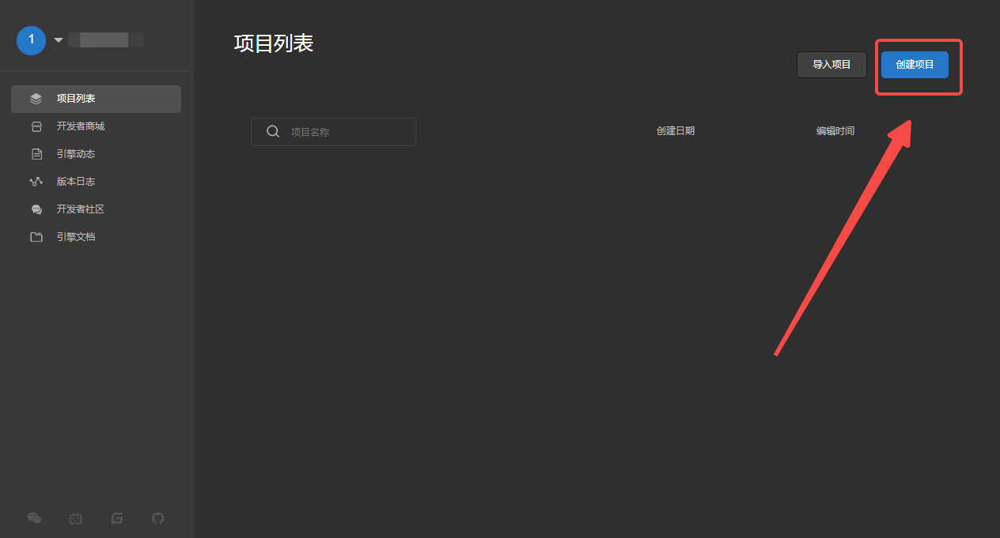

(Figure 1-1)

In the panel for creating a new project, developers can choose different project templates to create a project according to their needs. Here, taking a 2D or 3D empty project as an example, fill in the project name and select the project location, and then click "Create Project". As shown in Figure 1-2.

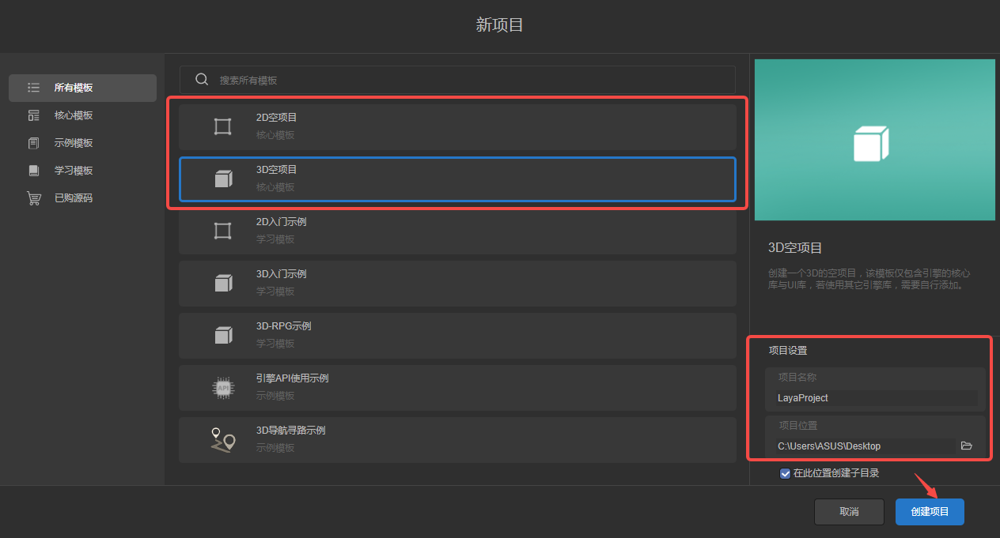

(Figure 1-2)

After the creation is completed, the created project will be automatically loaded and opened, as shown in Figure 1-3.

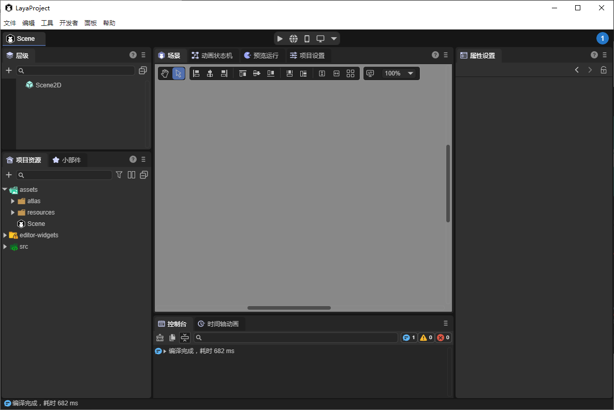

(Figure 1-3)

A 2D empty project does not have a 3D scene node by default, while a 3D empty project will have both 3D scene nodes and 2D scene nodes. As shown in Figure 1-4.

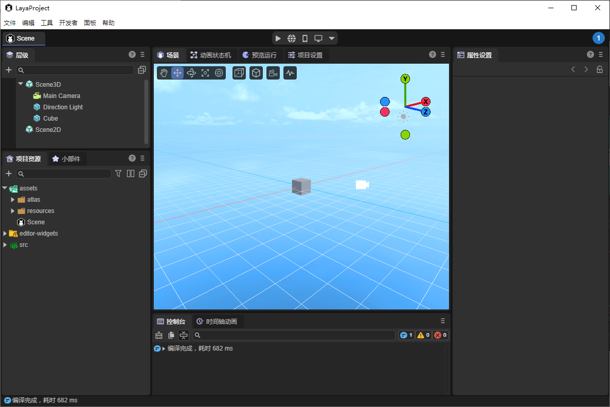

(Figure 1-4)

### 1.2 Basic Environment Configuration

After the developer installs the Vscode coding tool, the IDE will usually associate with the coding tool automatically.

If the developer wants to use other coding tools, or in some cases, the IDE fails to automatically recognize the coding tool, it can also be manually specified in the preferences, as shown in Figure 1-5.

(Figure 1-5)

> For the external browser used for debugging and previewing, if you don't want to use the one specified by the IDE by default, you can also set it here.

### 1.3 Language Settings of the IDE

The IDE of LayaAir3 supports both Chinese and English, and developers can choose according to their preferences.

It should be noted that in the Chinese interface, it is supported to choose whether to translate the property names.

Considering that some developers are more accustomed to the English property names for direct use in the code, and some developers are more accustomed to the Chinese property names for easy understanding. Therefore, you can use the fully Chinese interface by "checking the box of translating engine symbols" (the English property names can still be viewed in the Tips). As shown in Figure 1-6. If you uncheck the box, the engine properties will not be translated.

(Figure 1-6)

## 2. Preview and Run

Project preview is used to view the running effect of the project in different environments. LayaAir-IDE provides four modes (version >= 3.2), as shown in Figure 2-1, namely, preview in the IDE, browser preview, mobile preview, and Windows preview.

(Figure 2-1)

### 2.1 Preview and Debugging in the IDE

The IDE has a built-in browser preview environment. After clicking "Preview in IDE", the running effect can be previewed directly in the IDE. In this mode, developers can more clearly view the node hierarchy after running and directly adjust the change effect of node attributes. As shown in the animated GIF 2-2.

(Animated GIF 2-2)

> This effect is from the "2D Entry Example" project.

In the toolbar on the preview panel, you can adjust the preview resolution, zoom, reset, sound switch, developer tools, and refresh. As shown in Figure 2-3.

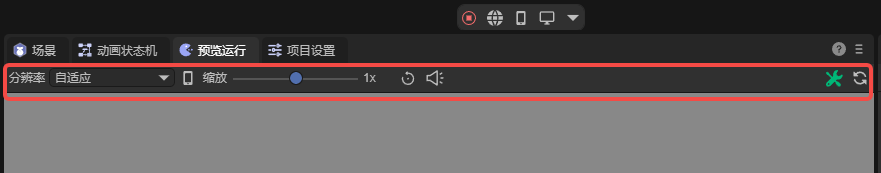

(Figure 2-3)

### 2.2 Browser Preview

Browser preview means calling the system browser to run and debug. We usually recommend the Chrome browser. If the default browser in the developer's system is not Chrome, you can also select the browser specified by the developer through `Preferences` -> `General` -> `External Tools` -> `Browser`. As shown in Figure 2-4.

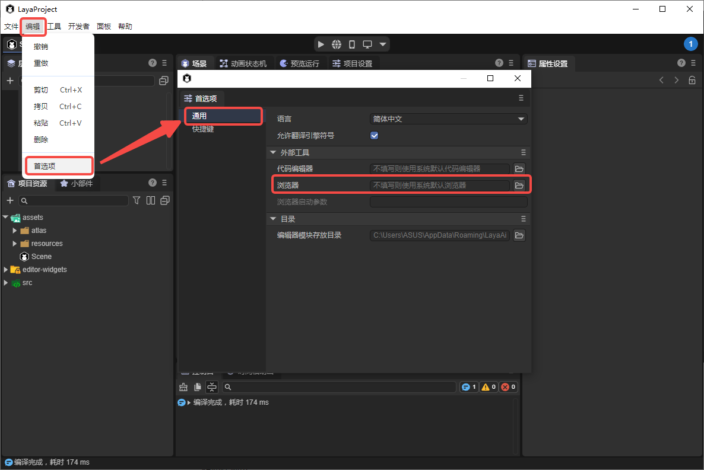

(Figure 2-4)

### 2.3 Mobile Preview

Mobile preview is used for scanning the QR code on the mobile phone to preview the real-machine effect of running in the mobile browser. As shown in Figure 2-5.

> It should be noted that the mobile device and the computer device must be in the same local area network.

(Figure 2-5)

### 2.4 Windows Preview

Windows preview is a preview mode based on the native exe environment of Windows. It is usually used to detect whether the Native installation package runs stably or has consistent performance.

If it is the first time to run and the corresponding native module is not installed, a prompt as shown in Figure 2-6 will pop up. First, install the support package for environment construction.

(Figure 2-6)

After clicking "OK", the installation will be prompted automatically. Click "Install" to proceed.

(Figure 2-7)

After the installation is completed, click to view the running effect, as shown in Figure 2-8.

(Figure 2-8)

> This effect is from the "2D Entry Example" project.

## 3. Explanation of the Entry Scene

### 3.1 Entry Point for Running

The LayaAir3 engine runs based on scenes, and it is not possible to set a pure code as the project entry point.

In other words, whether it is for testing or formal release, there must be an entry scene as the first scene to be launched when the project runs.

Click on the icon shown in Figure 3-1 to select the entry point for preview and running, that is, the scene to be loaded and run after clicking "Preview and Run".

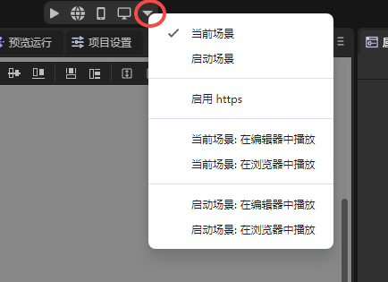

(Figure 3-1)

### 3.2 Current Scene

The "current scene" refers to the scene that is currently being edited, as shown in Figure 3-2. This mode is only used for preview testing.

(Figure 3-2)

### 3.3 Startup Scene

The startup scene is the entry scene of the entire project and is usually used as the loading page. On this interface, game resources are loaded and the progress bar is displayed.

To set the startup scene, you need to open `Build and Publish` -> `General`-> `Startup Scene` in sequence, as shown in Figure 3-3.

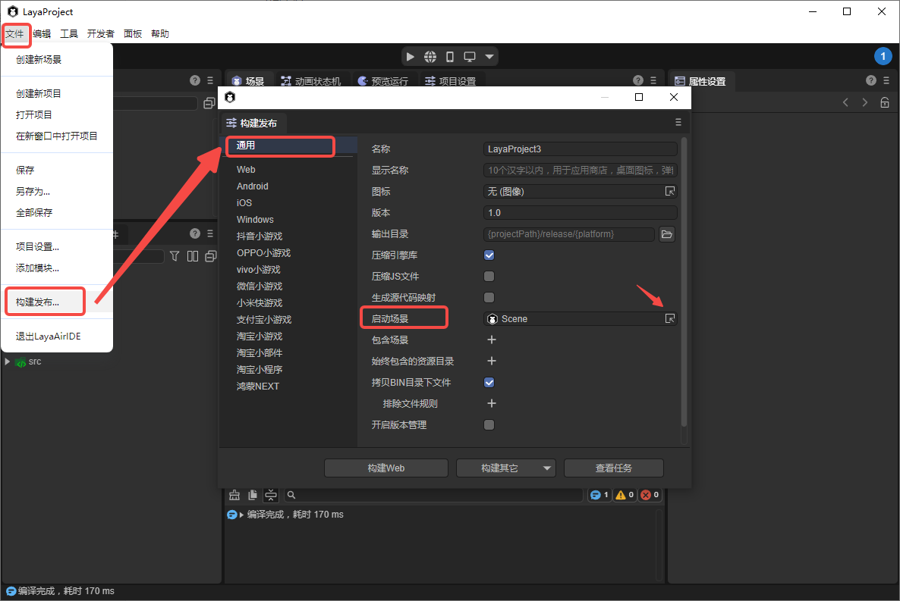

(Figure 3-3)

After the setting is completed, whether it is checking the `Startup Scene` in the project preview or building the project (releasing the product), the startup scene will be used as the entry scene for the project to run.

## 4. Scripts

Scenes support the running of two types of scripts. One is the UI runtime, which can only be used on the root node of a 2D UI scene. The other is a custom script, which can be used on any scene and node. No matter which one the developer chooses, the script logic will be executed along with the running of the scene.

As a beginner, this section takes the custom script as an example to guide developers to create a script on the scene and run the script.

### 4.1 Creating a Script

The developer first selects the root node in the hierarchy panel. In the property panel, click "Add Component" and "Create a New Component Script" in sequence, then "Enter the Name", and click "Create and Add". As shown in the animated GIF 4-1, the creation of the script and the operation of binding the script to the scene are completed.

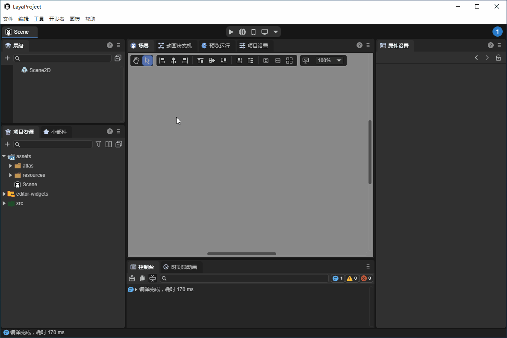

(Animated GIF 4-1)

In addition to this method, we can also create a script in the project resource panel and then drag the script to the property panel to bind the component. The operation is shown in the animated GIF 4-2.

(Animated GIF 4-2)

### 4.2 Script Coding

The coding environment for scripts has been introduced in the previous text. We recommend using Vscode for coding. When we double-click on the script in the property panel or the script in the resource panel, the Vscode coding tool will be opened, as shown in Figure 4-3.

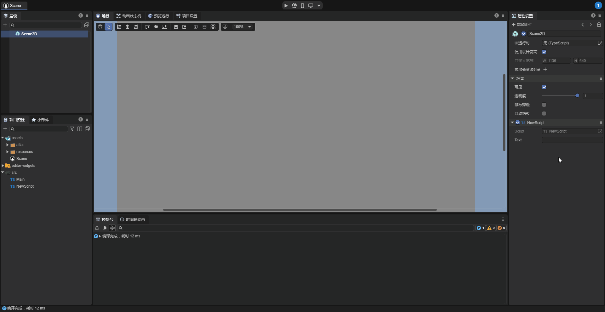

(Figure 4-3)

After entering the Vscode coding tool, we add the first line of code in the onAwake lifecycle method to print "Hello, World!", as shown in Figure 4-4.

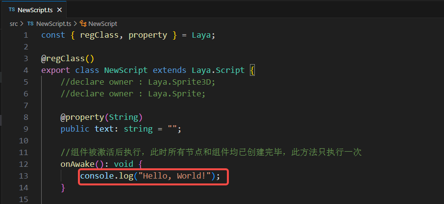

(Figure 4-4)

Return to LayaAir-IDE and run to view the console. As shown in the animated GIF 4-5, you can see the printed log.

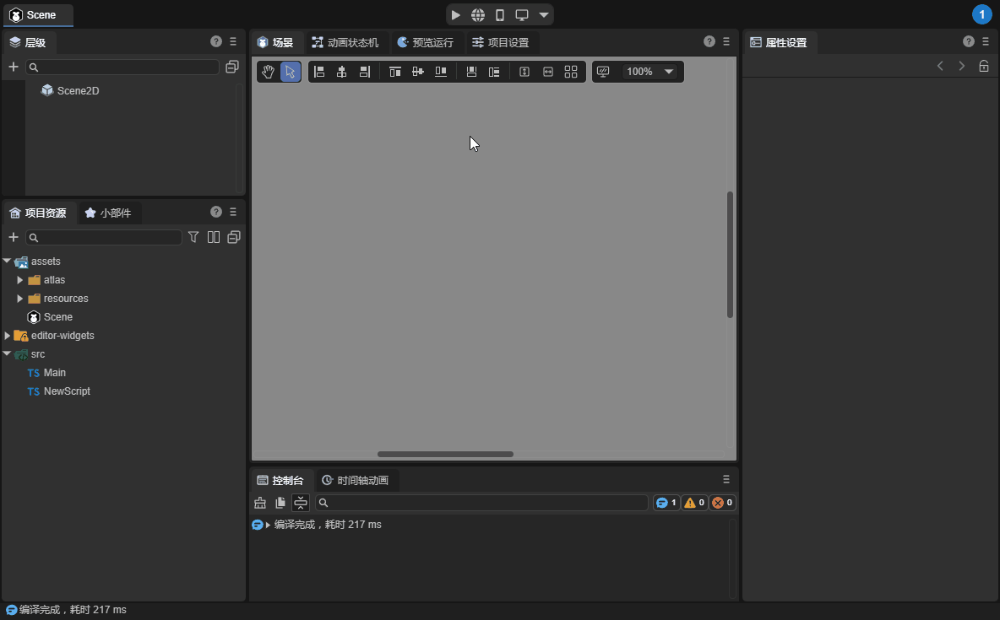

(Animated GIF 4-5)

If we use the browser for debugging, press the F12 key to view the log in DevTools.

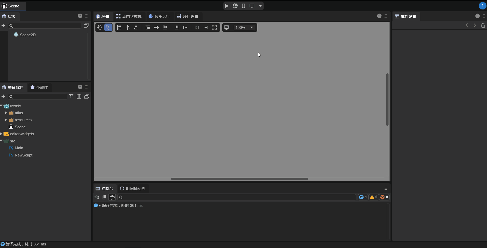

(Animated GIF 4-6)

For more information on how to write scripts based on the component system of LayaAir, be sure to refer to the document [“Entity Component System (ECS)”](../../common/Component/readme.md).

## 5. Visual Development

LayaAir3-IDE supports a rich set of visual development modules. Here are some links to the main functional module documents. Developers can view them one by one when they have time.

[UI Editing Module](../../../IDE/uiEditor/readme.md)

[Animation Editing Module](../../../IDE/animationEditor/readme.md)

[2D Physics Editing](../../../IDE/physicsEditor/physics2D/readme.md)

[3D Physics Editing](../../../IDE/physicsEditor/physics3D/readme.md)

[3D Particle Editing](../../../IDE/particleEditor/readme.md)

[Material Editing Module](../../../IDE/materialEditor/readme.md)

[Blueprint Editing Module](../../../IDE/ShaderBlueprint/readme.md)

[IDE Plugin System](../../../IDE/layapackage/readme.md)

## 6. Build and Publish

After the development is completed, the project can be published. In the "Build Release" panel, click "Build Web". Once the build is complete, click "Run" to run it in the browser.

> For more information on building releases, please refer to [Universal Release](../../../released/generalSetting/readme.md).