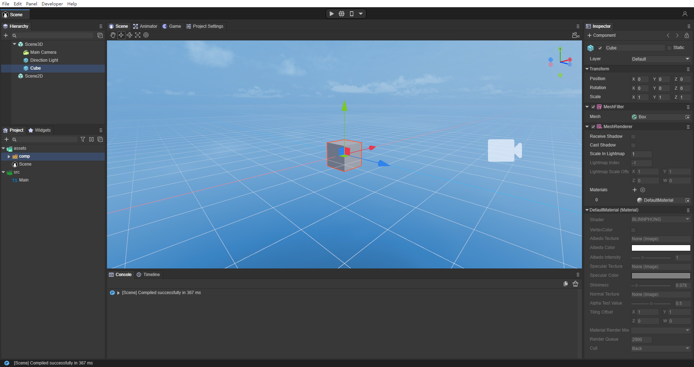
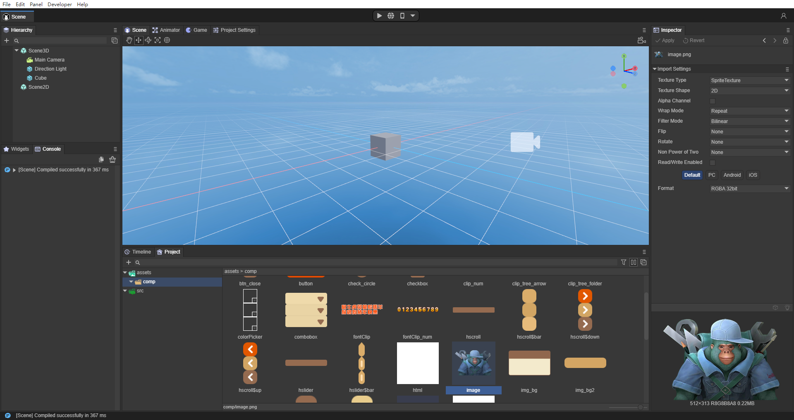
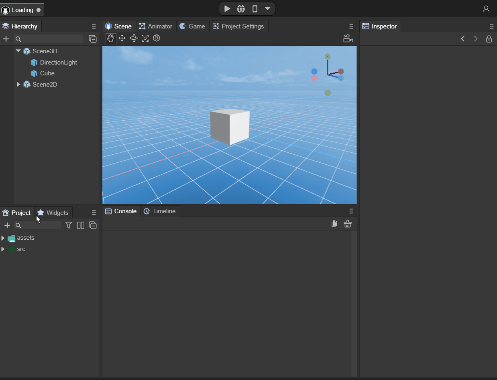
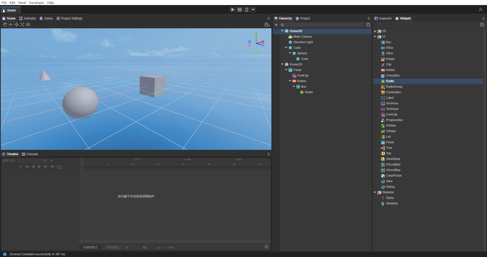
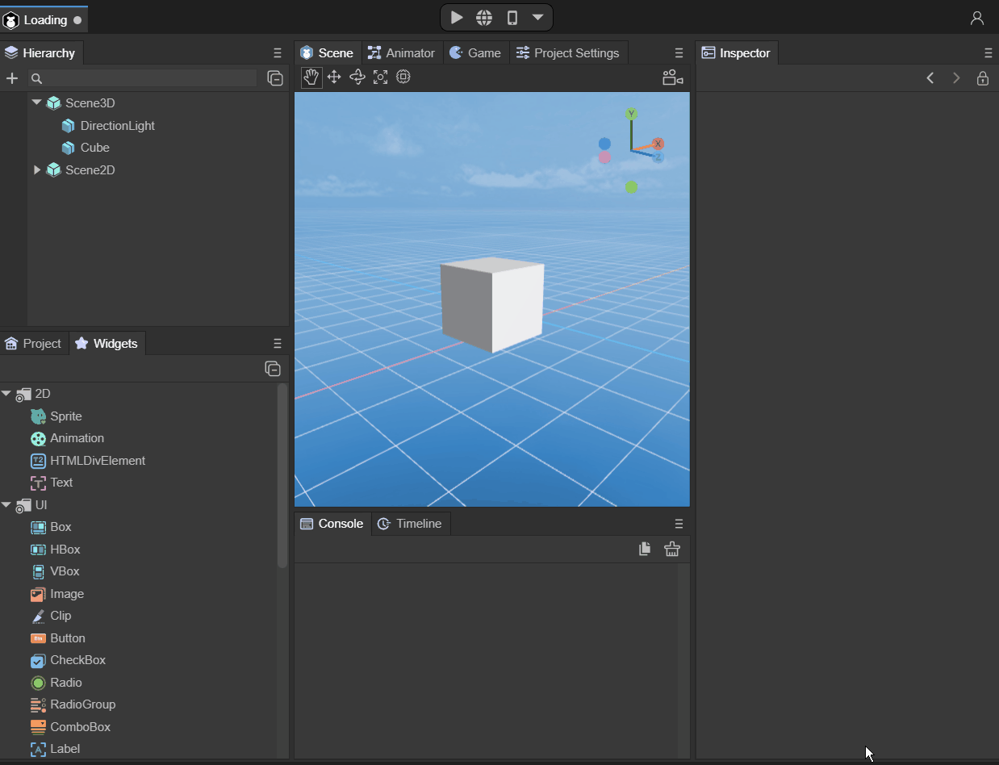
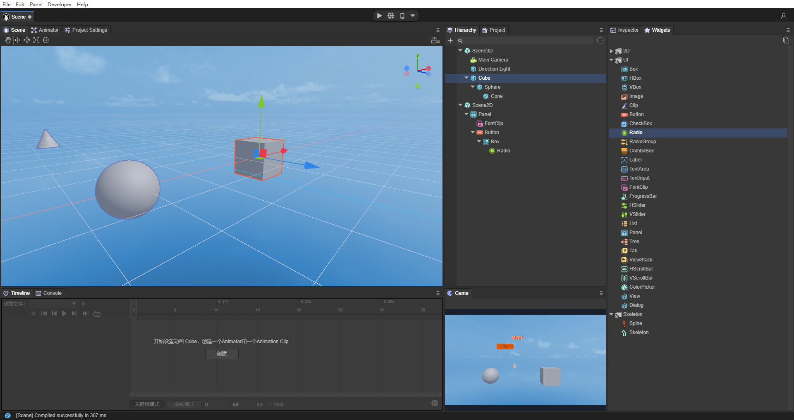
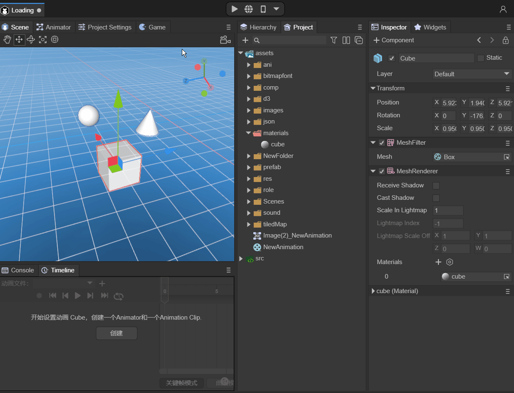

# Customize IDE interface layout

> Author: Charley && Poems for Flowers

LayaAir 3.0 IDE allows developers to layout and layout various functions according to their own habits or preferences.

## 1. Adjustment to make resource preview more convenient

When we create an empty project, such as a 3D empty project, the interface layout is as shown in Figure 1-1.

(Picture 1-1)

The default mode is relatively simple. Some developers may have higher requirements for resource preview. We might as well adjust it to such an effect. The interface is shown in Figure 1-2.

  

(Figure 1-2)

The operation method is shown in the animation 1-3:

(Animation 1-3)

## 2. Adjust to make hierarchical expansion more convenient

If the developer has many node levels and needs to expand and view them, it is obviously more convenient to view them vertically in full screen. The effect is shown in Figure 2-1.

    

(Figure 2-1)

The operation method is shown in the animation 2-2:

(Animation 2-2)

## 3. Adjust to instant preview mode

Sometimes, developers also need to edit scenes (2D and 3D) while viewing real-time preview effects. Then we can separate the Game panel, and the effect is as shown in Figure 3-1.

  

(Figure 3-1)

The operation method is shown in the animation 3-2:

(Animation 3-2)

---

> [!Note]
>
> The above three methods are for reference only. If you master the position adjustment method of the IDE panel, you can layout it according to your own needs and preferences~

