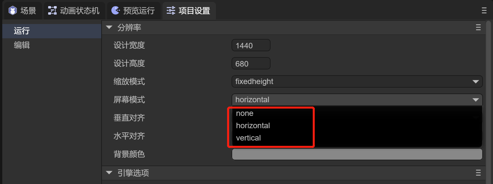

# Detailed explanation of project settings

> Author: Charley, Meng Xingyu

The project settings of the IDE include two parts, run settings and editor settings.

## 1. Run settings

### 1.1 Resolution setting

The resolution setting will affect the preview effect in the IDE, as well as the canvas width and height, adaptation mode, alignment, canvas background color, etc. when the project is running. The settable properties are shown in Figure 1-1:

  

(Picture 1-1)

#### 1.1.1 Screen width and height adaptation

The three settings that affect the width and height of the product screen are design width and height (Design Width, Design Height) and scaling mode (Scale Mode).

The design width and height are the width and height we set in the IDE and see.

This width and height will affect the size of the UI scene background in the IDE, and the viewing effect in the IDE's preview running mode is also based on this width and height.

In the actual operating environment, such as different mobile phones. Due to the different screen ratios, it is certainly impossible to completely match the design width and height.

Therefore, you need to use the engine's own scaling adaptation mode to scale to meet the developer's screen needs.

The scaling adaptation mode involves many knowledge points such as canvas, stage, adaptation algorithm, etc. We introduce it in detail in another document ["Screen Adaptation"] (../../common/adaptScreen/readme.md).

#### 1.1.2 Horizontal and vertical screen adaptation

Sometimes, we need to force the horizontal and vertical screen settings according to the screen ratio. This can be done by setting the Screen Mode in the IDE.

There are three adaptation modes for horizontal and vertical screens, as shown in Figure 1-2.

 

(Figure 1-2)

**1, no change: none**

When set to none, no matter how the screen direction is rotated, the horizontal direction of the game will not change to follow the screen rotation.

The effect is shown in the animation 1-3.


(Animation 1-3)

Through the animation 1-3, we found that when the value is none, when the screen is rotated, the interface based on the vertical screen design will become unsuitable in the horizontal screen. Similarly, the interface based on the horizontal screen design will not be suitable in the vertical screen. It will become unsuitable.

Of course, if our layout strategy is used more reasonably, we may also be able to take into account the experience of both horizontal and vertical screens. The effect is shown in the animation 1-4.


(Animation 1-4)

Although it is not that ugly, in order to achieve the best effect, the best solution is to always keep the vertical screen in the same direction as the device's vertical screen, and the horizontal screen in the same direction as the device's horizontal screen.

**2, always horizontal screen: horizontal**

When the width and height we set are horizontal screen products, horizontal is undoubtedly the best experience, as shown in the animation 1-5.

  

(Animation 1-5)

Through the animation 1-5, we found that when the screenMode attribute value is set to horizontal, no matter how the screen direction is rotated, the horizontal direction in the design will always remain perpendicular to the shortest side of the screen. Therefore, when the user's device is in portrait mode, it will be natural to see a horizontal screen image. The device will be turned sideways to match the design of the product.

**3, always vertical screen: vertical**

When the width and height we set are vertical screen products, vertical is undoubtedly the best experience, as shown in the animation 1-6.

  

(Animation 1-6)

Through the animation 1-6, we found that when the screenMode attribute value is set to vertical, no matter how the screen direction is rotated, the horizontal direction of the game will always remain vertical to the longer side of the screen. Therefore, even if the user has turned the device horizontally, he still sees the vertical screen image, and will naturally return the device to vertical screen, thus conforming to the design of the product.

> [!Tip]
>
> It should be noted that when running in the browser, the engine's automatic horizontal screen and automatic vertical screen can only rotate the canvas. If the user's phone locks the screen, although the screen will automatically rotate, the browser will not rotate. Over, it will cause the input method to still pop up in the direction of the browser. At this time, it may cause the input method and the browser to be displayed at 90 degrees.
>
> When running on a mini-game platform, since the bottom layer of the mini-game has a horizontal or vertical screen configuration, this problem will not occur.

#### 1.1.3 Canvas alignment adaptation

The alignV (vertical alignment) and alignH (horizontal alignment) provided in the engine are used to align the canvas. The setting method is shown in Figure 1-7:

  

(Figure 1-7)

Parameter description is as follows:

The parameters of AlignV vertical alignment are: top (top alignment), middle (vertical center alignment), bottom (bottom alignment).

The parameters of AlignH horizontal alignment are: left (aligned to the left), center (aligned to the center horizontally), right (aligned to the right).

> [!Tip]
>
> Canvas alignment cannot be understood as the alignment of the UI interface based on the stage, but the alignment of the canvas relative to the entire physical screen.
>
> This setting is basically not used on the mobile side. Most mobile terminals require full-screen adaptation. When the canvas already covers the entire screen, the settings are meaningless.
>
> Usually used on the PC side in non-full-screen modes, such as when the canvas is not in full-screen mode (showall and noscale).

#### 1.1.4 Canvas background color setting

The canvas background color is actually to set a color for the canvas. The default value is `#888888`, as shown in Figure 1-8:

  

(Figure 1-8)

### 1.2 Engine initialization settings

There are some engine configuration items that need to be set when the engine is initialized, and the setting entry is as shown in Figure 1-9:

  

(Figure 1-9)

2D attribute parameter description:

| attribute name	| Property description	|
| -------------- | ------------------------------------------------------------ |
| Frames per second FPS	| Device frame rate; used to calculate the maximum rendering interval between two frames. Usually the frame rate on the device is a maximum of 60, that is, only a maximum of 60 frames will appear on the screen in one second, so the frame rate between two frames The duration is 1000ms/60. For high frame rate devices, we can modify the FPS value. For example, for a 120 frame device, the time between two frames is 1000ms/120. |
| Canvas anti-aliasing	| Whether to turn on anti-aliasing; used to set the antialias anti-aliasing switch attribute of the webGL context, which will cause additional performance consumption. It is mainly used for 2D non-rectangular vector drawing anti-aliasing. When there is no vector drawing graphics or the performance pressure is high, you can choose not to Turn on. It is recommended to use the camera's Fxaa or Msaa for 3D anti-aliasing. |
| Retina Canvas Mode | Whether to use HD canvas mode; after turning it on, regardless of any adaptation mode, the canvas will use the physical resolution size. After turning it on, it will consume more performance than not using the physical resolution, but it will keep the text and so on the best clarity. Spend. |
| Canvas transparent	| Whether the canvas is transparent; the canvas has a background color by default. After turning it on, you can set the canvas to be colorless and transparent. |
| Vertex cache optimization | Whether to allocate the largest VB buffer; after turning it on, when rendering 2D, a cache sufficient for 64k vertices will be directly allocated each time a VB is created. This improves efficiency. After turning it off, 64k of video memory can be saved, but performance efficiency will be sacrificed. If 2D is included, it is recommended to keep it turned on by default. |
| Default font	| The default font of text; after setting, the default font of new text in the IDE will adopt the setting here. |
|Default font size	| The default font size of text; after setting, the default font size of new text in the IDE will adopt the setting here. |

3D attribute parameter description:

| attribute name	| Property description	|
| ------------------ | ------------------------------------------------------------ |
| Static batching	| Whether to enable static batching; turning on static batching can reduce the number of rendering state changes between visible mesh draw calls. |
| Dynamic batching	| Whether to enable dynamic batching; after enabling dynamic batching, if **instance merging** (same Mesh and same material) is met, the number of RenderBatches rendering batches and Shader submissions can be reduced. |
| Physical function initialization memory | When initializing 3D settings, the default physical function initialization memory is in M.	|
| Enable UniformBuffer | Enable Uniform Buffer; when the Uniform Buffer cache is enabled, the amount of data transferred from the CUP to the GPU can be reduced. |
| Resolution multiple	| Set the 3D resolution multiple, the default value is 1; reducing the 3D resolution will not affect the resolution of the 2D UI. Appropriate adjustment can reduce performance consumption. |
| Multiple light sources	| Whether to enable multiple light sources; if multiple light sources are not needed, turning it off can reduce performance consumption. |
| Maximum number of light sources	| The default value is 32.	|
| Number of light clusters	| The number of lighting clusters in x, y, and z axes; the z value will determine the number of clusters affected by area light (point light, spotlight), Math.floor(2048 / lightClusterCount.z - 1) * 4 is the number of each Cluster The maximum average amount of light received in the area. If the average number of light sources affected by each Cluster is greater than this value, the farther Cluster will ignore the excess light effects. |
| Maximum number of deformations	| The maximum number of deformations for the mesh renderer. The default value is 32.	|
| Whether to use BVH cropping	| Whether to use BVH clipping; after turning it on, you can set: the maximum number of cells in a BVH node (if it exceeds this number, it will be separated -), the size of the maximum BVH node, and the minimum number of cellbuilds (if it is less than this number, BVH will not be built). |


### 1.3 Project startup settings

#### 1.3.1 Entry startup scenario

There are two ways to set the LayaAir 3.0 project running entrance. One is to use the current scene (the scene being edited) as the project running entrance, and the other is to set a fixed project entrance scene.

When we set the **startup scene** in **build release** and **check** the startup scene as the entrance, as shown in Figure 1-10. When running the project, after the engine is initialized, the set startup scenario will be run first.

  

(Figure 1-10)

#### 1.3.2 Engine library module

The LayaAir engine consists of multiple module components, and only the more basic modules are introduced by default, as shown in Figure 1-11.


(Figure 1-11)

If applied to other modules, you need to check the corresponding module before you can use its API, otherwise an error will be reported when the project is run.

Engine library module description:

| Engine library module name	| Engine library module description	|
| ------------------- | ------------------------------------------------------------ |
| laya.d3	| 3D basic module, a must-have library for using 3D	|
| laya.ui	| ui module, including commonly used ui components, a must-have library for using 2D UI components	|
| laya.ani	| 2D animation module, including 2D node animation (sequence frame, atlas animation), built-in skeletal animation, etc. |
| laya.device     	| Gyroscope, accelerometer, geographical location, camera, microphone and other device interface call packaging |
| laya.tiledmap   	| tiledmap map interface encapsulation	|
| laya.particle   	| 2D particle encapsulation, not recommended	|
| laya. gltf	| The code directly uses the loading and parsing library of the gltf model	|
| laya.physics    	| Package of Box2D physics library	|
| laya.physics3D  	| Bullet 3D Physics Library	|
| laya.physics3D.wasm | Bullet 3D physics library for WebAssembly	|
| laya.spine      	| spine animation engine library	|
| laya.workerloader | WorkerLoader decodes images asynchronously	|

#### 1.3.3 Start page configuration

The startup page refers to the icon displayed before the game starts. If no setting is made, the engine's default icon will be used. Developers can customize icons, as shown in Figure 1-12:


(Figure 1-12)

Parameter Description:

| Parameters	| Description	|
| ---------------- | ------------------------------------------------------------ |
| Activate	| When checked, the startup page will be displayed before the game starts.	|
| background color	| After checking, you can set the background color of the startup page.	|
| Pictures	| The icon displayed on the startup page, the default is the engine icon. When customizing icons, the image path must be placed in the bin directory. |
| Adaptation	| Screen adaptation of icons. There are four modes: center, fill, contain, and cover.	|
| Minimum display time	| The minimum display time of the startup page, in seconds.	|
| Allow activation in preview | When checked, the startup page can be seen in preview mode. Otherwise, the splash page will only be visible after publishing. |


### 1.4 Debug startup settings

As shown in Figure 1-13, LayaAir IDE can enable the following debugging modules:


(Figure 1-13)

#### 1.4.1 Display statistics

After checking Show statistics, you can view the current frame rate, memory usage, nodes and other information for project analysis and optimization. As shown in Figure 1-14.

  

(Figure 1-14)

If you want to know more details about the parameters on the statistics panel, please consult the document [Performance Statistics and Optimization](../../common/Stat/readme.md)

#### 1.4.2 Display the mobile debugging tool VConsole

Debugging on the mobile side usually requires connecting to the browser on the computer side.

If the developer does not need breakpoints, but just some common log printing, loading and other viewing, open `V Console`, and the debugging tool panel as shown in Figure 1-15 will appear on the mobile terminal.

  

(Figure 1-15)

#### 1.4.3 Pop-up window displays global errors

If you capture a global error [window.onerror](https://www.w3school.com.cn/jsref/event_onerror.asp), check `pop-up window to display global error` to throw a detailed error stack in the pop-up window. For example, you can customize a global error with the following code:

```typescript
//Customize a global error
let err = new Error("Customized Error");
Laya.Browser.window.onerror(err.message, "", "", "", err);
```

When running, a pop-up window will throw an exception, and the effect is shown in Figure 1-16.


(Figure 1-16)

#### 1.4.4 Display 2D physics debugging

In LayaAir IDE, if you add physical attributes (rigid body, collision box, etc.) to a 2D node and check `Show 2D physical debugging`, the node with added physical attributes will display a shadow effect, as shown in the animation 1-17 Shown:


(Animation 1-17)


## 2. Editor settings

### 2.1 3D prefab editing scene

By default, 3D prefabs are edited in the context of a dedicated system empty scene (DefaultPrefabEditEnv).

If we specify a target scene through `3D prefab editing scene`, it is equivalent to editing directly in a 3D scene. In this way, when switching to a 3D scene, it will be more in line with the needs. The operation is shown in Figure 2-1:


(Figure 2-1)

The effect is shown in Figure 2-2:


(Figure 2-2)

### 2.2 Enable texture compression when importing resources

After checking `Enable texture compression when importing resources`, when importing texture resources (PNG and JPG) from outside to the IDE, as shown in Figure 2-3, the [Texture Compression](. ./../../IDE/uiEditor/textureCompress/readme.md), enabling this operation will increase operating efficiency, but will affect display quality.


(Figure 2-3)

This operation has no impact on old resources before this feature is enabled.


### 2.3 Automatically bake IBL

After checking `Automatically bake IBL`, as shown in Figure 2-4, if the skybox material is changed in Scene3D (Material is changed from skybox to other materials), there is no need to manually click the `Bake` button for the IBL Tex of Reflection Probe. , after saving the scene, the IDE will automatically re-bake it.


(Figure 2-4)

> Only when the Source of Reflection Probe is Skybox, it will be baked automatically. Custom cannot be baked automatically.

### 2.4 Preview server

The preview server can set the address and port number for previewing in the browser. After setting, refresh the IDE to apply it. The effect is shown in Figure 2-5.


(Figure 2-5)

### 2.5 3D node level settings

For 3D nodes, you can select levels and set them. In the editing settings, you can add, delete, and name levels. The effect is shown in Figure 2-6.

  

(Figure 2-6)

For more information about hierarchical Layer, you can go to the IDE document [Using 3D Sprites](../../../3D/Sprite3D/readme.md) to view it.


