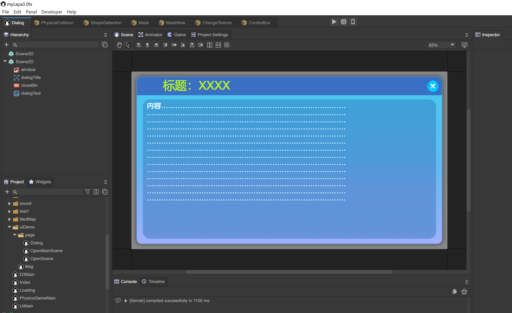
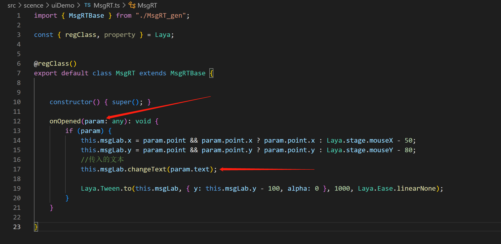

# Scene management

`Laya.Scene` scene class, responsible for scene creation, loading, destruction and other functions

After the scene is removed from the node, it will not be recycled by the automatic garbage mechanism. If you want to recycle, please call the destroy interface. You can view the list of scenes that have not been destroyed through the `unDestroyedScenes` attribute.

### Open scene

#### 1. Basic use

`Laya.Scene.open(url: string, closeOther: boolean = true, param: any = null, complete: Handler = null, progress: Handler = null)`

   	 

(Figure 1) Create a scene named OpenScene and save it in the path uiDemo/page/OpenScene.ls

```
Laya.Scene.open("uiDemo/page/OpenScene.ls", false);
```

You can open the scene like this in the code without closing other scenes.

#### 2. Pass and receive parameters


(Figure 2) Create a scene named Msg, which will pass text when entering this scene.

```
Laya.Scene.open("uiDemo/Msg.ls", false, { "text": "There is no check option, please check it first" });
```

Pass parameters to the next scene through `Laya.Scene.open`, the data is `{ "text": "There is no check option, please check it first" }`



(Figure 3) In the Msg scene, add the Runtime class. The `onOpened` method will accept the incoming parameters. `param.text` is "There is no check option, please check it first"


 (Figure 4) *Note: After the scene is opened, call this method (if there is a pop-up animation, it will be executed after the animation is completed)*


### Close scene

**1. Close the specified scene**

`Laya.Scene.close(url: string, name: string = "")`

Based on the address, close the scene (including the dialog box)

**2. Close the current scene**

`this.close()`


(Figure 5) Using the Runtime method, you can easily use `this.close()` to close the scene

**3, close all scenes (excluding dialog**)

`Laya.Scene.closeAll()`

**4, life cycle method called after closing**


(Figure 6) The Runtime class of the scene will be called when the scene is closed. The `onClosed()` method can be used to release various resources within the method.

### Scene loading page

设置 `Laya.Scene.setLoadingPage(loadPage: Sprite)`

Set the loading interface. The engine will delay opening the loading interface after calling the open method, and close the loading interface after the page is added to the stage.

显示 `Laya.Scene.showLoadingPage(param: any = null, delay: number = 500)`

Display the loading interface and open the parameters. If it is a scene, it will be passed to the `onOpened` method to delay the opening time. The default is 500 milliseconds.

隐藏 `Laya.Scene.hideLoadingPage(delay: number = 500)`


(Figure 7) Define a script code and add the Laya.Prefab attribute that may be dragged into the loadingScene

 

(Figure 8) In the Scene.ls scene, hang up the script and drag it into the Loading.ls scene


### Destroy

Destroy resources that are not currently being used `Laya.Scene.gc()`

Destroy the scene (including dialog) according to the address `Laya.Scene.destroy(url: string, name: string = "")`


(Figure 9)

