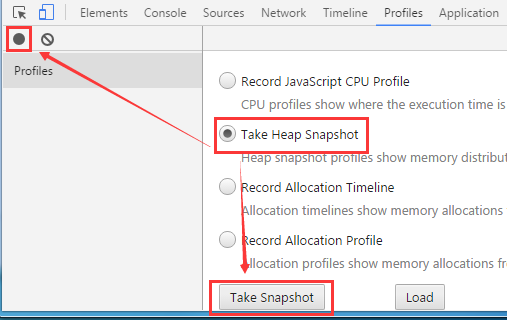

# Use chrome's performance analyzer

> Performance Analyzer (Profiles) is part of the chrome developer tools. You can open the chrome developer tools by right-clicking on the page and selecting Inspect Element or pressing F12 on the Google Chrome page. Then click Profiles to switch to the Performance Analyzer (Profiles) panel.
>

 

### 1. CPU usage analysis

#### 1.1 Start the CPU performance analyzer

Select `Record JavaScript CPU Profile` and click the Start button or the solid dot in the upper left corner. At this time, Chrome will start recording the execution of the method of the current web page. As shown in Figure 1-1.

 (Picture 1-1)

#### 1.2 End the monitoring of CPU performance analyzer

To end the monitoring recording of this performance analyzer, click the Stop button (or the red solid circle on the left). As shown in Figure 1-2.

 (Picture 1-2)

### 1.3 View the records of the CPU performance analyzer

After monitoring ends, a monitoring result file will be listed under Profiles on the left. Click to open this monitoring result file. As shown in Figure 1-3

 (Picture 1-3)

Monitoring results are displayed in the form of data tables. We can find the function names provided in Function according to the consumption ranking, and optimize the places where performance consumption is large.

### 2. Memory usage analysis

#### 2.1 Start memory analysis

Select `Take Heap Snapshot` and click the `Take Snapshot` button (you can also click the black solid circle on the left), as shown in Figure 2-1.

 (Picture 2-1)

The generated memory snapshot file records the number of current web page objects, the memory size occupied, etc. in the form of a data table.

#### 2.2 Memory Snapshot Recording

After starting memory analysis, a memory snapshot record file of the current web page will be generated soon under the Profiles column on the left. Click to view relevant data, as shown in Figure 2-2.

 (Picture 2-2)

#### 2.3 Memory Snapshot Analysis

After taking the first memory snapshot, click the dot in the upper left corner to record a new memory snapshot. Click to select the second memory snapshot to select the Comparison mode that changes between this second snapshot and the first snapshot. Optimize web pages through analysis.

​	 
​	(Figure 2-3)

​	 
​	(Figure 6)