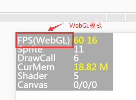

# Introduction to performance statistics panel	 

From the beginning of the design of the LayaAir engine, performance was the first goal and a lot of performance optimization was done in the engine. Proper use of engines can allow games and other engine products to achieve the experience of native APPs. If developers cannot take advantage of the engine, the final performance experience of the game may not be possible. Therefore, in the process of making games, it is still very necessary to master game and engine optimization skills.


> To understand the performance of the engine, you must first understand the performance statistics panel. The performance statistics panel will be introduced in detail below.


## 1. Calling the performance statistics panel

The performance statistics panel built into the LayaAir engine can detect current performance in real time. The call statistics panel will be different depending on the development language.

In TS language, enter `Laya.Stat.show(0,0);` directly in the code to bring up the performance statistics panel.

The sample Demo.ts code is as follows:

```typescript
//Initialize the stage
Release.heat(1136, 640);
//Call the performance statistics panel method, (0,0) is the panel position coordinates
Laya.Stat.show(0,0);
```

**Tips**: Pay attention to capitalization.


## 2. Introduction to FPS

### 2.1 FPS Overview

FPS is the abbreviation of Frames Per Second. Assume that the frame rate of the game is 60FPS, which means that the execution time of each frame when the game is running is 1/60 second. The higher the frame rate value, the smoother it feels visually.

<br /> (Picture 1)

The current full frame rate of PCs, mobile phones and other devices is 60 frames, as shown in Figure 1. However, some games do not have high requirements for the smoothness of the screen. You can also use the engine's frame rate limiting method `Stage.FRAME_SLOW` to reduce the FPS Frame rate is limited to a maximum of 30fps.

Since the actual running environment is in the browser, performance also depends on the efficiency of the JavaScript interpreter. Therefore, the FPS value of the same game may be different in different browsers. This part is not something that developers can decide. What developers can do is to use the best engines and optimization projects as much as possible to improve the FPS frame rate on low-end devices or low-performance browsers.

#### 2.2 FPS in different modes

The LayaAir engine supports two rendering modes: Canvas and WebGL. Therefore, when looking at the FPS frame rate, pay attention to which mode it is in. `FPS(Canvas)` indicates the frame rate in Canvas mode, as shown in Figure 1; `FPS(WebGL)` indicates the frame rate in WebGL mode. speed, as shown in Figure 2.

<br /> (Picture 2)

#### 2.3 Numerical description of FPS

In Figure 1 and Figure 2, the first yellow value of FPS `60` is the current **FPS frame rate**, the higher the better.

The second yellow value `16` is the time spent rendering each frame in milliseconds. The smaller the value, the better.

If these two values ​​cannot be maintained at full frame, they will change during product operation, as shown in animation 3.

 <br /> (Animation 3)

## 3. Introduction to DrawCall

 **The number of DrawCalls is an important indicator that determines performance**, located in the third row of the statistics panel, as shown in Figure 4. DrawCall represents different meanings under Canvas and WebGL rendering, but the less the better. **It is recommended that developers try to limit it to less than 100**.

 <br /> (Picture 4)


#### 4.1 DrawCall under Canvas

 DrawCall in Canvas mode represents the number of drawings per frame, including pictures, text, and vector graphics.

#### 4.2 DrawCall under WebGL

In WebGL mode, DrawCall represents a rendering submission batch. The process of preparing data and notifying the GPU for rendering each time is called a DrawCall. In each DrawCall, in addition to notifying the GPU of rendering, it is time-consuming to switch materials and shaders. It is also a very time-consuming operation.


**Tips**: For more information on the optimization of CacheAs, you can view the document "CacheAs Static Cache Optimization"


 

