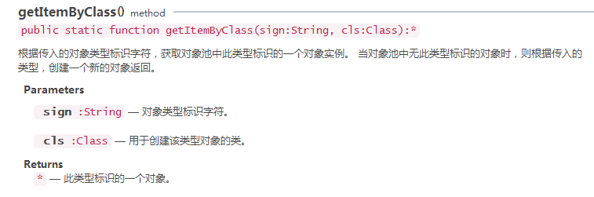
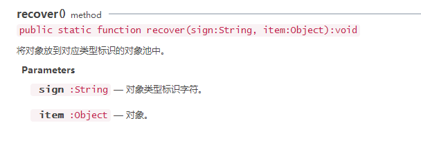
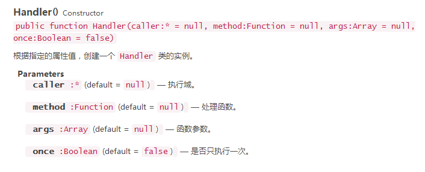
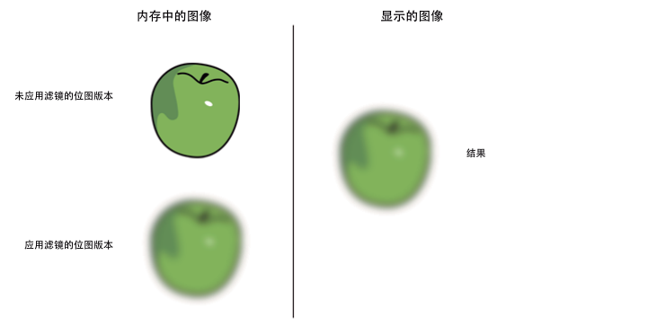

# Memory optimization method

### 1. Optimize memory through object pool

Object pool optimization is a very important optimization method in game development and is also one of the important factors affecting game performance.

There are many objects in the game that are constantly being created and removed, such as the creation and removal of character attack bullets, special effects, the destruction and refreshing of NPCs, etc. The creation process consumes a lot of performance, especially when the number is large. .

Object pool technology can solve the above problems very well. When objects are removed and disappear, they are recycled to the object pool. When new objects are needed, they are directly taken out of the object pool and used.

The advantage is that it reduces the overhead when instantiating the object, allows the object to be used repeatedly, and reduces the chance of new memory allocation and garbage collector running.

**Note**: When the object is removed, it is not immediately erased from the memory. Only when it is considered that the memory is insufficient, the garbage collection mechanism will be used to clear it. Clearing is very memory intensive and may cause lag. **Using the object pool will reduce the garbage objects of the program and effectively improve the running speed and stability of the program**.

#### 1.1 Object pool class of LayaAir engine

The LayaAir engine provides the object pool class [laya.utils.Pool](https://layaair.com/3.x/api/Chinese/index.html?version=3.0.0&type=Core&category=Utils&class=laya.utils.Pool ), used for object storage and reuse. The more commonly used ones are the `object pool creation` method `getItemByClass()` and the `recycling to object pool` method `recover()`. As shown in Figure 1-1 and Figure 1-2.

</br>

(Figure 1) Object pool creation method

</br>

(Figure 2) Recycling to the object pool method puts the used objects back into the object pool.

#### 1.2 Example of using object pool optimization

The following code demonstrates using the object pool method to create 100 snowflakes every 100 frames. When the snowflakes move beyond the boundary or the scale is less than 0, the stage is removed, and the Pool.recover() method is called to recycle the specified object into the object pool.

#####

```typescript
class PoolTest {
	private createTime: number = 0;

	constructor() {

    	//Initialize the engine
    	Laya.init(1136, 640, Laya.WebGL);
    	//Equal scaling
    	Laya.stage.scaleMode = Laya.Stage.SCALE_SHOWALL;
    	//background color
    	Laya.stage.bgColor = "#232628";
    	//frame loop
    	Laya.timer.frameLoop(1, this, this.onFrame);

	}
	onFrame(): void {
    	//If the object creation time is after 100 frame intervals
    	if (this.createTime >= 100) {
        	//Create 30 snowflakes every 200 frames
        	for (var i: number = 0; i < 100; i++) {

            	//img:Image=new Image(); //Writing without using object pool
            	//Create an image through the object pool. If there is no corresponding object in the object pool, execute new Image() creation based on the Image type.
            	var img: Laya.Image = Laya.Pool.getItemByClass("img", Laya.Image);
            	//Set the pivot point through the anchor point
            	img.anchorX = img.anchorY = 0.5;
            	//Picture resources
            	img.skin = "res/snow0.png"
            	//Create at a random position above the stage
            	img.x = Math.random() * 1136;
            	img.y = Math.random() * -150;
            	//The picture in the object pool has been scaled, and its scaling attribute needs to be reset.
            	//If there are other properties in the object that have been changed,
            	img.scaleX = img.scaleY = 1;
            	//Load to stage
            	Laya.stage.addChild(img);
            	//After reaching 100 frames, the time returns to 0 after the object is created.
            	this.createTime = 0;
        	}
    	} else {
        	//Update creation time
        	this.createTime++;
    	}
    	//Detect the picture objects in each stage and update the position.
   for(var j:number=0;j<Laya.stage.numChildren;j++)
        	{
            	//Get the picture object in the stage
            	var img1:Laya.Image=Laya.stage.getChildAt(j) as Laya.Image;
            	//Location update
            	img1.y++;
            	//Zoom update
            	img1.scaleX-=0.001;
            	img1.scaleY-=0.001;
            	//Picture rotation
            	img1.rotation++;
            	//Out of bounds or zoom less than 0
            	if(img1.y>640+20||img1.scaleX<=0)
            	{
                	//remove from stage
                	Laya.stage.removeChild(img1);
                	//img1.destroy(); //Do not use the object pool writing method, directly use destroy to clear it	 
                	//recycle to object pool
               	Laya.Pool.recover("img",img1);
            	}
        	}
    	}
	}

new PoolTest();
//The description of the above code is in the comments, please check it in detail.
```

### 2. Use Handler.create

During the development process, Handler is often used to complete asynchronous callbacks. Laya.Handler.create uses built-in object pool management, so you can use Laya.Handler.create to create a callback handler when using Handler objects. The following code uses Laya.Handler.create to create a callback handler for resource loading:

1. `Laya.loader.load(urls, Laya.Handler.create(this, this.onAssetLoaded));`

In games, we often load resources in batches based on game logic and stages. The first batch of resources is loaded and is recycled by the object pool after triggering the complete event callback method created by Laya.Handler.create(); when the game progresses to a certain point, When a second batch of resources needs to be loaded, Laya.Handler.create() will first retrieve the same callback method handler in the object pool. If found, it will directly use the method in the object pool, thus saving memory overhead.

#### Things to note when using Handler.create

</br>

In some special cases we need to pay attention to how `Laya.Hanlder.create()` is used. Let's carefully look at the `Laya.Hanlder.create()` method description in Figure 3.

Create a Handler from the object pool, which will be executed once by default and recycled immediately.

In other words, if you need to trigger this callback method multiple times, you need to set the `once` parameter in the `Laya.Hanlder.create()` method to `false`. Or create it using `new Laya.Handler()`.

For example, we need to load resources in the game start interface and display the progress of loading resources. The following coding is wrong.

1. `Laya.loader.load(urls, Laya.Handler.create(this, this.onAssetLoaded), Laya.Handler.create(this, this.onLoading));`

In the above code, the callback method returned by `Laya.Handler.create(this, this.onLoading)` is used to handle the progress loading progress event. Since the callback is recycled by the object pool after being executed once, progress loading The progress event is only triggered once and then ends, but in fact the resource has not been loaded and is still being loaded, so this kind of coding cannot meet our expected needs.

The correct way to write it is:

```
Laya.loader.load(urls, Laya.Handler.create(this,this.onAssetLoaded), Laya.Handler.create(this,this.onLoading, null, false));
```

or it could be:

1. `Laya.loader.load(urls, Laya.Handler.create(this,this.onAssetLoaded), new Laya.Handler(this, this.onLoading));`

**Tips**: What should not be confused here is that `Handler()` does not use the object pool. `Laya.Handler.create()` uses the object pool by default. Don't be confused about Handler.

**Handler() API reference is shown in Figure 2-2**:

</br>

(Figure 4)

### 3. Release memory

The JavaScript runtime cannot start the garbage collector. To ensure that an object can be recycled, all references to the object need to be deleted. The `destroy()` method provided by Sprite will help set the internal reference to null.

For example, the following code ensures that the object can be garbage collected:

1. `//Create a Sprite instance`
2. `var sp:Laya.Sprite = new Laya.Sprite();`
3. `//Set the sp internal reference to null`
4. `sp.destroy();`

When an object is set to null, it is not immediately removed from memory. The garbage collector will only run when the system thinks memory is low enough. Memory allocation (not object deletion) triggers garbage collection.

Garbage collection can consume a lot of CPU during garbage collection and affect performance. Try to limit the use of garbage collection by reusing objects. Also, set references to null whenever possible so that the garbage collector spends less time looking for the object. Sometimes (for example, two objects refer to each other), it is impossible to set both references to null at the same time. The garbage collector will scan the unreachable objects and clear them, which will consume more performance than reference counting.

### 4. Resource uninstallation

There are always many resources loaded when the game is running. These resources should be unloaded in time after use, otherwise they will remain in the memory.

The following example shows how to compare the resource status before and after the resource is unloaded after loading the resource:

```typescript
var assets: Array<any> = []
assets.push("res/apes/monkey0.png");
assets.push("res/apes/monkey1.png");
assets.push("res/apes/monkey2.png");
assets.push("res/apes/monkey3.png");
Laya.loader.load(assets, Laya.Handler.create(this, onAssetsLoaded));
function onAssetsLoaded():void
{
  for(var i:number = 0, len: number = assets.length; i<len; ++i)
  {
	var asset:string = assets[i];
	//Check the log, the resource has been in memory before cleaning
	console.log(Laya.loader.getRes(asset));
	//Call the cleanup method
	Laya.loader.clearRes(asset);
	//Check the log. After cleaning, the resource is uninstalled.
	console.log(Laya.loader.getRes(asset));
  }
}
```

1. ### 5. About filters and masks

   Try to minimize the use of filter effects. When filters (BlurFilter and GlowFilter) are applied to a display object, two bitmaps are created in memory at runtime. Each bitmap is the same size as the display object. The first bitmap is created as a rasterized version of the display object and then used to generate another bitmap with the filter applied:

   </br>

(Figure 5)

  Two bitmaps in memory when applying filter

 When one of the properties of the filter or display object is modified, both bitmaps in memory are updated to create the resulting bitmap, which can take up a lot of memory. In addition, this process involves CPU calculations, which will reduce performance when updated dynamically.

 ColorFiter needs to calculate each pixel under Canvas rendering, but the GPU consumption under WebGL is negligible.

 As a best practice, whenever possible, use bitmaps created with image authoring tools to simulate filters. Avoiding creating dynamic bitmaps at runtime can help reduce CPU or GPU load. Especially an image that has a filter applied and is not being modified.
