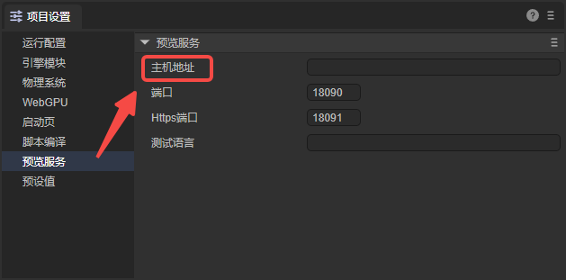
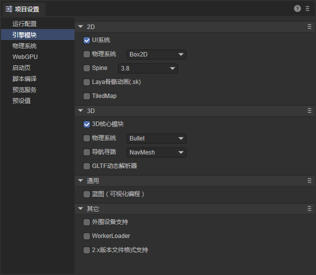

# LayaAir3 Guide for Unity Developers
> The version of LayaAir-IDE used when writing this document is 3.2.1.

Unity is the leading 3D engine in the mobile field. LayaAir is the mainstream 3D engine in the mini - game and HTML5 markets.

Compared with Unity, the LayaAir engine places more emphasis on cross - platform publishing. It not only supports publishing as native installation packages for mobile platforms (Android, iOS, HarmonyOS Next), but also as exe installation packages for the Windows platform. Especially on the HTML5 web platform and mini - game platforms (WeChat, Douyin, Taobao, Alipay, OPPO, vivo, Xiaomi, etc.), it has more obvious advantages. For example, the engine base package is smaller, the loading efficiency is higher, and the performance is better.

More and more developers whose market focus is shifting towards mini - games and the web market are turning to the LayaAir engine to obtain a better user experience, more comprehensive platform publishing effects, and also to save a large amount of R & D costs.

Therefore, this document provides an overview of the main technical differences between LayaAir and Unity for users familiar with Unity, helping Unity developers quickly get started with the LayaAir engine.

Download the LayaAir editor [here](https://layaair.com/#/engineDownload), and clone the engine source code [here](https://github.com/layabox/LayaAir).

## 1. Overview
### 1.1 LayaAir-IDE
When developing with LayaAir, LayaAir-IDE is highly relied upon. The functional comparison of each area between the Unity editor (Figure 1 - 1) and the LayaAir-IDE (Figure 1 - 2) is as follows. Areas with the same color represent the same functions.

(Figure 1 - 1 Unity Editor)

(Figure 1 - 2 LayaAir3-IDE Editor)

### 1.2 Panel Terminology Summary Table
LayaAir supports [custom layouts](../IDE/layouts/readme.md), allowing you to drag and drop panels, pop up floating displays, etc. When using it, you can also click the "?" icon in the upper - right corner of the panel to view relevant documentation. The left - hand side of the following table shows common terms in Unity, and the right - hand side shows the corresponding (or similar) terms in LayaAir-IDE.
| Unity                | LayaAir                                                      |
| -------------------- | ------------------------------------------------------------ |
| Toolbar              | Menu Bar                                                     |
| Hierarchy            | [Hierarchy](../IDE/Hierarchy/readme.md)                      |
| Project              | [Project Assets](../IDE/assets/readme.md) / [Widgets](../../IDE/uiEditor/widgets/readme.md) |
| Play/Pause/Step      | [Preview in IDE / Preview in Browser / Mobile Preview / PC Preview / Preview Options](../IDE/Game/readme.md) |
| Scene View/Game View | [Scene](../IDE/shortcutKeyCombinations/readme.md) / [Animator](../../IDE/animationEditor/aniController/readme.md) / [Game](../IDE/Game/readme.md) / [Project Settings](../IDE/projectSettings/readme.md) |
| Console              | Console / [Animation](../../IDE/animationEditor/timelineGUI/readme.md) |
| Inspector            | [Inspector](../IDE/Inspector/readme.md)                      |

### 1.3 Projects and Files
Similar to Unity projects, LayaAir projects are also saved in a specific directory structure and have their own project files with the extension `.laya`. The file name of this file is the project name.
The [project directory](../IDE/projecFolders/readme.md) contains different sub - directories that store the game's asset content, source code, and various configuration files.
In LayaAir, the directory for saving game assets is the **Assets** folder, and the source code (TypeScript classes) can be stored in the **src** directory for easy management.
LayaAir supports some of the most common file types:

| Asset Type | Supported Formats                    |
| ---------- | ------------------------------------ |
| 3D         | .fbx,.obj,.gltf,.glb                 |
| Textures   | .png,.jpg,.tiff,.tif,.tga,.dds,.webp |
| Audio      | .mp3,.wav                            |
| Video      | .mp4                                 |
| Fonts      | .ttf                                 |

## 2. Assets
### 2.1 Common Asset Types
The common resources in LayaAir are as follows:
| File Suffix        | File Type Description              |
| ------------------ | ---------------------------------- |
| **.ls**            | Scene File                         |
| **.lh**            | Prefab File                        |
| **.shader**        | Shader File                        |
| **.bps**           | Shader Blueprint File              |
| **.bpsf**          | Shader Blueprint Function File     |
| **.bp**            | Program Blueprint File             |
| **.lmat**          | Material Data File                 |
| **.bundledef**     | Script Set Definition File         |
| **.cubemap**       | Cubemap Texture File               |
| **.rendertexture** | Render Texture File                |
| **.tex2darray**    | 2D Texture Set File                |
| **.lavm**          | Animation Mask File                |
| **.mcc**           | 2D Animation State Machine File    |
| **.mc**            | 2D Animation Data File             |
| **.controller**    | 3D Animation State Machine File    |
| **.lani**          | 3D Animation Data File             |
| **.atlascfg**      | Automatic Atlas Configuration File |
| **.lighting**      | Lightmap Baking Configuration File |
| **.fnt**           | Bitmap Font File                   |

### 2.2 Exporting Resources from Unity to LayaAir
If you want to export resources from a Unity project to LayaAir for development, you need to use the "Unity Resource Export Plugin".
It should be noted that this plugin does not support exporting all types of resources. For specific support and usage, please refer to the [Unity Resource Export Plugin](../../3D/advanced/Unity/readme.md) document.

## 3. Development Process
### 3.1 Basic Usage Process
Developers can refer to the document [Development Process: Hello World](../IDE/helloWorld/readme.md) to understand the overall development process, which includes essential operations such as environment configuration, project creation, basic settings, running, and debugging.

### 3.2 UI Editing
In LayaAir, if it is a pure 2D project, directly delete the "Scene3D" node in the scene. Developers can use various [widgets](../../IDE/uiEditor/widgets/readme.md) for UI editing.

### 3.3 Blueprints and TS
When developing games in LayaAir, script code needs to be written for logic control, and the scripts need to be developed using the TypeScript language.
The program blueprint function allows developers to write a script component in a "connect - the - dots" way and also extend the built - in UI controls.
For the use of program blueprints, please refer to the [Program Blueprint](../../IDE/ShaderBlueprint/blueprint/readme.md) document.

### 3.4 Animation Editing
Similar to creating and editing animations in Unity, LayaAir provides relevant functions.
If you want to create an animation file and edit a custom animation, please refer to the [Detailed Explanation of Timeline Animation Editing](../../IDE/animationEditor/timelineGUI/readme.md) document.
If you already have an available animation file, you can refer to the [Detailed Explanation of Animation State Machine](../../IDE/animationEditor/aniController/readme.md) document to learn how to use the animation file.

### 3.5 Rendering
Both LayaAir and Unity can achieve rich and colorful effects through shaders. The usage method is to apply the shader to the material and then apply the material to the object.
For using 3D shaders, please refer to the [Custom Shader 3D](../../3D/advanced/customShader/readme.md) document. For using 2D shaders, please refer to the [Custom Shader 2D](../../2D/advanced/customShader/readme.md) document.

### 3.6 Physics System
LayaAir has a built - in Box2D 2D physics engine and Bullet and PhysX 3D physics engines.
For the use of the 2D physics engine, please refer to the [2D Physics Editing](../../IDE/physicsEditor/physics2D/readme.md) document. For the use of the 3D physics engine, please refer to the [3D Physics Editing](../../IDE/physicsEditor/physics3D/readme.md) document.
Of course, developers can also integrate other third - party physics engines into the LayaAir engine themselves. Through the physics interface of the LayaAir engine, they can directly switch and use various physics engines. For the specific process, please refer to the [Custom Physics Engine Library](../../3D/advanced/customPhysicsEngine/readme.md) document.

### 3.7 Custom Plugins
LayaAir-IDE supports users in customizing plugins to develop more extended functions. The plugin system encapsulates most functions based on the Electron framework. Plugin developers do not need to learn the relevant front - end frameworks. They only need to use the UI framework provided by the IDE to complete custom plugin development.
For developing plugins in LayaAir-IDE, please refer to the [Plugin Development Instructions](../../IDE/layapackage/plug-in/readme.md) document. For importing and using plugins from the LayaAir Asset Store, please refer to the [Plugin Import and Usage Instructions](../../IDE/layapackage/pluginImport/readme.md) document.

### 3.8 Building and Publishing
LayaAir supports publishing projects on numerous platforms, enabling projects to be developed once and published and run on various platforms. At the same time, since the same set of code is used, the consistency of the game experience on various platforms is guaranteed.
When building and publishing, first perform [general](../../released/generalSetting/readme.md) settings, and then configure the options for each platform. Currently supported platforms include: [Web](../../released/web/readme.md), mini - game platforms ([WeChat Mini - Game](../../released/miniGame/wechat/readme.md), [Douyin Mini - Game](../../released/miniGame/byteDance/readme.md), [OPPO Mini - Game](../../released/miniGame/OPPO/readme.md), [vivo Mini - Game](../../released/miniGame/vivo/readme.md), [Xiaomi Quick Game](../../released/miniGame/xiaomi/readme.md), [Alipay Mini - Game](../../released/miniGame/alipaygame/readme.md), [Taobao Mini - Game](../../released/miniGame/tbgame/readme.md)), mobile platforms ([Android](../../released/native/build_Tool/readme.md), [iOS](../../released/native/build_Tool/readme.md), [HarmonyOS NEXT](../../released/native/build_Harmony/readme.md)), and PC platforms ([Windows](../../released/native/build_Windows/readme.md)).

## 4. LayaAir Engine Ecosystem
For Unity developers, LayaAir's tutorials, community, and asset store can help them quickly master the use of LayaAir.
### 4.1 Tutorials
LayaAir officially provides documentation tutorials and video tutorials.
In addition to the module - specific documentation mentioned in this article, you can click on the left - hand directory to view more detailed introductions.
For video tutorials, please visit LayaAir's [Bilibili homepage](https://space.bilibili.com/1736809941).

### 4.2 Developer Community
After developers enter the [community](https://ask.layaair.com/), they can ask questions, share experiences, and report bugs in the community.

### 4.3 Asset Store
The asset store helps developers achieve profitability in the engine ecosystem and also enables them to develop products with higher efficiency and lower costs.
The LayaAir3 [asset store](https://store.layaair.com/) allows developers to add free or paid resources in the asset store for project development. It also supports developers in getting certified as individual or enterprise developers, enabling them to upload IDE - based plugins, art resources, sound resources, development tools, project or function DEMO source code, etc.
For the upload process of the asset store, you can view the [video tutorial](https://www.bilibili.com/video/BV1oQ4y1E7j3/?share_source=copy_web&vd_source=f3dd357b10b2bb3c4e1be310439eb5cd).

## 5. Common Questions
**How can I have multiple versions of LayaAir-IDE on a Windows local machine?**
Currently, only one installed version is supported, but it does not affect the green - version. You can copy the current version to another directory, create a shortcut to the main program (.exe) on the desktop, and use the green - version. The next time you install, this version will not be overwritten.

**Why can't I preview by scanning the QR code on my mobile phone?**
If you have installed software such as a virtual machine, it may create a virtual network card, causing the mobile phone and the PC to be on different local area networks. You can disable the virtual machine network card or find the IP through the `ipconfig` command and then set the preview address in the project settings panel of LayaAir-IDE.

(Figure 5 - 1)

**Why aren't the property names displayed in Chinese in the IDE?**
If you want the property names to be displayed in Chinese, you need to check the "Allow translation of engine symbols" option in the "Edit -> Preferences" panel in the menu bar.

(Figure 5 - 2)

**What are the measurement units in the physics system?**
In the project settings panel of LayaAir-IDE, you can customize the length unit conversion ratio.

(Figure 5 - 3)

**Why can't I use some modules?**
In LayaAir-IDE, you need to check the relevant modules in the project settings panel to use them. Otherwise, an error will be reported during runtime, indicating that the module or method cannot be found.

(Figure 5 - 4)

**Does it support WebGPU?**
Yes, it does. You need to check the option in the project settings panel.

(Figure 5 - 5)