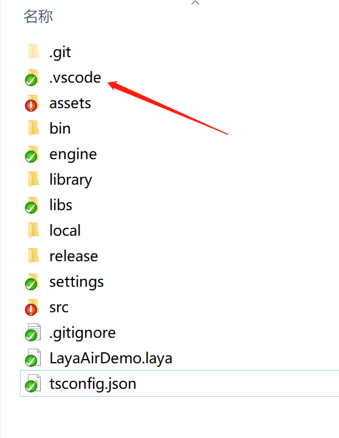
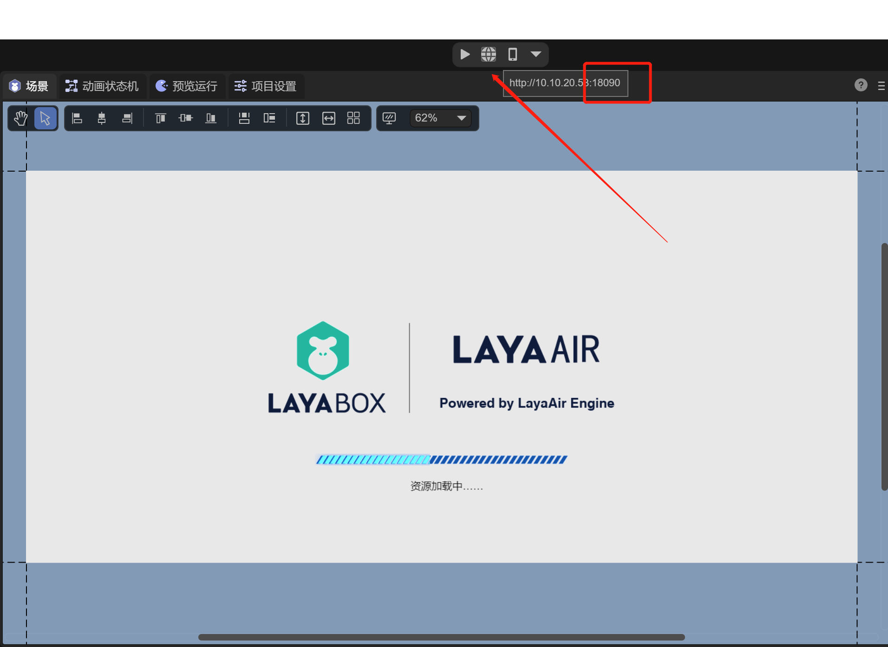
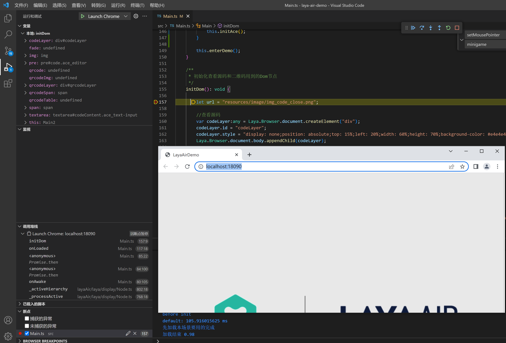

# VScode local debugging


Usually we can use Chrome's DevTools for breakpoint debugging, but if we want to breakpoint debug the project source code directly in vsCode. We can learn how to debug directly in vscode through this document.


## 1. Create launch.json

As shown in Figure 1-1, create a launch.json file in the .vscode directory of the project directory to configure the startup parameters of the vscode project.



(Picture 1-1)


## 2. Add configuration parameters

In the launch.json file, directly copy the following parameters

```json
{
	"version": "0.2.0",
	"configurations": [
	{
    	"name": "Launch Chrome",
    	"request": "launch",
    	"type": "chrome",
    	"url": "http://localhost:18090",
    	"webRoot": "${workspaceFolder}/src",
    	"sourceMapPathOverrides": {
        	"webpack:///src/*": "${webRoot}/*"
    	}
	},
	{
    	"name": "Attach to Chrome",
    	"request": "attach",
    	"type": "chrome",
    	"port": 18090,
    	"webRoot": "${workspaceRoot}",
    	"urlFilter":"http://localhost:18090/*"
	}
	]
}
```

Among them, two debugging configurations are added here. "Launch Chrome" is to open the Chrome browser directly through vscode, which is local debugging. The entire Chrome instance can be controlled with vscode. "Attach to Chrome" is to debug Chrome in the external environment. Instance, that is to say, this Chrome browser window is opened by you separately.

Note: When running the project with Chrome, the port number in the above configuration information may need to be modified. The following will introduce how to check it.


## 3. Change the port number

By default, the LayaAir 3.0 project will use 18090 as the default port. If you want to make sure, you can see the port number by clicking "Open in browser" of the IDE, as shown in Figure 3-1


(Figure 3-1)


## 4. Debugging Project

In vsCode, add a breakpoint to the ts code, and click "Start Debugging" in the vsCode menu "Run" or press F5 to start Chrome to open the project and perform breakpoint debugging, as shown in Figure 4-1



(Pic 4-1)

