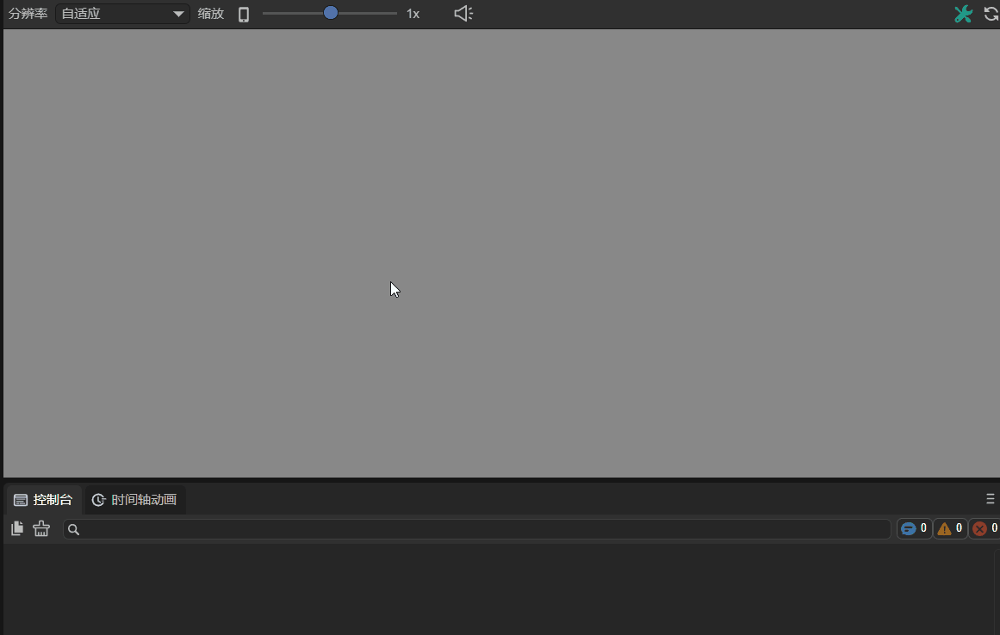
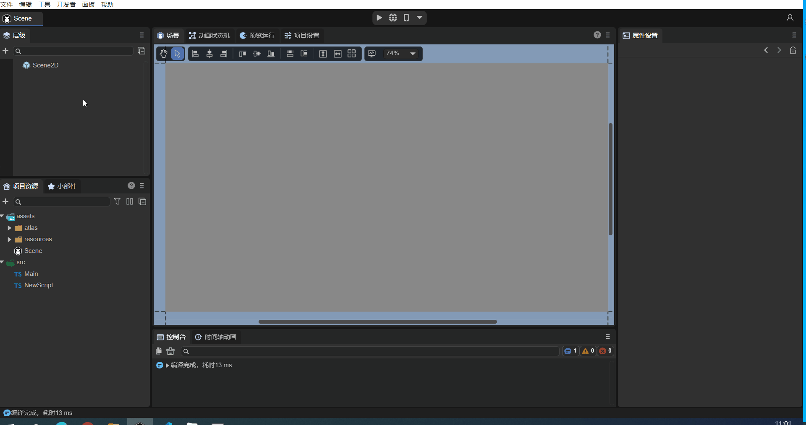
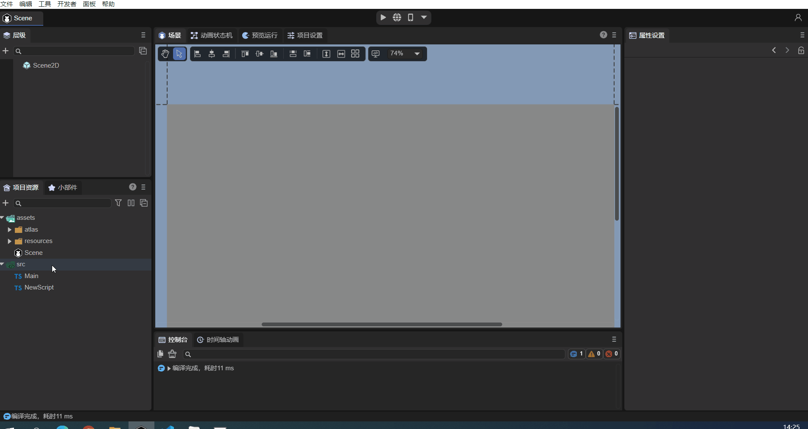
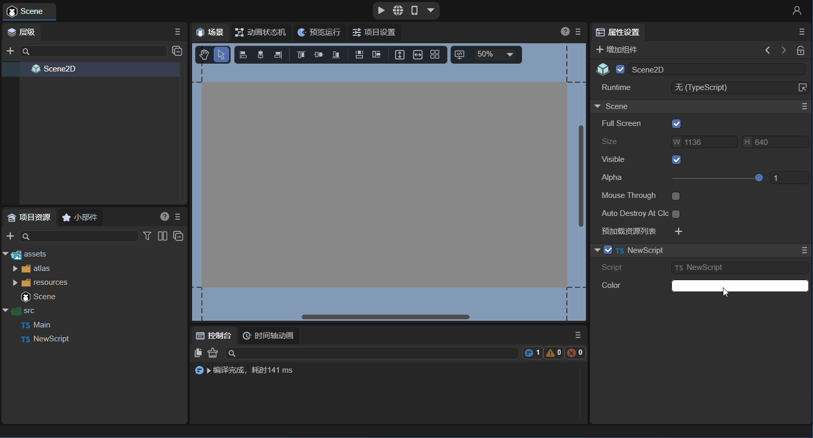
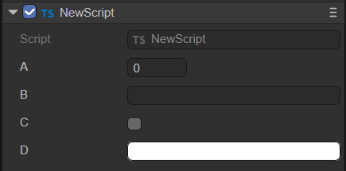
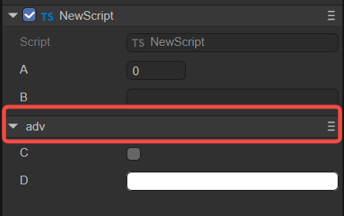

# Entity Component System (ECS)

> Author: Charley, Gu Zhu, Meng Xingyu

## 1. What is ECS

ECS is the abbreviation of Entity-Component-System, which is a data-driven game design pattern.

LayaAir's ECS treats each display object node with a unique ID in the scene as an entity. Each entity can have one or more different component system scripts added to it.

Here, the component system is composed of components and systems. Components only contain data, not logic. The logical behavior of game objects is controlled by the system, so the system is the logical control part of the entity, and the component is the data interface part between the system and the outside world. . LayaAir exposes the interface to the IDE through decorators, allowing developers to intuitively pass in data. The life cycle methods and event methods provided by the engine for the component system can serve as the entrance to system logic control.

Developers can realize the complete functions of component system scripts by inheriting the engine's component script class `Laya.Script`. **We usually refer to component system scripts as component scripts for short**. Then add it to the entity through IDE or code to achieve complete ECS functions.

> Component scripts are in principle decoupled and have a single responsibility, so that multiple entities can share the same component system.


## 2. Built-in methods of component scripts

After inheriting the engine's component script class `Laya.Script`, you can directly use the engine to provide built-in life cycle methods and event methods for component scripts. These methods can be used as the execution entry point for component script logic. As shown below:


(Figure 2-1) Life cycle method of component script


### 2.1 Component life cycle methods

Life cycle methods refer to methods that are automatically called during the creation, destruction, activation, and disabling of objects. When using custom component scripts, the following life cycle methods can be implemented to facilitate rapid development of business logic. A log can be printed in each method to facilitate testing by developers.

| Name	| Conditions	|
| ------------ | ------------------------------------------------------------ |
| onAdded  	| is called after being added to the node. Unlike Awake, onAdded will be called even if the node is not activated |
| onReset	| Reset component parameters to default values. If this function is implemented, the component will be reset and automatically recycled to the object pool to facilitate reuse next time. If there is no reset, no recycling will be performed |
| onAwake	| Executed after the component is activated. At this time, all nodes and components have been created. This method is only executed once |
| onEnable 	| Executed after the component is enabled, such as after the node is added to the stage	|
| onStart  	| Executed before onUpdate is executed for the first time, it will only be executed once	|
| onUpdate 	| Executed when each frame is updated, try not to write large loop logic here or use the getComponent method |
| onLateUpdate | Executed when each frame is updated and executed after onUpdate. Try not to write large loop logic here or use the getComponent method |
| onPreRender | Executed before rendering	|
| onPostRender | Executed after rendering	|
| onDisable	| Executed when the component is disabled, such as after the slave node is removed from the stage	|
| onDestroy	| Executed when manually calling node destruction	|

The usage in the code is as follows:

```typescript
    //Called after being added to the node. Unlike Awake, onAdded will be called even if the node is not activated.
	onAdded(): void {
    	console.log("Game onAdded");
	}

	//Reset component parameters to default values. If this function is implemented, the component will be reset and automatically recycled to the object pool to facilitate reuse next time. If there is no reset, no recycling will be performed
	onReset(): void {
    	console.log("Game onReset");
	}

	//Execute after the component is activated. At this time, all nodes and components have been created. This method is only executed once.
	onAwake(): void {
    	console.log("Game onAwake");
	}

	//Executed after the component is enabled, such as after the node is added to the stage
	onEnable(): void {
    	console.log("Game onEnable");
	}

	//Executed before executing update for the first time, it will only be executed once
	onStart(): void {
    	console.log("Game onStart");
	}

	//Executed when each frame is updated, try not to write large loop logic here or use the getComponent method
	onUpdate(): void {
    	console.log("Game onUpdate");
	}

	//Executed when each frame is updated, and executed after update. Try not to write large loop logic here or use the getComponent method.
	onLateUpdate(): void {
    	console.log("Game onLateUpdate");
	}

	//Execute before rendering
	onPreRender(): void {
    	console.log("Game onPreRender");
	}

	//Execute after rendering
	onPostRender(): void {
    	console.log("Game onPostRender");
	}

	//Executed when the component is disabled, such as after the slave node is removed from the stage
	onDisable(): void {
    	console.log("Game onDisable");
	}

	//Executed when manually calling node destruction
	onDestroy(): void {
    	console.log("Game onDestroy");
	}
```

The following takes a bullet script `Bullet.ts` in the "2D Getting Started Example" as an example to explain the life cycle method. The following is the code of this script file:

```typescript
const { regClass, property } = Laya;
/**
 * Bullet script to implement bullet flight logic and object pool recycling mechanism
 */
 @regClass()
export default class Bullet extends Laya.Script {
	constructor() { super(); }

	onEnable(): void {
    	//Set initial speed
    	let rig: Laya.RigidBody = this.owner.getComponent(Laya.RigidBody);
    	rig.setVelocity({ x: 0, y: -10 });
	}

	onTriggerEnter(other: any, self: any, contact: any): void {
    	//If touched, remove the bullet
    	this.owner.removeSelf();
	}

	onUpdate(): void {
    	//If the bullet goes beyond the screen, remove the bullet
    	if ((this.owner as Laya.Sprite).y < -10) {
        	this.owner.removeSelf();
    	}
	}

	onDisable(): void {
    	//When the bullet is removed, recycle the bullet to the object pool to facilitate reuse next time and reduce object creation overhead.
    	Laya.Pool.recover("bullet", this.owner);
	}
}
```

In the game, when adding bullets to the stage, they must have an initial velocity each time they are added to the stage. However, if onEnable() is replaced with onAwake(), then the initial velocity will be invalid. onUpdate() is executed once every frame. If the bullet exceeds the screen, the bullet is removed. The if condition here is judged once every frame. onDisable() is triggered after the node is removed from the stage. When the bullet is removed beyond the screen, this method is triggered. Here, the bullet is recycled to the object pool.


### 2.2 Component event methods

Event methods refer to methods that are automatically triggered based on conditions under certain specific circumstances. For example, a collision event is only triggered when an object collides. When using custom component scripts, the following event methods can be implemented to facilitate rapid development of business logic.

#### 2.2.1 Physical events

| Name	| Conditions	|
| ---------------- | -------------- |
| onTriggerEnter | Execute when triggering starts |
| onTriggerStay	| Execute when triggered continuously |
| onTriggerExit	| Executed when the end trigger |
| onCollisionEnter | Executed when collision starts |
| onCollisionStay | Executed when collision continues |
| onCollisionExit | Executed when collision ends |

The usage in the code is as follows:

```typescript
    //Execute when the trigger starts
 	onTriggerEnter(other: Laya.PhysicsComponent | Laya.ColliderBase, self?: Laya.ColliderBase, contact?: any): void {
	}

	//Execute when triggered continuously
	onTriggerStay(other: Laya.PhysicsComponent | Laya.ColliderBase, self?: Laya.ColliderBase, contact?: any): void {
	}

	//Execute when the trigger ends
	onTriggerExit(other: Laya.PhysicsComponent | Laya.ColliderBase, self?: Laya.ColliderBase, contact?: any): void {	 
	}

	//Execute when collision starts
	onCollisionEnter(collision: Laya.Collision): void {
	}

	//Execute when collision continues
	onCollisionStay(collision: Laya.Collision): void {
	}

	//Executed when the collision ends
	onCollisionExit(collision: Laya.Collision): void {
	}
```

The following uses an example of a small ball collision to demonstrate physical events. Here is a code snippet from the collision part of the program:

```typescript
    //After the collision enters, the object changes color
	public onTriggerEnter(other:Laya.PhysicsComponent):void {
   	 (this.owner.getComponent(Laya.MeshRenderer).material as Laya.BlinnPhongMaterial).albedoColor = new Laya.Color(0.0, 1.0, 0.0, 1.0);//绿色
    }
    
	//When collision continues, print log
    public onTriggerStay(other:Laya.PhysicsComponent):void {
    	console.log("peng");
    }
    
	//After the collision leaves, the object changes back to its original color
    public onTriggerExit(other:Laya.PhysicsComponent):void {
   	 (this.owner.getComponent(Laya.MeshRenderer).material as Laya.BlinnPhongMaterial).albedoColor = new Laya.Color(1.0, 1.0, 1.0, 1.0);//白色
    }
```

As shown in the animation 2-2, onTriggerEnter is executed when the collision starts, the ball and the cube enter the collision, and the ball turns green; onTriggerStay is executed when the collision continues, and the log "peng" is printed; after the collision leaves, onTriggerExit is executed, and the ball becomes The original color of the cube changes to white.


(Animation 2-2)


#### 2.2.2 Mouse events

| Name	| Conditions	|
| ------------------ | -------------------------------------------------- |
| onMouseDown    	| Execute when mouse is pressed	|
| onMouseUp      	| Executed when mouse is raised	|
| onRightMouseDown | Executed when the right or middle mouse button is pressed	|
| onRightMouseUp 	| Executed when the right or middle mouse button is raised	|
| onMouseMove    	| Executed when the mouse moves on the node	|
| onMouseOver    	| Executed when the mouse enters the node	|
| onMouseOut     	| Executed when the mouse leaves the node	|
| onMouseDrag    	| After the mouse is pressed on an object, it is executed when dragging	|
| onMouseDragEnd 	| Press and hold an object with the mouse, drag it a certain distance, and then release the mouse button to execute |
| onMouseClick   	| Execute when mouse clicks	|
| onMouseDoubleClick | Executed when the mouse double-clicks	|
| onMouseRightClick | Executed when the mouse right button is clicked	|

The usage in the code is as follows:

```typescript
    //Executed when the mouse is pressed
	onMouseDown(evt: Laya.Event): void {
	}

	//Executed when the mouse is raised
	onMouseUp(evt: Laya.Event): void {
	}

	//Executed when the right or middle mouse button is pressed
	onRightMouseDown(evt: Laya.Event): void {
	}

	//Executed when the right mouse button or middle button is lifted
	onRightMouseUp(evt: Laya.Event): void {
	}

	//Executed when the mouse moves on the node
	onMouseMove(evt: Laya.Event): void {
	}

	//Executed when the mouse enters the node
	onMouseOver(evt: Laya.Event): void {
	}

	//Executed when the mouse leaves the node
	onMouseOut(evt: Laya.Event): void {
	}

	//After the mouse is pressed on an object, it is executed when dragging
	onMouseDrag(evt: Laya.Event): void {
	}

	//Hold down an object with the mouse, drag it a certain distance, and execute after releasing the mouse button.
	onMouseDragEnd(evt: Laya.Event): void {
	}

	//Execute when mouse clicks
	onMouseClick(evt: Laya.Event): void {
	}

	//Executed when the mouse double-clicks
	onMouseDoubleClick(evt: Laya.Event): void {
	}

	//Executed when the mouse right clicks
	onMouseRightClick(evt: Laya.Event): void {
	}
```

Taking onMouseDown and onMouseUp as examples, add the following code to the custom component script "Script.ts":

```typescript
const { regClass, property } = Laya;

@regClass()
export class Script extends Laya.Script {
	/**
 	* Executed when mouse is pressed
 	*/
    onMouseDown(evt: Laya.Event): void {
    	console.log("onMouseDown");
	}
	/**
 	* Executed when the mouse is raised
 	*/
	onMouseUp(evt: Laya.Event): void {
    	console.log("onMouseUp");
	}
}
```

As shown in Figure 2-3, after adding the component script to the property panel of Scene2D, uncheck Mouse Through first, because if it is checked, mouse events under Scene2D will not respond. If it is a 3D scene, it will be passed to Scene3D.


(Figure 2-3)

Run the project, as shown in the animation 2-4. When the mouse is pressed, onMouseDown is executed and "onMouseDown" is printed; when the mouse is released, onMouseUp is executed and "onMouseUp" is printed.



(Animation 2-4)


#### 2.2.3 Keyboard events

| Name	| Conditions	|
| ---------- | ---------------------- |
| onKeyDown | Executed when the keyboard is pressed	|
| onKeyPress | Executed when the keyboard generates a character |
| onKeyUp	| Executed when the keyboard is raised	|

The usage in the code is as follows:

```typescript
    //Execute when keyboard is pressed
 	onKeyDown(evt: Laya.Event): void {
	}

	//Executed when the keyboard generates a character
	onKeyPress(evt: Laya.Event): void {
	}

	//Executed when the keyboard is raised
	onKeyUp(evt: Laya.Event): void {
	}
```

> Note: onKeyPress is executed when a character is generated, such as the letters "a", "b", "c", etc. This method will not be executed if keys such as up, down, left, and right keys, F1, F2, etc. are not character input keys.


## 3. How components are exposed in the IDE

In LayaAir 3.0 IDE, if you want to display the properties of component scripts in the IDE, you need to use decorator rules to achieve this.

### 3.1 Identification of component scripts `@regClass()`

Component scripts written by developers need to use the decorator identifier `@regClass()` before the class definition. The sample code is as follows:

```typescript
const { regClass } = Laya;

@regClass()
export class Script extends Laya.Script {
}
```

As shown in the animated picture 3-1, only when the above decorator identifier is used, the developer's customized component script will be recognized as a component by the IDE, and can be used in the `Property Settings Panel of the node (entity) -> Add Component - > Custom component script` added.



(Animation 3-1)

> A TS file can only have one class using @regClass().
>
> Classes marked with @regClass() will be compiled in the IDE environment, but when they are finally released, if the class is not referenced by other classes, has not been added to the node, or the prefab/scene it is in has not been released, Then this class will be clipped.


### 3.2 Identification of component properties `@property()`

#### 3.2.1 General use of component properties

When the developer wants to expose the properties of the component to external editors through the IDE, they can pass in data. The decorator identifier `@property()` needs to be used before the class attribute is defined. The sample code is as follows:

```typescript
const { regClass, property } = Laya;

@regClass()
export class NewScript1 extends Laya.Script {
	//The standard way of writing decorator attributes, suitable for IDEs that need to display tips or Chinese aliases of attributes and other complete functional requirements
	@property({ type: String, caption: "An alias for IDE display", tips: "This is a text object, you can only enter text" })
	public text1: string = "";

	//Abbreviation of decorator attribute type, suitable for requirements that only define types
	@property(String)   
	public text2: string = "";

	constructor() {
    	super();
	}
}
```
`@property()` is the decorator identifier that the IDE identifies component attributes and displays on the IDE property panel. The type is the parameter that the decorator attribute identifier must carry.

If we don't need to write a tips description for the attribute, we don't need to redefine an alias for the attribute to be displayed in the IDE, etc. Just follow the abbreviation of the above example.

> If there are syntax warnings in the abbreviation, please use a new version of IDE and solve it through the IDE's `Developer -> Update engine d.ts file` function, or use standard writing to solve it.


#### 3.2.2 Use of decorators for property accessors

Sometimes, developers control the reading and writing behavior of properties through property accessors (getters) and property setters (setters).

When a property accessor and a property setter exist at the same time, the decorator's property identifier `@property()` can be used directly before the property accessor. At this time, the component properties are used in the same way as the conventional usage introduced in the previous section. All are readable and writable.

If the script only has a property accessor, then this property is read-only and can only be displayed in the IDE, but cannot be edited.

The sample code for using a decorator with both getter and setter is as follows:

```typescript
const { regClass, property } = Laya;

@regClass()
class Animal {
	private _weight: number = 0;
    
	@property( { type : Number } )
	get weight() : number {
    	return this._weight;
	}
    
	set weight(value: number) {
    	this._weight = value;
	}
}
```


#### 3.2.3 Whether to serialize and save

After being defined as a component attribute through a decorator, by default, the attribute name and value will be serialized and saved to the scene file or prefab file where the component is added. For example, after adding custom components to scene.ls, open this scene.ls through vscode, and you can find the serialized and saved component attribute names and values. The effect is as shown in animation 3-2.



(Animation 3-2)

After serialization and saving, it is not only convenient to visually view and edit component property values ​​in the IDE. During the running phase, you can also directly use serialized stored values. For data with complex structures, directly using serialized values ​​can also save the overhead caused by data structure generation. Therefore, sometimes, even if it does not need to be displayed and edited on the property panel, it can be set as a component property through a decorator, and the value can be serialized and stored in the scene or prefab file.

However, sometimes, our component properties are just for the convenience of understanding and adjustment in the IDE. When used, these values ​​​​are not actually useful, so we also provide control over whether to serialize and save. When the decorator attribute is defined, if serializable is passed in the object parameter as false, then the attribute will not be serialized.

For example, the developer's requirement is to serialize and save the radian value, but the radian value is not intuitive when manually adjusting the value. At this time, the angle value can be directly entered in the IDE without saving it, and only the converted radian value is stored. . The sample code is as follows:

```typescript
const { regClass, property } = Laya;

@regClass()
export class Main extends Laya.Script {
	@property({ type: Number })
	_radian: number = 0; //Underlined attributes will not appear on the IDE's attribute panel by default and are only used to store the input radian.
    
	@property({ type: Number, caption: "angle", serializable: false }) //Serializable is set to false here, so degree will not be saved to the scene file
 	get degree() {
    	return this._radian * (180 / Math.PI);//Since it is not serialized and saved, it is necessary to back-calculate the radian saved by _radian back to the angle for display in the IDE property panel
	}
	set degree(value: number) {
    	this._radian = value * (Math.PI / 180);//Convert the input angle value into radians and store it in _radian.
	}
    
	onStart() {
    	console.log(this._radian);
	}
}
```


#### 3.2.4 Whether component properties are displayed in the IDE

By default, decorator attribute rules will only mark non-underlined class attributes as component attributes of the IDE.

For attributes with underlines, they will not be displayed in the IDE. At this time, the only value of the component attribute is to save the value to the scene file. This is mentioned above, and the example is also applied.

> If there is no need to serialize and save the underlined properties to the scene file, there is no need to use a decorator.

If the developer wants to display the underlined attributes in the IDE, this can be done. Pass the decorator attribute identifier into the object and set the parameter private to false.

The sample code is as follows:

```typescript
@property({ type: "number", private: false })
_velocity: number = 0;
```

The private parameter can not only cause underlined attributes to be displayed, but also set private to true so that attributes without underlines do not appear in the IDE's property panel.

Here, we slightly modify the previous radian conversion example, the code is as follows:

```typescript
const { regClass, property } = Laya;

@regClass()
export class Main extends Laya.Script {
	@property({ type: Number , private: true })
	radian: number = 0; //After private is set to true, radian will not appear on the IDE's property panel, but is only used to store the input radian.
    
	@property({ type: Number, caption: "angle", serializable: false }) //Serializable is set to false here, so degree will not be saved to the scene file
 	get degree() {
    	return this.radian * (180 / Math.PI);//Since it is not serialized and saved, it is necessary to back-calculate the radian saved by radian back to the angle for display in the IDE property panel.
	}
	set degree(value: number) {
    	this.radian = value * (Math.PI / 180);//Convert the input angle value into radians and store it in radian.
	}
    
	onStart() {
    	console.log(this.radian);
	}
}
```


#### 3.2.5 The type identified by the decorator attribute

The type identified by the decorator attribute supports engine object types (for example: Laya.Vector3, Laya.Sprite3D, Laya.Camera, etc.), custom object types (requires marking `＠regClass()`), and basic types of the TS language.

##### 3.2.5.1 Engine object type

The understanding of engine object types is relatively simple. After exposing component attributes, you can directly pass in the value of the corresponding type. For example, Laya.Sprite3D can only pass in 3D nodes. Trying to drag in 2D nodes or resources is prohibited.

Examples of commonly used engine object types are as follows:

```typescript
const { regClass, property } = Laya;

@regClass()
export class Main extends Laya.Script {

	@property( { type:Laya.Camera } ) //Camera type
	private camera: Laya.Camera;  

	@property( { type:Laya.Scene3D } ) //3D scene root node type
	private scene3D: Laya.Scene3D;

	@property( { type:Laya.DirectionLightCom } ) //DirectionLight component type
	private directionLight: Laya.DirectionLightCom;

	@property( { type:Laya.Sprite3D } ) //Sprite3D node type
	private cube: Laya.Sprite3D;  

	@property( { type:Laya.Prefab } ) //Load the object obtained by Prefab
	private prefabFromResource: Laya.Prefab;    

	@property( { type:Laya.ShurikenParticleRenderer } ) //ShurikenParticleRenderer component type
	private particle3D: Laya.ShurikenParticleRenderer;  

	@property( { type:Laya.Node } ) //Node type
	private scnen2D: Laya.Node;

	@property( { type:Laya.Box } ) //Get the Box component
	private box: Laya.Box;

	@property( { type:Laya.List } ) //Get the List component
	private list: Laya.List;

	@property( { type:Laya.Image } ) //Get the Image component
	private image: Laya.Image;

	@property( { type:Laya.Label } ) //Get the Label component
	private label: Laya.Label;

	@property( { type:Laya.Button } ) //Get the Button component
	private button: Laya.Button;

	@property( { type:Laya.Sprite } ) //Get the Sprite component
	private sprite: Laya.Sprite;

	@property( { type:Laya.Animation } ) //Get the Animation component
	private anmation: Laya.Animation;

	@property( { type:Laya.Vector3 } ) //Laya.Vector3 type
	private vector3 : Laya.Vector3;
}
```

As shown in animation 3-3, drag the Image that has been added in the scene into the Image property entrance exposed by @property, so that this node is obtained, and then you can use code to control the properties of the Image in the script (reference Section 4.1).


(Animation 3-3)


##### 3.2.5.2 Custom object type

A custom object type is to set a custom imported object. Exposes component properties as identified by the object's decorator property.

For example, the following two TS codes:

```typescript
//MyScript.ts
const { regClass, property } = Laya;

import Animal from "./Animal";

@regClass()
export class MyScript extends Laya.Script  {
	@property({ type : Animal })
	animal : Animal;
}
```

```typescript
//Animal.ts
const { regClass, property } = Laya;

@regClass()
export default class Animal {
	@property({ type : Number })
	weight : number;
}
```

The Animal object is referenced in the component script MyScript, and the type identified by the decorator attribute is set to Animal. Although Animal is not a component script inherited from Laya.Script, it is referenced by the component script MyScript and exposed to the IDE, so the Animal class definition It was also necessary to mark `@regClass()` before. The properties identified by `@property()` under this class can also appear in the IDE property panel.


##### 3.2.5.3 TS language basic types

Finally, there are the commonly used basic types of TS language. However, it should be noted that the basic types need to be described using strings. Only numbers, strings, and Boolean types can be marked by their object types.

| Type	| Type writing demonstration	| Type Description	|
| ------------------ | ------------------------------------------------------------ | --------------------------------------------------- |
| Number type	| "number"                                                 	| You can also use Number to mark this type	|
| Single-line string text type | "string"	| You can also use String to mark this type	|
| Boolean value type	| "boolean"                                                	| You can also use Boolean to mark this type	|
| Integer type	| "int"                                                    	| Equivalent to { type: Number, fractionDigits: 0 }	|
| Positive integer type	| "uint"                                                   	| Equivalent to { type: Number, fractionDigits: 0 , min: 0 } |
| Multiline string text type | "text"	| Equivalent to { type: string, multiline: true }	|
| any type	| "any"                                                    	| Types will only be serialized and cannot be displayed or edited.	|
| Typed array type	| Int8Array, Uint8Array, <br />Int16Array, Uint16Array, <br />Int32Array, Uint32Array, Float32Array | Supports 7 typed array types	|
| array type	| ["number"]、["string"]                                   	| Use square brackets to enclose the array element type,	|

The sample code is as follows:

```typescript
const { regClass, property } = Laya;

//enumerate
enum TestEnum {
	A,
	B,
	C
};
//Enumeration in string form
enum Direction {
	Up = 'UP',
	Down = 'DOWN',
	Left = 'LEFT',
	Right = 'RIGHT'
};

@regClass()
export class Script extends Laya.Script {

	@property(Number)//Number type, equivalent to { type : "number" }
	num : number;

	@property(String)//Single-line string text type, equivalent to { type: "string"}
    str : string;

	@property(Boolean)//Boolean value type, equivalent to { type: "boolean"}
    bool : boolean;

    @property("int")//Integer type, equivalent to { type: Number, fractionDigits: 0 }
    int : number;

	@property("uint") //Positive integer type, equivalent to { type: Number, fractionDigits: 0, min: 0 }
	uint : number;

	@property("text")//Multiline string text type, equivalent to { type: String, multiline: true }
	text : string;

	@property("any")//Any type will only be serialized and cannot be displayed or edited.
    a : any;
    
	@property(Int8Array)//Typed array type, in addition to Int8Array, it also supports Uint8Array, Int16Array, Uint16Array, Int32Array, Uint32Array, and Float32Array. The usage methods are similar.
	i8a: Int8Array;
   	 
	@property({ type: ["number"] })//Array type, use square brackets to include the array element type
	arr1: number[];

	@property({ type: ["string"] })//Array type, use square brackets to include the array element type
	arr2: string[];
    
	//Ordinary enumeration types (can be abbreviated) will be displayed as a drop-down box for users to choose.
	@property(TestEnum)
	enum: TestEnum;
    
    //Enumerations in string form cannot use type abbreviations, such as: @property(Direction). The standard writing method must be specified with the type parameter below.
	@property({ type: Direction })
	direc: Direction;
    
	//Dictionary type, you need to use array parameters to set the type. The Record type in the following example needs to be placed in the string as the first element of the array parameter. The second element of the array parameter is the type of the dictionary input value, used for Determine the input control type of the property panel
	@property({ type: ["Record", Number] })
	dict: Record<string, number>;

}
```

The sample effect is shown in the animation 3-4:


(Animation 3-4)


#### 3.2.6 Input controls for component property values

The IDE has built-in number (number input), string (string input), boolean (multiple selection box), color (color box + color palette + color picker), vec2 (XY input combination), vec3 (XYZ input combination) , vec4 (XYZW input combination), asset (select resources), these input controls.

Normally, the IDE will automatically select the corresponding attribute value input control based on the component attribute type.

But in some cases, it is also necessary to force the input control to be specified. For example, the data type is string, but it actually expresses color. The default string editing control is not suitable. You need to set the parameter inspector of the component attribute identification here to "color". The sample code is as follows:

```typescript
//Displayed as color input (if the type is Laya.Color, you do not need to define it this way, if it is a string type, you need it)
@property({ type: String, inspector: "color"})
color: string;
```
> Note: The color obtained according to the above method is the color value of the 2D component, for example: rgba(217, 232, 0, 1)

The effect is shown in the animation 3-5:



(Animation 3-5)

If the inspector parameter is null, the property input control will not be constructed for the property, unlike if the hidden parameter is set to true. If hidden is true, it is created but not visible, and if inspector is null, it is not created at all.


#### 3.2.7 Classification and sorting of component attributes

By default, the properties of the component will be uniformly displayed under the property classification column with the component script name. The effect is shown in Figure 3-6:



(Figure 3-6)

If the developer wants to categorize certain attributes within the component, this can be achieved through the object parameter catalog identified by the decorator attribute. The sample code is as follows:

```typescript
	@property({ type : "number" })
	a : number;

	@property({ type: "string"})
	b : string;

	@property({ type: "boolean",catalog:"adv"})
	c : boolean;

	@property({ type: String, inspector: "color" ,catalog:"adv"})
	d: string;
```

As can be seen from the above code, when the same catalog name ("adv") is set for multiple attributes (c and d), they will be classified according to the catalog name. The effect is shown in Figure 3-7:



(Figure 3-7)

If we want to give this category a Chinese alias, we can do it through the parameter catalogCaption. The sample code is as follows (change the d attribute of the above example):

```typescript
	@property({ type: String, inspector: "color" ,catalog:"adv", catalogCaption:"Advanced Component"})
	d: string;
```

The effect is shown in Figure 3-8:


(Figure 3-8)

When faced with multiple component attribute classifications, we can also customize the display order of columns through the parameter catalogOrder. The smaller the value is displayed in front, if not provided, it will be displayed in the order in which the attributes appear. The sample code is as follows:

```typescript
    @property({ type : "number", catalog:"bb", catalogOrder:1 })
	a : number;

	@property({ type: "string"})
	b : string;

	@property({ type: "boolean", catalog:"adv"})
	c : boolean;

	@property({ type: String, inspector: "color", catalog:"adv", catalogCaption:"Advanced Component", catalogOrder:0})
	d: string;
```

The effect is shown in Figure 3-9:


(Figure 3-9)

> The attribute classification name catalogCaption and attribute classification sorting catalogOrder can be configured in the attribute with the same name in any catalog. There is no need to configure all attributes once.


#### 3.2.8 Summary of decorator attribute identification parameters

The above introduces the parameter functions of commonly used decorator attribute identifiers (those in bold are those that appeared above). Here we give an overview and summary of all parameters.

| Parameter name	| Parameter usage example	| Description	|
| ------------------ | ------------------------------------------------------------ | ------------------------------------------------------------ |
| name           	| name: "abc"                                              	| Generally no setting is required	|
| **type**       	| type: "string"                                           	| The type of value that can be entered in the component attribute, refer to the introduction above	|
| **caption**    	| caption: "angle"	| The alias of the component attribute, commonly used in Chinese, does not need to be set, the component attribute name will be used by default	|
| **tips**       	| tips: "This is a text object, you can only enter text."	| Tips description of component attributes, used to further describe the function of the attribute and other purposes	|
| **catalog**    	| catalog:"adv"                                            	| Set the same value for multiple attributes and display them in the same column	|
| **catalogCaption** | catalogCaption:"Advanced Components"	| The alias of the attribute classification column. If not provided, the column name will be used directly.	|
| **catalogOrder**   | catalogOrder:0                                           	| The display order of the columns, the smaller the value is displayed in front. If not provided, the order in which the attributes appear |
| **inspector**  	| inspector: "color"                                       	| Attribute value input control, built-in: number, string, boolean, color, vec2, vec3, vec4, asset |
| hidden         	| hidden: "!data.a"                                        	| true to hide, false to display. You can use Boolean values ​​directly, or you can use expressions to obtain Boolean operation results by putting conditional expressions into strings. <br />In the string expression, data is a variable with a fixed name, which is a data collection of all registered attributes of the current type. All js syntax can be used in expressions, but engine-related types cannot be referenced, nor global objects such as Laya can be used. |
| readonly       	| readonly: "data.b"                                       	| true means read-only. You can use Boolean values ​​directly, or you can use expressions to obtain Boolean operation results by putting conditional expressions into strings. (The format of the expression is the same as above) |
| validator      	| validator: "if (value == data.text1) return 'cannot be the same as text1 value' " | You can use expressions and put them in strings. For example, in the example, if the value entered in the IDE is equal to the value of text1, "Cannot be the same as the value of text1" will be displayed |
| **serializable**   | serializable： false                                     	| Control whether component properties are serialized and saved, true: serialized and saved, false: not serialized and saved |
| **multiline**  	| multiline: true                                          	| When the string type is used, whether it is multi-line input, true: yes, false: no	|
| password       	| password: true                                           	| Whether to enter a password, true: yes, false: no. Password entry will hide the entered content |
| submitOnTyping 	| submitOnTyping: false                                    	| If set to true, each time a character is entered, it will be submitted. If set to false, it will only be submitted once after the input is completed and the text input box loses focus by clicking elsewhere. |
| prompt         	| prompt: "Text prompt information"	| Before entering text, there will be a prompt message in the text box	|
| enumSource     	| enumSource: [{name:"Yes", value:1}, {name:"No",value:0}] 	| Component properties display and enter values ​​in the form of drop-down boxes	|
| reverseBool    	| reverseBool: true                                        	| Invert the Boolean value. When the attribute value is true, the multi-select box is displayed as unchecked.	|
| nullable       	| nullable: true                                           	| Whether to allow null values, the default is true	|
| **min**        	| min: 0                                                   	| For numeric types, the minimum value of the number	|
| max            	| max: 10                                                  	| For numeric types, the maximum value of the number	|
| range          	| range: [0, 5]                                            	| When the numeric type is used, the component properties are displayed and the input value is displayed in the form of a sliding bar within a range |
| step           	| step: 0.5                                                	| When the numeric type is used, the minimum change precision value when the mouse slides or the wheel scrolls in the input box	|
| **fractionDigits** | fractionDigits: 3                                        	| For numeric types, how many decimal places should be kept after the attribute value?	|
| percentage     	| percentage: true                                         	| When the range parameter is set to [0,1], the percentage can be set to true and displayed as a percentage |
| fixedLength    	| fixedLength: true                                        	| When the array type is used, the array length is fixed and no modification is allowed.	|
| arrayActions   	| arrayActions: ["delete", "move"]                         	| array type, you can limit the operations that can be performed on the array. If not provided, the array allows all operations, if provided, only the listed operations are allowed. The types provided are: "append", "insert", "delete", "move" |
| elementProps   	| elementProps: { range: [0, 10] }                         	| Applies to array type properties. Here you can define attributes of array elements	|
| showAlpha      	| showAlpha: false                                         	| When the color type is used, it indicates whether to provide modification of the transparency a value. true means provided, false means not provided |
| defaultColor   	| defaultColor: "rgba(217, 232, 0, 1)"                     	| For color types, define a non-null default color value	|
| colorNullable  	| colorNullable: true                                      	| For color type, set to true to display a checkbox to determine whether the color is null |
| isAsset        	| isAsset: true                                            	| Indicates that this attribute refers to a resource	|
| assetTypeFilter	| assetTypeFilter: "Image"                                 	| resource type, set the loaded resource type	|
| useAssetPath   	| useAssetPath: true                                       	| The attribute type is string, and when selecting a resource, this option determines whether the attribute value is the original path of the resource or in the format of res://uuid. The default is false. If it is true, it is the original path of the resource. It is generally not used because if the resource is renamed, the path will be lost. |
| position       	| position: "before x"                                     	| The order in which attributes are displayed defaults to the order in which they appear in the type definition. Position can artificially change this order. The sentence patterns that can be used are: "before x", "after x", "first", "last" |
| **private**    	| private：false                                           	| Control whether component properties are displayed in the IDE, false: displayed, true: not displayed	|
| addIndent	| addIntent:1	| Increase indentation, the unit is level, note not pixels	|
| onChange       	| onChange: "onChangeTest"                                 	| When the property changes, call the function named onChangeTest. The function needs to be defined on the current component class |

The code examples are as follows (only those not introduced above are listed):

```typescript
    //hide control
	@property({ type: Boolean })
	a: boolean;
	@property({ type: String, hidden: "!data.a" })//Put the conditional expression !data.a in the string. If a is true (checked in the IDE), then !data.a returns false. At this time, the hidden attribute represents the display
	hide: string = "";

    // read-only control
	@property({ type: Boolean })
	b: boolean;
	@property({ type: String, readonly: "data.b" })//Place the conditional expression data.b in the string. If b is true (checked in the IDE), then data. b will return true. At this time, the readonly attribute indicates read-only.
	read: string = "";

    //data checking mechanism
	@property(String)
	text1: string;
	@property({ type: String, validator: "if (value == data.text1) return 'cannot be the same as a value' " })
	text2: string = "";

    //Password input
	@property({ type: String, password: true })
	password: string;

    //If true or default, the text input is submitted every time it is entered; otherwise it is only submitted when it is out of focus.
	@property({ type: String, submitOnTyping: false })
	submit: string;

    //Input text prompt information
	@property({ type: "text", prompt: "Text prompt information" })
	prompt: string;

    //Display as drop-down box
	@property({ type: Number, enumSource: [{name:"Yes", value:1}, {name:"No",value:0}] })
	enumsource: number;

    //reverse boolean value
	@property({ type: "boolean", reverseBool: true })
    reverseboolean : boolean;
    
    //Allow null value
	@property({ type: String, nullable: true })
	nullable: string;

    //Control the precision and range of digital input
	@property({ type: Number, range:[0,5], step: 0.5, fractionDigits: 3 })
	range : number;

    //displayed as percentage
	@property({ type: Number, range:[0,1], percentage: true })
	percent : number;

    //Fixed array length
	@property({ type: ["number"], fixedLength: true })
	arr1: number[];

    //Operations allowed by the array
	@property({ type: ["number"], arrayActions: ["delete", "move"] })
	arr2: number[];

	//Enable the maximum and minimum values ​​to be limited when editing array elements
	@property({ type: [Number], elementProps: { range: [0, 100] } })
	array1: Array<Number>;
	//If it is a multi-dimensional array, elementProps also needs to use multiple layers
	@property({ type: [[Number]], elementProps: { elementProps: { range: [0, 10] } } })
	array2: Array<Array<Number>>;

    //Does not provide modification of transparency a value
	@property({ type: Laya.Color, showAlpha: false })
	color1: Laya.Color;

    //For color types, defaultColor defines a non-null default value.
	@property({ type: String, inspector: "color", defaultColor: "rgba(217, 232, 0, 1)" })
	color2: string;

    //Display a checkbox to determine whether the color is null
	@property({ type: Laya.Color, colorNullable: true })
	color3: Laya.Color;

    //Load the Image resource type and set the resource path format
	@property({ type: String, isAsset: true, assetTypeFilter: "Image" })
	resource: string;

	//The x attribute appears before the testposition attribute
	@property({ type: String })
	x: string;
	//You can use position to artificially arrange the testposition attribute to be displayed before the x attribute.
	@property({ type: String, position: "before x" })
	testposition: string;

    //Increase indentation, the unit is level
	@property({ type: String, addIndent:1 })
	indent1: string;
	@property({ type: String, addIndent:2 })
	indent2: string;

	//When the property changes, call the function named onChangeTest
	@property({ type: Boolean, onChange: "onChangeTest"})
	change: boolean;
	onChangeTest() {
    	console.log("onChangeTest");
	}
```


#### 3.2.9 Special usage of decorator attribute identification

> In addition to the basic parameter properties listed above, @property also has some special combinations.

- Type attribute nested array or dictionary

Examples are as follows:

```typescript
	@property([["string"]])
	test1: string[][] = [["a", "b", "c"], ["e", "f", "g"]];

	@property([["Record", "string"]])
	test2: Array<Record<string, string>> = [{ name: "A", value: "a" }, { name: "B", value: "b" }];

	@property({ type: ["Record", [Number]], elementProps: { elementProps: { range: [0, 10] } } })
	test3: Record<string, number[]> = { "a": [1, 2, 3], "b": [4, 5, 6] };

	@property(["Record", [Laya.Prefab]])
	test4: Record<string, Laya.Prefab[]>;
```

One of its important applications is to implement dynamic drop-down boxes. As mentioned in Section 3.2.8 above, there are two ways to implement a drop-down box: one is to set the attribute type to Enum, and the other is to set the enumSource to an array. Both methods can achieve a fixed drop-down option list, but if you want the option list to be dynamic, you can use the following method:

```typescript
	//This attribute provides a get method to return the drop-down option. This data is generally only used in the editor, so the settings are not saved.
	@property({ type: [["Record", String]], serializable: false })
	get itemsProvider(): Array<Record<string, string>> {
    	return [{ name: "Item0", value: "0" }, { name: "Item1", value: "1" }];
	}
	//Set enumSource to a string, indicating to use the attribute with this name as the drop-down data source
	@property({ type: String, enumSource: "itemsProvider" })
	enumItems: string;
```


### 3.3 Executing life cycle method `@runInEditor` in IDE

In addition to exposing component properties on the IDE property panel, developers can also use the decorator identifier `@runInEditor` to trigger life cycle methods (onEnable, onStart and other component script life cycle methods) when the component is loaded in the IDE. The sample code is as follows:

```typescript
const { regClass, property, runInEditor } = Laya;

@regClass() @runInEditor 	//The key point here is to put it before the class. Either @regClass() or @runInEditor comes first.
export class NewScript extends Laya.Script {
	@property({ type: Laya.Sprite3D })
	sp3: Laya.Sprite3D;

	constructor() {
    	super();
	}

	onEnable() {
    	console.log("Game onStart", this.sp3.name);
	}
}
```

Unless there are special needs, we do not recommend this. On the one hand, static objects are more conducive to editing in the IDE. On the other hand, because in order to optimize the performance of the scene editor, the frame rate refresh is much slower than normal operation, so the effect will be significantly different from normal operation.


### 3.4 `@classInfo()`

The decorator identifier `@classInfo()` has two main functions:

#### 3.4.1 Add the component list of IDE

Developers' custom component scripts are by default located under 'Add Component->Custom Component Script' in the 'Property Settings' panel, as shown in Figure 3-10.


(Animation 3-10)

If we want to add this component to our own defined component list category in this `component list`, we can use the decorator identifier `@classInfo()`. The sample code is as follows:

```typescript
const { regClass, property, classInfo } = Laya;

@regClass()
@classInfo( {
	menu : "MyScript",
	caption : "Main",
})
export class Main extends Laya.Script {

	onStart() {
    	console.log("Game start");
	}
}
```

Then we save the code and return to the IDE, we will find that the customized classification has appeared in the component list. As shown in animation 3-11.


(Animation 3-11)

#### 3.4.2 Attribute grouping

Assume that the decorator is used to expose 5 attributes A, B, C, D, and E. The display effect is as follows:


(Figure 3-12)

When there are many attributes, the attributes can be displayed in groups, and @classInfo() is used. @classInfo() can add non-data type attributes to the type. For example, to display two attributes BC in a group, the implementation is as follows:

```typescript
const { regClass, property, classInfo } = Laya;

@regClass()
@classInfo({
	properties: [
    	{
        	name: "Group1",
        	inspector: "Group",
        	options: {
            	members: ["b", "c"]
        	},
        	position: "after a"
    	}
	]
})
export class NewScript extends Laya.Script {

	@property(String)
	public a: string = "";

	@property(String)
	public b: string = "";

	@property(String)
	public c: string = "";

	@property(String)
	public d: string = "";

	@property(String)
	public e: string = "";

}
```

Among them, members specifies the list of attribute names belonging to this group. If there are many attributes, you can also use this format [ "b~c" ] to represent all attributes from attribute b to attribute c. position is optional and indicates where this group is displayed. The display effect is as follows:


(Figure 3-13)


## 4. Using attributes in code

The addition and identification of component components have been introduced previously. I believe that developers with a certain foundation can already use LayaAir's physical component system directly.

But for some novice developers, this section uses examples of several common types of properties to further help you understand the basis of component development.

### 4.1 Node type method

LayaAir is divided into 2D node and 3D node types. When set to 2D node Laya.Sprite, 3D node cannot be used as its attribute value. When set to a 3D node Laya.Sprite3D, a 2D node cannot be used as its attribute value.

#### 4.1.1 Use of 2D nodes

First, as shown in animation 4-1, drag the 2D node Sprite that has been added in the scene into the property entrance exposed by @property, so that the node is obtained.


(Animation 4-1)

Then you can use code in the script to change the properties of the node, for example, add texture to Sprite, etc. The sample code is as follows:

```typescript
const { regClass, property } = Laya;

@regClass()
export class NewScript extends Laya.Script {

	@property({ type : Laya.Sprite})
	public spr: Laya.Sprite;
    
	onAwake(): void {
    	this.spr.size(512, 313); //Set Sprite size
    	this.spr.loadImage("atlas/comp/image.png"); //Add texture
	}

}
```

The effect is shown in Figure 4-2:


(Figure 4-2)


#### 4.1.2 Basic use of 3D nodes

First, as shown in the animation 4-3, drag the 3D node Cube that has been added in the scene into the property entrance exposed by @property, so that this node is obtained.


(Animation 4-3)

Then you can use code in the script to change the properties of the node. For example, you can make the Cube rotate around itself. The sample code is as follows:

```typescript
const { regClass, property } = Laya;

@regClass()
export class NewScript extends Laya.Script {

	@property({ type : Laya.Sprite3D})
	public cube: Laya.Sprite3D;

	private rotation: Laya.Vector3 = new Laya.Vector3(0, 0.01, 0);

	onStart() {
    	Laya.timer.frameLoop(1, this, ()=> {
        	this.cube.transform.rotate(this.rotation, false);
    	});
	}
}
```

The effect is shown in the animation 4-4:


(Animation 4-4)


#### 4.1.3 Advanced use of 3D nodes

```typescript
	@property( { type :Laya.Sprite3D } ) //Node type
	public p3d: Laya.Sprite3D;

	onAwake(): void {

    	this.p3d.transform.localPosition = new Laya.Vector3(0,5,5);
    	let p3dRenderer = this.p3d.getComponent(Laya.ShurikenParticleRenderer);
    	p3dRenderer.particleSystem.simulationSpeed = 10;
	}
```

By exposing the @property( { type :Laya.Sprite3D } ) node type attribute and dragging in the particle node, the particle node object can be obtained. The transform can be modified directly, and the simulationSpeed ​​property is obtained through getComponent(Laya.ShurikenParticleRenderer).particleSystem.


### 4.2 Use of component types

```typescript
	@property( { type : Laya.ShurikenParticleRenderer } ) //Component type
	public p3dRenderer: Laya.ShurikenParticleRenderer;

	onAwake(): void {

    	(this.p3dRenderer.owner as Laya.Sprite3D).transform.localPosition = new Laya.Vector3(0,5,5);
    	this.p3dRenderer.particleSystem.simulationSpeed = 10;
	}
```

By exposing the @property( { type : Laya.ShurikenParticleRenderer } ) component type property and dragging in the particle node, you can get the particle's ShurikenParticleRenderer component. The transform can be modified through (this.p3dRenderer.owner as Laya.Sprite3D), and the simulationSpeed ​​property is obtained through this.p3dRenderer.particleSystem.

> You cannot use Laya.ShuriKenParticle3D directly as the attribute type because the IDE cannot recognize it, only node and component types can.
>
> Even if the type is set to Laya.Sprite3D, although the IDE identifies the attribute as a Sprite3D node, it cannot be converted into a Laya.ShuriKenParticle3D object.


### 4.3 Prefab type attributes

When using Laya.Prefab as a property, for example:

```typescript
@property( { type : Laya.Prefab } ) //Load the object of Prefab
private prefabFromResource: Laya.Prefab;    
```

At this time, you need to drag in the prefab resource from the assets directory as shown in Figure 4-5. The instantiated prefab will be directly obtained during runtime.


(Animation 4-5)


