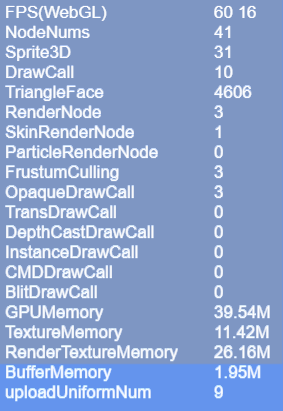

# Performance statistics and optimization	 

From the beginning of the design of the LayaAir engine, performance was the first goal and a lot of performance optimization was done in the engine. Proper use of engines can allow games and other engine products to achieve the experience of native APPs. If developers cannot take advantage of the engine, the final performance experience of the game may not be possible. Therefore, in the process of making games, it is still very necessary to master game and engine optimization skills.


> To understand the performance of the engine, you must first understand the performance statistics panel. The performance statistics panel will be introduced in detail below.


## 1. Calling the performance statistics panel

The performance statistics panel built into the LayaAir engine can detect current performance in real time. The call statistics panel will be different depending on the development language.

Directly enter the TS language code `Laya.Stat.show(0,0);` to bring up the performance statistics panel.

The sample Demo.ts code is as follows:

```typescript
//Initialize the stage
Release.heat(1136, 640);
//Call the performance statistics panel method, (0,0) is the panel position coordinates
Laya.Stat.show(0,0);
```

**Tips**: Pay attention to capitalization.


## 2. Introduction to FPS

### 2.1 FPS Overview

FPS is the abbreviation of Frames Per Second. Assume that the frame rate of the game is 60FPS, which means that the execution time of each frame when the game is running is 1/60 second. The higher the frame rate value, the smoother it feels visually.


(Figure 2-1)

The current full frame rate of PCs and mobile phones is 60 frames, as shown in Figure 2-1. However, some games do not have high requirements for smoothness of the screen. You can also use the engine's frame rate limiting method `Stage.FRAME_SLOW`. Limit FPS frame rate to a maximum of 30 frames.

Since the actual running environment is in the browser, performance also depends on the efficiency of the JavaScript interpreter. Therefore, the FPS value of the same game may be different in different browsers. This part is not something that developers can decide. What developers can do is to use the best engines and optimization projects as much as possible to improve the FPS frame rate on low-end devices or low-performance browsers.

### 2.2 FPS in WebGL mode

LayaAir engine supports WebG rendering mode. As shown in Figure 2-2; `FPS(WebGL)` is the frame rate in WebGL mode.


(Figure 2-2)

### 2.3 Numerical description of FPS

In Figure 2-1 and Figure 2-2, the first yellow value of FPS `60` is the current **FPS frame rate**, the higher the better.

The second yellow value `16` is the time spent rendering each frame in milliseconds. The smaller the value, the better.

If these two values ​​cannot be maintained at full frame, they will change during product operation, as shown in the animation 2-3.


 (Animation 2-3)

## 3. Introduction to DrawCall

**The number of DrawCalls is an important indicator that determines performance**, located in the third row of the statistics panel, as shown in Figure 4. The fewer DrawCalls, the better. **It is recommended that developers try to limit it to less than 100**.


 (Figure 3-1)

### 3.1 Introduction

DrawCall can be understood as "drawing instruction", which means that the CPU calls the graphics API and sends graphics drawing commands to the GPU. Generally, the CPU's memory reading and writing or data processing speed is very slow compared to the GPU's rendering speed. That is to say, after the GPU has finished processing the data, there are still many DrawCalls that have not been processed by the CPU, and the GPU is in a low power state at this time. In other words, the root cause is that the CPU does not process DrawCall in time, resulting in performance degradation. So the less DrawCall, the better.

In WebGL mode, DrawCall represents a rendering submission batch. Each time the CPU prepares data and notifies the GPU for rendering, the process is called a DrawCall. In each DrawCall, in addition to notifying the GPU of rendering, which is more time-consuming, switching materials and Shaders are also very time-consuming operations.

### 3.2 Optimization method

To optimize the number of DrawCalls, you can take the following methods:

1. Merge meshes: Merge multiple meshes of the same material into one large mesh to reduce the number of rendering calls.
2. Use an atlas: Merge multiple small textures into a large texture atlas to reduce the number of texture switches.
3. Use batch processing: Put multiple objects of the same material in a batch and render them together to reduce the number of rendering calls.
4. Use GPU instantiation: Use GPU instantiation technology to instantiate and render multiple objects of the same model, reducing the number of rendering calls.
5. Reduce transparent objects: The rendering of transparent objects requires mixing operations, which will increase the number of DrawCalls. You can minimize the number of transparent objects.
6. Use static batch processing: static batch processing of objects that will not change to reduce the number of rendering calls.

Through the above optimization methods, the number of DrawCalls can be effectively reduced and the performance of the game can be improved.

> For detailed optimization methods, please refer to ["2D Performance Optimization"](../../../2D/performanceOptimization/readme.md) and ["3D Performance Optimization"](../../../ 3D/advanced/performanceOptimization/readme.md).

### 3.3 Other categories

There are also a few different categories in the performance statistics panel:

- OpaqueDrawCall: Indicates the number of opaque objects rendered in the built-in rendering pipeline.
- TransDrawCall: Indicates the number of transparent objects rendered in the built-in rendering pipeline.
- DepthCastDrawCall: Indicates the number of shadow maps rendered in the built-in rendering pipeline.
- InstanceDrawCall: Indicates the number of instances of DrawCall.
- CMDDrawCall: Indicates the number of rendering instructions in the command stream.
- BlitDrawCall: Indicates the number of times blit is used to render the final image to the screen.


## 4. Numerical description of NodeNums

NodeNums is an indicator in the performance statistics panel, indicating the number of nodes in the current scene. The larger the value of NodeNums, the more nodes there are in the scene and the greater the impact on performance. Therefore, unnecessary nodes in the scene should be minimized during development to improve game performance. As shown in Figure 4-1.


(Pic 4-1)


## 5. Sprite3D numerical description

Sprite3D is an indicator in the performance statistics panel, indicating the number of Sprite3D nodes in the current scene. Sprite3D is the basic class of 3D nodes, which can include 3D models, materials, lighting and other attributes, and can perform operations such as 3D transformation and animation.

The number of Sprite3D is one of the important factors affecting game performance. Too many Sprite3Ds will increase the number of renderings, thus affecting the game's frame rate and performance. Therefore, the number of Sprite3D nodes in the scene should be minimized during development to improve game performance. As shown in Figure 5-1.


(Figure 5-1)

## 6. TriangleFace value description

TriangleFace is an indicator in the performance statistics panel, indicating the number of triangle faces rendered in the current scene. The larger the value of TriangleFace, the more triangle faces need to be rendered in the scene, and the greater the impact on performance.

In 3D rendering, each MeshRenderer (MeshSprite3D, SkinnedMeshSprite3D) is composed of multiple triangular faces. Therefore, the number of triangles that need to be rendered should be minimized during development to improve game performance. As shown in Figure 6-1.


(Figure 6-1)

To reduce the number of triangle faces that need to be rendered TriangleFace, you can take the following methods:

1. Optimize the model: use a simpler model and reduce the number of faces.
2. Merge meshes: Merge multiple meshes of the same material into one mesh to reduce the number of renderings.
3. Use LOD technology: use models with different levels of detail based on distance to reduce the number of faces of distant models.
4. Use occlusion culling: According to the camera's frustum, invisible models are eliminated to reduce the number of rendered faces.

Through the above method, the number of triangle faces that need to be rendered can be effectively reduced and the performance of the game can be improved.

## 7. RenderNode value description

RenderNode is an indicator in the performance statistics panel, indicating the number of rendering nodes in the current scene. Rendering nodes refer to nodes that need to be rendered, including Sprite, MeshSprite3D, SkinnedMeshSprite3D, etc.

The number of RenderNodes is one of the important factors affecting game performance. Too many RenderNodes will increase the number of renderings, affecting the game's frame rate and performance. As shown in Figure 7-1.


(Figure 7-1)

## 8. SkinRenderNode value description

SkinRenderNode is an indicator in the performance statistics panel, indicating the number of skeletal animation rendering nodes in the current scene. Skeletal animation rendering nodes refer to nodes that require skeletal animation rendering, including SkinnedMeshSprite3D, etc. As shown in Figure 8-1.

The number of SkinRenderNode is one of the important factors affecting game performance. Too many SkinRenderNodes will increase the number of renderings, thus affecting the game's frame rate and performance.


(Figure 8-1)

## 9. ParticleRenderNode value description

ParticleRenderNode is an indicator in the performance statistics panel of LayaAir engine version 3.0, indicating the number of particle rendering nodes in the current scene. Particle rendering nodes refer to nodes that require particle rendering, including ParticleSystem. As shown in Figure 9-1.

You can optimize by reducing the number of particles and using reasonable particle emitter settings to avoid excessive particle numbers.


(Figure 9-1)

## 10. FrustumCulling value description

Frustum Culling is an indicator in the performance statistics panel, indicating the number of rendering nodes with frustum clipping enabled in the current scene. View frustum clipping means that only objects within the view frustum are rendered, and objects beyond the view frustum are not rendered, thereby reducing unnecessary rendering and improving game performance. As shown in Figure 10-1.

The greater the number of Frustum Culling, the greater the number of rendering nodes that enable frustum clipping in the scene, and the greater the impact on performance.


(Figure 10-1)

During development, you can avoid unnecessary rendering by setting the appropriate size and position of the view frustum to prevent the view frustum from being too large or too small.

You can also improve the efficiency of Frustum Culling through reasonable node management and frustum clipping settings, thereby improving the performance of the game.

## 11. GPUMemory value description

GPUMemory is an indicator in the performance statistics panel, indicating the amount of GPU memory occupied in the current scene. GPU memory refers to the memory used to store data required by the GPU, including textures, buffers, etc. As shown in Figure 11-1.

Too much GPUMemory usage can cause game lags, frame drops and other problems.


(Figure 11-1)

## 12. TextureMemory value description

TextureMemory is an indicator in the performance statistics panel of the LayaAir engine version 3.0, indicating the size of the texture memory occupied in the current scene. Texture memory refers to the memory used to store texture data, including maps, fonts, etc. As shown in Figure 12-1

If TextureMemory takes up too much, it will cause game freezes, frame drops and other problems.


(Figure 12-1)

## 13. RenderTextureMemory value description

RenderTextureMemory is an indicator in the performance statistics panel, indicating the size of the rendering texture memory occupied in the current scene. Rendering texture memory refers to the memory used to store rendering texture data, including RenderTarget used to dynamically generate textures, etc. As shown in Figure 13-1.


(Figure 13-1)

In games, RenderTextureMemory is used to store rendering texture data, which can be used to implement some special effects, post-processing, screen capture and other functions. Rendering textures can render the scene onto a texture, and then apply this texture as a material to other objects to achieve some special effects. However, the use of rendering textures will occupy a certain amount of memory resources. If the rendering texture memory occupies too much, it will cause game lags, frame drops and other problems. Therefore, in game development, it is necessary to use rendering textures rationally and avoid excessive rendering texture memory usage to improve game performance.

## 14. BufferMemory value description

BufferMemory is an indicator in the performance statistics panel, indicating the size of the buffer memory occupied in the current scene. Buffer memory refers to the memory used to store buffer data, including vertex buffers, index buffers, etc. As shown in Figure 14-1.


(Figure 14-1)

## 15. UploadUniformNum value description

Uniforms are a way to send data from an application in the CPU to a shader in the GPU, but uniforms and vertex attributes are a little different. First of all, uniform is global. Global means that the uniform variable must be unique within each shader program object, and it can be accessed by any shader at any stage of the shader program. Second, no matter what you set the uniform values ​​to, uniforms will keep their data until they are reset or updated.

> For a detailed introduction to Uniform, please refer to [*Custom Shader*](../../../3D/advanced/customShader/readme.md).

uploadUniformNum represents the number of Uniform updates in the Shader. Every time a Uniform is added, a count is increased. As shown in Figure 15-1, the parameters are located in the last row of the statistics panel.



(Figure 15-1)


