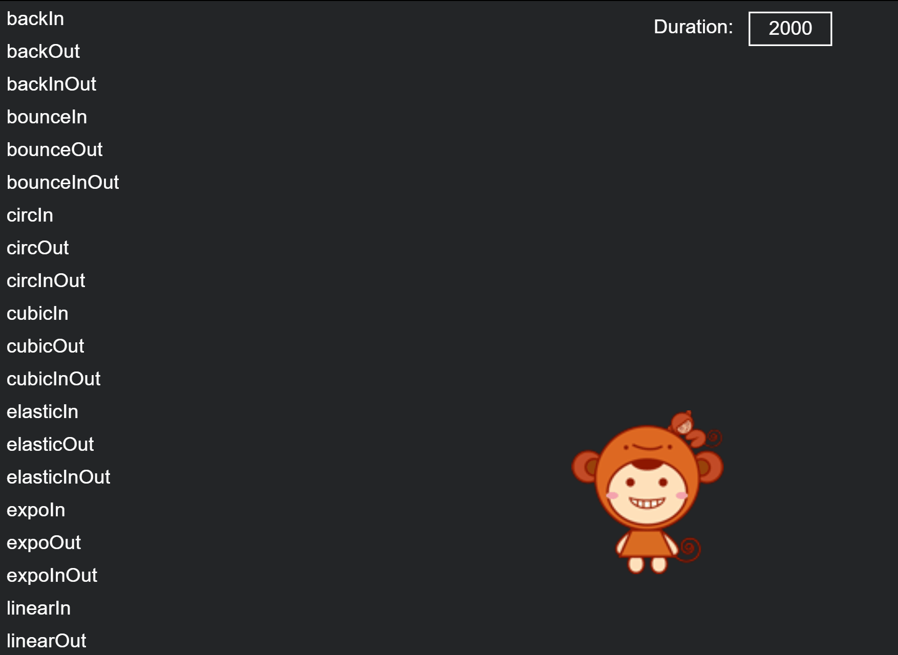
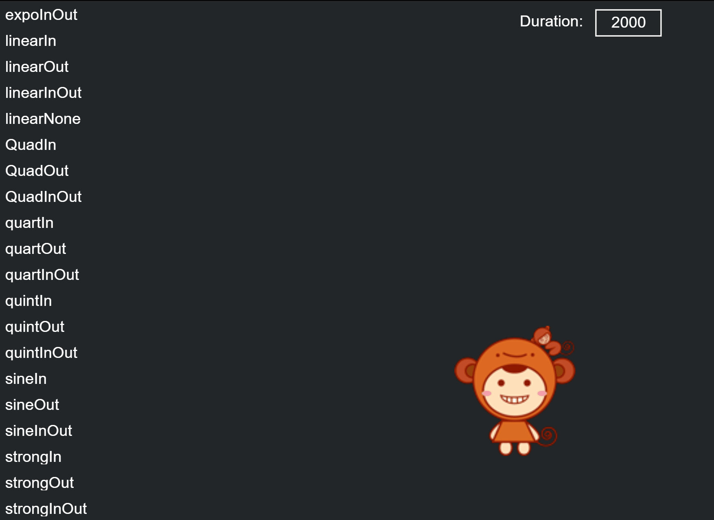

# Easing


## 1. Overview

The greatest use of easing is to apply it to the movement performance of the design. It can combine physics, mathematics and other principles to truly simulate and display the movement phenomena in life, which is more in line with the laws of nature and human cognition, and allows objects to interact according to the user's expected behavior. Provide a continuity of experience. Easing animation is common in game development. It is one of the important factors to improve the game UI experience, such as dialog boxes popping up and closing, button animations appearing and disappearing, props flying into backpacks, etc. We can directly use the animation provided by the LayaAir engine Tween easing class and Ease class for quick implementation.

Next we introduce the Tween and Ease classes respectively


## 2. Ease

The `Ease` class defines a large number of easing functions to achieve the specific easing effect of the `Tween` animation. The Tween class of the LayaAir engine is used in combination with the Ease class to basically meet the easing effect requirements of game development.

We mainly look at the following easing effects to understand:


### 2.1 Uniform motion (linearIn)

In rare cases, uniform motion will be used, which will appear stiff. It does not conform to the laws of the physical world. In a real state of motion, the speed of an object will change with the state of motion.




### 2.2 Acceleration (expoIn)

Start the movement at zero velocity and then increase the speed as you execute.


### 2.3 Rapid acceleration (strongIn)

Start the movement at zero velocity and then speed it up as you execute




### 2.4 BackIn

Start by moving backwards, then move in the opposite direction toward the target

  

More effects can be viewed through examples


## 3. Tween

The `Tween` easing class is used to implement easing of the target object's attributes, such as target value settings such as the easing distance of the x or y axis of the target object, as well as settings such as easing start, stop, and cleanup.


### 3.1 Introduction to commonly used APIs

The easing class `Tween` provides more methods, and we commonly use two methods, namely `from()` and `to()`. The parameter settings of these two methods are exactly the same, but the effects are different. Different, from is to generate movement from the easing target point to the initial position (from the easing target position), and to is to generate movement from the initial position to the easing target position (to the easing target position), which will be detailed later with examples. Note, developers can first understand the basic instructions of these two methods:

```typescript
	/**
 	* From the props attribute, ease to the current state.
 	* @param target target object (the object whose attribute value is about to be changed).
 	* @param props Changed property list, such as {x:100,y:20,ease:Ease.backOut,complete:Handler.create(this,onComplete),update:new Handler(this,onComplete)}.
 	* @param duration The time spent, in milliseconds.
 	* @param ease easing type, the default is uniform motion.
 	* @param complete End callback function.
 	* @param delay delay execution time.
 	* @param coverBefore Whether to cover the previous easing.
 	* @param autoRecover Whether to automatically recycle, the default is true, and it will automatically recycle to the object pool after easing.
 	* @return Returns the Tween object.
 	*/
	static from(target: any, props: any, duration: number, ease: Function = null, complete: Handler = null, delay: number = 0, coverBefore: boolean = false, autoRecover: boolean = true): Tween {
    	return Pool.getItemByClass("tween", Tween)._create(target, props, duration, ease, complete, delay, coverBefore, false, autoRecover, true);
	}
    
	/**
 	* Easing the props property of the object to the target value.
 	* @param target target object (the object whose attribute value is about to be changed).
 	* @param props Changed property list, such as {x:100,y:20,ease:Ease.backOut,complete:Handler.create(this,onComplete),update:new Handler(this,onComplete)}.
 	* @param duration The time spent, in milliseconds.
 	* @param ease easing type, the default is uniform motion.
 	* @param complete End callback function.
 	* @param delay delay execution time.
 	* @param coverBefore Whether to cover the previous easing.
 	* @param autoRecover Whether to automatically recycle, the default is true, and it will automatically recycle to the object pool after easing.
 	* @return Returns the Tween object.
 	*/
	static to(target: any, props: any, duration: number, ease: Function|null = null, complete: Handler|null = null, delay: number = 0, coverBefore: boolean = false, autoRecover: boolean = true): Tween {
    	return Pool.getItemByClass("tween", Tween)._create(target, props, duration, ease, complete, delay, coverBefore, true, autoRecover, true);
	}

```


### 3.2 Parameter description

Both methods `to()` and `from()` support static methods, so we don't need to instantiate the Tween class to use it.

The parameters of `to()` and `from()` are relatively simple to understand. Here we focus on the props, duration, ease, complete, and delay parameters.

**props**

props are the properties of the target object that need to be changed to produce the easing effect. The public properties of the object can be set, such as the most commonly used x, y position properties, and alpha transparency properties, as well as other properties such as rotation, axis, size, etc. The setting of attributes is in the form of object data, such as {x:100,y:20,ease:Ease.backOut,complete:Handler.create(this,onComplete),update:new Handler(this,onComplete)}

**duration**

duration is the time it takes to execute the easing effect, in milliseconds. The longer the time, the slower the easing effect.

**ease**

Ease is an easing type, which can use various functions defined under the Ease class to change the animation process.

**complete**

complete is the callback method after easing is completed. For example, when a button appears to be easing, we cannot allow the user to click it during the easing process. In this case, we can use the easing to complete the callback, and add button monitoring to the callback function.

**delay**

delay is the time of delayed execution. Later, the text easing fluctuation effect will be produced through delayed execution in the instance.


### 3.3 Easing example

In the following code, we first implement the text easing animation of the "LayaBox" character through the Tween.from() method.

`from()` ：

```typescript
	//Create easing text
	private createTween():void{
    	//"LayaBox string total width"
    	var w:number = 800;
    	//The starting position of text creation (>>Use the right shift operator here, which is equivalent to /2. Using >> is more efficient)
    	var offsetX:number = Laya.stage.width - w >> 1;
    	//Displayed string
    	var demoString:string = "LayaBox";
    	var letterText:Laya.Text;
    	//Create individual characters based on the "LayaBox" string length and use an easing animation for each individual character
    	for(var i:number = 0,len:number = demoString.length;i<len;++i){
        	//Create text by extracting individual characters one by one from the "LayaBox" string
        	letterText = this.createLetter(demoString.charAt(i));
        	letterText.x = w/len*i+offsetX;
        	//Initial y attribute of text
        	letterText.y = 300;
        	//The object letterText attribute y moves from the easing target 100 to the initial y attribute 300. Each execution of the easing effect takes 3000 milliseconds. The easing type uses the elasticOut function method, and the delay interval is i*100 milliseconds.
        	Laya.Tween.from(letterText,{y:100},3000,Laya.Ease.elasticOut,null,i*1000);
    	}
	}
	//Create a single character text and load it to the stage
	private createLetter(char:string):Laya.Text{
    	var letter:Laya.Text = new Laya.Text();
    	letter.text = char;
    	letter.color = "#ffffff";
    	letter.font = "Impact";
    	letter.fontSize = 180;
    	this.owner.addChild(letter);
    	return letter;
	}
```


(Animation 3-1)

Combined with the example code, and then through the motion effect of animation 3-1, we can see that after the text "Layabox" appears at the initial position (*y-axis 300*), it disappears instantly, and then is set from the easing method Tween.from The target `{ y : 100 }` (*y axis 100*) moves towards the initial position (easing effect from top to bottom).

Because this method is first displayed at the initial position, and then disappears instantly from the easing target position to the initial position. It will create a visual difference and feel more like a bounce effect. So let's continue to understand the effects of Tween.to, and developers can choose which easing method to use according to their needs.

`to()`: We can continue to use the above example, just change Tween.from to Tween.to

```typescript
//The object letterText attribute y moves from the initial y attribute to the 100 attribute of the easing target. The easing effect takes 3000 milliseconds. The easing type uses the elasticOut function method, and the delay interval is 1000 milliseconds.
Laya.Tween.to( letterText , {y:100}, 3000, Laya.Ease.elasticOut, null, 1000 );
```

The operation effect is shown in the animation 3-2.


(Animation 3-2)


### 3.4 Understanding Props parameters

Regardless of Tween.from or Tween.to, the second parameter Props (property) can affect the motion trajectory of the easing effect, etc.

Since the easing effects of Tween.from and Tween.to are originally opposite, Tween.from has a falling feeling, while Tween.to in GIF 3-2 has a bouncing upward feeling.

If we swap the initial y attribute value with the easing target's y attribute value, let's take a look at the difference between the falling effect achieved using Tween.to and Tween.from.

Continuing with the previous example, modify the code as follows.

```typescript
//Initial y attribute of text
letterText.y = 100;
//Laya.Tween.from(letterText,{y:100},3000,Laya.Ease.elasticOut,null,i*1000);//Comment this line and change Laya.Tween.from to Laya.Tween. to
Laya.Tween.to(letterText, { y : 300 }, 3000, Laya.Ease.elasticOut, null, i * 1000);
```

The running effect is shown in the animation 3-3

 

(Animation 3-3)

Since in the animated picture 3-3, the initial y attribute is at 100, the effect of Tween.to is to move from the initial attribute to the attribute of the easing target. Therefore, when the y attribute of the easing target is 300, it will produce a movement from the initial y-axis of 100 to the y-axis of 300, which is the effect of falling. There will be a significant difference between implementing the falling effect with Tween.from. Therefore, developers should pay attention to the difference in effects between the two when using them.


### 3.5 Understand the easing duration (*duration*) and delayed execution (*delay*) parameters

Continuing to use the previous example, we change the third parameter duration to 1000 milliseconds and the sixth parameter delay to 100 milliseconds. The effect is as shown in the animation 3-4. Both the easing speed and the speed of the falling interval will produce obvious changes. Therefore, it can be seen that different animation effect goals can also be achieved by adjusting the duration or delay time. I won’t go into details here, developers can adjust the experience themselves.


(Animation 3-4)

The modified code for the effect of animation 3-4 is as follows:

```typescript
//Initial y attribute of text
letterText.y = 100;
//Laya.Tween.from(letterText,{y:100},3000,Laya.Ease.elasticOut,null,i*1000);//Comment this line and change Laya.Tween.from to Laya.Tween. to
Laya.Tween.to(letterText, { y : 300 }, 1000, Laya.Ease.elasticOut, null, i * 100);
```


### 3.6 Understanding ease parameters

The fourth parameter ease corresponds to each method of the `laya.utils.Ease` class. In this section, we change it to the `Ease.bounceIn` effect, as shown in the animation 3-5.


(Animation 3-5)

The modified code for the effect of animation 3-5 is as follows:

```typescript
//Initial y attribute of text
letterText.y = 100;
//Laya.Tween.from(letterText,{y:100},3000,Laya.Ease.elasticOut,null,i*1000);//Comment this line and change Laya.Tween.from to Laya.Tween. to
Laya.Tween.to(letterText, { y : 300 }, 1000, Laya.Ease.bounceIn, null, i * 100);
```


### 3.7 Understanding the completion callback (*complete*) parameters

The fifth parameter complete is used to call back after executing the easing effect. We continue to use the previous example and add a callback method to make the font color turn red after the easing is completed.

Usage example:

```typescript
Laya.Tween.to(letterText, { y : 300 }, 1000, Laya.Ease.bounceIn, Laya.Handler.create(this,this.changeColor,[letterText]), i * 100);
```

The added changeColor method is as follows

```typescript
	/**
 	* Callback method after easing is completed
 	* txt easing object
 	*/    
	private changeColor(txt:Laya.Text):void{
    	//Change text font to red
    	txt.color = "#ff0000";
	}
```

The code running effect is shown in Figure 3-6.


(Animation 3-6)


### 3.8 Implement process callback through Props parameters

The complete (*complete callback*) parameter can be implemented not only in the fifth parameter, but also in the second parameter Props. However, in order to make the code clearer and easier to read, we do not recommend implementing the completion callback in Props.

Here we only introduce how to implement update callback in Props. That is to say, if we want to execute the callback method during the easing process, it is impossible to implement the fifth parameter, because the fifth parameter must be executed after the easing is completed. Therefore, we continue to use the previous example and add a font color update callback in the Props parameter.

Usage example:

```typescript
/**
* The object letterText property y eases from 100 to 300, and the color is updated through the callback method every frame
* Use 1000 milliseconds to complete the easing effect
* The easing type uses bounceIn
* After the easing effect of a single character ends, use the changeColor callback function to change the character to red
* Execution with delay interval i*100 milliseconds
*/
Laya.Tween.to(letterText, { y : 300, update: new Laya.Handler(this, this.updateColor,[letterText])}, 1000, Laya.Ease.bounceIn, Laya.Handler.create(this,this.changeColor,[letterText]), i * 100);
```

The added changeColor method is as follows

```typescript
	/**
 	* Callback update method when easing is in progress
 	* txt easing object
 	*/
	private updateColor(txt:Laya.Text):void{
    	var c:number = Math.floor(Math.random()*3);
    	switch (c) {
        	case 0:
            	txt.color = "#eee000";
            	break;
        	case 1:
            	txt.color = "#ffffff";
            	break;
        	case 2:
            	txt.color = "#ff0000";
            	break;
        	default:
            	txt.color = "#eee000";
            	break;
    	}
	}
```

When the code is running, since the update callback is executed every frame, there is a flashing effect during the easing process. As shown in animation 3-7


(Animation 3-7)


