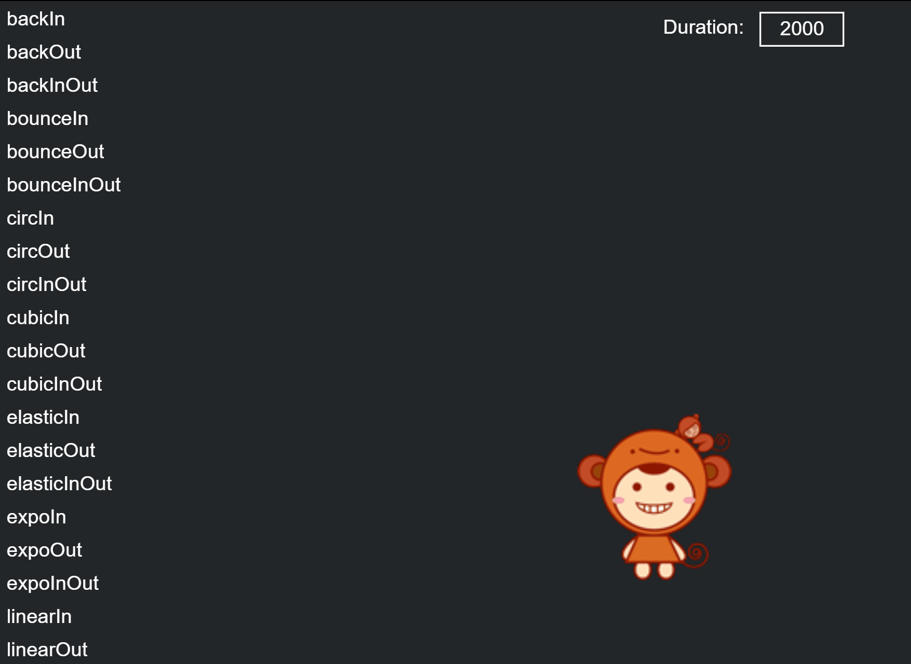
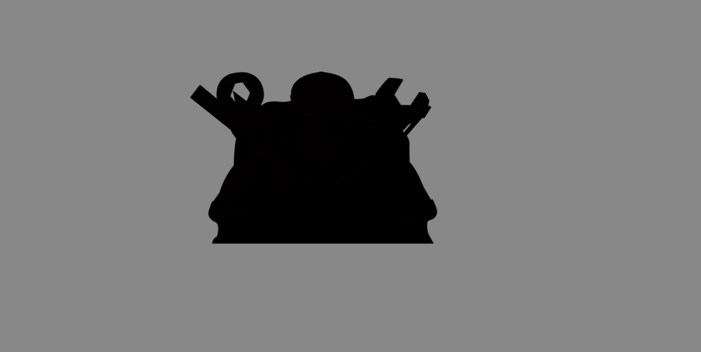

# Tween

## 1. Overview

The greatest use of tweening is in the motion performance of design. It can realistically simulate the motion phenomena in real life by combining principles of physics, mathematics, etc., which is more in line with natural laws and human cognition. It enables objects to interact according to the expected behavior of users, providing a continuous experience. Tween animations are quite common in game development and are one of the important factors to enhance the game UI experience, such as the pop-up and closing of dialog boxes, the appearance and disappearance of button animations, and the flying of items into the backpack, etc.

In previous versions, the LayaAir engine provided the Tween easing class and the Ease class to achieve the effect of tweening.

Starting from the LayaAir 3.3 version, the Tween system has undergone comprehensive optimization and upgrading. These changes include compatibility with common usages such as Laya.Tween.to and Laya.Tween.from, maintaining most of the API unchanged, but no longer supporting the non-mainstream new Tween() usage.

The types of tweening attributes not only support number but also add support for Vector2, Vector3, Vector4, Color, Point, and string-form color values. The new Tween object is designed to be very lightweight, so it is not reused by default to avoid problems caused by object reuse. In addition, the new system no longer uses Handler, thus eliminating the confusion caused by Handler reuse. At the same time, the improved Tween system supports more options and serial and parallel task functions, providing developers with a more flexible and powerful tool to achieve the desired animation effect.


## 2. Ease

The `Ease` class defines a large number of easing functions to achieve the specific easing effect of the `Tween` animation. The combination of the Tween class and the Ease class of the LayaAir engine can basically meet the easing effect requirements of game development.

Let's mainly look at the following several easing effects to understand:


### 2.1 Uniform Motion (linearIn)

In relatively few cases, uniform motion is used, which may seem rather stiff. It does not conform to the laws of the physical world. In a real motion state, the speed of an object changes with the motion state.


### 2.2 Accelerated Motion (expoIn)

It starts the motion at zero speed and then accelerates the speed during execution.




### 2.3 Fast Accelerated Motion (strongIn)

It starts the motion at zero speed and then accelerates the speed during execution.


### 2.4 Backward and Then Reverse (backIn)

It starts by moving backward and then reverses to move towards the target.


## 3. Tween

### 3.1 Basic Usage

When using the new version of the Tween system, developers no longer need to pass complex parameters within a method. They only need to add or remove the corresponding methods to the code according to the requirements of the program design. This design makes the code concise and clear and is easy to modify.

Next, let's take a look at a piece of code. This code provides a basic usage example of Tween:

```typescript
   /**
    * Create a basic tween
    * aSprite is a 2D sprite
    */
    Laya.Tween.create(aSprite).duration(1000).to("x", 500).to("y", 300);
```

Add this code to the script on the node, run it and view the effect, as shown in Figure 3-1-1:


(Figure 3-1-1)

Let's explain this code:

**1.** Use the `create()` method to create a tween. This method can pass the target object of the tween as a parameter:

```typescript
        /**
         * @zh Create a new tween object. Use the returned object to set the properties and other options of the tween.
         * The tween starts automatically without the need for additional API calls. If you do not want the tween to be executed immediately, you can call pause and then resume later.
         * @param target The target object of the tween. Can be empty.
         * @param lifecycleOwner The lifecycle object. When destroyed, the tween will automatically stop. Generally, if the target object of the task has a destroyed property, there is no need to set this property. If the target object of the task does not have a destroyed property, this property can be set.
         * @returns Returns a Tween object.
         */
         static create(target?: any, lifecycleOwner?: { destroyed: boolean; }): Tween;
```

If the target object of the tween is not an object with a lifecycle, such as a Transform3D, we can additionally pass a parameter to tell the underlying layer its associated lifecycle object.


**2.** Use the `duration()` method to set the duration of the tween, with the unit of milliseconds (ms):

```typescript
        /**
         * @zh Set the duration of the current task.
         * @param value The duration, in milliseconds.
         * @return The Tween object.
         */
        duration(value: number): this;
```


**3. ** Use the `to()` method to set the properties of the tween:

```typescript
        /**
         * @zh Tween the property of the object to the specified value.
         * The property type can be a number, string, boolean, Vector2, Vector3, Vector4, Color. If it is a string, it is implicitly a color value.
         * @param propName The property name.
         * @param value The target value of the property.
         * @return The Tween object.
         */
        to(propName: string, value: any): this;
```

In addition to the `to()` method, there are also two methods `from()` and `go()` that can be used to set the properties of the tween:

```typescript
    /**
        * @zh Tween the property of the object from the specified value to the current value.
        * @param propName The property name.
        * The property type can be a number, string, boolean, Vector2, Vector3, Vector4, Color. If it is a string, it is implicitly a color value.
        * @param value The target value of the property.
        * @return The Tween object.
        */
    	from(propName: string, value: any): this;

        /**
         * @zh Tween the property of the object from the specified start value to the specified end value.
         * @param propName The property name.
         * The property type can be a number, string, boolean, Vector2, Vector3, Vector4, Color. If it is a string, it is implicitly a color value.
         * @param startValue The start value of the property.
         * @param endValue The end value of the property.
         * @return The Tween object.
         */
        go<T>(propName: string, startValue: T, endValue: T): this;
```

There are many other methods in Tween to achieve various effects. They are not listed here. Developers in need can refer to the API documentation.


### 3.2 Lifecycle

Developers can call the `kill()` method of the tween to prematurely end the tween. If the Tween object returned by the `create()` method is saved, the `kill()` method on the Tween can be directly called. In addition, the associated tween of the object can also be queried through the `Laya.Tween.getTween()` or `Laya.Tween.getTweens()` methods.

```typescript
        // Get the first tween on the object
        let tween = Tween.getTween(aSprite);
        if (tween!= null)
            tween.kill();

        // Get all tweens on the object
        let tweens = Tween.getTweens(sSprite);
        tweens.forEach(tween => tween.kill());
```

The `kill()` method has an optional parameter `complete`. This parameter indicates whether the various properties need to be set to the final state when the `kill()` method is called to prematurely end the tween. For example, if there is a tween that moves the x-coordinate to 500 and the `kill()` method is called when it runs to x = 250, the x-coordinate will remain at 250; if `kill(true)` is called, the x-coordinate will be immediately set to 500.

Call `kill(true)`:


Call `kill(false)`:


If the target object of the tween is destroyed, the tween will immediately end.

```typescript
        Laya.Tween.create(aSprite).duration(1000).to("x", 100)

        aSprite.destroy(); // The above tween will immediately end
```

If the target object of the tween is not an object with a lifecycle, such as a Transform3D, we can additionally pass a parameter to tell the underlying layer its associated lifecycle object.

```typescript
        Laya.Tween.create(aCube.transform, aCube).duration(1000).to("x", 100)

        aCube.destroy(); // The above tween will also immediately end
```


### 3.3 Callback Functions

The Tween system supports three types of callbacks: start callback, update callback, and end callback.

**Start Callback**: When the tween starts, the `onStart()` method will be called. It should be noted that the `delay()` method will cause the tween to be delayed in starting. If the developer calls the `delay()` method, the start callback of the tween will be executed after the delay ends.

```typescript
        Laya.Tween.create(aSprite).duration(1000).to("x", 100)
            // The onStart method will be called 2000 milliseconds later
            .delay(2000)
            // Start callback
           .onStart(tweener => {
                // The final value of x is set to 200 in the start callback
                tweener.endValue.set("x", 200);
            });
```

**Update Callback**: The `onUpdata()` method will be called each time the tween is updated. The following code starts a purely calculated tween, and the specific effect will be implemented by the developer in onUpdate.

```typescript
        // Create a purely calculated tween
        Laya.Tween.create(null).duration(1000).go(null, 0, 1000)
            // Update callback
           .onUpdate(tweener => {
                let value = tweener.get(null);
                // The developer can implement the specific effect here
            });
```

**End Callback**: When the tween ends, the `then()` method will be called, and the developer can set the corresponding logic in it. It should be noted that when the `kill()` method is called and the parameter value is set to true, the end callback will also be called.

```typescript
        // Create the tween
        let tween = Laya.Tween.create(aSprite).duration(1000).to("x", 0)
            // End callback
           .then(this.onComplete, this);

        // The then() method will also be executed
        if (tween!= null)
            tween.kill(true);
```


### 3.4 Easing Functions

Developers can set an easing function through the `ease()` method to achieve the adjustment of the speed of numerical changes.

```typescript
    // When using the ease() method, an easing function can be passed as a parameter
    Laya.Tween.create(aSprite).duration(1000).to("x", 600).ease(Laya.Ease.cubicOut);


    // The function name can also be directly used
    Laya.Tween.create(aSprite).duration(1000).to("x", 600).ease("cubicOut");
```

The running effect is as shown in the figure. It can be seen that the object starts to move at a relatively fast speed and gradually slows down during the movement:


Some easing functions may have additional parameters. The developer can pass these parameters in the `ease()` method. For example, the `elasticOut()` method can additionally set the amplitude and effective time of elasticity.

```typescript
    // Pass parameters for the easing function
    Laya.Tween.create(aSprite).duration(1000).to("x", 600).ease("elasticOut", 5);
```


Developers can also customize the easing function

```typescript
    // Call the developer-defined easing function
    Laya.Tween.create(aSprite).duration(1000).to("x", 600).ease(myEase);

    // The developer-defined easing function
    function myEase(t: number, b: number, c: number, d: number) : number {
        //...
    }
```


### 3.5 Serial and Parallel

This section mainly introduces two methods: `chain()` and `parallel()`.

`chain()`: When developers want to execute multiple tweening effects sequentially, they can use the `chain()` method. This method will serialize multiple tweening effects together and execute these tweening effects one by one. For example, if the developer wants to move the x of aSprite to 600 within 1 second and then move the y to 400 within 2 seconds, the code can be set as follows:

```typescript
    // Serialize two tweening effects together
    Laya.Tween.create(aSprite).duration(1000).to("x", 600)
        .chain().duration(2000).to("y", 400);
```

The running effect is as follows: 


The `chain()` method will inherit the target object of the previous tween by default. The developer can also change the target object by themselves. For example:

```typescript
    // Move the x of aSprite to 600 within 1 second, and then move the y of bSprite to 400 within 2 seconds
    Laya.Tween.create(aSprite).duration(1000).to("x", 600)
        .chain(bSprite).duration(2000).to("y", 400);
```


`parallel()`: Generally speaking, if we need to tween multiple properties simultaneously, we only need to continuously call `to()`, `from()`, or `go()`. However, these methods all share the same target object, duration, easing function, and other options. For example, if we call `duration(1000)`, then the duration of all tweens is one second; if at this time we want the duration of one tween to be 2 seconds, the `parallel()` method needs to be used. The `parallel()` method can allow multiple tweens to execute in parallel, and each tween can set different options. The example code is as follows:

```typescript
        // This code uses both serial and parallel methods
        Laya.Tween.create(aSprite).duration(1000).to("x", 600)
           .parallel().duration(2000).to("y", 400)
           .chain().duration(1000).to("visible", false);
```

The above example achieves moving x to 600 within 1 second and moving y to 400 within 2 seconds simultaneously. After these two tweens are completed, delay for 1 second to execute visible = false.


It should be noted that using the `kill()` method will terminate the entire tween, including all serial and parallel tasks. If it is necessary to terminate a single task, the findTweener can be used to obtain the task object of one of the segments.

```typescript
        // Create the tween and add a name to the tween
        Laya.Tween.create(aSprite).name("first").duration(1000).to("x", 100)
           .chain().duration(2000).to("y", 100);

        // Find the tween based on the name
        let tweener = Laya.Tween.findTweener("first");
        if (tweener!= null) // It is necessary to check for null because if this tween has already completed execution, it will return null
            tweener.kill(); // This will terminate this tween and immediately execute the next segment
```


### 3.6 Custom Interpolation Functions

Developers can set custom interpolation functions through the `interp()` method. The engine has several built-in special interpolation functions that fulfill some common requirements.


#### 3.6.1 Vibration Effect

Using the interpolation function `Laya.Tween.shake` can achieve the effect of making an object vibrate for a period of time. The vibration effect does not use the final value, so the final value parameter of x in the `to()` method can be passed as 0.

```typescript
        // Create the tween
        Laya.Tween.create(aSprite).duration(1000).to("x", 0)
            // Achieve the vibration effect through the interpolation function
          .interp(Laya.Tween.shake, 10);
```

The running effect is as follows:


#### 3.6.2 Separate Color Channel Interpolation

When performing tweening on color values of integer type or string type, the desired effect may not be obtained. For example, from 0x000000 to 0xFF0000, the red color does not deepen gradually as expected but various colors appear in the middle, as shown in the figure:


In this case, it is necessary to separate the color channels and calculate for each channel; the built-in interpolation function `Laya.Tween.sperateChannel` in the engine can fulfill this requirement.

```typescript
        // Create the tween
        Laya.Tween.create(aImage).duration(1000).go("color", "#000000", "#FF0000")
            // Separate the color channels through the interpolation function
          .interp(Laya.Tween.seperateChannel);
```

The running effect is as follows:




#### 3.6.3 Curve Path

Developers can use the built-in interpolation function `Laya.Tween.useCurvePath` of the engine to achieve the function of making an object move along a path. The path can consist of one or more segments of straight lines, quadratic Bezier curves, cubic Bezier curves, and B-spline curves. When using this interpolation, the initial and final values passed in to/from/go will be ignored, and the coordinate values are sampled completely from the curve.

```typescript
        // Create a path
        let path = new Laya.CurvePath();
        path.create(
            // Set the points on the path
            Laya.PathPoint.create(0, 0, 0),
            Laya.PathPoint.create(-6, 1, 1),
            Laya.PathPoint.create(3, 3, 3),
        );

        // Create the tween
        Laya.Tween.create(aCube.transform, aCube)
           .duration(2000)
           .to("localPosition", Laya.Vector3.ZERO)
            // Set the interpolation function to make the object move along the curve path
          .interp(Laya.Tween.useCurvePath, path)
```

The running effect is as follows:

