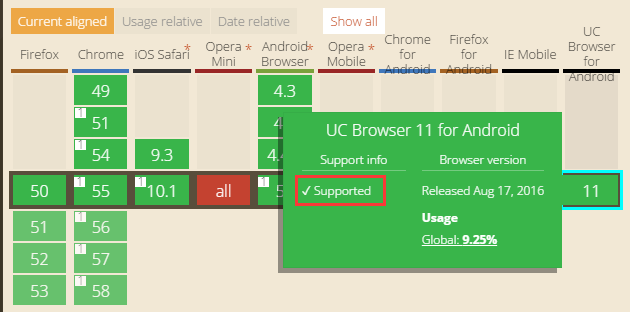

# Use Geolocation to Obtain Location Information

## Geographical Location

If the device supports Geolocation and the used browser supports it, you can use Geolocation to obtain the current geographical location of the device. You can open the webpage [http://caniuse.com/#search=geolocation](http://caniuse.com/#search=geolocation) to check which browser versions support Geolocation. Displayed "Supported" indicates support.



Geolocation returns GeolocationInfo, which contains the following information:

- `latitude` - Latitude (degrees).
- `longitude` - Longitude (degrees).
- `altitude` - Altitude relative to sea level (meters). If the device does not provide altitude data, the value of `altitude` is null.
- `accuracy` - The accuracy of the returned latitude and longitude, in meters.
- `altitudeAccuracy` - The accuracy of the returned altitude, in meters. `altitudeAccuracy` may be `null`.
- `heading` - Returns the moving direction of the device (angle), indicating the angle from the north. 0 degrees indicates pointing due north, and the direction rotates clockwise (this means east is 90 degrees and west is 270 degrees). If `speed` is 0, `heading` will be `NaN`. If the device cannot provide `heading` information, the value is `null`.
- `speed` - Returns the moving speed of the device per second (meters). `speed` may be `null`.
- `timestamp` - The time when the current location of the device was obtained.

The static property values of Geolocation contain the following general settings:

- `enableHighAccuracy` - Boolean. If set to true and the device can provide a more accurate location, the application should obtain the best result as much as possible. Note that this may result in longer response times and greater power consumption (such as enabling the GPS of the mobile device). If set to false, a faster response and less power consumption will be obtained. The default value is false.
- `timeout` - Represents the maximum time (milliseconds) limit for returning the location. The default value is `Infinity`, meaning that `getCurrentPosition()` does not return until the location is available.
- `maximumAge` - Represents the maximum time limit for the available cached location that can be returned. If set to 0, the device does not use the cached location and always attempts to obtain the real-time location. If set to `Infinity`, the device must return the cached location regardless of its age. The default value: 0.

### 1. Obtaining the Current Position

Use the static method `Geolocation.getCurrentPosition()` to obtain the current position, and `getCurrentPosition()` is triggered only once.

```typescript
    /**
     * Obtain the current position of the device.
     * @param	onSuccess	Callback handler with a unique <code>Position</code> parameter.
     * @param	onError		Optional. Callback handler with error information. The error codes are one of Geolocation.PERMISSION_DENIED, Geolocation.POSITION_UNAVAILABLE, and Geolocation.TIMEOUT.
     */
    static getCurrentPosition(onSuccess: Handler, onError: Handler = null): void {
        Geolocation.navigator.geolocation.getCurrentPosition(function (pos: any): void {
            Geolocation.position.setPosition(pos);
            onSuccess.runWith(Geolocation.position);
        },
            function (error: any): void {
                onError.runWith(error);
            },
            {
                enableHighAccuracy: Geolocation.enableHighAccuracy,
                timeout: Geolocation.timeout,
                maximumAge: Geolocation.maximumAge
            });
    }
```

In LayaAir IDE, add a custom component script to Scene2D and add the following code to obtain the geographical location after a mouse click.

```typescript
const { regClass, property } = Laya;

@regClass()
export class NewScript extends Laya.Script {

    constructor() {
        super();
    }
    
    onMouseClick(evt: Laya.Event): void {
        // Attempt to obtain the current position
        Laya.Geolocation.getCurrentPosition(
            Laya.Handler.create(this, this.onSuccess),
            Laya.Handler.create(this, this.onError)
        );
        console.log("click");
    }
    
    // Triggered after successfully obtaining the position
    onSuccess(info: Laya.GeolocationInfo): void {
        console.log('Longitude and Latitude: (' + info.longitude + '°, ' + info.latitude + '°), Accuracy: ' + info.accuracy +'m');
    
        if (info.altitude!= null)
            console.log('Altitude: ' + info.altitude +'m' + (info.altitudeAccuracy!= null? ('，Accuracy: ' + info.altitudeAccuracy +'m') : ''));
    
        if (info.heading!= null &&!isNaN(info.heading))
            console.log('Direction: ' + info.heading + "°");
    
        if (info.speed!= null &&!isNaN(info.speed))
            console.log('Speed: ' + info.speed + "m/s");
    }
    
    // Triggered after obtaining the position fails
    onError(err: any): void {
        var errType: String;
        if (err.code == Laya.Geolocation.PERMISSION_DENIED)
            errType = "Permission Denied";
        else if (err.code == Laya.Geolocation.POSITION_UNAVAILABLE)
            errType = "Position Unavailable";
        else if (err.code == Laya.Geolocation.TIMEOUT)
            errType = "Time Out";
        console.log('ERROR(' + errType + '): ' + err.message);
    }
}
```

The above example code demonstrates obtaining the current position information using `getCurrentPosition()`, printing the geographical location information when successful, and printing the error information and reason when failed.

If the developer clicks the browser preview in the IDE, the above example will print the error information of Permission Denied (no permission). The reason is that when obtaining location information using getCurrentPosition(), the use of navigator.geolocation in Geolocation can only use the https protocol, and the ordinary http protocol cannot be executed. However, the default Google browser opened in the IDE uses the http protocol.

Here is a testing method. The developer can first [Web Publish](../../../../released/web/readme.md), and then use the anywhere command to start https for testing. It should be noted that in the example, the method for obtaining the geographical location is placed in the mouse click event. The reason is that navigator.geolocation only returns geographical information when responding to the user's gesture operation. Therefore, if it is directly placed in global methods such as onStart(), it will not work. It must be a response function of a gesture event like onMouseClick().

> Obtaining location information requires enabling a proxy.

### 2. Monitoring Position Changes

In addition to obtaining the current position, you can also monitor position changes. Use `Geolocation.watchPosition()` to monitor position changes. This function returns a monitor ID value. You can use `Geolocation.clearWatch()` and pass in this ID value to cancel the position listener registered by `watchPosition()`.

```typescript
    /**
     * Monitor the current position of the device. The callback handler is executed when the device position changes.
     * @param	onSuccess	Callback handler with a unique <code>Position</code> parameter.
     * @param	onError		Optional. Callback handler with error information. The error codes are one of Geolocation.PERMISSION_DENIED, Geolocation.POSITION_UNAVAILABLE, and Geolocation.TIMEOUT.
     */
    static watchPosition(onSuccess: Handler, onError: Handler): number {
        return Geolocation.navigator.geolocation.watchPosition(function (pos: any): void {
            Geolocation.position.setPosition(pos);
            onSuccess.runWith(Geolocation.position);
        },
            function (error: any): void {
                onError.runWith(error);
            },
            {
                enableHighAccuracy: Geolocation.enableHighAccuracy,
                timeout: Geolocation.timeout,
                maximumAge: Geolocation.maximumAge
            });
    }

    /**
     * Remove the specified handler installed by <code>watchPosition</code>.
     * @param	id
     */
    static clearWatch(id: number): void {
        Geolocation.navigator.geolocation.clearWatch(id);
    }
```

The following example has the same testing method as the example in Section 1 and needs to be tested after publishing.

```typescript
const { regClass, property } = Laya;

@regClass()
export class NewScript extends Laya.Script {

    constructor() {
        super();
    }
    
    onKeyDown(): void {
        // Geolocation.watchPosition function signature
        Laya.Geolocation.watchPosition(
            Laya.Handler.create(this, this.updatePosition),
            Laya.Handler.create(this, this.onError));
        console.log("keydown");
    }
    
    updatePosition(info: Laya.GeolocationInfo): void {
        console.log('Longitude and Latitude: (' + info.longitude + '°, ' + info.latitude + '°), Accuracy: ' + info.accuracy +'m');
    }
    
    onError(err: any): void {
        var errType: String;
        if (err.code == Laya.Geolocation.PERMISSION_DENIED)
            errType = "Permission Denied";
        else if (err.code == Laya.Geolocation.POSITION_UNAVAILABLE)
            errType = "Position Unavailable";
        else if (err.code == Laya.Geolocation.TIMEOUT)
            errType = "Time Out";
        console.log('ERROR(' + errType + '): ' + err.message);
    }
}
```

`watchPosition()` has the same function signature as `getCurrentPosition()`. For more applications of `watchPosition()`, you can view the documentation [ "Using Baidu Map"](../baiduMap/readme.md).