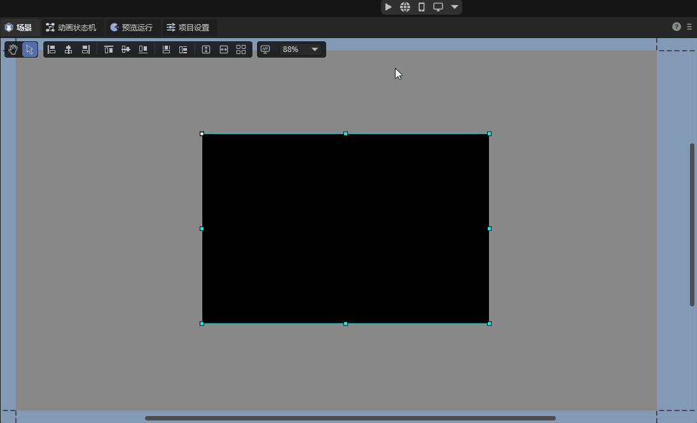
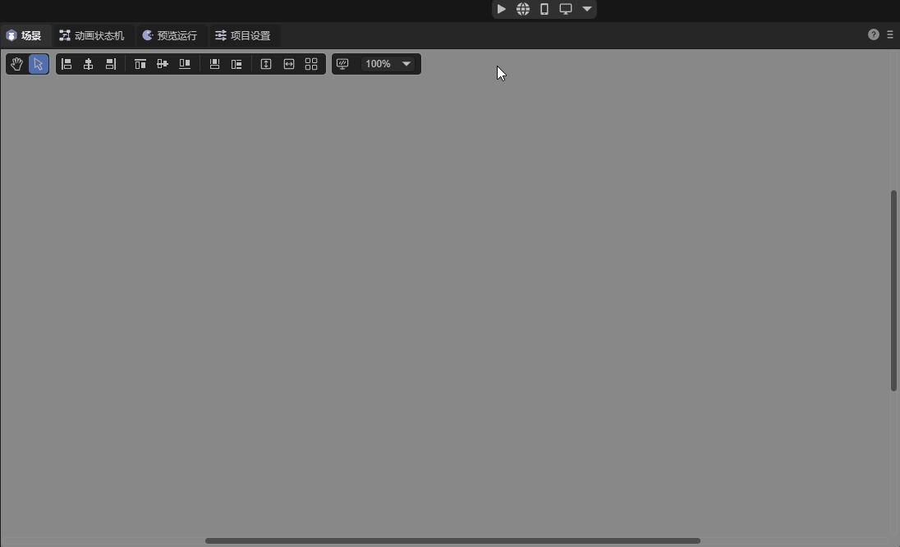
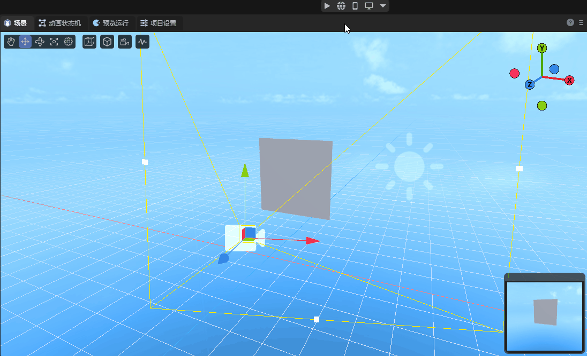

# Video

When making games, the function of playing videos has a wide range of applications, such as playing cutscenes and the background of the game loading interface. This article summarizes some methods that can be used to play videos in the LayaAir engine for developers' reference.

## 1. Video Node

Developers can add video nodes in the scene to play videos. Video nodes will not play automatically when the program runs, and developers need to control it using code. For the specific usage method of video nodes, you can refer to [Video Node](../../../../2D/displayObject/VideoNode/readme.md).



## 2. Dom Element video

Developers can also use Dom elements to play videos. The specific usage method has been detailed in the `LayaAir's Dom Element video` section in the document [LayaAir and Native Dom](../../../../2D/dom/readme.md), and will not be repeated here.



## 3. Video Texture

If developers want to play videos in a 3D scene, they can use video textures. Video textures need to be used through code.

The following code provides a simple example demonstrating how to use video textures:

```typescript
const { regClass, property } = Laya;

/**
 * Use video texture
 */
 @regClass()
 export class Script extends Laya.Script {
    declare owner: Laya.Sprite3D;

    @property(Laya.Scene3D)
    private scene: Laya.Scene3D;

    private videoPlane: Laya.Sprite3D;
    private videoTexture = new Laya.VideoTexture();

    onAwake(): void {
        // Get the 3D node in the scene to add the video texture
        this.videoPlane = this.scene.getChildByName("Plane") as Laya.Sprite3D;
        // Use the video file at the specified path
        this.createVideo("resources/mov_bbb.mp4");
    }

    // Create a video texture and apply it to the Sprite3D
    private createVideo(url: string): void {

        // Set the path of the texture
        this.videoTexture.source = url;
        // Start playing the video
        this.videoTexture.play();
        // Set the playback mode of the texture to loop playback
        this.videoTexture.loop = true;
     
        // Create an unlit material
        let mat = new Laya.UnlitMaterial();
        // Set the created video texture as the texture of the material
        mat.albedoTexture = this.videoTexture;
        // Apply the material to the Sprite3D
        this.videoPlane.getComponent(Laya.MeshRenderer).sharedMaterial = mat;

    }
 }
```

The effect is shown as follows:



Now let's introduce the commonly used properties and methods in videoTexture. Developers can also view all the properties and methods of videoTexture in the [API documentation](https://layaair.layabox.com/3.x/api/Chinese/index.html?version=3.0.0&type=Core&category=Media&class=laya.media.VideoTexture).

**Properties**:

| Name                   | Use                                                  |
| ---------------------- | ---------------------------------------------------- |
| currentSrc             | Get the current video source path.                   |
| currentTime            | The starting position of the current video playback. |
| duration               | The length of the video in seconds.                  |
| ended                  | Whether the video playback has ended.                |
| loop                   | Whether to replay when the playback ends.            |
| muted                  | Whether the video is muted.                          |
| playbackRate           | The current playback speed of the video.             |
| source                 | The source path of the video.                        |
| videoHeight/videoWidth | The height/width of the video source.                |
| volume                 | The current volume.                                  |

Methods:

| Name        | Use                                                      |
| ----------- | -------------------------------------------------------- |
| canPlayType | Detect whether the specified format video can be played. |
| load        | Reload the video.                                        |
| pause       | Pause the video playback.                                |
| play        | Start playing the video.                                 |