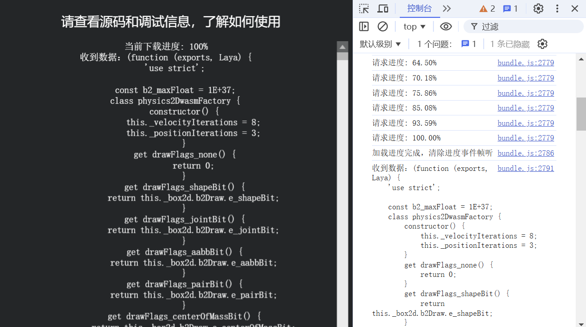

# HTTP Communication

> Author: Charley

The LayaAir 3 engine provides a powerful HTTP communication module through the `HttpRequest` class to perform network requests, supporting common HTTP methods such as `GET`, `POST`, and more. This module offers a convenient remote data interaction function for game developers, enabling communication with external servers to achieve features like data upload, download, and resource retrieval.

This document will introduce the basic operations, commonly used methods, event handling, and how to extend the `HttpRequest` class to meet special needs in LayaAir engine HTTP requests.

## 1. Basic Concepts of HTTP

**HTTP (HyperText Transfer Protocol)** is a protocol used for communication between clients and servers. It defines the format of requests and responses and is the foundational protocol for web applications. Through HTTP, clients (such as browsers or mobile apps) can send requests to servers to retrieve resources (such as files, images, data, etc.) or submit data to the server.

HTTP consists of two parts: **request** and **response**.

A **request** typically includes a request line, headers, an empty line, and an optional request body, while a **response** includes a status line, headers, an empty line, and a response body.

### 1.1. Components of an HTTP Request

- The request line includes the request method (such as GET, POST, PUT, DELETE, etc.), the requested URL (Uniform Resource Locator), and the HTTP version. For example, "GET /index.html HTTP/1.1", where "GET" is the request method indicating the resource is to be fetched, "/index.html" is the resource path, and "HTTP/1.1" is the protocol version.

  > This document will only cover the commonly used GET and POST requests.

- The request headers include additional information about the request, such as the content type the client can accept (Accept), language (Accept-Language), user agent (User-Agent, used to identify client software such as the browser type and version), etc. For example, "Accept: text/html,application/xhtml+xml,application/xml;q=0.9,image/webp,image/apng,*/*;q=0.8" indicates that the client can accept various content types, with different priorities indicated by the `q` value.

### 1.2. Components of an HTTP Response

- The status line includes the HTTP version, status code, and status message. The status code is a three-digit number that indicates the result of the request. For example, "200 OK" means the request was successful and the server successfully returned the requested resource; "404 Not Found" means the requested resource does not exist; "500 Internal Server Error" means there was a server-side error.
- The response headers include information about the response, such as content type (Content-Type), content length (Content-Length), and server software (Server). For example, "Content-Type: text/html; charset=UTF-8" indicates that the response body is in HTML format with UTF-8 character encoding.
- The response body contains the actual content returned by the server, such as HTML code for a webpage or image data.

## 2. Using the Engine's Request Methods

XMLHttpRequest (XHR) is a JavaScript object that provides a mechanism for sending HTTP (or HTTPS) requests asynchronously in the browser and handling server responses. For example, it can be used to fetch remote resources, submit form data, or send JSON data.

In the LayaAir engine, the `HttpRequest` class is the core class used to send HTTP requests. It wraps the native `XMLHttpRequest` and provides a simplified interface and event mechanism, making it easier for developers to exchange data with remote servers.

Through this object, developers can use the browser’s request functionalities (such as `GET`, `POST`, etc.) to communicate with servers.

### 2.1 Sending HTTP Requests

LayaAir engine supports common HTTP requests such as GET and POST. Below are examples of each.

#### 2.1.1 API for Sending Requests

In the `HttpRequest` class of the LayaAir engine, the `send` method is used to send GET and POST requests. The parameters are explained as follows:

```typescript
/**
 * Send an HTTP request.
 * @param url              The URL of the request. Most browsers implement a same-origin policy, requiring this URL to have the same hostname and port as the script.
 * @param data             (default = null) The data to be sent.
 * @param method           (default = "get") The HTTP method to be used for the request. Values include "get", "post", "head".
 * @param responseType     (default = "text") The response type from the web server, can be "text", "json", "xml", or "arraybuffer".
 * @param headers          (default = null) The HTTP request headers. Parameters should be in a key-value array: key is the header name (no spaces, colons, or newlines), value is the header value (no newlines). For example, ["Content-Type", "application/json"].
 */
send(url: string, data?: any, method?: "get" | "post" | "head", responseType?: "text" | "json" | "xml" | "arraybuffer", headers?: string[]): void;
```

#### 2.1.2 GET Request Example

A GET request mainly passes parameters in the URL. Parameters appear after a "?", and multiple parameters are separated by "&", like "https://example.com/search?q=keyword&page=1". This makes the data visible in the URL and is subject to URL length restrictions.

Since the data is transmitted in the URL, it is relatively less secure. It is mainly used to retrieve resources from the server without altering the server’s state, such as querying data.

Example code for a GET request:

```typescript
// Create HttpRequest object
const xhr = new Laya.HttpRequest();
// Send HTTP GET request, data is attached to the URL, suitable for cases where large data transmission is not needed.
xhr.send('https://httpbin.org/get', null, 'get', 'text');
```

#### 2.1.3 POST Request Example

POST request data is placed in the request body, and data in the request body is not visible in the URL. This is more secure for transmitting sensitive information (like passwords), and the size limitations for the request body are typically more relaxed than the URL length limit of GET requests.

Compared to GET requests, POST improves security to some extent. It is mainly used to submit data to the server, which typically results in changes to the server’s state, such as creating new resources or updating existing ones.

Example code for a POST request:

```typescript
// Create HttpRequest object
const xhr = new Laya.HttpRequest();
// Send HTTP POST request, data is contained in the request body, suitable for transmitting large data or sensitive information.
xhr.send('https://httpbin.org/post', 'name=test&age=20', 'post', 'text');
```

### 2.2 Retrieving HTTP Responses

After sending an HTTP request, we can listen to the response using event listeners and handle different responses accordingly.

#### 2.1 Supported Event Types

The `HttpRequest` in LayaAir inherits from `EventDispatcher`, so it supports multiple event types for handling responses after an HTTP request. Common events include:

- **`Event.PROGRESS`**: Used to track the upload and download progress of an HTTP request. For example, when downloading a file, a value of 1 indicates completion.
- **`Event.COMPLETE`**: Triggered when the request is completed, indicating that the response data has been fully received.
- **`Event.ERROR`**: Triggered when an error occurs with the request, often used for network failures or other exceptions.

#### 2.2 Real-world HTTP Response

After sending an HTTP request, we handle the response by listening for asynchronous event callbacks. The complete example code is as follows:

```typescript
import Event = Laya.Event;
import HttpRequest = Laya.HttpRequest;
const { regClass } = Laya;
@regClass()
export class Network_GET extends Laya.Script {
	private hr: HttpRequest;
	private logger: Laya.TextArea;
	private text: Laya.Label = new Laya.Label();

	onAwake(): void {
		this.initUI();
		this.connect();
	}
	/**
	 * Initialize the UI
	 */
	private initUI(): void {
		this.showLogger();
		this.text.text = "Please refer to the source code and debugging information for usage details.";
		this.text.color = "#FFFFFF";
		this.text.font = "Impact";
		this.text.fontSize = 25;
		this.text.width = 800;
		this.text.anchorX = 0.5;
		this.text.align = "center";
		this.text.y = 20;
		this.text.centerX = 0;
		this.owner.addChild(this.text);
	}

	/**
	 * Make the HTTP connection request
	 */
	private connect(): void {
		// Create HttpRequest object
		this.hr = new HttpRequest();
		// Triggered when the request response progress changes
		this.hr.on(Event.PROGRESS, this, this.onHttpRequestProgress);
        // Triggered when the request is completed, indicating that the response data has been fully received.
		this.hr.once(Event.COMPLETE, this, this.onHttpRequestComplete);
        // Triggered when the request encounters an error, commonly used for network failure or other exceptions.
		this.hr.once(Event.ERROR, this, this.onHttpRequestError);
		// The URL in the example is a temporary test address, which is not guaranteed to be valid long-term. Please replace it with a valid URL.
		this.hr.send('https://ldc-1251285021.cos.ap-shanghai.myqcloud.com/engine/3.2/libs/laya.box2D.js', null, 'get', 'text');
	}

	/**
	 * Display HTTP response log
	 */
	private showLogger(): void {
		this.logger = new Laya.TextArea();
		this.logger.scrollType = 2;
		this.logger.vScrollBarSkin = "resources/res/ui/vscroll.png";
		this.logger.fontSize = 18;
		this.logger.color = "#FFFFFF";
		this.logger.align = 'center';
		this.logger.valign = 'middle';
		this.logger.left = this.logger.right = this.logger.bottom = 10;
		this.logger.top = 60;
		this.logger.text = "Waiting for response...\n";
		this.owner.addChild(this.logger);
	}

	/**
	 * Callback triggered when the request fails
	 * @param e Event object
	 */
	private onHttpRequestError(e: any = null): void {
		console.error("Request failed:", e);
		this.logger.text = "Request failed, please try again.\n";
	}

	/**
	 * Callback triggered when the request progress changes
	 * @param e Event object
	 */
	private onHttpRequestProgress(e: any = null): void {
		// Progress percentage
		const progress = e * 100;
		console.log("Request progress:", progress.toFixed(2) + "%");
		// Update the log display
		this.logger.text = `Current download progress: ${progress.toFixed(2)}%\n`;
		// Clear progress event listener after loading is complete
		if (progress == 100) {
			this.logger.text = `Current download progress: 100%\n`;
			Laya.timer.clear(this, this.onHttpRequestProgress);
			console.log("Loading progress completed, clearing progress event listener.");
		}
	}
	/**
	 * Callback triggered when the request completes
	 * @param e Event object
	 */
	private onHttpRequestComplete(e: any = null): void {
		this.logger.text += "Received data: " + this.hr.data;
		console.log("Received data: " + this.hr.data);
	}
}
```

From the example code above, we can see that if the request responds successfully, we can receive progress updates and the completion response, as shown in Figure 1-1:



(Figure 1-1)

If there are issues such as an invalid address, an error event will be triggered, as shown in Figure 1-2:


(Figure 1-2)

> POST requests and responses are identical except for the parameters passed during the `send` method. There’s no need to repeat the example. If you don't understand, you can create an API sample template project in LayaAir 3-IDE, which provides sample code for both GET and POST requests.

In game interaction communications, event responses for request completion and errors must be used, while progress update event responses are unnecessary in most cases.

### 2.3 Using Native XMLHttpRequest

Since the `HttpRequest` class methods we encapsulated mainly target common needs for game interaction scenarios, it does not cover all the features of the XMLHttpRequest object. If there is a need for functionality beyond the built-in capabilities of the engine, you can directly use the native XMLHttpRequest object via the `http` property of the `HttpRequest` class.

The example code is as follows:

```typescript
const { regClass } = Laya;
@regClass()
export class Network_GET extends Laya.Script {
	onAwake(): void {
		this.useXhr();
	}
    
    /** Test using the native XMLHttpRequest object */
	useXhr(): void {
		// Reference the XMLHttpRequest object
		var xhr = new Laya.HttpRequest().http;

		// Set the request URL and method
		xhr.open('GET', 'https://ldc-1251285021.cos.ap-shanghai.myqcloud.com/layaair-3.2/win/LayaAirIDE-win-x64-3.2.1.exe', true);

		// Set the response type to blob (can be a file type)
		xhr.responseType = 'blob';

		// Listen for the progress event during the download
		xhr.addEventListener('progress', function (event: any) {
			if (event.lengthComputable) {
				// Calculate the download percentage
				var percent = (event.loaded / event.total) * 100;
				console.log('Download progress: ' + percent.toFixed(2) + '%');
			}
		});

		// Set the function to handle the request completion
		xhr.onload = function () {
			if (xhr.status === 200) {
				console.log("File download complete!");
			} else {
				console.error("Request failed: " + xhr.status);
			}
		};

		// Set the function to handle request errors
		xhr.onerror = function () {
			console.error("Request error!");
		};

		// Send the request
		xhr.send();
	}
}
```

From the code above, we can see that the logic is entirely based on the native XMLHttpRequest API.

If developers want to learn more about the native capabilities of XMLHttpRequest, they can visit the following URL:

[https://developer.mozilla.org/zh-CN/docs/Web/API/XMLHttpRequest](https://developer.mozilla.org/zh-CN/docs/Web/API/XMLHttpRequest)