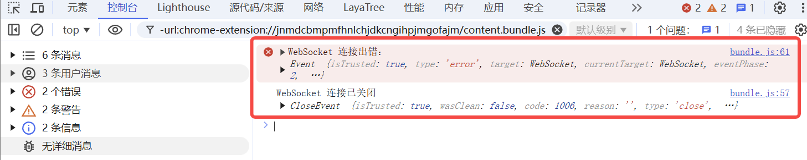
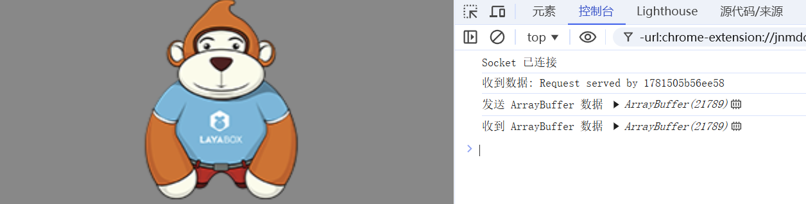

# WebSocket Communication

> Author: Charley

The WebSocket protocol is widely used in scenarios such as online games, real-time chat, and data push due to its full-duplex and low-latency features. LayaAir engine provides built-in WebSocket encapsulation (through `Laya.Socket`), along with `Laya.Byte` for efficient reading and writing of binary data, offering developers an easy-to-use network communication interface. This document will guide you step-by-step on how to utilize WebSocket for data communication in LayaAir.

## 1. WebSocket Basic Concepts

WebSocket is a network communication protocol designed to establish a persistent, full-duplex connection between the client (e.g., a web browser) and the server. This means that once the connection is established, both parties can actively send and receive data at any time without needing to establish a new connection and wait for request responses, as is the case with traditional HTTP protocols.

### 1.1 Background and Origin

Before WebSocket, real-time communication between the client and server was typically achieved through polling or long-polling techniques.

Polling refers to the client periodically sending requests to the server to fetch the latest data, which results in a large number of unnecessary requests, wasting bandwidth and server resources.

Long-polling improved on this but still wasn't true real-time communication. To address these issues, the WebSocket protocol was introduced in the HTML5 specification.

### 1.2 Key Features

#### 1.2.1 **Full-Duplex Communication**

After establishing the WebSocket connection, both the client and server can send data to each other at any time without waiting for the other party's request. For example, in an online chat application, the client can send a message to the server at any time, and the server can push messages from other users to the client immediately.

#### 1.2.2 **High Real-Time Performance**

Since it is a full-duplex communication, data can be transmitted in real time, without the delay problems associated with traditional polling methods. This makes WebSocket ideal for applications requiring high real-time performance, such as stock price displays and online games.

#### 1.2.3 **Persistent Connection**

Once the connection is established, the channel between the client and server remains open until either party actively closes the connection. This greatly reduces the overhead associated with frequently establishing and closing connections.

#### 1.2.4 **Low Overhead**

After the connection is established, the header information in WebSocket communication is very small, much smaller than the header information in HTTP requests, thus reducing data transmission overhead.

#### 1.2.5 **Cross-Domain Communication**

WebSocket allows cross-domain communication, enabling the client to interact with servers from different domains in real-time, without being restricted by the same-origin policy.

### 1.3 Working Principle

#### 1.3.1 **Handshake Phase**

The client initiates a WebSocket connection request to the server via an HTTP request, with some special fields in the request header, such as `Upgrade: websocket` and `Connection: Upgrade`, indicating that the client wishes to upgrade the current HTTP connection to a WebSocket connection. When the server receives this request and supports the WebSocket protocol, it responds with a status code of 101, indicating agreement to upgrade the connection.

#### 1.3.2 **Data Transmission Phase**

After the handshake succeeds, the TCP connection remains open, and both the client and server can freely send and receive data through this connection. Data is transmitted in the form of frames, with WebSocket protocol defining different types of frames, such as text frames and binary frames.

#### 1.3.3 **Closing Connection Phase**

When either the client or server needs to close the connection, a close frame is sent. The receiving party sends a close confirmation frame, and both parties then close the TCP connection.

## 2. Laya.Socket Communication Basics

The core class used for WebSocket communication in LayaAir is `Laya.Socket`. Below is a detailed introduction to its usage.

### 2.1 Establishing a Connection

#### 2.1.1 Constructor Parameters

You can directly pass the host address and port in the constructor to attempt the connection immediately.


```typescript
// Note: The host parameter does not require the "ws://" prefix; it's defaulted to ws
let socket = new Laya.Socket("192.168.1.2", 8899);
// If you need the wss secure protocol, the 5th parameter should be true.
// let socket = new Laya.Socket("192.168.1.2", 8899, null, null, true);
```

#### 2.1.2 **connect Method**

First, create the Socket object, then call `connect(host, port)` to establish the connection.

```typescript
let socket = new Laya.Socket();
socket.connect("192.168.1.2", 8899);
// If you need the wss secure protocol, the 3rd parameter should be true.
// let socket = new Laya.Socket("192.168.1.2", 8899, true);
```

#### 2.1.3 **connectByUrl Method**

Directly pass the complete WebSocket URL, including the protocol prefix (e.g., "ws://").

```typescript
let socket = new Laya.Socket();
socket.connectByUrl("ws://localhost:8989");
```

### 2.2 **Event Listeners and Handling**

Since both the connection and data transfer of WebSocket are asynchronous, after establishing the connection, you typically need to register the following event listeners:

- **Event.OPEN**: Triggered after the connection is successfully established.
- **Event.MESSAGE**: Triggered when data is received from the server.
- **Event.CLOSE**: Triggered when the connection is closed.
- **Event.ERROR**: Triggered when there is an error in the connection.

Example code:

```typescript
// Register event listeners example
this.socket.on(Laya.Event.OPEN, this, this.onSocketOpen);
this.socket.on(Laya.Event.MESSAGE, this, this.onMessageReceived);
this.socket.on(Laya.Event.CLOSE, this, this.onSocketClose);
this.socket.on(Laya.Event.ERROR, this, this.onConnectError);
```


## 3、WebSocket Data Communication Example

### 3.1 **String Data Communication**

Example of sending string data:

```typescript
// Send string data
this.socket.send("Hello, LayaAir!");
```

The data received by the server is a plain string, and the client directly processes it upon receipt.

Complete example of receiving string data:

```typescript
const { regClass } = Laya;

@regClass()
export class WebSocketDemo extends Laya.Script {
    private socket: Laya.Socket;

    // This function runs when the component is enabled, for example, when the node is added to the stage
    onEnable(): void {
        this.socket = new Laya.Socket();

        // Register event listeners
        this.socket.on(Laya.Event.OPEN, this, this.onSocketOpen);
        this.socket.on(Laya.Event.MESSAGE, this, this.onMessageReceived);
        this.socket.on(Laya.Event.CLOSE, this, this.onSocketClose);
        this.socket.on(Laya.Event.ERROR, this, this.onConnectError);

        // Establish connection (connectByUrl method is used here, but others can be chosen as needed)
        this.socket.connectByUrl("wss://echo.websocket.org:443");
    }

    /** Callback when the connection is successful, send string data */
    private onSocketOpen(e: any): void {
        console.log("WebSocket connected");

        // Example of sending a string
        this.socket.send("Hello, LayaAir WebSocket!");
    }

    /** Callback when data is received */
    private onMessageReceived(msg: any): void {
        console.log("Message received:");
        if (typeof msg === "string") {
            console.log("Text data:", msg);
        } else {
            console.log("Received non-string data", msg);
        }
        // Clear the input buffer to avoid residual data
        this.socket.input.clear();
    }

    /** Callback when the connection is closed */
    private onSocketClose(e: any): void {
        console.log("WebSocket connection closed", e);
    }

    /** Callback when there is a connection error */
    private onConnectError(e: any): void {
        console.error("WebSocket connection error:", e);
    }
}
```

Once the example code successfully connects, the console output will appear as shown in Figure 1-1:

 

(Figure 1-1)

If the connection encounters an error or is closed, the console output will appear as shown in Figure 1-2:



(Figure 1-2)

### 3.2 Binary Data Communication

#### 3.2.1 Advantages of Binary Communication

Compared to string data communication, the size of binary data is typically 50%-80% smaller than text (such as JSON), and decoding is 3-5 times faster than text parsing (without serialization/deserialization overhead). Binary data allows direct memory manipulation, reduces the creation of temporary objects, and has other advantages.

#### 3.2.2 Binary Communication Data Types

In the WebSocket protocol, the basic binary types supported are Blob and ArrayBuffer.

**Blob** focuses on storing and transmitting files, mainly used in web interaction scenarios, while **ArrayBuffer** is more suitable for data processing, such as game data interaction.

Since ArrayBuffer is the optimal choice in game engines, **LayaAir’s encapsulation has fixed the binary data type as "arraybuffer"**, and it does not support Blob.

#### 3.2.3 ArrayBuffer Data Communication

**ArrayBuffer** is a basic data structure in JavaScript used to represent **raw binary data**. It does not directly store data but provides a fixed-size memory area, accessed and manipulated using **TypedArray** or **DataView** data types.

The complete example code is as follows:

```typescript
const { regClass } = Laya;
import Socket = Laya.Socket;
import Event = Laya.Event;

@regClass()
export class ArrayBufferSocketDemo extends Laya.Script {
    private socket: Socket;

    onEnable(): void {
        this.socket = new Socket();
        this.socket.connectByUrl("wss://echo.websocket.org:443");

        this.socket.on(Event.OPEN, this, this.onSocketOpen);
        this.socket.on(Event.MESSAGE, this, this.onMessageReceived);
        this.socket.on(Event.ERROR, this, this.onConnectError);
    }

    private onSocketOpen(): void {
        console.log("Socket Connected");

        // Create an ArrayBuffer of size 8 bytes
        let buffer = new ArrayBuffer(8);
        let view = new DataView(buffer);

        // Write integers
        view.setInt32(0, 123456, true);  // Little-endian byte order
        view.setInt32(4, 654321, true);

        // Send data
        this.socket.send(buffer);
    }

    private onMessageReceived(message: any): void {
        if (message instanceof ArrayBuffer) {
            // Create a DataView to parse the ArrayBuffer
            const view = new DataView(message);
            try {
                // Parse data
                const num1 = view.getInt32(0, true); // Little-endian byte order
                const num2 = view.getInt32(4, true);

                // Print parsed results
                console.log("Received binary data:");
                console.log("Number 1:", num1);
                console.log("Number 2:", num2);
            } catch (error) {
                console.error("Error parsing binary data:", error);
            }
        } else {
            console.log("Received non-binary message:", message);
        }
    }

    private onConnectError(): void {
        console.log("Connection Error");
    }
}
```

Add this script to your scene, and you'll see the output in the console as shown in Figure 2-1.

 

(Figure 2-1)

#### 3.2.4 Binary Image Transmission Example

Sometimes, you may need to read binary images from the server and display them. Here is a simulated binary image example script for developers to reference.

The complete example code is as follows:

```typescript
const { regClass } = Laya;

@regClass()
export class ArrayBufferSocketDemo extends Laya.Script {
    private socket: Laya.Socket;

    onEnable(): void {
        this.socket = new Laya.Socket();
        this.socket.connectByUrl("wss://echo.websocket.org:443");
        this.socket.on(Laya.Event.OPEN, this, this.onSocketOpen);
        this.socket.on(Laya.Event.MESSAGE, this, this.onMessageReceived);
        this.socket.on(Laya.Event.ERROR, this, this.onConnectError);
    }

    private onSocketOpen(): void {
        console.log("Socket 已连接");
        /** A binary image resource path (local or online), please replace with your local binary image path,
         * or download the sample image from the following URL (path: https://layaair.com/3.x/demo/resources/res/test.bin)
         */
        const imageUrl = "resources/res/test.bin";
        // Load the binary image file
        Laya.loader.fetch(imageUrl, "arraybuffer").then((arrayBuffer: ArrayBuffer) => {
            // Directly send the loaded ArrayBuffer data
            this.socket.send(arrayBuffer);
            console.log("Sending ArrayBuffer data", arrayBuffer);
        });
    }
    private onMessageReceived(message: any): void {
        if (message instanceof ArrayBuffer) {
            console.log("Received ArrayBuffer data", message);

            // Skip the first 4 bytes used for encryption and only process the valid data. If the resource is not encrypted, the second parameter can be omitted.
            const uint8Array = new Uint8Array(message, 4);

            // Convert the ArrayBuffer to image data and load it into the LayaAir engine
            const img = new Laya.Image();
            img.size(110, 145); // Set image display size
            img.skin = Laya.Browser.window.URL.createObjectURL(new Blob([uint8Array], { type: 'image/png' }));
            img.centerX = 0; // Set the image to be centered

            // Add the image to the stage
            Laya.stage.addChild(img);
        } else {
            console.log("Received data:", message);
        }
    }

    private onConnectError(): void {
        console.log("Connection Error");
    }
}
```

The runtime result is shown in Figure 3-1.



(Figure 3-1)

### 3.3 Binary Communication Based on Laya.Byte

#### 3.3.1 TypedArray基础概念

#### 3.3.1 TypedArray Basic Concept

TypedArrays are important tools in JavaScript for efficiently handling binary data. Essentially, they are views based on `ArrayBuffer`. `ArrayBuffer` is a fixed-length binary data buffer, and TypedArray provides developers with a way to access and manipulate the data in `ArrayBuffer` using specific data types, such as integers, floating-point numbers, etc.

It is important to note that TypedArray is not a single object but a collection of constructors. Each constructor corresponds to a different data type and creates a specific type of binary array. For example, the `Uint8Array` constructor creates a typed array for manipulating data at the byte level, suitable for processing image pixel data, audio samples, and other byte-based data. The `Float32Array` constructor creates an array for handling data as 32-bit floating-point numbers, commonly used in scientific computations, graphics processing, and other precision-demanding scenarios.

With TypedArray, developers can avoid the complexities of directly handling raw byte data, such as manually dealing with byte offsets, conversions, and encoding. It simplifies working with binary data, improving development efficiency.

The common TypedArray view data types are as follows:

| Type         | Description                                        |
| ------------ | -------------------------------------------------- |
| Uint8Array   | Used to operate on 8-bit unsigned integer arrays.  |
| Int8Array    | Used to operate on 8-bit signed integer arrays.    |
| Uint16Array  | Used to operate on 16-bit unsigned integer arrays. |
| Int16Array   | Used to operate on 16-bit signed integer arrays.   |
| Uint32Array  | Used to operate on 32-bit unsigned integer arrays. |
| Int32Array   | Used to operate on 32-bit signed integer arrays.   |
| Float32Array | Used to operate on 32-bit floating-point arrays.   |
| Float64Array | Used to operate on 64-bit floating-point arrays.   |

#### 3.3.2 DataView Basic Concept

`DataView` is a powerful tool in JavaScript used for handling binary data, allowing reading and writing binary data on an `ArrayBuffer`. `DataView` itself does not store data but acts as a view of the `ArrayBuffer`, offering a set of methods to access the underlying binary content with various data types.

Unlike `TypedArray`, `DataView` does not bind a specific data type to the entire `ArrayBuffer`, allowing access to different data types within the same `ArrayBuffer`. This means that developers can read different types of data like `Int8`, `Uint16`, `Float32`, etc., from the same buffer, while `TypedArray` can only use the single data type specified during construction.

When reading and writing multi-byte data, `DataView` allows developers to specify the byte order, i.e., the storage order of the data in memory. It provides control over whether to use big-endian or little-endian byte order, which is important when dealing with different systems and network protocols.

Furthermore, `DataView` offers precise control over the access position of the data. Developers can read or write data from any byte offset in the `ArrayBuffer`, whereas `TypedArray` can only access data sequentially. This flexibility makes `DataView` especially useful for parsing complex binary data structures. For example, if you need to read different types of data in an `ArrayBuffer` (e.g., read `Int16` first, then `Float32`), `TypedArray` would not suffice.

Of course, `TypedArray` also has its own advantages.

For example, `TypedArray` is more performant and suited for large-scale numeric calculations, offering methods like `map`, `forEach`, `set`, which allow developers to treat binary data similarly to regular arrays, and so on.

**When to use `TypedArray`?**
- Handling **large-scale numerical computations** (e.g., audio, video, physical simulations).
- Interacting with **Web APIs** (e.g., `WebGL`, `fetch`, `Web Audio`).
- **High-performance access** to `ArrayBuffer` data is required.

**When to use `DataView`?**
- Need to **read different data types** (e.g., mixing `Int16`, `Float32`).
- Need to **manually specify byte order** (e.g., parsing network protocols, file formats).
- Need **random access** to any byte in the `ArrayBuffer`, not just sequential data.

#### 3.3.3 Laya.Byte Advantages

LayaAir engine's `Byte` class combines the advantages of `TypedArray` and `DataView` into one encapsulation, providing an efficient and flexible solution for reading and writing binary data.

For data storage and management, the `Byte` class leverages `TypedArray` (e.g., `Uint8Array`) for efficient data storage. `TypedArray` features continuous memory storage, enabling fast index-based access like a regular array, making it suitable for storing large binary data chunks. This gives `Byte` excellent performance when handling large data. The `Byte` class also has an **automatic resizing** mechanism, which dynamically adjusts the size when data exceeds the current buffer capacity, avoiding the complexity of manual memory management.

For data read and write operations, the `Byte` class utilizes `DataView` to flexibly handle different data types and byte orders. `DataView` allows reading and writing data of various types and byte orders in the same `ArrayBuffer`, fulfilling the needs of different systems and protocols. Developers can easily switch byte order by setting the `endian` property, and use `DataView`'s methods for precise reading and writing of multi-byte data types, such as integers and floating-point numbers.

For performance optimization, the combination of `TypedArray`'s bulk operation capabilities and `DataView`'s precise reading and writing capabilities makes `Byte` efficient and flexible for binary data handling. For large data blocks, `TypedArray` can quickly bulk write; for specific data types, `DataView` provides precise read and write operations, avoiding unnecessary type conversions and memory overhead.

Additionally, the `Byte` class can unify error handling and boundary checks when working with `TypedArray` and `DataView` objects, such as checking for data overflow during read and write operations, and throwing exceptions when out of bounds, improving the robustness of the code.

#### 3.3.4 Creating Laya.Byte Object and Setting Endianness

"Setting the byte order" refers to specifying the order in which multi-byte data (e.g., 16-bit, 32-bit integers or floats) is arranged in memory. In simple terms, it's about determining whether the data in memory is stored in **big-endian** or **little-endian** order.

BIG_ENDIAN: Big-endian byte order, where the high-order byte is stored at the lowest memory address, and the low-order byte is stored at the highest address. It is sometimes called network byte order.

LITTLE_ENDIAN: Little-endian byte order, where the low-order byte is stored at the lowest memory address, and the high-order byte is stored at the highest address.

In scenarios like network communication and file I/O, data transmission between different systems may require a standardized format. If the sender and receiver understand the byte order differently, it will lead to data parsing errors. Thus, in data transmission, both parties must agree on and use the same byte order. To ensure consistency between front-end and back-end, it is recommended to use little-endian (LITTLE_ENDIAN).

Example code:

```typescript
// Initialize Laya.Byte for binary data processing
let byte = new Laya.Byte();
// Set the byte order to little-endian
byte.endian = Laya.Byte.LITTLE_ENDIAN;
```

#### 3.3.5 Writing and Sending Data with Laya.Byte

After creating the object and setting the byte order, we can call the appropriate writing methods (e.g., writeByte, writeInt16, writeFloat32, writeUTFString) in the protocol order, and then send the data.

Example code:

```typescript
// Write data in sequence
byte.writeByte(1);
byte.writeInt16(20);
byte.writeFloat32(20.5);
byte.writeUTFString("LayaAir WebSocket");

// When sending, pass byte.buffer (ArrayBuffer object), not the byte object directly.
socket.send(byte.buffer);
```

#### 3.3.6 Receiving Data and Full Example

After receiving the ArrayBuffer from the server, we read the data through `Laya.Byte` just like during sending.

Full example code:

```typescript
const { regClass } = Laya;

@regClass()
export class WebSocketDemo extends Laya.Script {
    private socket: Laya.Socket;
    private byte: Laya.Byte;

    onEnable() {
        // Create Socket object
        this.socket = new Laya.Socket();
        // Initialize Laya.Byte for binary data processing
        this.byte = new Laya.Byte();
        // Set byte order to little-endian
        this.byte.endian = Laya.Byte.LITTLE_ENDIAN;

        // Register event listeners
        this.socket.on(Laya.Event.OPEN, this, this.onSocketOpen);
        this.socket.on(Laya.Event.MESSAGE, this, this.onMessageReceived);
        this.socket.on(Laya.Event.CLOSE, this, this.onSocketClose);
        this.socket.on(Laya.Event.ERROR, this, this.onConnectError);

        // Connect (here using connectByUrl, but you can choose other methods)
        this.socket.connectByUrl("wss://echo.websocket.org:443");
    }

    // Connection successful callback
    private onSocketOpen(e: any): void {
        console.log("WebSocket 已连接");
        // Write data in sequence: one byte, one 16-bit integer, one 32-bit float, one string
        this.byte.writeByte(99);
        this.byte.writeInt16(2025);
        this.byte.writeFloat32(0.12345672398805618);
        this.byte.writeUTFString("二进制数据示例");

        // When sending, pass the binary data byte.buffer (ArrayBuffer), not the byte object
        this.socket.send(this.byte.buffer);
        // Clear buffer to avoid data residue affecting subsequent operations.
        this.byte.clear();
    }

    // Data received callback
    private onMessageReceived(msg: any): void {
        console.log("接收到消息：", msg);

   		// Check if the message is of type ArrayBuffer (binary data)
        if (msg instanceof ArrayBuffer) {
            // Create a Laya.Byte instance to manipulate binary data
            let byte = new Laya.Byte();
            // Set byte order
            byte.endian = Laya.Byte.LITTLE_ENDIAN;
            // Write binary data from ArrayBuffer to Laya.Byte object
            byte.writeArrayBuffer(msg);

            // Reset the byte stream position pointer to 0
            byte.pos = 0;

            // Read one byte (8 bits)
            let a = byte.getByte();  // Get one byte (1 byte)
            // Read one 16-bit integer (2 bytes)
            let b = byte.getInt16();  // Get one 16-bit integer
            // Read one 32-bit float (4 bytes)
            let c = byte.getFloat32();  // Get one 32-bit float
            // Read a UTF-8 encoded string
            let d = byte.getUTFString();  // Get one UTF-8 string

             // Print the parsed result
            console.log("解析结果：", a, b, c, d);
        }
        // Clear socket input stream to ensure clean reading for the next time
        this.socket.input.clear();
    }


    // Connection closed callback
    private onSocketClose(e: any): void {
        console.log("WebSocket connection closed");
    }

    // Connection error callback
    private onConnectError(e: any): void {
        console.error("WebSocket connection error:", e);
    }
}
```

The effect, as shown in Figure 4-1, demonstrates successfully sending and receiving binary data using `Laya.Byte` and printing the data.

 

(Figure 4-1)

## 4、Other APIs

After familiarizing yourself with the main process, other APIs can be found in the engine source code or the official API documentation:

https://layaair.com/3.x/api/

https://github.com/layabox/LayaAir