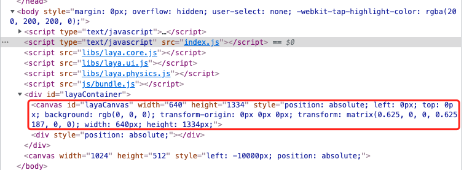
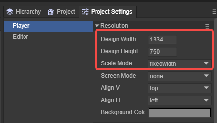

# Basic concepts of engine use

> Author : Charley

### 1. Canvas

The canvas is the browser's canvas, as shown in Figure 1:

(figure 1)

All visible images of the LayaAir engine game are drawn frame by frame, and the results are displayed during continuous playback. The number of frames played per second represents the performance indicator of whether the game is smooth. The canvas is the container for each frame of drawing displayed by the engine. Without the canvas, it is like a painter without drawing paper, and it is impossible to paint in thin air.

> The higher the frame number, the smoother the picture. Usually 60 frames is a full frame, but it will vary depending on the device. Some models can reach 90 frames or 120 frames.

The size of the LayaAir canvas depends on the design width and height set by our game and the screen adaptation in the LayaAir engine, as shown in Figure 2.

  

(figure 2)

Under different model resolutions, the canvas size may vary. This knowledge will be introduced in the screen adaptation documentation.

### 2. Stage

The stage is the Stage of the engine, and is the actual area used by the LayaAir engine to draw game images on the canvas and provide feedback on interactive events.

You can imagine that a painter only paints in the center area of ​​a piece of paper (canvas), leaves only a little edge, or paints the entire paper. This planning can be understood in the engine as the size of the stage.

The picture in the game is actually limited by the stage of the engine. If the stage is not full screen, the light canvas will be full screen, and the part beyond the stage will not be displayed. If the equipment is compared to a table and the canvas is drawing paper, even if the drawing paper covers the entire table, if it is stipulated that the painter can only paint in a certain area, then the artist will not go beyond that area when painting. Therefore, for games that require full-screen adaptation, not only must the size of the canvas reach the full screen size, but the size of the stage must also fill the size of the canvas.

The size of the stage is also related to the design width and height and screen adaptation. The above adaptation document is also suitable for students who want to understand the concept of **stage** in depth.

### 3. Object

Students with programming knowledge can all understand that in object-oriented programming, objects are instances of classes.

In a broad sense, data with attribute structures or data structures that can set attributes can also be called objects, such as json objects and empty objects `{}`.

### 4. Node, display list, display object, container object

In the LayaAir engine, the Node (node) class is the base class for all objects that can be placed in the display list. The 2D basic sprite Sprite and the 3D basic sprite Sprite3D both inherit from Node. Not only this, but all subclasses that inherit from Node. Or grandchild class, also called node, for example: Sprite node, Image node.

> Only node objects that inherit from a subclass or grandchild of Node can add child node objects.

In nodes, visible objects such as pictures, text, animations, models, etc. are display objects. Some nodes themselves are not responsible for rendering and display, but are only used to mount child nodes. Such objects are called container objects. For example Sprite, Sprite3D, Box, etc.

> Sprite is special. When a texture resource is added, it becomes a display object. When no texture is added and is only used to mount child nodes, it is a container object.

The display list is an abstract concept. The display list can be understood as a node tree based on the stage. Whether it is a display object or a container object, it is within the display list.

The display list is used to manage all objects displayed when LayaAir is running. It should be noted that the two subclasses Sprite and Sprite3D inherited from Node are the 2D basic display object and the 3D basic display object respectively. The two cannot be mixed and added, which means that Sprite and its sub-nodes cannot be used as sub-nodes of Sprite3D, and Sprite3D and its sub-nodes cannot be used as sub-nodes of Sprite.

