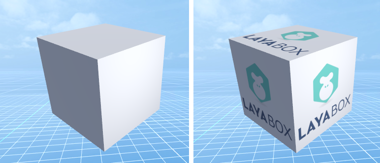
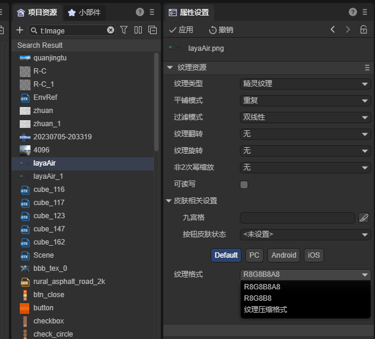
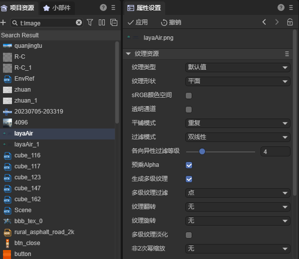

# Texture basics

> Author: Charley

## 1. What is texture?

In the LayaAir engine, texture is an indispensable basic term.

Some novice developers simply understand the texture as a JPG or PNG image.

In fact, texture refers to object data applied to a three-dimensional model or the appearance of a two-dimensional planar surface.

Texture data mainly consists of pixels, each of which has its own color space information, such as RGB. In addition, it also includes some other texture data information for processing different texture appearance effects.

It appears as a two-dimensional image or pattern that can be overlaid on the surface of the geometry based on the model material to increase the detail, color, lighting and realism of the model. Can also be used for 2D backgrounds, UI elements, etc.

For example, the right side of Figure 1 shows the cube effect after adding texture.

(figure 1)

As for bitmap files with JPG and PNG suffixes, they are only one of the storage forms of textures. Compressed textures are also a relatively common form of texture storage.

Textures stored as resource files are called texture resources. It contains data information such as color, Alpha, etc., and the engine performs coloring and drawing based on these data information.

## 2. Texture categories

Textures can also be subdivided into many different types depending on their use. From the data storage of textures to even the resource types and names of textures, they are all different.

Below we will introduce them separately based on the engine.

### 2.1 Sprite texture

LayaAir's sprite texture refers to the texture type applied to 2D UI and is the texture source of the sprite (Sprite) node.

The sources of sprite texture resources are mainly bitmaps such as PNG and JPG. You can also use texture compression format resources through the IDE's texture compression option.

The texture data of sprite textures is simpler than 3D textures and does not require multi-level texture and other data. For example, as shown in Figure 2:

(figure 2)

When using textures for 2D nodes, you must manually select the elf texture type, otherwise the texture display may be abnormal due to differences in texture data generated when importing resources.

> [!Tip]
>
> 1. Resources based on the resource naming rules of LayaAir engine 2DUI "[UI component details] (../../../IDE/uiEditor/uiComponent/readme.md#General resource naming rules are as follows:)" will be automatically Set to sprite texture type.
>
> 2. For the use of sprite textures, please refer to the document "[Sprite](../../../2D/displayObject/Sprite/readme.md#322-set-texture)" about the use of textures.

### 2.2 2D texture

A 2D texture is a texture whose **texture shape** is a **plane**, as shown in Figure 3. This is also the default texture data state after texture resources are imported into LayaAir3-IDE (resources that do not follow UI naming rules).

(image 3)

The sprite texture is essentially a 2D texture, but based on the purpose of the texture, using the sprite texture type, you can set the properties of the texture to the purpose of 2D UI with one click, which is faster and more efficient.

As opposed to 2D textures that are sprite textures, the default attribute settings are for 3D texture purposes. Therefore, developers must pay attention to whether the texture is used for 2D UI or 3D mapping.

Plane textures used for 3D will generate multi-level textures by default to solve 3D detail phenomena caused by viewing distance such as moiré.

For application scenarios where it is certain that moiré will not occur, such as in a room that is not very empty, developers can also manually remove the check box for generating multi-level textures.

> For a detailed explanation of each attribute of texture, please refer to the document "[Texture Resource Settings](../../../IDE/assets/Texture/readme.md)"

### 2.3 Cube texture

Cube Map Texture is a special texture type used to render 3D environments. It is represented by a combination of 2D textures representing the six faces of a cube, as shown in Figure 4.

(Figure 4)

 Cube texture, mainly used in sky boxes and environment reflections. As shown in Figure 5:

(Figure 5)

In LayaAirIDE, there are many ways to create a cube texture, for example, directly setting the texture shape of the panorama texture resource to a cube, right-clicking on the project resource panel to create a cube texture, baking to generate, etc.

For a detailed introduction to cube texture, you can view ["Detailed Explanation of the Use of Cube Texture"](../../../IDE/assets/TextureCube/readme.md)

### 2.4 Lightmap texture

### 1.2 Texture categories

In terms of resource categories, LayaAir textures mainly come from image files (PGN, JPG), video files (MP4, OGG, WEBM), and texture compression files (ASTC, KTX, KTX2,).

In terms of engine function categories, LayaAir textures are mainly divided into sprite textures, light map textures, cube map textures, video textures, rendering textures, and 3D textures.

The sources of the above texture resources are also different. Among them, the sprite texture and light map texture are image files imported and set through LayaAirIDE, the cube map texture is generated using multiple textures, and the video texture is automatically set as a texture after the video file is imported. , the rendering texture was created by LayaAirIDE.

> Elf textures are used in 2D and will not be introduced in this article. Others will be introduced in detail below.

### 1.3 Texture size specifications

The recommended size of the LayaAir texture is a power of 2 (2, 4, 8, 16, 32, 64, 128, 256, 512, 1024, 2048) pixels. The width and height can be different, as long as it is a power of 2. However, a single texture cannot exceed 2048 pixels at most.

If the texture resource is not a power of 2, it can also be used, but it will take up more memory. If the platform does not support non-power-of-2 textures, you can set the non-power-of-2 texture in LayaAirIDE and scale the fill to reach a power-of-2 size. The operation is shown in Figure 2.

(figure 2)

> [Tip]
>
> Forcibly stretching using a non-power-of-2 scaling function may cause the texture effect to be deformed due to stretching. It is recommended that the artist directly designs the texture size according to the power of 2 size.

### 1.4

### 1.5 Texture format

There are two main types of texture formats, one is the true color bitmap texture format common to the platform, and the other is the texture compression texture format.

#### 1.4.1 Platform-common texture formats

 

#### 1.4.2 Texture compression format for PC platform

#### 1.4.3 Common texture compression format for iOS and Android platforms

#### 1.4.4 Texture compression format for Android platform only

### 3. Common parameter concepts of texture

3.1 mipmap

