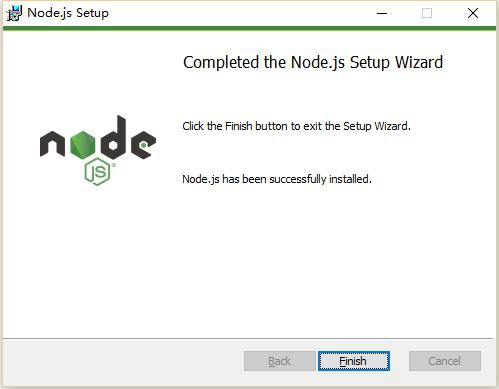
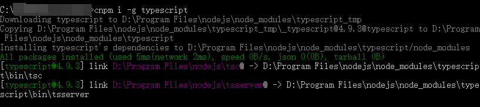

# Set up a development environment

> Author: Charley

Before getting familiar with the development environment, developers are asked to prepare the relevant tool environment~

## 1. Download and install LayaAir IDE

The engine is integrated into the IDE, just download the IDE directly.

Download address: https://layaair.com/#/engineDownload


## 2. Build TS development environment

LayaAir 3.0 only supports TypeScript language development, so the TypeScript installation environment still needs to be prepared.

### 2.1 Download and install Node.js

#### 2.1.1 Check whether the node.js environment has been installed

Developing using TypeScript requires the Node.js environment. If you have not installed it, please go to the official download (LTS version recommended).

Before installation, if you are not sure whether there is a ready-made environment, you can first confirm whether the node environment has been installed, open the command line tool (cmd for windows), and enter the command `npm -h`

```typescript
npm -h
```

After pressing the Enter key, if you can see the npm command description, version number, installation path and other information, as shown in Figure 1-1 (similar information is enough), it means that it has been installed. If it does not affect use, You can skip the steps of downloading and installing the node environment.


(Picture 1-1)

#### 2.1.2 Download and install Node.js official website

If there is no installation environment, you can go directly to the node official website to download and install. The LTS version is recommended, as shown in Figure 1-2. The URL address is: https://nodejs.org/en/


(Figure 1-2)

Figure 1-2 is for reference only. Just open the link to download the LTS version directly.

> Note: The default link opens window (x64). For non-64-bit computers, you can click Other Downloads and download the corresponding version.

After the download is completed, find the Node.js installation package you just downloaded and install it step by step. When the installation is complete, the interface is as shown in Figure 1-3.


(Figure 1-3)

After the installation is completed, you can check the installation status by entering `npm -h` on the command line as described in Section 2.1.

### 2.2 Install TSC

After the Node environment is fine, you can use npm to install the TypeScript compilation environment.

#### 2.2.1 Command line installation typescript

Directly enter the command "`npm install -g typescript`" in the command line tool and press the Enter key, as shown in Figure 2-1, to start downloading and installing the TypeScript environment. At this time, be sure to keep the network open. .

```
npm install -g typescript
```


(Figure 2-1)

If developers encounter the situation in Figure 2-2 during installation, it is usually caused by cache conflicts. (If you haven’t encountered it, skip this step.)


(Figure 2-2)

At this time, you can use the cache cleaning command `npm cache clean --force`, press Enter to execute the command, and re-enter the installation instructions.

```
npm cache clean --force
```

> [!Tip|label:Tips]
>
> If there is no circumvention, npm installation may not go smoothly. At this time, it is recommended to execute `npm cache clean --force` to clear the npm cache.
>
> Then use cnpm to install.

When we see the words "`All packages installed`", we can confirm that the installation of the TypeScript environment is completed, as shown in Figure 2-3, just close the command line tool.


(Figure 2-3)

The tsc directory in Figure 3-1 is the installation directory of our TypeScript compilation environment. With this, LayaAirIDE can compile TypeScript into JavaScript through this Compiler.

#### 2.2.2 Check TypeScript compilation environment version

Enter the "tsc -v" command on the command line to view the current TypeScript compiled version, as shown in Figure 2-4.

```
tsc -v
```


(Figure 2-4)

If the version number is displayed, TypeScript Compiler (tsc) is installed successfully.

## 3. Install browser

It is recommended to use a browser with a Chromium core as the LayaAir running and debugging environment, such as the Edge browser that comes with Windows or Google's chrome browser.

Chrome official website download address:

https://www.google.cn/intl/zh-CN/chrome/


## 4. Download and install VSCode

VSCode is a widely used coding tool and is also the coding tool recommended by LayaAir engine.

VSCode official website download address:

https://code.visualstudio.com/Download


