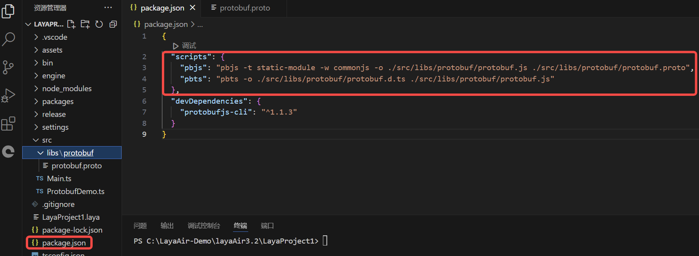
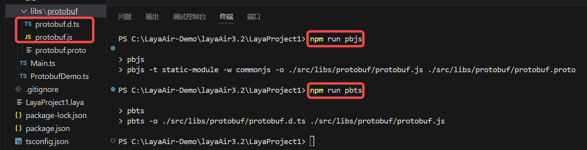
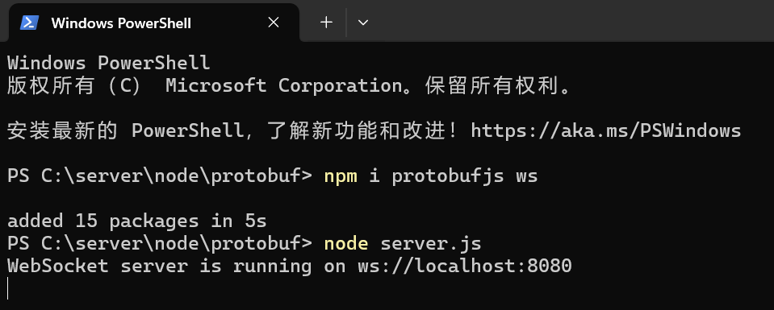
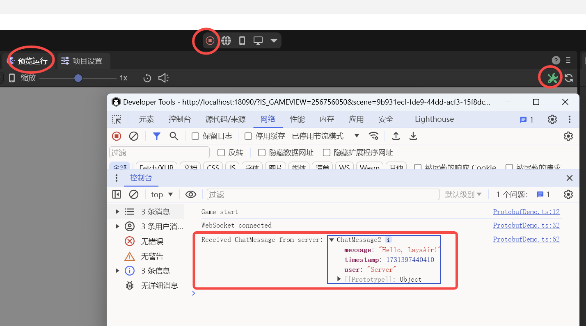

# ProtocolBuffer Communication

> Author: Charley

Protocol Buffers (referred to as Protobuf) is an efficient, flexible, and lightweight data serialization format developed by Google.

It is mainly used for the serialization and deserialization of structured data. In data transmission and storage scenarios, Protobuf can convert complex data structures (such as objects containing multiple data types, such as integers, strings, nested objects, arrays, etc.) into a compact binary format, greatly reducing the volume of data. This can reduce bandwidth usage and improve transmission speed for network transmission. Moreover, when deserializing the serialized binary data, the original data structure and data values can be accurately restored.

Compared with other data serialization formats (such as XML and JSON), Protobuf has higher performance. Its binary format enables faster parsing, and because the defined message structure is strongly typed, the message format can be checked during the compilation stage, reducing runtime errors. In addition, the structure of the message can be clearly defined through the `.proto` file, including the fields in the message, the field types, whether it is a required field, and other information. This definition method facilitates team collaboration development and is easy to maintain and update the definition of the data structure.

## 1. Preparation Work for Protobuf

### 1.1 Install `protobufjs-cli`

First, open a command line at random and install protobufjs-cli via npm to generate static code, etc.

```sh
npm install protobufjs-cli --save-dev
```

 

(Figure 1-1)

> If you don't have an npm environment, please install Node.js first before continuing to read.

### 1.2 Write `.proto` File

The `.proto` file is used to define the data structure and message format, and it is the core of Protobuf. Both the client and the server communicate based on this file protocol. In the `chat.proto` file, developers need to define the structure of the message, the type of the field, the field name, the field number, etc.

We create an empty `protobuf.proto` file in the `project root directory\src\libs\protobuf\` directory, then open it with an editor and write the following sample code:

```protobuf
syntax = "proto3"; // Specify the use of Protobuf 3 syntax

// Define a ChatMessage message
message ChatMessage {
  string user = 1;     // User name, field number is 1
  string message = 2;  // Message content, field number is 2
  int64 timestamp = 3; // Message timestamp, field number is 3
}
```

**The role of each part**:

1. **`syntax = "proto3";`**: Specify the use of Protobuf 3 syntax. `proto3` is the latest version of Protobuf at the time of writing this article, with simplified syntax and wider support.
2. **`message`**: Defines a message structure. Each message is a data structure containing multiple fields.
3. **`string`, `int32`, `int64`**, etc.: Specify the type of the field. Protobuf supports multiple data types, such as strings, integers, floating-point numbers, etc.

> For more about the use of `.proto`, please search for related tutorials on Baidu by yourself. This document only serves as a guide for the basic process.

### 1.3 Generate `.js` and `.d.ts` Files

The `.js` and `.d.ts` files generated through the `protobufjs-cli` tool are generated on demand based on the `.proto` file and only contain the message types and fields defined in the project's `.proto` file, rather than the entire content of the `protobufjs` library. Therefore, compared to the official full js library, the files generated on demand are usually lighter. Therefore, only the usage process of this method is introduced in this article.

#### 1.3.1 Configure Tool Instructions

The `protobufjs-cli` tool has two instructions, `pbjs` and `pbts`, which are used to generate JavaScript library files `.js` and TypeScript declaration files `.d.ts` respectively. Due to the large number of instruction parameters, they are usually configured in the project, and you can directly call the shortcut instructions.

The sample code is as follows:

```json
"scripts": {
    "pbjs": "pbjs -t static-module -w commonjs -o./src/libs/protobuf/protobuf.js./src/libs/protobuf/protobuf.proto",
    "pbts": "pbts -o./src/libs/protobuf/protobuf.d.ts./src/libs/protobuf/protobuf.js"
  },
```

The effect is shown in Figure 1-2:

 

**The role of the `pbjs` instruction parameters**:

Compile the `.proto` file into a JavaScript file. The generated `.js` file contains the definitions and serialization methods of all message types and is suitable for direct use in the project.

1. **`-t static-module`**

   - `-t`: Specify the target type of the generated code, that is, the format of the target code.
   - `static-module`: Indicates generating "static module" code, which directly converts the content of the `.proto` file into a JavaScript module instead of generating a dynamic message class.
     Using `static-module` can directly use the generated code without the `protobufjs` library. For cases with fewer files or clear modularization requirements, this method is more efficient.

2. **`-w commonjs`**

   - `-w`: Specify the code style of the generated module.
   - `commonjs`: Indicates generating code that conforms to the CommonJS specification and is suitable for projects that use `require` for import.

3. **`-o./src/libs/protobuf/protobuf.js`**

   - `-o`: Specify the output file path.
   - `./src/libs/protobuf/protobuf.js`: This is the path of the compiled JavaScript file.
     After running the `pbjs` command, all the content of the `.proto` file will be compiled into this `protobuf.js` file.

4. **`./src/libs/protobuf/protobuf.proto`**

   This is the path of the `.proto` file that needs to be compiled. This file contains the message format and structure we defined earlier.

**The role of the `pbts` instruction parameters**:

Generate a TypeScript type declaration file based on the generated `.js` file. The `.d.ts` file contains the corresponding type definitions, enabling complete type support for TypeScript projects.

1. **`-o./src/libs/protobuf/protobuf.d.ts`**

   - `-o`: Specify the output file path.
   - `./src/libs/protobuf/protobuf.d.ts`: This is the path of the generated `.d.ts` file, which contains all the generated type definitions.
     This file will define all message types, fields, and methods for obtaining type hints and compilation checks in TypeScript projects.

2. **`./src/libs/protobuf/protobuf.js`**

   This is the path of the `protobuf.js` file generated by the previous command. `pbts` will read the content of this file to generate the corresponding `.d.ts` file. The `.d.ts` file contains the TypeScript types corresponding to the structure defined in the `.proto` file, making it convenient for direct use in TypeScript projects.

#### 1.3.2 Generate Files

Since the `pbts` instruction depends on the `protobuf.js` generated by the `pbjs` instruction, we first execute the instruction of `pbjs`,

```shell
npm run pbjs
```

Then execute the instruction of pbts.

```shell
npm run pbts
```

After executing the two instructions twice, you can see that the two files `protobuf.js` and `protobuf.d.ts` are generated in the specified output path, as shown in Figure 1-3

 

(Figure 1-3)

## 2. Encoding and Using Protobuf

### 2.1 Create Script and Import Protobuf

After generating `protobuf.js` and `protobuf.d.ts`, we can directly use them in the ts project.

First, we add an empty script to the scene and name it `ProtobufDemo`, as shown in Figure 2-1.

 

(Figure 2-1)

> If you don't know how to create a script, please read the relevant basic documents of the official first.

Then, based on the current script path, you can directly import the generated protobuf module. As shown in the following code:

```typescript
// src/ProtobufDemo.ts
// Import the generated protobuf module, the path is relative to the current file
import * as protobuf from "./libs/protobuf/protobuf";
const { regClass } = Laya;
@regClass()
export class ProtobufDemo extends Laya.Script {
    onEnable() {
        console.log("Game start");
   }
}
```

### 2.2 Protobuf Sample Script

After importing the protobuf module, it can be directly used in the project. Here we wrote a simple sample DEMO. The complete code is as follows:

```typescript
// src/ProtobufDemo.ts
// Import the generated protobuf module, the path is relative to the current file
import * as protobuf from "./libs/protobuf/protobuf";
const { regClass } = Laya;

@regClass()
export class ProtobufDemo extends Laya.Script {
    private ChatMessage: any;
    private socket: WebSocket | null = null;

    onStart() {
        console.log("Game start");
        // Initialize protobuf
        this.initializeProtobuf();
    
        // Initialize WebSocket connection
        this.initializeWebSocket();
    }
    
    // Initialize protobuf and load message definitions
    private initializeProtobuf() {
        // ChatMessage is the message type defined in the.proto file, containing fields user, message, and timestamp, used to represent the user name, message content, and timestamp respectively.
        this.ChatMessage = protobuf.ChatMessage;
    }
    
    // Initialize WebSocket and handle messages
    private initializeWebSocket() {
        this.socket = new WebSocket("ws://localhost:8080");
        this.socket.binaryType = "arraybuffer";
        // When the connection is successful, send a test message
        this.socket.onopen = () => {
            console.log("WebSocket connected");
    
            // Send a greeting message of the ChatMessage type. The user field represents the user name of the message sender. The message field contains the message content. The timestamp is the current timestamp.
            const greetingMessage = { user: "LayaAir", message: "Hello, Server!", timestamp: Date.now() };
            // Call the encode method to encode the greetingMessage object into binary format (serialization), and return a Uint8Array type binary buffer through.finish().
            const greetingBuffer = this.ChatMessage.encode(greetingMessage).finish();
            // When the socket is not null or undefined, send the binary data greetingBuffer to the server via WebSocket.
            this.socket?.send(greetingBuffer);
        };
    
        // Receive the message returned by the server
        this.socket.onmessage = (event) => {
            // Convert event.data to Uint8Array type for processing by the decoding function handleServerResponse.
            const buffer = new Uint8Array(event.data);
            this.handleServerResponse(buffer);
        };
    
        // Handle connection close
        this.socket.onclose = () => {
            console.log("WebSocket closed");
        };
    
        // Handle connection error
        this.socket.onerror = (error) => {
            console.error("WebSocket error:", error);
        };
    }
    private handleServerResponse(buffer: Uint8Array) {
        // Try to decode as ChatMessage. Use the decode method to deserialize the received Uint8Array data buffer into a JavaScript object of the ChatMessage type.
        const chatMessage = this.ChatMessage.decode(buffer);
        console.log("Received ChatMessage from server:", chatMessage);
    }
}
```

Detailed comments have been added to the code, and no detailed analysis will be given here.

## 3. Testing Protobuf Communication

### 3.1 Build a Simple Server Environment

Protobuf communication naturally cannot be separated from the server side. So we first build a simple server based on node.

First, we find a directory at random, use npm to install the WebSocket server module `ws` for sending and receiving binary data and other basic two-way communication, and install the Protobuf module `protobufjs` to ensure that both sides can correctly parse the message.

```sh
npm install protobufjs ws
```

After executing the installation command, we can see that the `protobufjs` and `ws` modules have been successfully installed in the newly created `node_modules` directory, as shown in Figure 3-1.

  

(Figure 3-1)

### 3.2 Establish `.proto` File

On the server side, create a `.proto` file that is the same as the client side so that the server can also parse and generate Protobuf formatted data. We can directly copy the `protobuf.proto` file from the client side to the server project. Ensure the consistency of this file with the client definition so that both sides can communicate using the same structure.

The sample directory structure is shown in Figure 3-2.

 

(Figure 3-2)

### 3.3 Write Server Code

Next, create a simple WebSocket server, use the `ws` module to handle connection requests, and use `protobufjs` to load and handle the definitions in the `.proto` file to decode and respond to the received data.

**Example `server.js` file**:

```javascript
//C:\server\node\protobuf\server.js
const WebSocket = require("ws");
const protobuf = require("protobufjs");

// Load the.proto file, consistent with the client side
protobuf.load("./protobuf.proto", (err, root) => {
    if (err) throw err;

    // Get the message type
    const ChatMessage = root.lookupType("ChatMessage");
    
    // Create a WebSocket server and define port 8080, which needs to be consistent with the port requested by the client
    const wss = new WebSocket.Server({ port: 8080 });
    
    wss.on("connection", (ws) => {
        console.log("Client connected");
    
        // Listen for messages
        ws.on("message", (data) => {
    
            // Decode (deserialize) the received binary data buffer into a ChatMessage object
            const receivedMessage = ChatMessage.decode(new Uint8Array(data));
            console.log("Received ChatMessage from client:", receivedMessage);
    
            // Reply with a greeting message
            const responseMessage = { user: "Server", message: `Hello, ${receivedMessage.user}!`, timestamp: Date.now() };
            const responseBuffer = ChatMessage.encode(responseMessage).finish();
            ws.send(responseBuffer);
        });
    
        // Listen for the close event
        ws.on("close", () => {
            console.log("Client disconnected");
        });
    });
    
    console.log("WebSocket server is running on ws://localhost:8080");
});
```

### 3.4 Execute the Test Code

After completing the code writing, we start the server-side code in the server directory using node in the command line,

```sh
node server.js
```

The running effect is shown in Figure 3-3.

 

(Figure 3-3) 

Since the script of the client is created based on the scene in the previous text, we can also directly run the scene. In the `Preview Run` interface, we open the `Developer Tools` console and can see that the client successfully connects to the server and also receives the message returned from the server. As shown in Figure 3-4.

  

(Figure 3-4)

We switch back to the command line interface of the server side and can also see the print information of the message from the client, as shown in Figure 3-5.

 

(Figure 3-5)

So far, a complete process based on Protobuf communication within the LayaAir3 project has been verified and passed.