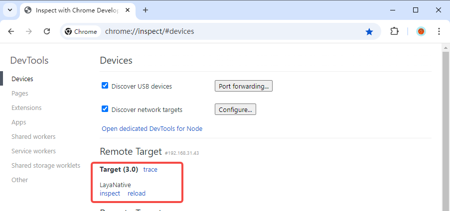
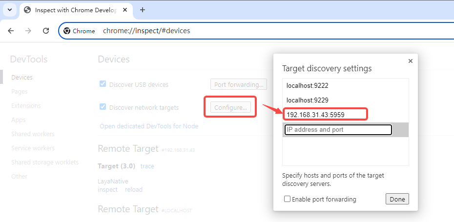
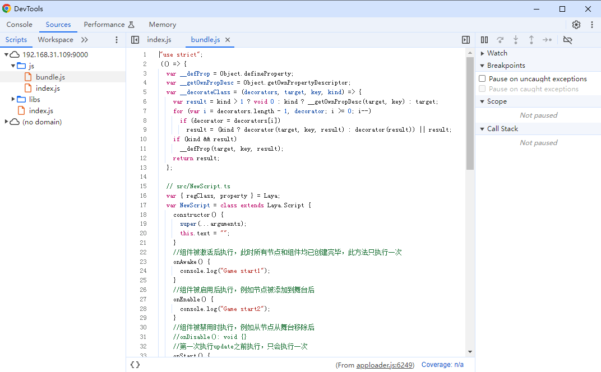

# Debugging JavaScript Code on the Android Real Machine

## 1. Debugging Principle

The code published by LayaAir-IDE will eventually be compiled into JS. The debugging of JavaScript code is carried out using the Chrome browser on the debugging machine. When LayaNative on the Android test machine starts, a WebSocket server will also be started simultaneously. The Chrome browser connects and communicates with LayaNative through WebSocket, thereby enabling the debugging of the project's JavaScript using Chrome.

When debugging the JavaScript code in the project, there are two debugging modes to choose from:

(1) Debug/Normal mode

In this mode, the project on the Android test machine can be directly started and run, and the Chrome browser can connect for debugging after the project is running.

(2) Debug/Wait mode

In this mode, after the project on the Android test machine is started, it will wait for the connection of the Chrome browser. The JavaScript script will continue to execute only when the Chrome connection is successful. When it is necessary to debug the JavaScript script loaded at startup, please give priority to this mode.

**Note: Please ensure that the debugging machine and the Android test machine are in the same local area network during the debugging process.**

## 2. Debugging the Android Project Built by LayaAir-IDE

### Step 1: Build the Project

Use LayaAir-IDE to build the project and generate the Android project.

> Refer to [Android/iOS Construction](../build_Tool/readme.md).

### Step 2: Modify the Debugging Mode

Open the built project using Android Studio.

Open `android_studio/app/src/main/assets/config.ini` and modify the value of `JSDebugMode` to set the required debugging mode. As shown in Figure 2-1,

(Figure 2-1)

The values and meanings of JSDebugMode are as follows:

| Value |             Meaning             |
| :---: | :-----------------------------: |
|   0   | Turn off the debugging function |
|   1   |        Debug/Normal mode        |
|   2   |         Debug/Wait mode         |

> When the project is officially released, please set the value of JSDebugMode to 0, otherwise it will affect the performance during the project's runtime.

### Step 3: Compile and Run the Project

Compile the project using Android Studio.

- If the Debug/Normal mode is selected, wait for the Android test machine to successfully **start and run** the project.

(Figure 2-2)

- If the Debug/Wait mode is selected, wait for the Android test machine to successfully **start** the project.

(Figure 2-3)

### Step 4: Use Chrome to Connect to the Project

Open the Chrome browser on the debugging machine and enter the website `chrome://inspect/#devices`, and you can see LayaNative, indicating a successful connection.

(Figure 2-4)

It should be noted that in `Configure`, the device address needs to be configured. The address 192.168.31.43 in Figure 2-5 is the IP of the test machine, and the port number 5959 is the JSDebugPort value in the config.ini file (Figure 2-1).

(Figure 2-5)

### Step 5: Debug

After clicking `inspect` in Figure 2-4, you can use Chrome to debug the JavaScript in the project. As shown in Figure 2-6,

(Figure 2-6)