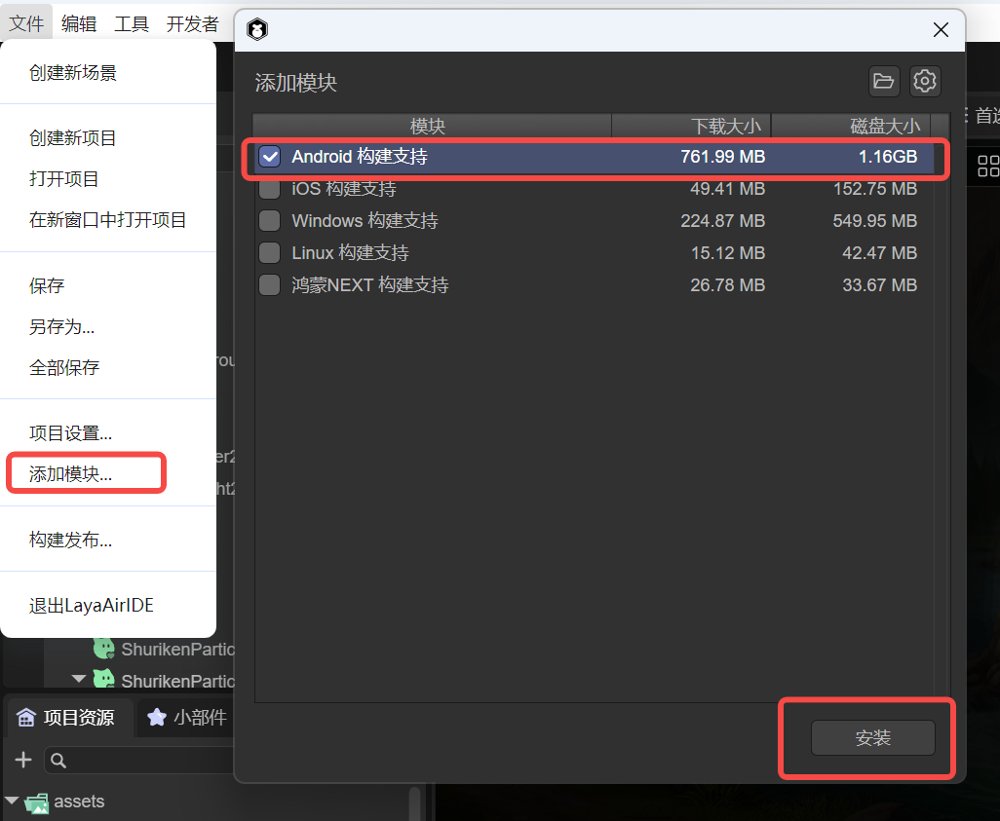
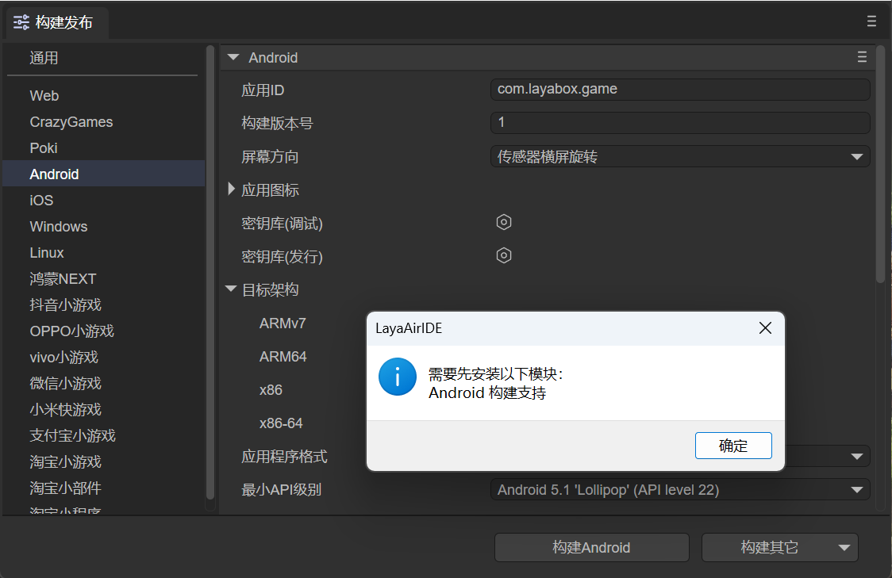
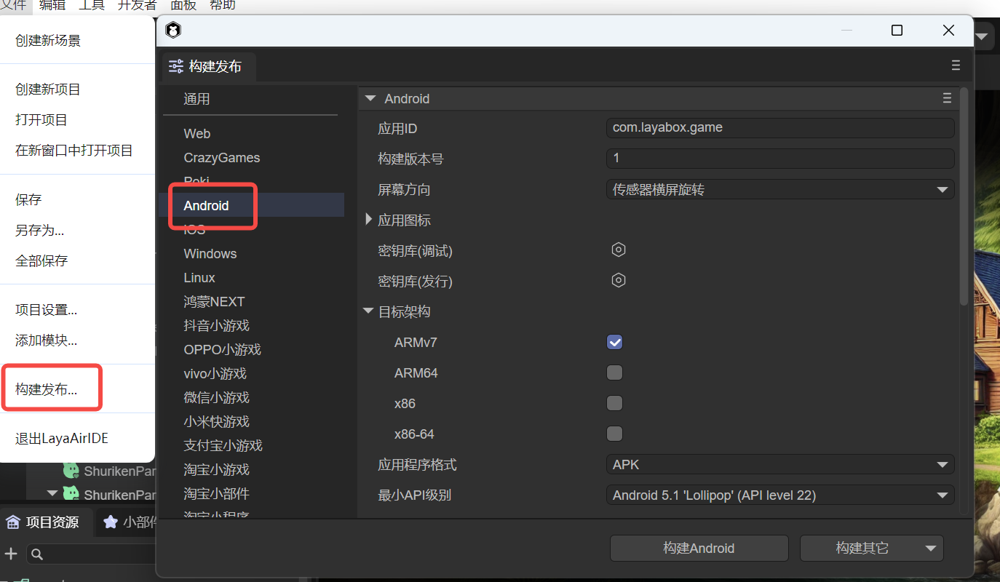
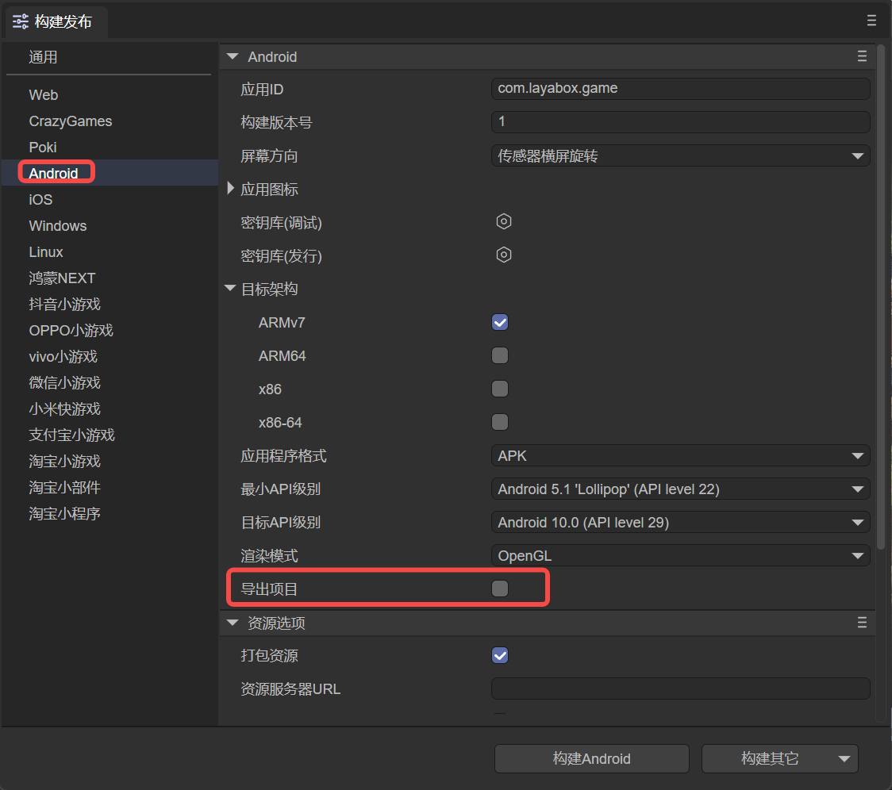
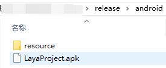

# Android apk Publishing

Starting from LayaAir 3.2 version, LayaAir Native also supports automatic packaging. Novices can publish apk with one click, which is very easy to use.

For experienced developers, we also retain the solution of building as a native package project, allowing developers to freely integrate third-party SDKs and extensions.

## 1. Installing the Build and Publishing Environment

Before building and publishing for Android, we need to first add the Android publishing environment module. As shown in Figure 1-1, click the "Add Module" option under the "File" menu,

  

(Figure 1-1)

If we don't add the publishing environment first, when clicking to build for Android, a prompt to install the module will also pop up, as shown in Figure 1-2.

 

(Figure 1-2)

If a prompt pops up, click OK to automatically jump to the installation interface. Click Install, and the environment required for Android building will be automatically downloaded and installed.

Since the library files required by the building tool are relatively large, they are not directly included in LayaAirIDE. When using this tool for the first time, the corresponding support module will be downloaded first.

> The file is large, so please be patient when downloading.

## 2. Build and Publish

In the "File" menu, open the "Build and Publish" option and select the "Android" platform tab, as shown in Figure 2-1,

  

(Figure 2-1)

First, let's understand the functions of each common configuration.

### 2.1 Application ID

The package name of the application, which is normally not visible. Generally, the reverse domain naming rule is adopted (conducive to distinguishing and avoiding conflicts with existing APPs in the system).

For example: com.layabox.runtime.demo

The package name must be in the format of xxx.yyy.zzz and have at least two levels, that is, xxx.yyy. Otherwise, the packaging will fail.  

### 2.2 Build Version Number

The version of the Native project, defined by the developer for identification purposes.

### 2.3 Package Resources

Whether to package the resources exported for the current platform (the resource directory) into the native project. The packaged resources will be placed in a specific directory for subsequent generation of Apps for different platforms.

If you want to provide a standalone version, you must select to package resources, that is, check "Package Resources" and leave the "Resource Server URL" empty. Packaging the resources directly into the App package can avoid network download and speed up the resource loading speed.

> The disadvantage of packaging resources is that it will increase the size of the package.
>
> If you want to publish an online game that checks "Package Resources", you must make DCC on the server side; otherwise, you will lose the advantage of packaging.

### 2.4 Obfuscate Resources

If checked, when packaging resources, they will be randomly obfuscated. The main purpose is to avoid certain sensitive functions being scanned by the platform when listed.

### 2.5 Resource Server URL

Just fill in the server address. Note to add index.js after the address.

For example: http://192.168.31.109:8000/index.js

### 2.6 Hot Update (DCC)

After enabling DCC, resources can be packaged or not.

> Refer to [DCC Documentation](../native/LayaDcc_Tool/readme.md).

### 2.7 Screen Orientation

> Refer to [Horizontal and Vertical Screen Settings](../native/screen_orientation/readme.md).

### 2.8 Application Icon

You can set the icon of the APP.

### 2.9 Keystore

It is divided into debug version and release version, used to generate digital signatures for the application. The signature proves the author identity of the application and ensures that the application content has not been tampered with.

### 2.10 Target Architecture (CPU)

ARMv7: The 32-bit version of the ARM processor. Covers most old devices and some mid-to-low-end devices.

ARM64: Also known as AArch64 or ARMv8, it is the 64-bit version of the ARM processor. Covers most modern mid-to-high-end devices.

x86: 32-bit processor architecture based on Intel. Mainly used in some older Intel processor Android devices and is relatively less used in Android devices.

x86-64: Also known as x64 or AMD64, it is the 64-bit version of the Intel processor. Used in newer Intel processor Android devices and is less used in Android devices.

### 2.11 Application Format

You can choose APK or AAB format.

### 2.12 Minimum API Level

Specifies the minimum Android version (API level) required for the application to run. The system version of the device must be equal to or higher than this value to install and run the application.

### 2.13 Target API Level

Specifies the target Android version (API level) for which the application is designed and tested. It tells the system that the application has been optimized for this version but can still run on higher versions of the system.

### 2.14 Rendering Mode

There are two rendering modes: OpenGL and WebGL. Generally, OpenGL is selected by default.

### 2.15 Export Project

If checked, the built and published project will not be automatically packaged into an apk package but will be published as a native package Android Studio project.

### 2.16 Texture Options

`Compress Textures`: Generally, it is necessary to check "Allow the use of compressed texture formats". If not checked, all settings for texture compression formats for images will be ignored.

`Texture Source Files`: You can uncheck "Always include texture source files". If checked, even if the image uses a compressed format, the source file (png/jpg) will still be packaged. The purpose is to fallback to the source file when encountering a system that does not support the compressed format.

## 3. Direct Packaging as apk

By default, "Export Project" is not checked, as shown in Figure 3-1. At this time, an apk installation package will be directly generated. If checked, an Android Studio project will be exported. So let's focus on this.

 

(Figure 3-1)

### 3.1 Standalone Package

When the "Resource Server URL" of the "Resource Options" is empty, as shown in Figure 3-1, a standalone apk installation package will be directly produced, as shown in Figure 3-2,

 

(Figure 3-2)

At this time, the apk package can be directly installed on the mobile phone. However, such a pure standalone application cannot implement dynamic resource updates. When the resources change, the APP must be updated.

### 3.2 Online Package

If it is an online package, you need to fill in the "Resource Server URL", and you can uncheck "Package Resources" after filling in. After publishing, the resource directory needs to be placed on the server, and the address is the url filled in during publishing. In this way, the published application will load resources from the server.

If the "Resource Server URL" is filled in and "Package Resources" is checked, the final published one is an online package with resources. The apk itself contains resources, but compared to a pure standalone application, it can update resources through DCC.

## 4. Building the Android Studio Project

Building the Android Studio project is more flexible and extensible for experienced developers. At this time, Android studio needs to be prepared, and the Android system version needs to be ≥ 4.3.

### 4.1 Use of the Built Project Engineering

When building and publishing, if "Export Project" is checked, the built Android studio project will be exported and can be opened with the corresponding development tool for secondary development, packaging and other operations.

The threshold of the Android Studio project is relatively high. If you are a novice and do not have relevant knowledge, please first learn and understand the basic development knowledge of the relevant Android studio.

Here is a simple **reference material**:

["The Use and Configuration of Android Studio"](https://github.com/layabox/layaair-doc/tree/master/Chinese/LayaNative/AndroidStudio_ConfigurationAndApplication)

### 4.2 Manually Switching between Standalone and Network Versions

After the build is completed, you can switch between the standalone and network versions by directly modifying the code in the project.

Open MainActivity.java in the built project and search for `mPlugin.game_plugin_set_option("localize","false");`  

For the standalone version, it needs to be set to "true", such as `mPlugin.game_plugin_set_option("localize","true");`  

If you want to set it to the network version, it needs to be modified to: `mPlugin.game_plugin_set_option("localize","false");`

And set the correct address: `mPlugin.game_plugin_set_option("gameUrl", "http://your_address/index.js");`

The opposite is also true.  

> Once the url address is modified, the originally packaged resources will all become invalid. At this time, you need to manually delete the contents in the cache directory and regenerate the packaged resources using layadcc. See [LayaDCC Tool](../native/LayaDcc_Tool/readme.md).

### 4.3 Resources

After building the project through the IDE,

- If the selected version is the standalone (package resources) version, all the resources of the h5 project (including: scripts, images, html, sounds, etc.) will be packaged in this directory:

`release\android\android_project\app\src\main\assets\cache`

- If it is an online version without packaging resources, the resources will use the resource directory under the publishing directory (release\resource).

## 5. Other Attention Issues

After the Android Studio build is completed, the version number of the Android SDK needs to be modified according to your own environment. The file that needs to be modified is app/build.gradle.