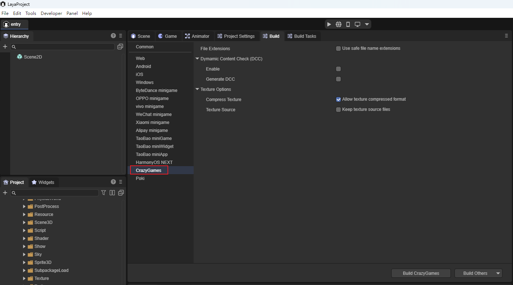
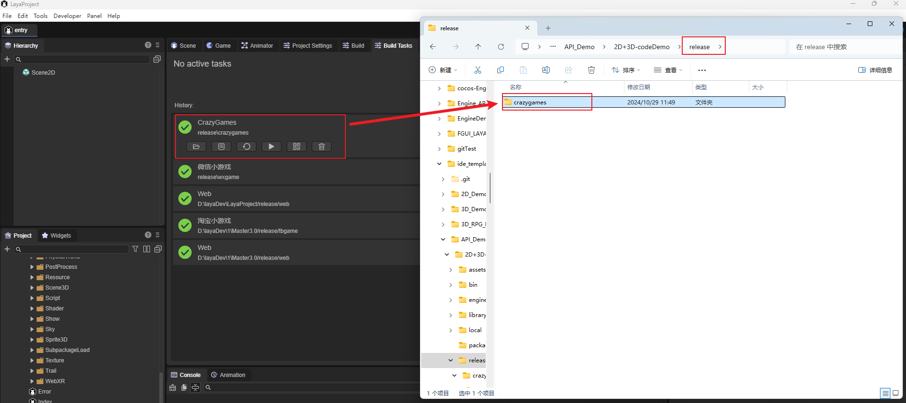
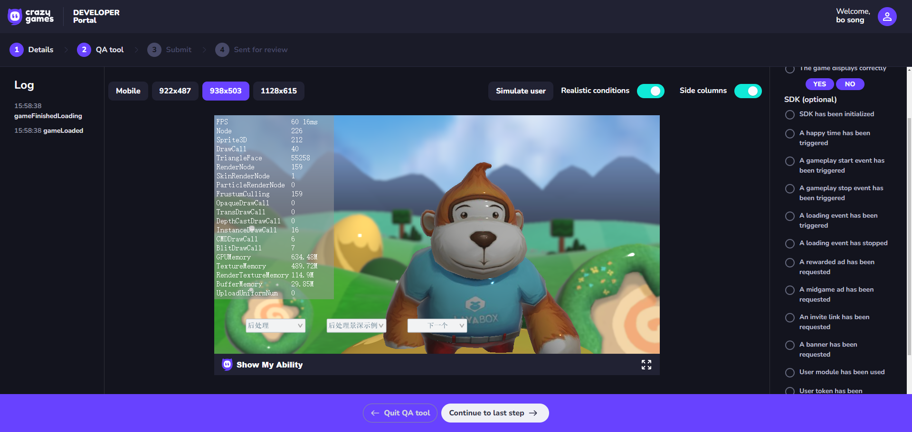

# CrazyGames

## 1. Build on LayaAir-IDE as CrazyGames

As shown in Figure 1-1, use LayaAir-IDE to build the project on the CrazyGames platform.

（Figure 1-1）

The configuration files such as `File Extension` and `Common` in the build interface can refer to [Web](../web/readme.md)and [General Setting](../generalSetting/readme.md)。

After build, a new crazygames folder will be added in the "project root directory/release/" to contain the content of the built project.

（Figure 1-2）

## 2. Enter the developer backend of CrazyGames

Click on this website to enter the backend（ https://developer.crazygames.com/games ）You can submit your own HTML5 type game here.

## 3. Publish the game and test it

You can upload the built projects to the CrazyGames platform.

（Figure 3-1）

（Figure 3-2）

After uploading the game, click "Save and continue" to enter QATool for testing, which simulates the real platform of CrazyGames.

## 4. The running status of the CrazyGames on the web

3D example of running API project in CrazyGames on the web:

（Figure 4-1）

2D example of running API project in CrazyGames on the web:

（Figure 4-2）

