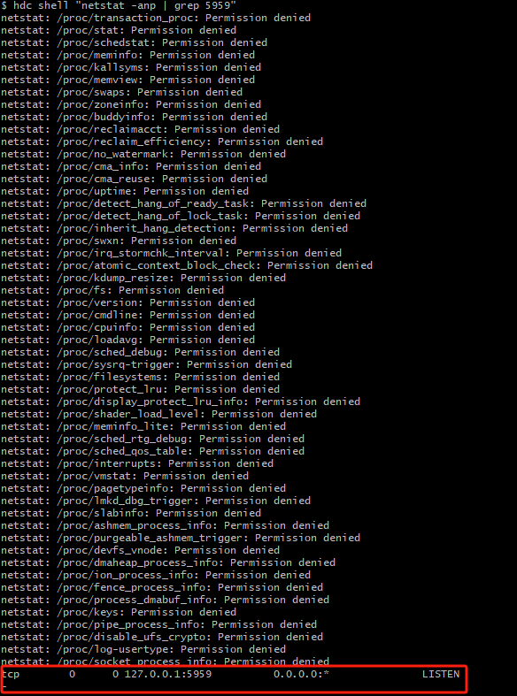
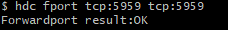
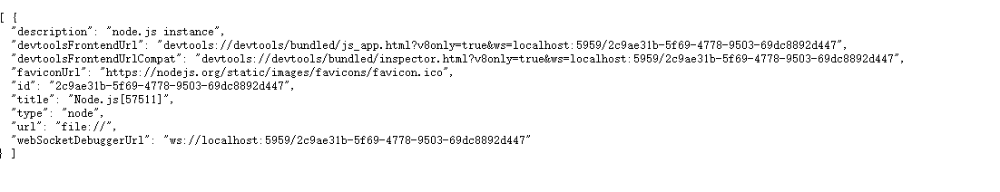

# Debugging JavaScript Code on the Real Machine of HarmonyOS NEXT

## 1. Debugging Principle

The code published by LayaAir-IDE will eventually be compiled into JS. The debugging of JavaScript code is carried out using the Chrome browser on the debugging machine. When LayaNative on the HarmonyOS NEXT test machine starts, a WebSocket server will also be started simultaneously. The Chrome browser connects and communicates with LayaNative through WebSocket, thereby enabling the debugging of the project's JavaScript using Chrome.

When debugging the JavaScript code in the project, there are two debugging modes to choose from:

(1) Debug/Normal mode

In this mode, the project on the HarmonyOS NEXT test machine can be directly started and run, and the Chrome browser can connect for debugging after the project is running.

(2) Debug/Wait mode

In this mode, after the project on the HarmonyOS NEXT test machine is started, it will wait for the connection of the Chrome browser. The JavaScript script will continue to execute only when the Chrome connection is successful. When it is necessary to debug the JavaScript script loaded at startup, please give priority to this mode.

**Note: Please ensure that the debugging machine and the HarmonyOS NEXT test machine are in the same local area network during the debugging process.**

## 2. Debugging the HarmonyOS NEXT Project Built by LayaAir-IDE

### Step 1: Build the Project

Use LayaAir-IDE to build the project and generate the HarmonyOS NEXT project.

> Refer to [HarmonyOS NEXT Construction](../readme.md).

### Step 2: Modify the Debugging Mode

Open the built project using DevEco Studio.

Open `ohos/entry/src/main/resources/rawfile/config.ini` and modify the value of `JSDebugMode` to set the required debugging mode. As shown in Figure 2-1,

(Figure 2-1)

The values and meanings of JSDebugMode are as follows:

| Value |             Meaning             |
| :---: | :-----------------------------: |
|   0   | Turn off the debugging function |
|   1   |        Debug/Normal mode        |
|   2   |         Debug/Wait mode         |

> When the project is officially released, please set the value of JSDebugMode to 0, otherwise it will affect the performance during the project's runtime.

### Step 3: Compile and Run the Project

Compile the project using DevEco Studio.

- If the Debug/Normal mode is selected, wait for the HarmonyOS NEXT test machine to successfully **start and run** the project.

(Figure 2-2)

- If the Debug/Wait mode is selected, wait for the HarmonyOS NEXT test machine to successfully **start** the project.

(Figure 2-3)

### Step 4: Check Whether the Port on the Terminal Side is Opened Successfully

hdc shell "netstat -anp | grep 5959". The result is that the status of the 5959 port is "LISTEN".

(Figure 2-4)

### Step 5: Forward the Port

hdc fport tcp:5959 tcp:5959. Forward the port 5959 on the PC side to the port 5959 on the terminal side. The result is "Forwardport result:OK".

(Figure 2-5)

### Step 6: Use Chrome to Connect to the Project
Enter "localhost:5959/json" in the address bar of the Chrome browser and press Enter to obtain the port connection information.

(Figure 2-6)

### Step 7: Debug
Copy the url content of the "devtoolsFrontendUrl" field to the address bar and press Enter to enter the DevTools source code page. You will see the JS source code executed in the application, and it will pause at the first line of the JS source code at this time.
Users can set breakpoints in the source code page, issue various debugging commands through buttons to control the execution of the JS code, and view variables.

(Figure 2-7)