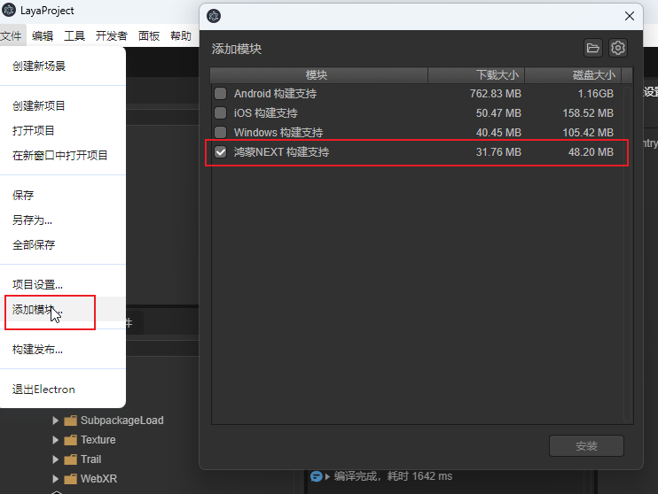
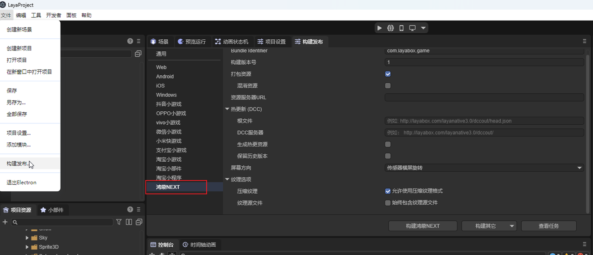
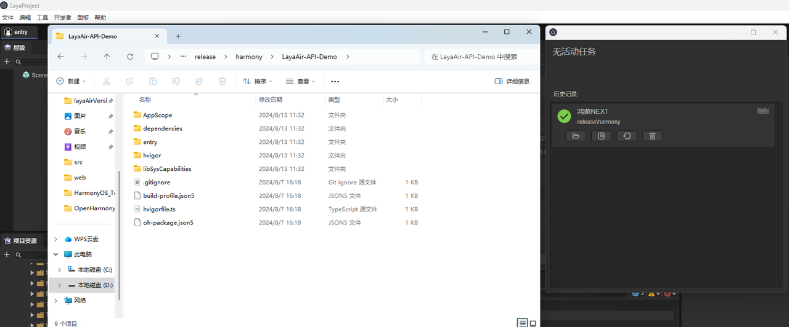
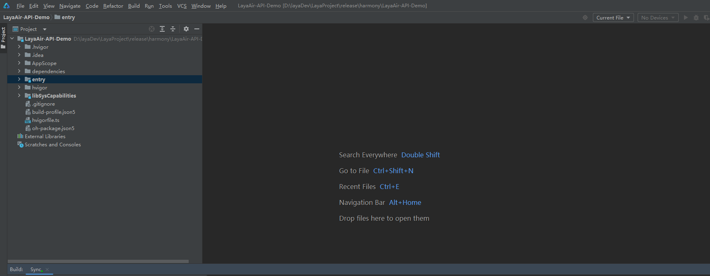

# Building the HarmonyOS NEXT Project

Since the LayaAir 3.2.0 version, support for publishing HarmonyOS NEXT projects has been added.

## 1. Basic Development Environment

To build a HarmonyOS NEXT project, a well-prepared development environment is required. In building a HarmonyOS NEXT project, we need to prepare the HarmonyOS App development tool DevEco Studio. Besides, we also need to register a Huawei developer account and complete the certification.

Reference links:

[HUAWEI DevEco Studio](https://developer.huawei.com/consumer/cn/deveco-studio/)

[Huawei Developer Account](https://developer.huawei.com/consumer/cn/doc/start/introduction-0000001053446472)

## 2. Adding the HarmonyOS NEXT Build Module in LayaAir-IDE

Download LayaAir-IDE from [the official website](https://layaair.com/#/engineDownload) (requires LayaAirIDE 3.2.0beta3 version or above). Open LayaAirIDE -> File -> Add Module -> Check the HarmonyOS NEXT build support, click Install and wait for the module to be downloaded and decompressed, as shown in Figure 1:

 

(Figure 1)

## 3. Project Building

In LayaAirIDE -> File -> Build and Publish, open the Build and Publish window, select the publishing platform as the HarmonyOS NEXT platform, as shown in Figure 2:

 

(Figure 2)

Other parameters in the project building settings are the same as those of other platforms of LayaNative, and developers can publish directly.

Reference link: [IDE Building LayaNative Project](../native/build_Tool/readme.md)

## 4. Use of the Built HarmonyOS Project Engineering

The HarmonyOS NEXT project engineering built through the above app builder, as shown in Figure 3, needs to be opened using the HarmonyOS developer tool DevEco Studio for secondary development, packaging and other operations, as shown in Figure 4. Use the DevEco Studio tool to open and connect the device to build and run the App.

 

(Figure 3)

 

(Figure 4)