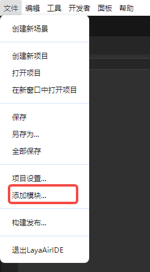
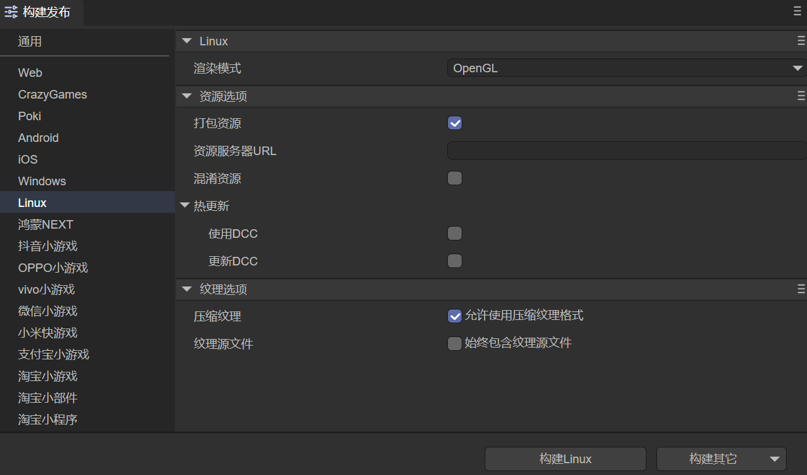

# Build Linux Project

Starting from the LayaAir 3.3 version, support for publishing Linux projects has been added.

## 1. Adapted Development Environment
Currently, the Linux project has passed tests under the following environment configuration:

- Ubuntu 22.04.5 LTS (GNU/Linux 6.8.0-49-generic x86_64)
- cmake version 3.22.1
- gcc version 11.4.0

**Note: Currently, only the x86_64 architecture is supported**

## 2. Installation of the Build and Release Environment

Before building and releasing Linux, we need to add the release environment module for Linux. As shown in Figure 2-1, click the "Add Module" option under the "File" menu,

 

(Figure 2-1)

When the module panel shown in Figure 2-2 pops up, select Linux build support and click Install.

 

(Figure 2-2)

If we don't add the module first, when clicking the "Build Linux" button, a prompt to install the module will also be displayed, as shown in Figure 2-3.

 

(Figure 2-3)

After clicking OK, the module installation interface shown in Figure 2-2 will be automatically opened.

## 3. Build Configuration Instructions

In the build and release panel, select Linux to configure the release settings for Linux, as shown in Figure 3-1:

 

(Figure 3-1)

The explanations of the configuration are as follows:

### 3.1 Rendering Mode

There are two rendering modes, OpenGL and WebGL. Generally, OpenGL is selected by default.

### 3.2 Packaging Resources

Whether to package the resources exported for the current platform (resource directory) into the native project. The packaged resources will be placed in a specific directory for subsequent generation of Apps for different platforms.

If you want to provide a stand-alone version, you must select to package resources, that is, check "Package Resources", and keep the "Resource Server URL" empty. Packaging resources directly into the App package can avoid network downloads and speed up the loading speed of resources.

> The disadvantage of packaging resources is that it will increase the size of the package.

> If you want to publish an online game with "Package Resources" checked, you must perform dcc on the server side; otherwise, the advantage of packaging will be lost.

### 3.3 Resource Server URL

Just fill in the server address, and be sure to add index.js after the address.

For example: http://192.168.31.109:8000/index.js

### 3.4 Obfuscate Resources

If checked, when packaging resources, resources will be randomly obfuscated, mainly to avoid certain sensitive functions from being scanned by the platform when uploading.

### 3.5 Hot Update (DCC)

After enabling DCC, resources can be packaged or not.

> Refer to [DCC Documentation](../native/LayaDcc_Tool/readme.md).

### 3.6 Texture Options

"Compressed Texture": Generally, it is necessary to check "Allow the use of compressed texture formats". If not checked, the settings for the compression format of all pictures will be ignored.

"Texture Source File": You can uncheck "Always include texture source files". If checked, even if the picture uses a compressed format, the source file (png/jpg) is still packaged. The purpose is to fallback to the source file when encountering a system that does not support the compression format.

## 4. Project Compilation

Enter the Linux project engineering directory built by the above app builder and execute the following command for compilation.

```bash
./build.sh
```
After executing the command, the executable file is written to the install_cmake/bin directory. The current test project name is LayaBox. As shown in the following figure, the generated executable file is LayaBox, and it can be run by clicking on the desktop environment. 

 

(Figure 4-1)