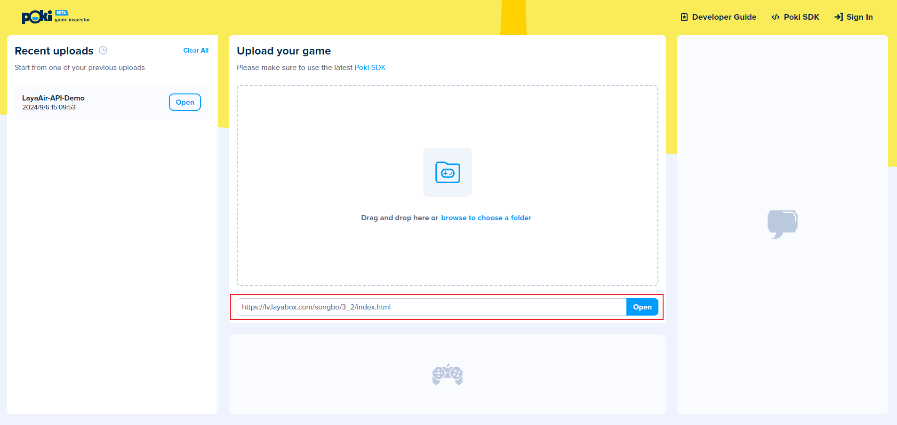
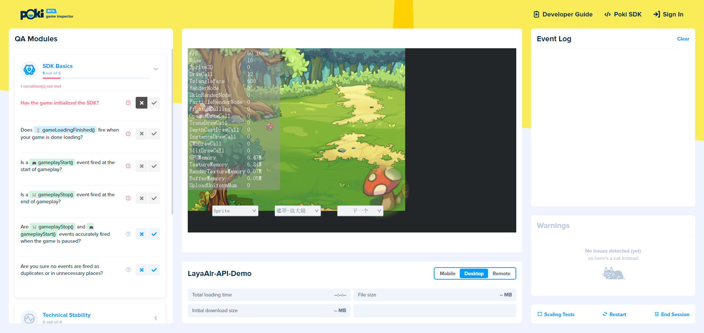

# Poki

## 1. Build as Poki in LayaAir-IDE

Build the project as a Poki platform in LayaAir-IDE,

（Figure 1-1）

The configuration files such as `File Extension` and `Common` in the publishing interface can refer to [Web](../web/readme.md)与[General Setting](../generalSetting/readme.md)。

After publishing, a Poki directory will be added to the "project root/release" directory, containing the project's building content.

（Figure 1-2）

## 2. Enter Poki's Inspector tool to upload and test

Enter Poki's Inspector tool: [Inspector](https://inspector.poki.dev/?)。

In Poki's Inspector backend, web projects can be uploaded and games can be run through URL addresses. Select the web URL hosted on the server here, as shown in Figure 2-1, and click 'open' to open it for testing.

（Figure 2-1）

## 3. Operation status of the Poki on the web

3D example of API project created by running IDE:

（Figure 3-1）

2D example of API project created by running IDE:

（Figure 3-2）

