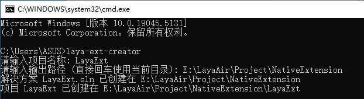
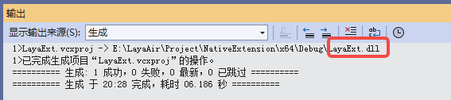
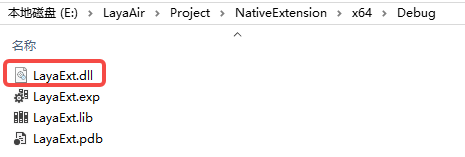
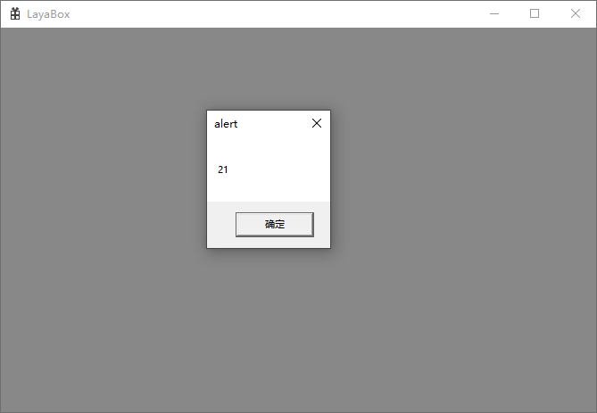

# Windows Extension

## 1. Introduction

LayaAir supports adding custom extensions. Users can use the extension tool provided by LayaNative to generate dynamic link libraries to provide extension functions for the project.

The main function of the extension is to export C++ functions or classes for calling in JavaScript. Because LayaNative has been restructured and encapsulated the V8 interface, users no longer need the source code of LayaNative when developing extensions. Instead, they can directly extend the JavaScript interface based on the header files and lib libraries provided in the extension tool, thereby extending the engine functions.

Due to the strict restrictions on dynamic link libraries on other platforms, especially iOS, the extension function of LayaNative is currently only available on the Windows platform.


## 2. Extension Tool

### 2.1 Installation

Generating a dynamic link library requires the use of the extension tool (laya-ext-creator) provided by LayaAir. Developers need to install it using the command line. Open the console and enter the command for installation:

```
npm install laya-ext-creator -g
```

After the installation is complete, then execute the command `laya-ext-creator` to create a LayaNative extension template project. Enter the project name and directory as required, as shown in Figure 2-1,



(Figure 2-1)

The created project is shown in Figure 2-2. Double-click the.sln to open the project (Visual Studio 2022 is required) and continue editing and compiling.


(Figure 2-2)

The created directory structure is as follows:

```
LayaExt
  ├── LayaExt.sln
  └── LayaExt/
       ├──layaRuntime/      Extension SDK
       |     ├── include/
       |     └── lib/
       |          └── x64
       |               └── conch.lib
       ├──dllmain.cpp
       ├──exports.cpp       Contains sample code
       ├──LayaExt.vcxproj
       └──framework.h

```


### 2.2 Generate Dynamic Link Library

After opening the project, click "Build Solution" in Figure 2-3,


(Figure 2-3)

The output of the console is shown in Figure 2-4 below,



(Figure 2-4)

Finally, the generated dynamic link library can be seen in the corresponding directory,



(Figure 2-5)


### 2.3 Introduction to Template Project

Developers can edit custom extension functions based on the template project created by the extension tool. This template project encapsulates several simple functions in exports.cpp for reference.

Integer parameter

```c
jsvm_value jsAdd(jsvm_env env, jsvm_callback_info info) {
    jsvm_status status;
    size_t argc = 2;
    jsvm_value args[2];
    jsvm_value _this;
    jsvm_get_cb_info(env, info, &argc, args, &_this, nullptr);

    int int1,int2;
    jsvm_get_value_int32(env, args[0], &int1);
    jsvm_get_value_int32(env, args[1], &int2);
    
    jsvm_value result;
    jsvm_create_int32(env, int1+int2, &result);
    return result;
}
```

String parameter

```c
jsvm_value jsStr(jsvm_env env, jsvm_callback_info info) {
    jsvm_status status;
    size_t argc = 1;
    jsvm_value args[1];
    jsvm_value _this;
    jsvm_get_cb_info(env, info, &argc, args, &_this, nullptr);

    char strBuff[1024];
    size_t strLen = 0;
    jsvm_get_value_string_utf8(env, args[0], strBuff, 1024, &strLen);
    std::string cstr;
    cstr.assign(strBuff, strLen);
    cstr += " C++ addition";
    
    jsvm_value retstr;
    jsvm_create_string_utf8(env, cstr.c_str(), cstr.length(), &retstr);
    return retstr;
}

```

ArrayBuffer parameter

```c
jsvm_value jsBin(jsvm_env env, jsvm_callback_info info) {
    jsvm_status status;
    size_t argc = 1;
    jsvm_value args[1];
    jsvm_value _this;
    jsvm_get_cb_info(env, info, &argc, args, &_this, nullptr);

    char* buff = nullptr;
    size_t byteLen = 0;
    jsvm_get_arraybuffer_info(env, args[0], (void**) & buff, &byteLen);
    buff[0] = 22;
    
    jsvm_value retLen;
    jsvm_create_int32(env, byteLen, &retLen);
    return retLen;
}
```

> More parameters can be referred to the header file.

In the `LayaExtInit` function, export the above functions so that the JavaScript code can call these native functions.

```c
extern "C" {
    LAYAEXTAPI void LayaExtInit(jsvm_env env, jsvm_value exp) {
        // Register new functions
        jsvm_value fn;
        jsvm_create_function(env, "testAdd", SIZE_MAX, jsAdd, nullptr, &fn);
        jsvm_set_named_property(env, exp, "nativeAdd", fn);

        jsvm_value fn1;
        jsvm_create_function(env, "testStr", SIZE_MAX, jsStr, nullptr, &fn1);
        jsvm_set_named_property(env, exp, "nativeStr", fn1);
    
        jsvm_value fn2;
        jsvm_create_function(env, "testBin", SIZE_MAX, jsBin, nullptr, &fn2);
        jsvm_set_named_property(env, exp, "nativeBin", fn2);
    
    }
}
```


## 3. Using DLL in LayaAir-IDE

After exporting the dynamic link library (.dll) using the extension tool, you can place the file in any directory of assets or src and check "Import as Plugin", as shown in Figure 3-1.


(Figure 3-1)

Then in the IDE, create a script file named `TestLib.ts` and add the following code:

```typescript
interface ITestLib {
    nativeAdd(a: number, b: number): number;
}

export const testLib: ITestLib = Laya.importNative("LayaExt.dll");
```

Then add the code in the component script `Main.ts`:

```typescript
import { testLib } from "./TestLib";
const { regClass, property } = Laya;

@regClass()
export class Main extends Laya.Script {

    onStart() {
        alert(testLib.nativeAdd(10, 11));
    }
}
```

Because the extension function of LayaNative only supports the Windows platform, only through Windows preview or publishing as a Windows project can the correct result be obtained. The running effect is shown in Figure 3-2,



(Figure 3-2)