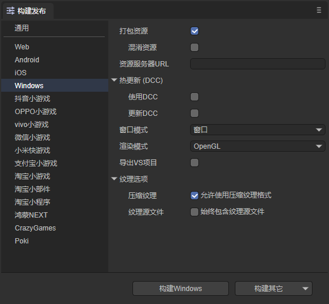
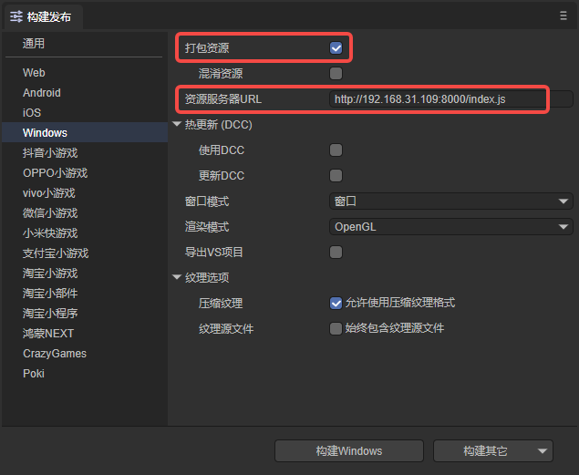
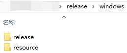
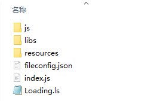
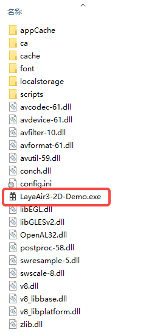
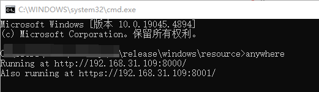
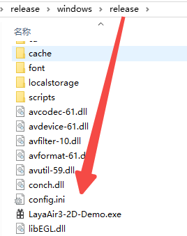
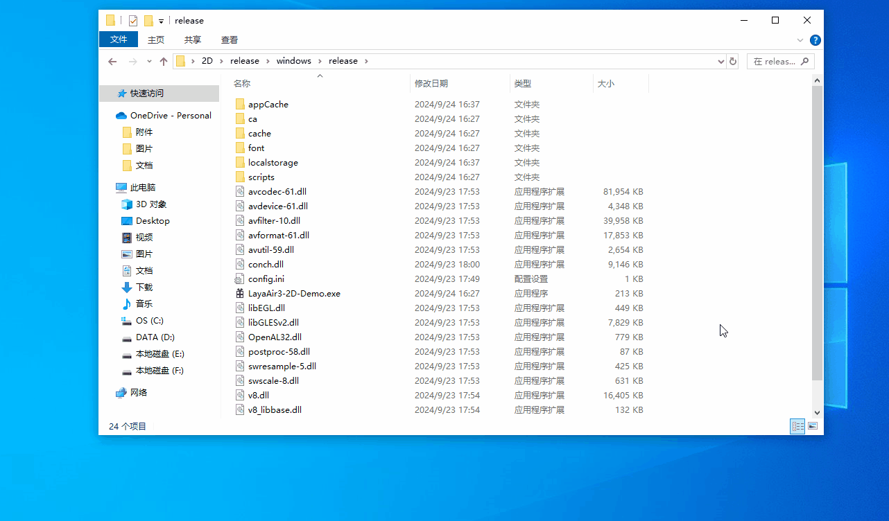

# Windows Publishing

## 1. Introduction

Starting from LayaAir 3.2 version, it is supported to build and publish LayaAir projects to the Windows platform.

The published project can be run directly by clicking the.exe executable file.

> Before publishing on Windows, it is necessary to perform [general](../../generalSetting/readme.md) settings. Note that do not check the option to enable subpackages.

## 2. Publishing as Windows

### 2.1 Select the Target Platform

In the build and publish panel, select Windows as the target platform on the sidebar. As shown in Figure 2-1,

 

(Figure 2-1)

Click "Build Windows" or "Windows" in "Build Others" to publish as a Windows project.

`Package Resources`: It is generally recommended to check. After checking, the resources of the project are packaged separately for storage on the server side.

`Obfuscate Resources`: If checked, when packaging resources, they will be randomly obfuscated. The main purpose is to avoid certain sensitive functions being scanned by the platform when listed.

`Resource Server URL`: Just fill in the server address. Note to add index.js after the address (as shown in Figure 2-2).

`Hot Update DCC`: Refer to the [DCC Documentation](../LayaDcc_Tool/readme.md).

`Rendering Mode`: There are two rendering modes: OpenGL and WebGL. Generally, OpenGL is selected by default.

`Export VS Project`: If checked, the published Windows project will not generate an.exe file. Developers need to compile and package it themselves using Visual Studio. This option is suitable for developers who have debugging needs after building and publishing.

`Compress Textures`: Generally, it is necessary to check "Allow the use of compressed texture formats". If not checked, all settings for texture compression formats for images will be ignored.

`Texture Source Files`: You can uncheck "Always include texture source files". If checked, even if the image uses a compressed format, the source file (png/jpg) will still be packaged. The purpose is to fallback to the source file when encountering a system that does not support the compressed format.

### 2.2 Introduction to the Mini-Game Directory After Publishing

Publish as shown in Figure 2-2, check Package Resources, and fill in the Resource Server URL,

 

(Figure 2-2)

The directory structure after publishing is shown in Figure 2-3,

 

(Figure 2-3)

Among them, the resource directory is the packaged resources, as shown in Figure 2-4. The js directory and libs directory are the project code and engine libraries. fileconfig.json is the project configuration file, and index.js is the entry file of the project.

 

(Figure 2-4)

The release directory is the project directory after publishing Windows. It can be seen that the.exe file has been automatically generated.

 

(Figure 2-5)

## 3. Running the Windows Project

First, transfer the resources to the server. Here, anywhere is used to simulate a local server, as shown in Figure 3-1,

 

(Figure 3-1)

Then, double-click the.exe file shown in Figure 3-2 to run the published Windows project.

 

(Figure 3-2)

The running effect is shown in the animation 3-3, 

 

(Animation 3-3)