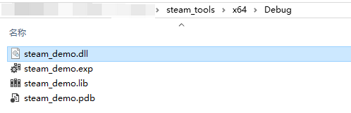
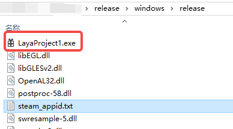
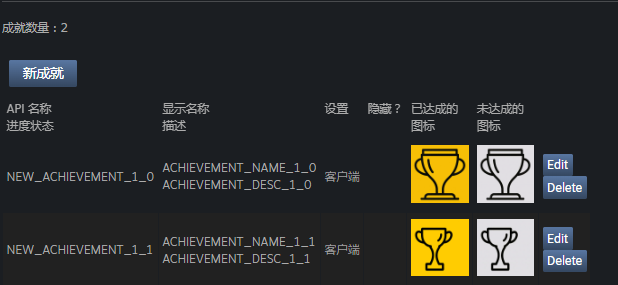
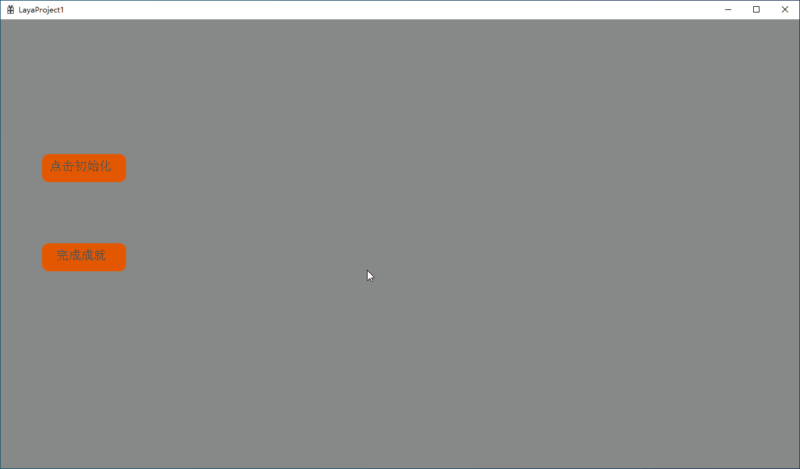

# Steam Extension Example

## 1. Overview

LayaAir supports adding custom Windows extensions. Users can integrate the extension functions provided by Steam officials into the games developed with LayaAir in the form of generating dynamic link libraries through the extension tool provided by LayaNative, so that these functions can be used after the game is listed on the Steam store.

To interface with the Steam extension functions, the [Steamworks API](https://partner.steamgames.com/doc/api) provided by Steam officials needs to be used. By accessing the basic system provided by this API, all the extension functions in Steam can be fully utilized, including pausing the game when the user opens the Steam overlay interface, inviting friends, allowing players to unlock Steam achievements, etc.

Before integrating the Steam extension, developers need to prepare the following:

- Read the [Windows Extension](../extension/readme.md) document. The integration of the Steam extension function requires the use of the LayaNative extension tool, and the installation steps are all in this document.
- Create a developer account in [SteamWorks](https://partner.steamgames.com/), fill in the information, make the payment and wait for the approval. After the account is approved, create an [application](https://partner.steamgames.com/doc/store/application) on the main panel to obtain the AppID of the application.
- Download the [Steamworks SDK](https://partner.steamgames.com/downloads/steamworks_sdk.zip) and unzip it. Copy the Steamworks API header folder `public/steam` to the LayaNative extension tool (the SDK version used in this article is steamworks_sdk_161).


## 2. Initialization

Before using the Steam extension functions, initialization must be performed first. This can set the global state and fill in the interface pointers that can be accessed through the global functions matching the name of this interface. Initialization can be completed by calling the [SteamAPI_Init](https://partner.steamgames.com/doc/api/steam_api#SteamAPI_Init) function.

> Note: This function **must** be called and return successfully before accessing any [Steamworks interface](https://partner.steamgames.com/doc/sdk/api#steamworks_interfaces).

When initializing, the following points should be noted:

- During initialization, the Steam client needs to be running and logged in with the developer account in SteamWorks.
- The Steamworks API requires the AppID of the game to initialize. After building and publishing the Windows project with LayaAir, create a text file named `steam_appid.txt` next to the executable file (.exe), which only contains the AppID and does not contain any other content.


### 2.1 Encapsulating the Initialization Function

In the LayaNative extension tool, a SteamManager class can be added and the interfaces in the Steam SDK can be called for initialization through the following code,

```c
bool SteamManager::Initialize()
{
    // Whether initialization has been performed
    if (m_bInitialized)
    {
        return true;
    }

    SteamErrMsg msg;    
    
    if (SteamAPI_InitEx(&msg)!= ESteamAPIInitResult::k_ESteamAPIInitResult_OK)
    {
        // Steam initialization failed. Please ensure that the Steam client is running
        return false;
    }
    
    m_bInitialized = true;
    
    return true;
}
```

Then in exports.cpp, implement the interface encapsulation of Steam initialization `Initialize`,

```c
jsvm_value jsInitializeSteam(jsvm_env env, jsvm_callback_info info) {
    bool success = SteamManager::GetInstance()->Initialize();
    printf("init steam!!!");
    jsvm_value result;
    JSVM_CALL_CHECK(jsvm_create_int32(env, success? 1 : 0, &result));
    return result;
}
```

Finally, in the `LayaExtInit` function, export the initialization function so that the JavaScript code can call these native functions.

```c
extern "C" {
    LAYAEXTAPI void LayaExtInit(jsvm_env env, jsvm_value exp) {
       ...
        // Register the Steam initialization function
        jsvm_value fnInitSteam;
        jsvm_create_function(env, "initializeSteam", SIZE_MAX, jsInitializeSteam, nullptr, &fnInitSteam);
        jsvm_set_named_property(env, exp, "initializeSteam", fnInitSteam);
    }
}
```


### 2.2 Generate Dynamic Link Library

> The method of generating the dynamic link library and its usage can refer to the [Windows Extension](../extension/readme.md) document.

The generated dynamic link library `steam_demo.dll` is shown in Figure 2-1,



(Figure 2-1)

Another `steam_api64.dll` is also needed, which can be found in the `redistributable_bin/win64` directory of the [Steamworks SDK](https://partner.steamgames.com/downloads/steamworks_sdk.zip).

Finally, import these two dlls into the game project in LayaAir-IDE.


### 2.3 Complete the Initialization

In LayaAir-IDE, create a new `extlib.ts` script and add the following code to set the interface for initializing Steam,

```typescript
interface IExtendLib {
    // Initialize Steam
    initializeSteam(): number;  // Return 1 for success and 0 for failure
}

export const extendLib: IExtendLib = Laya.importNative("steam_demo.dll");
```

Then create a component script on Scene2D. When the button is clicked, the initialization is completed.

```typescript
import { extendLib } from "./extlib";

const { regClass, property } = Laya;

@regClass()
export class NewScript extends Laya.Script {

    @property({type: Laya.Button})
    public initBtn: Laya.Button;
    
    onEnable(): void {
        this.initBtn.on(Laya.Event.CLICK, this.onInit);
    }
    
    onInit() {
        alert(extendLib.initializeSteam());
    }

}
```

After building and publishing Windows, a `steam_appid.txt` file needs to be created in the same directory as the exe, which only contains the AppID.



(Figure 2-2)

Under the premise of logging in to the Steam client, double-click the executable file. If the return value is "1", as shown in Figure 2-3, it indicates that the initialization is successful.


(Figure 2-3)

After the initialization is successful, more extensions of Steam can be used.


## 3. Achievements

[Achievements](https://partner.steamgames.com/doc/features/achievements/ach_guide) can be used to encourage and reward players' interactions and milestones in the game. Achievements are usually used to record the number of kills, mileage, number of box openings or other common behaviors in the game. Once unlocked, these achievements will pop up in the corner of the player's window and be marked on the achievement page of the player.

### 3.1 Set the Achievements of the Game

First, it needs to be set on the [Achievement Configuration](https://partner.steamgames.com/apps/achievements/) page in the back-end Steamworks application management. Here is an example of an achievement list, as shown in Figure 3-1,



(Figure 3-1)

The "API Name" here will be used as a parameter in the achievement function-related interfaces (it can be understood as the ID of this game achievement).


### 3.2 Obtain Data and Establish Callback

Before setting achievements, initialization is required, and the callback of the initial call `RequestStats` needs to be processed. Therefore, the process of handling this callback needs to be added to the initialization method. The code is as follows,

```c
bool SteamManager::Initialize()
{
    // Initialization code
    ......
    
    // Request user statistics data
    CSteamID userID = SteamUser()->GetSteamID(); // Get the user ID
    SteamUserStats()->RequestUserStats(userID);
    
    // Reset achievements, can be used for testing
    // SteamUserStats()->ResetAllStats(true);
    
    return true;
}
```

> In the [official document](https://partner.steamgames.com/doc/features/achievements/ach_guide), the [RequestCurrentStats](https://partner.steamgames.com/doc/api/ISteamUserStats#RequestCurrentStats) function is given for handling `RequestStats`, but this interface has been commented out in steamworks_sdk_161. Therefore, [RequestUserStats](https://partner.steamgames.com/doc/api/ISteamUserStats#RequestUserStats) is used for processing.

In addition to obtaining user data, a [callback](https://partner.steamgames.com/doc/sdk/api#callbacks) also needs to be established to notify Steam of the current achievement status. The code is as follows,

```c
void SteamManager::SteamCallback()
{
    // Called every frame
    if (m_bInitialized)
    {
        SteamAPI_RunCallbacks();
    }
}
```


### 3.3 Encapsulating the Achievement Function

In the SteamManager class, add the following code to call the interfaces in the Steam SDK to implement the achievement function. The parameter `achievementID` is the "API Name" in Figure 3-1,

```c
bool SteamManager::SetAchievement(const char* achievementID)
{
    if (!m_bInitialized ||!SteamUserStats())
    {
        // Steam is not initialized or the statistics interface is unavailable
        return false;
    }

    if (!SteamUser()->BLoggedOn())
    {
        // The Steam user is not logged in
        return false;
    }
    
    // Check if the achievement has been unlocked
    bool alreadyAchieved = false;
    if (SteamUserStats()->GetAchievement(achievementID, &alreadyAchieved))
    {
        if (alreadyAchieved)
        {
            printf("The achievement has already been unlocked", achievementID);
            return false;
        }
    }
    
    bool result = SteamUserStats()->SetAchievement(achievementID);
    if (result)
    {
        // Store the update immediately
        return SteamUserStats()->StoreStats();
    }
    return false;
}
```

Then in exports.cpp, encapsulate `SteamCallback` and `SetAchievement`, the code is as follows,

```c
jsvm_value jsSteamCallback(jsvm_env env, jsvm_callback_info info) {
    SteamManager::GetInstance()->SteamCallback();
    jsvm_value result;
    JSVM_CALL_CHECK(jsvm_create_int32(env, 1, &result));
    return result;
}

jsvm_value jsSetAchievement(jsvm_env env, jsvm_callback_info info) {
    size_t argc = 1;
    jsvm_value args[1];
    jsvm_value _this;
    JSVM_CALL_CHECK(jsvm_get_cb_info(env, info, &argc, args, &_this, nullptr));

    bool success = SteamManager::GetInstance()->SetAchievement(achievementID);
    jsvm_value result;
    JSVM_CALL_CHECK(jsvm_create_int32(env, success? 1 : 0, &result));
    return result;
}
```

Finally, in the `LayaExtInit` function, export the initialization function so that the JavaScript code can call these native functions.

```c
extern "C" {
    LAYAEXTAPI void LayaExtInit(jsvm_env env, jsvm_value exp) {
        // Register Steam-related functions
        ......

        // Register achievement-related functions
        jsvm_value fnSetAchievement;
        jsvm_create_function(env, "setAchievement", SIZE_MAX, jsSetAchievement, nullptr, &fnSetAchievement);
        jsvm_set_named_property(env, exp, "setAchievement", fnSetAchievement);
    
        jsvm_value fnSteamCallback;
        jsvm_create_function(env, "steamCallback", SIZE_MAX, jsSteamCallback, nullptr, &fnSteamCallback);
        jsvm_set_named_property(env, exp, "steamCallback", fnSteamCallback);
    }
}
```


### 3.4 Set the Achievements

After generating the dynamic link library and importing it into LayaAir-IDE, in the `extlib.ts` script, add the following code to edit the interface for setting Steam achievements,

```typescript
interface IExtendLib {
    // Initialize Steam
    initializeSteam(): number;  // Return 1 for success and 0 for failure
    
    // Set (unlock) a certain achievement
    setAchievement(achievementID: string): number;  // Return 1 for success and 0 for failure
    
    steamCallback(): number;  // Steam callback function, return 1 for success and 0 for failure
}

export const extendLib: IExtendLib = Laya.importNative("steam_demo.dll");
```

Then create a component script on Scene2D. When the button is clicked, the initialization is completed. When the button is clicked again, set the specified achievement.

```typescript
import { extendLib } from "./extlib";

const { regClass, property } = Laya;

@regClass()
export class NewScript extends Laya.Script {

    @property({type: Laya.Button})
    public initBtn: Laya.Button;
    
    @property({type: Laya.Button})
    public setAchieve: Laya.Button;
    
    onEnable(): void {
        this.initBtn.on(Laya.Event.CLICK, this.onInit);
        this.setAchieve.on(Laya.Event.CLICK, this.achievememtsettings);
    }
    
    // Executed every frame
    onUpdate(): void {
        extendLib.steamCallback();
    }
    
    onInit() {
        alert(extendLib.initializeSteam());
    }
    
    achievememtsettings(): void {
        if (extendLib.initializeSteam()) {
            // Unlock the achievement
            extendLib.setAchievement("NEW_ACHIEVEMENT_1_0");
        }
    }
}
```

> NEW_ACHIEVEMENT_1_0 is the "API Name" in Figure 3-1.


### 3.5 Effect Display

The final running effect is shown in the animation 3-2. Initialize first, and then unlock the achievement,



(Animation 3-2)

After clicking the achievement completion button, a pop-up window will be displayed on the desktop, as shown in Figure 3-3,


(Figure 3-3)

Before the achievement is completed, the status displayed by the Steam client is shown in Figure 3-4,


(Figure 3-4)

After unlocking the achievement, the status is shown in Figure 3-5,


(Figure 3-5)