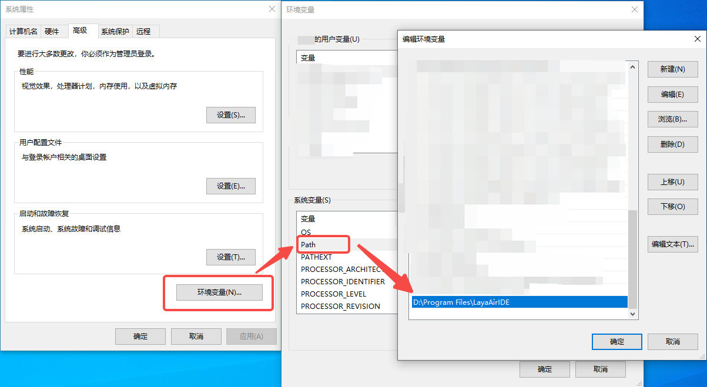
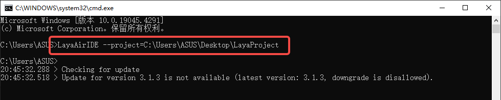
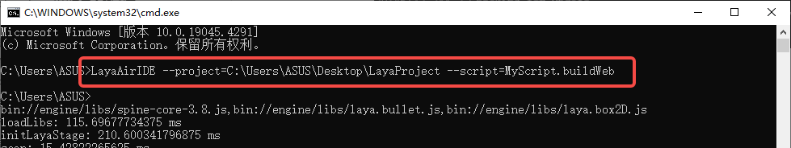
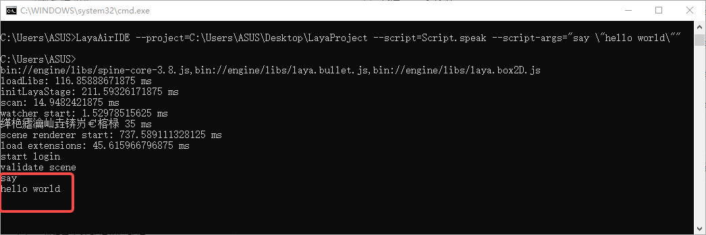

# Command Line Publishing

## 1. Starting the Editor

After downloading LayaAir-IDE, add Path to the local environment variables, as shown in Figure 1-1, where `D:\Program Files\LayaAirIDE` is the installation path,



(Figure 1-1)

Then open the command line window and you can start the IDE in the terminal. The command is:

```
> LayaAirIDE --project=/path/to/project
```

**--project:** The path of the project to be opened (full path). For example, if there is a LayaAir project in `C:\Users\ASUS\Desktop\LayaProject`, enter `LayaAirIDE --project=C:\Users\ASUS\Desktop\LayaProject` in the terminal to open this project, as shown in Figure 1-2.



(Figure 1-2)


## 2. Executing Scripts

Commands can also be entered in the terminal and scripts can be executed in the background. The command is:

```
> LayaAirIDE --project=/path/to/project --script=MyScript.buildWeb
```

**--project:** The full path of the project.

**--script:** Specify the script file to be executed.

For example, add the `MyScript.ts` script file to the project and add the following code. Then, you can use the command `LayaAirIDE --project=C:\Users\ASUS\Desktop\LayaProject --script=MyScript.buildWeb` to build the Web platform, as shown in Figure 2-1. After the background script execution is completed, the background process will automatically exit.

```typescript
@IEditorEnv.regClass()
class MyScript {
    static async buildWeb() {
        return IEditorEnv.BuildTask.start("web").waitForCompletion();
    }
}
```



(Figure 2-1)

The publishing scripts for each platform are given below,

```typescript
@IEditorEnv.regClass()
class MyScript {
    // Build web
    static async buildWeb() {
        return IEditorEnv.BuildTask.start("web").waitForCompletion();
    }

    // Build WeChat mini-game
    static async buildWxgame() {
        return IEditorEnv.BuildTask.start("wxgame").waitForCompletion();
    }
    
    // Build Douyin mini-game
    static async buildBytedancegame() {
        return IEditorEnv.BuildTask.start("bytedancegame").waitForCompletion();
    }
    
    // Build Oppo mini-game
    static async buildOppogame() {
        return IEditorEnv.BuildTask.start("oppogame").waitForCompletion();
    }
    
    // Build Vivo mini-game
    static async buildVivogame() {
        return IEditorEnv.BuildTask.start("vivogame").waitForCompletion();
    }
    
    // Build Xiaomi quick game
    static async buildXmgame() {
        return IEditorEnv.BuildTask.start("xmgame").waitForCompletion();
    }
    
    // Build Alipay mini-game
    static async buildAlipaygame() {
        return IEditorEnv.BuildTask.start("alipaygame").waitForCompletion();
    }
    
    // Build Taobao mini-game
    static async tbgame() {
        return IEditorEnv.BuildTask.start("tbgame").waitForCompletion();
    }
}
```

The corresponding terminal commands are:

```
// Build web
> LayaAirIDE --project=C:\Users\ASUS\Desktop\LayaProject --script=MyScript.buildWeb
// Build WeChat mini-game
> LayaAirIDE --project=C:\Users\ASUS\Desktop\LayaProject --script=MyScript.buildWxgame
// Build Douyin mini-game
> LayaAirIDE --project=C:\Users\ASUS\Desktop\LayaProject --script=MyScript.buildBytedancegame
// Build Oppo mini-game
> LayaAirIDE --project=C:\Users\ASUS\Desktop\LayaProject --script=MyScript.buildOppogame
// Build Vivo mini-game
> LayaAirIDE --project=C:\Users\ASUS\Desktop\LayaProject --script=MyScript.buildVivogame
// Build Xiaomi quick game
> LayaAirIDE --project=C:\Users\ASUS\Desktop\LayaProject --script=MyScript.buildXmgame
// Build Alipay mini-game
> LayaAirIDE --project=C:\Users\ASUS\Desktop\LayaProject --script=MyScript.buildAlipaygame
// Build Taobao mini-game
> LayaAirIDE --project=C:\Users\ASUS\Desktop\LayaProject --script=MyScript.tbgame
```

Script parameters can also be specified for execution. The command is:

```
> LayaAirIDE --project=/path/to/project --script=Script.Speak --script-args="say \"hello world\""
```

**--project:** The full path of the project.

**--script:** Specify the script file to be executed.

**--script-args**: Specify the script parameters to be executed. In the above example, the parameters of the script will be passed ("say", "hello world").

For example, create a new script file Script.ts in the project and then add the following code:

```typescript
@IEditorEnv.regClass()
class Script {
    
    static speak(arg1: any, arg2: any) {
        console.log(arg1); 
        console.log(arg2); 
    }
}
```

Then open the terminal and enter the command `LayaAirIDE --project=C:\Users\ASUS\Desktop\LayaProject --script=Script.speak --script-args="say \"hello world\""`, as shown in Figure 2-2, and you can see the successful output.

> Note: In the passed parameters, the outer quotes are used to define the boundary of the parameter string. The backslash is an escape character, and its combination with the inner quotes is used to indicate that the double quotes here are part of the string content, not the boundary identifier.



(Figure 2-2)