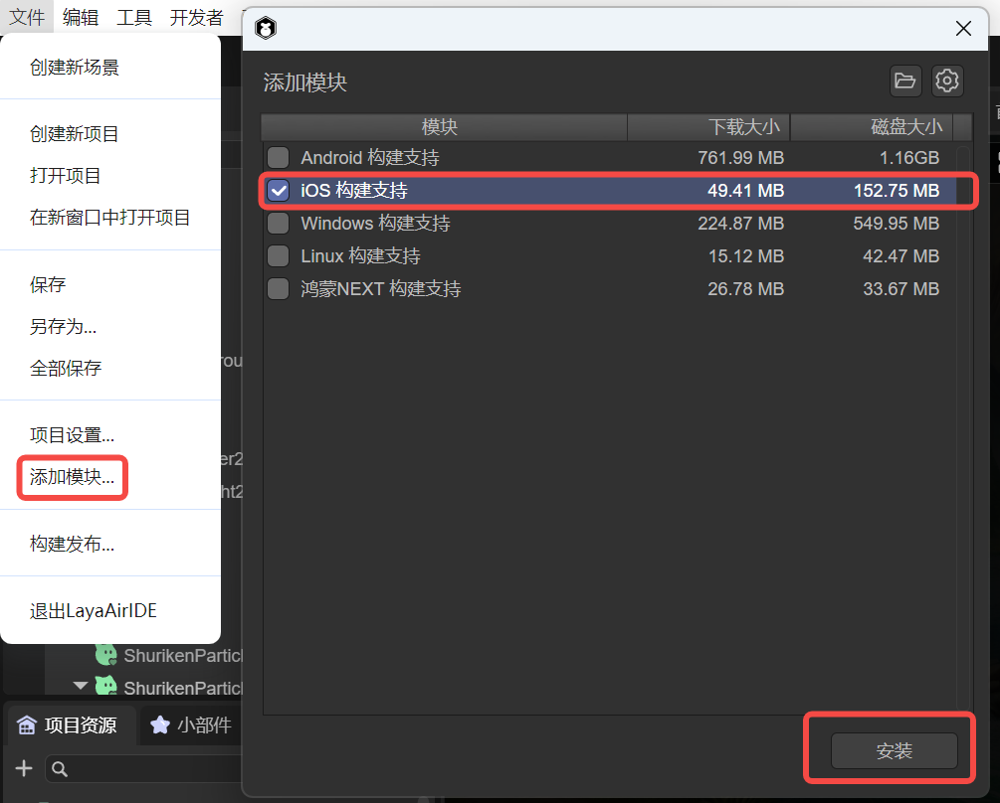

# iOS Build and Release

## 1. Installation of the Build and Release Environment

Before building and releasing iOS, we need to add the release environment module for iOS first. As shown in Figure 1-1, click the "Add Module" option under the "File" menu.

  

(Figure 1-1)

If we don't add the release environment first, when clicking to build iOS, a prompt to install the module will also pop up, as shown in Figure 1-2.

 

(Figure 1-2)

If a prompt pops up, click OK to automatically jump to the installation interface. Click Install, and the environment required for Android building will be automatically downloaded and installed.

Because the library files required by the build tool are relatively large, they are not directly included in LayaAirIDE. When using this tool for the first time, the corresponding support module will be downloaded first.

> The file is large. Please be patient when downloading.

## 2. Build and Release

In the "File" menu, open the "Build and Release" option and select the "iOS" platform tab, as shown in Figure 2-1,

  

(Figure 2-1)

First, let's understand the functions of each common configuration.

### 2.1 Application ID

The package name of the application, which is normally not visible. Generally, the reverse domain naming rule is adopted (which is beneficial for distinguishing and avoiding conflicts with existing APPs in the system).

For example: com.layabox.runtime.demo

The package name must be in the format of xxx.yyy.zzz and have at least two levels, that is, xxx.yyy. Otherwise, the packaging will fail.  

### 2.2 Build Version Number

The version of the Native project, defined by the developer for identification.

### 2.3 Packaging Resources

Whether to package the resources exported for the current platform (resource directory) into the native project. The packaged resources will be placed in a specific directory for subsequent generation of Apps for different platforms.

If you want to provide a stand-alone version, you must select to package resources, that is, check "Package Resources", and keep the "Resource Server URL" empty. Packaging resources directly into the App package can avoid network downloads and speed up the loading speed of resources.

> The disadvantage of packaging resources is that it will increase the size of the package.

> If you want to publish an online game with "Package Resources" checked, you must perform dcc on the server side; otherwise, the advantage of packaging will be lost.

### 2.4 Obfuscate Resources

If checked, when packaging resources, resources will be randomly obfuscated, mainly to avoid certain sensitive functions from being scanned by the platform when uploading.

### 2.5 Resource Server URL

Just fill in the server address, and be sure to add index.js after the address.

For example: http://192.168.31.109:8000/index.js

### 2.6 Hot Update (DCC)

After enabling DCC, resources can be packaged or not.

> Refer to [DCC Documentation](../native/LayaDcc_Tool/readme.md).

### 2.7 Screen Orientation

> Refer to [Screen Orientation Settings](../native/screen_orientation/readme.md).

### 2.8 Icon

The application icon is the visual identifier that users see on their devices. To adapt to different devices and display situations, you need to prepare icon files of various resolutions.

By specifying these icon files in the project settings, you can ensure that the application is displayed with the best icon on all types of iOS devices.

### 2.9 Signature

Signature is an important security measure used to verify the source and integrity of the application program.

- Developer Team ID: This is the unique identifier of the Apple developer account, used to identify the developer's identity. Before all applications are uploaded to the App Store, they must be signed with a valid developer ID. This ID is usually a 10-character string consisting of letters and numbers.

- Automatic Signature: Xcode can automatically handle the signature process. By enabling the automatic signature function, Xcode will automatically generate the corresponding certificates and configuration files to help simplify the release process.

### 2.10 Distribution Type

Different distribution types help developers better manage applications in various stages of development, testing, and release. When choosing the appropriate distribution type, developers should weigh based on the development stage of the application and the target users.

**App Store**:

- This distribution type is used to publish applications to the Apple App Store.

- Applications need to go through Apple's review process and must comply with the guidelines and policies of the App Store.

- In this mode, the construction of the application needs to be signed and generate a release configuration file.

**Debugging**:

- This distribution type is used for debugging during the development process.

- Debug builds contain symbol information and data required by debugging tools, and are usually not optimized to make it easier to find and correct problems.

- This mode is not suitable for distribution to end users because they contain more development details.

**Enterprise**:

- Enterprise distribution is suitable for distributing applications within the enterprise, especially for developing internal tools or business applications, without going through the App Store.

- An Apple enterprise developer account is required to support this type of distribution.

- Applications can be installed through the internal channels of the enterprise, such as using the MDM (Mobile Device Management) system.

**Release Testing**:

- This distribution type is generally used for testing before release.

- In the release test stage, the build will be optimized and contain less debugging information to be closer to the final production environment.

- This option may be used for pre-release versions to allow testers to test the application ready for release to ensure quality and performance.

### 2.11 Rendering Mode

There are two rendering modes, OpenGL and WebGL. Generally, OpenGL is selected by default.

### 2.12 Export Project

After checking, the project built and released will not be automatically packaged into an ipa package but will be released as a native package XCode project.

### 2.13 Texture Options

"Compressed Texture": Generally, it is necessary to check "Allow the use of compressed texture formats". If not checked, the settings for the compression format of all pictures will be ignored.

"Texture Source File": You can uncheck "Always include texture source files". If checked, even if the picture uses a compressed format, the source file (png/jpg) is still packaged. The purpose is to fallback to the source file when encountering a system that does not support the compression format.

## 3. Build XCode Project

To build an iOS project, a Mac computer and XCode need to be prepared, and the minimum required system version is 10.0

### 3.1 Use of the Built Project Engineering

When building and releasing, if "Export Project" is checked, the built XCode project will be exported and can be opened with the corresponding development tool for secondary development, packaging, and other operations.

iOS projects can be imported and developed using the xcode software. After opening the XCode (ios) project, a real ios device needs to be selected for building.

The threshold of XCode projects is relatively high. If you are a novice and do not have relevant knowledge, please first learn and understand the basic development knowledge of relevant XCode.

Here is a simple **reference**:

[ "Detailed Process of IOS Packaging and Publishing App" ](https://github.com/layabox/layaair-doc/tree/master/Chinese/LayaNative/packagingReleases_IOS)

### 3.2 Manual Switching Between Standalone and Network Versions

After the build is completed, the standalone and network versions can be switched by directly modifying the code in the project.

There is a function that executes loadUrl at the end of the resource/scripts/index.js script in the project directory. Here, the homepage address is loaded. By modifying the address here, the standalone and network versions can be switched. The address of the standalone version is fixed as `http://stand.alone.version/index.js`.

For example, initially it is the network version, and the address is:  

 `loadUrl(conch.presetUrl||"http://10.10.20.19:7788/index.js");`   

To change it to the standalone version, modify here:  

 `loadUrl(conch.presetUrl||"http://stand.alone.version/runtime.json");`  

And vice versa.  

> Once the url address is modified, the originally packaged resources will all become invalid. At this time, the content under the cache directory needs to be manually deleted, and packaged resources need to be regenerated using layadcc. See [LayaDCC Tool](../native/LayaDcc_Tool/readme.md).

### 3.3 Resources

After the project is built through the IDE,

- If the selected version is the standalone version (packaged resources), all the resources of the H5 project (including: scripts, pictures, html, sounds, etc.) will be packaged under this directory:

release\ios\ios_project\resource\cache

- If it is the online version and the resources are not packaged, the resources will use the resource directory under the release directory (release\resource).