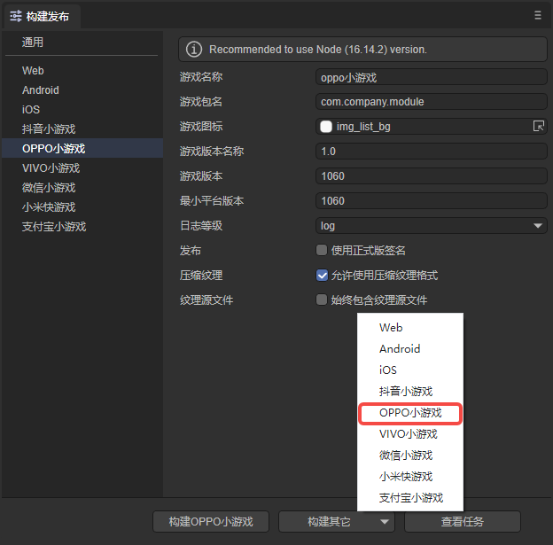
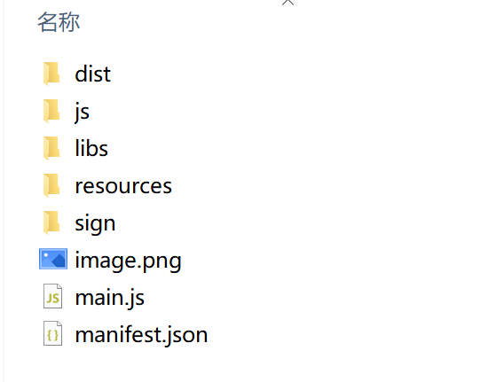
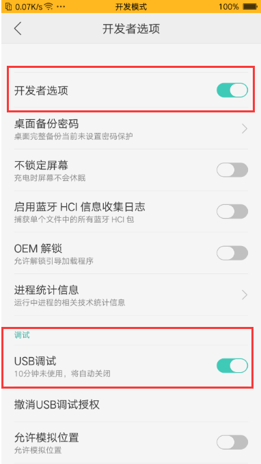
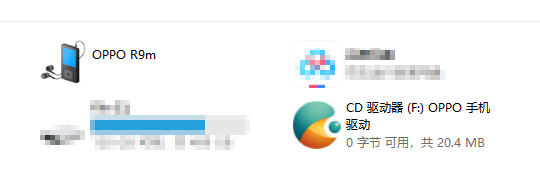
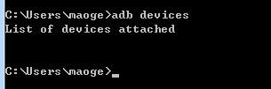
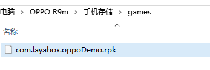
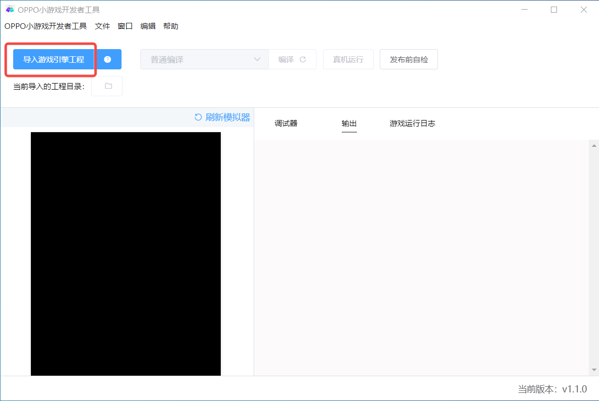
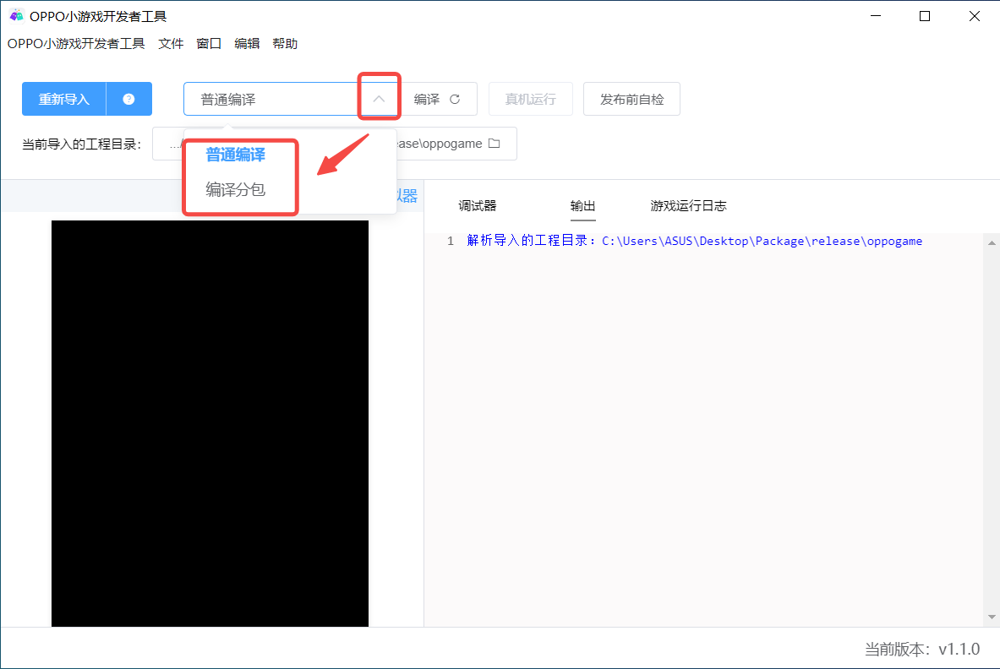
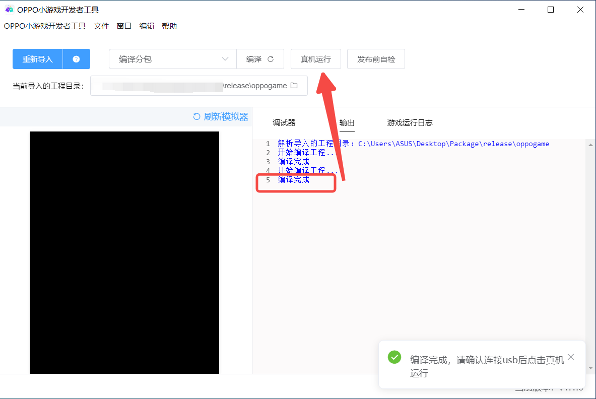

# OPPO Mini Game


## 1. Overview

It is recommended to take a look at the official [documentation](https://ie-activity-cn.heytapimage.com/static/minigame/CN/docs/index.html) of OPPO Mini Game . The documentation of the LayaAir engine is more about the engine. Related, of course, there will also be some application introductions of small game interfaces mixed in, but it is definitely correct to take a closer look at OPPO's official documents.

OPPO officially provides visual developer tools, click [here](https://ie-activity-cn.heytapimage.com/static/minigame/CN/docs/index.html#/develop/games/ide) to download, at After configuring the relevant parameters in LayaAirIDE, and then successfully publish it directly in LayaAirIDE with one click (an rpk package will also be generated), you can use OPPO developer tools to debug.

Another debugging method is to install an apk debugging environment on the OPPO mobile phone, choose to open the rpk file in the apk, and then connect the mobile phone to the PC with a data cable through chrome for debugging.

>Before OPPO mini games are released, you need to perform [General](../../generalSetting/readme.md) settings.


## 2. Published as OPPO mini-game

### 2.1 Select target platform

In the build and release panel, select the target platform as OPPO Mini Game in the sidebar. As shown in Figure 2-1,



(Figure 2-1)

Click "Build OPPO Mini Game" or "OPPO Mini Game" in the "Build Other" option to publish the project as an OPPO Mini Game.

Next we will introduce the filling in of these function parameters.

**1. Game name**

Generally, Chinese characters are filled in, but English is also acceptable. Used for game entrances such as app stores, desktop icons, pop-up windows, etc. A good name is an important factor in whether the game can attract traffic. OPPO can be within 6 Chinese characters

**2. Game package name**

The format of the game package name is `com.company.module`. The first digit is com, the second digit is the company name, and the third digit is the project name. All must be written in English, for example: `com.layabox.demoGame`.

**3. Game icon**

The game icon is also an important game entrance logo. Like the game name, it is a very important element that attracts attention. If the game icon is well designed, the game name will be well chosen. The same position will get more clicks than other games. The game icon needs to provide a square size of `192*192`.

**4. Game version name**

The game version name is the actual version and is generally used to differentiate between functional versions. For example, I have a major version change. It was originally 1.0 and can be changed to 2.0. If it is just to correct the bug, then 1.0 can be changed to 1.1. By analogy, we recommend using floating point numbers for naming. For example, "0.1", "1.3", "5.0"...

**5. Game version**

The game version and the version name have different purposes. Here is the channel platform used to distinguish version updates. Every interrogation must be at least recursive +1, it doesn't matter if you test it yourself. However, the value here must be at least +1 compared to the value of the last arraignment. +N is also acceptable. It must not be equal to or less than the previous version value. It is recommended that the arraignment version number be recursively +1. It should be noted here that the game version must be a positive integer.

**6. Minimum platform version**

Minimum platform version, just fill in the platform version number displayed on the debugger.

**7. Log level**

Seven log levels, from high to low, are OFF, ERROR, WARN, INFO, LOG, DEBUG, and TRACE. You can easily know the running status of the current program.

**8. Whether to use the official version signature**

If you are only debugging the test version, you do not need to check it here. It must be checked before it is officially released online (submit the version to the platform).

If checked, the official version signature will be enabled. About release signature:

① For companies, generally a company only uses one signature. If the company already has a signature, it is recommended to use the company’s signature. If not, publishing in the IDE integrates this function to facilitate developers to generate signatures.

②For individual developers, one official signature can be used on multiple projects. It only needs to be generated once.

If the release has been signed, place the signature file in the sign/release folder of the Laya project.

**9. Compressed texture**

`Compressed texture`: Generally, you need to check "Allow the use of compressed texture format". If not checked, the compression format settings of all images will be ignored.

`Texture source file`: You can uncheck "Always include texture source file". If checked, the source file (png/jpg) will still be packaged even if the image uses a compressed format. The purpose is to fallback to the source file when encountering a system that does not support the compression format.


### 2.2 Introduction to the mini-game directory after release

Click version release. Since the rpk release environment (used to generate rpk packages) will be checked before release, if there is no release environment, the download will start.

The directory structure after publishing is shown in Figure 2-2.



(Figure 2-2)

**js directory and libs directory**:

Project code and engine libraries.

**resources directory and Scene.ls**:

resources resource directory and scene file Scene.ls. Due to the limitations of the initial package for small games, it is recommended to plan the contents of the initial package. It is best to put them in a unified directory to facilitate the separation of the initial package.

**main.js**：

The entry files of OPPO mini games, the game project entry JS files and the adaptation library JS are all introduced here. The IDE has already generated it when creating the project. Under normal circumstances, there is no need to touch it here.

**manifest.json**：

The project configuration file of the mini game contains some information about the mini game project. If you want to modify it, you can edit it directly here.


## 3. Chrome jointly debugs OPPO mini-games

### 3.1 OPPO mini game release and debugging environment preparation

1. OPPO brand mobile phones.

2. Download and install the OPPO real machine test APP "Quick Application" (OPPO mini game debugger)

Go to the OPPO official website [Documentation](https://ie-activity-cn.heytapimage.com/static/minigame/CN/docs/index.html#/develop/games/use) and find the `Install runtime.apk package to the OPPO phone` Go to this column and usually choose the new version to download.

It should be noted that the debugger version and the minimum platform version number are indicated in the document. When LayaAirIDE is released, it must correspond to the minimum platform version number here.

3. PC’s chrome browser and mobile phone data connection cable.

4. Install the node.js environment. It is recommended to install the 14.x.x stable version (10.x.x or above may have incompatibility issues), node official website: https://nodejs.org/en/.

Just download and install it, it’s relatively simple and I won’t go into details. Being able to call the npm command in the command line is considered a success.

5. Install ADB

When OPPO released it, it pushed the rpk package to the games directory of the phone through ADB, so this must be installed.

[ADB official website download: http://adbshell.com/downloads]

> As a reminder, after downloading ADB Kits, it is recommended to decompress the downloaded compressed package into a directory with a simpler path (such as: `D:\adb`). Remember to add environment variables (if you don’t know how to add environment variables, you can Baidu yourself).


### 3.2 Complete process of OPPO mini-game release and access

In order to make the launch of OPPO smoother, we have to do some inspections.

First, the node environment, ADB, and Chrome must all be installed on the PC.

Second, in the OPPO mobile phone, enter `Settings->Other Settings->Developer Options`. Developer options and USB debugging must be turned on, as shown in Figure 3-1.



(Figure 3-1)

In addition, make sure to install the OPPO mini game debugging environment "Quick Application", as shown in Figure 3-2.


(Figure 3-2)

Third, connect the PC and mobile phone with a USB data cable. An interface similar to Figure 3-3 will appear on the computer. For example, click on OPPO R9m in the upper left corner of Figure 3-3 to enter the phone storage.



(Figure 3-3)

What should be noted on the mobile phone is that the screen remains lit and open. When publishing the OPPO mini-game in the PC's IDE, if a request for authorization information appears on the mobile phone, be sure to click OK to allow it. As shown in Figure 3-4.


(Figure 3-4)


### 3.3 Real machine debugging and Chrome output

OPPO's debugging must be based on real machine debugging. PC's chrome can only output information and cannot see the screen.

If the preparations are OK, under normal circumstances, after the OPPO mini-game is successfully released in LayaAir IDE, the rpk package will automatically appear in the OPPO mini-game list of the mini-game (the IDE pushes it to the specified directory by calling ADB). As shown in Figure 3-5.


(Figure 3-5)

The `OPPO test` in Figure 3-5 is the game name we filled in when we released it. If we see our corresponding game name, it means that the normal release was successful. Click Open to open the game we published.

If you want to see debugging information. At this time, you need to open the chrome browser. Then enter in the input field:

```
devtools://devtools/bundled/inspector.html?v8only=true&ws=10.10.82.111:12345/00010002-0003-4004-8005-000600070008
```

Just replace the IP address `10.10.82.111` in the above example with the IP on your mobile phone. 12345 is the port number. If not, replace it with 12346. I don’t know how to check the IP address, so I used Baidu. The important reminder here is that the **PC must be in the same network segment as the mobile phone in a LAN environment**. When debugging, make sure the mobile phone is open on the mini-game page.

If there is no problem, the effect is as shown in Figure 3-6, and the debugging log will be printed.


(Figure 3-6)

Release and debugging, if everything goes well, it will be completed.

### 3.4 Publishing unsuccessful processing experience

The release document only talks about the use of functions. The above document is the process under smooth conditions. However, developers may not be so smooth, so here we talk about our experience.

**The game is not found in the debug list, what's going on**

If we fail to automatically send the rpk to the mini-game directory when publishing, then there will be no way to directly see the newly released mini-game in the list in Figure 3-5.

At this time, you can use adb to confirm the environment.

Enter the `adb devices` command in cmd.

**1. Abnormal connection situation: **



(Figure 3-7-1)

At this point, the developer needs to check whether the mobile phone connection and permissions are correct.

**2. When the connection is normal: **


(Figure 3-7-2)

At this time, it means that the mobile phone has been successfully connected, and the developer mode and USB debugging have been turned on. At this time, you can try to restart OPPO's quick app apk and check the list information again.

**When the connection is normal**, if the problem occurs again. It may be related to windows permissions. You need to make sure to start LayaAirIDE with administrator permissions.

For issues related to adb or mobile phone permissions, developers can learn by themselves.

------

Another solution allows us to use manual mode and copy the rpk package to the **games directory stored on the mobile phone**. If there is no games directory, create it manually.

The rpk package is located in the release/OPPOgame/dist directory of the project.

 Copy the rpk file generated by publishing to the games directory stored on the mobile phone, as shown in Figure 3-8.



(Figure 3-8)

This method is more stable.

In the case where the `.rpk` file is generated successfully, the publishing process is actually over.

If there is a problem with the packaging process, you can feedback the problem to the official Layabox team, and Layabox will work with the OPPO team to handle it.


## 4. OPPO developer tool debugging

In addition to Chrome debugging, developers can also use official developer tools. As shown in Figure 4-1, open the OPPO developer tools, click Import Game Engine Project, and then select the path.



(Pic 4-1)

Then select the compilation method, as shown in Figure 4-2. The default is normal compilation. If subcontracting is performed, select "Compile Subcontracting" and click "Compile" after selection.



(Figure 4-2)

After the compilation is successful, connect the USB to the real machine, and then click on the real machine to run:



(Figure 4-3)

The real machine effect is shown in Figure 4-4:


(Figure 4-4)

The advantage of this method compared to Chrome browser debugging is that it can display the effect of the mobile phone in real time.


## 5. Subpackage loading

After the development is completed, developers can package other files in the project other than sub-packages into the main package; and then type the entire package into a .rpk file. Developers can first look at the subpackaging set by [General](../../generalSetting/readme.md).

> OPPO subcontracted loading package size limit
>
> - The total size of all sub-packages of the entire mini-game does not exceed 16M
> - Unlimited size of individual packets
> - Including the main package 4M, the final rpk package size does not exceed 20M
>
> For details, please refer to the official website [Documentation](https://ie-activity-cn.heytapimage.com/static/minigame/CN/docs/index.html#/develop/subpackage/subpackage).

To use LayaAirIDE to subcontract, just click Build and Publish, check Enable subcontracting, and then select the folder to be subcontracted. When setting, you need to pay attention. If the resource is loaded by code and is not referenced in the scene, it must be added to the `always included resource directory`.

After release, developers only need to debug according to any of the debugging methods in Sections 3 and 4.


