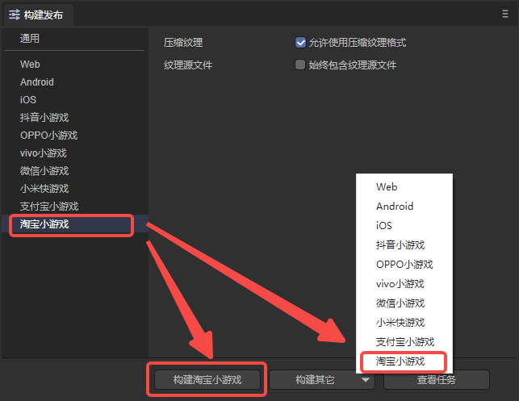
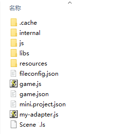
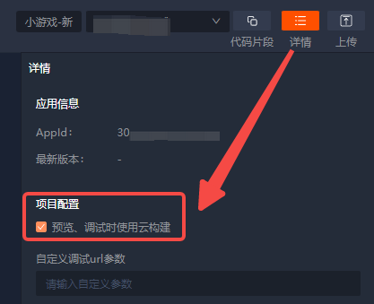
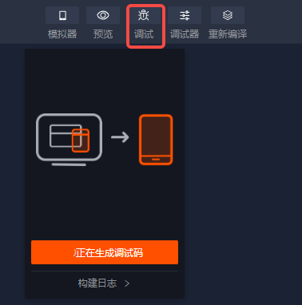
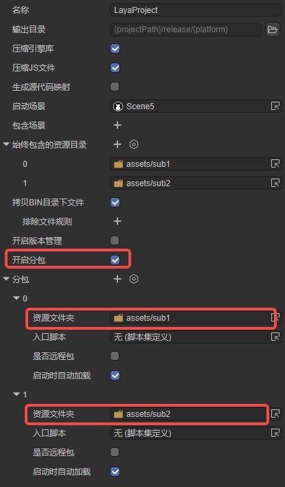
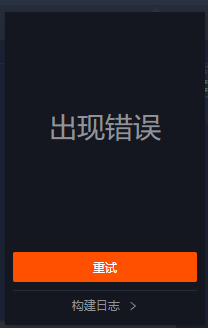

# Taobao Mini-Games

>Version >= LayaAir 3.1.1

## 1. Overview

Taobao mini-games refer to games developed by developers based on the [Taobao Open Platform](https://open.taobao.com/) and directly released to consumer terminals such as Taobao Mobile, Taobao Lite, and others, providing games suitable for all age groups, including nurturing, puzzle-solving, synthesis, construction, etc.

It is recommended that developers check the official Taobao introduction to [mini-games](https://open.taobao.com/v2/doc#/abilityToOpen?docType=1&docId=121009&treeId=804) to understand application scenarios, access guides, etc. You can also take a look at the official [development guide](https://open.taobao.com/v2/doc#/abilityToOpen?treeId=776&docId=119114&docType=1) from Taobao.

**Download and install the Taobao developer tool**

The [Taobao developer tool](https://developer.taobao.com/) is mainly used for preview and debugging of mini-game products, real-device testing, upload and submission, etc. It is an essential tool for Taobao mini-game development.

> Before publishing Taobao mini-games, it is necessary to perform [general](../../generalSetting/readme.md) settings first.


## 2. Publishing as Taobao Mini-Games

### 2.1 Select the target platform

In the build and publish panel, select Taobao mini-games as the target platform on the sidebar. As shown in Figure 2-1,



(Figure 2-1)

Click "Build Taobao Mini-Game" or "Taobao Mini-Game" in the "Build Others" option to publish the project as a Taobao mini-game.

`Compress Textures`: Generally, it is necessary to check "Allow the use of compressed texture formats". If not checked, all settings for texture compression formats for images will be ignored.

`Texture Source Files`: You can uncheck "Always include texture source files". If checked, even if the image uses a compressed format, the source file (png/jpg) will still be packaged. The purpose is to fallback to the source file when encountering a system that does not support the compressed format.


### 2.2 Introduction to the mini-game directory after publishing

The directory structure after publishing is shown in Figure 2-2:



(Figure 2-2)

**js directory and libs directory**:

Project code and engine libraries.

**resources directory and Scene.ls**:

The resources directory and the scene file Scene.ls. Due to the limitations of the initial package of mini-games, it is recommended to plan the content of the initial package well and preferably place it in a unified directory for easy separation of the initial package.

**game.js**:

The entry file of the Taobao mini-game. The game project entry JS file and the adaptation library JS are all imported here. When the IDE creates the project, it has been generated. Generally, there is no need to modify it here.

**game.json**:

The configuration file of the mini-game. The developer tool and the client need to read this configuration to complete the relevant interface rendering and property settings. For example, the orientation of the screen.

**mini.project.json**:

The project configuration file of the mini-game. The file includes some information about the mini-game project. If you want to modify it, you can directly edit it here.

**my-adapter.js**:

The adaptation library file for Taobao mini-games.


## 3. Creating Mini-Game Projects Using the Taobao Developer Tool


### 3.1 Account Preparation

When previewing and debugging Taobao mini-games, you need to settle in. Developers need to log in to the [Taobao Open Platform](https://open.taobao.com/), log in with their developer account (Taobao account), and create an application. The specific operations can refer to the official [document](https://open.taobao.com/doc.htm?docId=121007&docType=1&spm=0.0.0.0.qtzgFm). After successful settlement, you can proceed with the subsequent steps.


### 3.2 Importing the Project

After creating and publishing the Taobao mini-game project in the LayaAir IDE, open the Taobao developer tool. On the sidebar, select mini-games and click Open Project, as shown in Figure 3-1,


(Figure 3-1)

Then, select the project path, choose the option in the "Mini-Game - New" column for the project type, and the associated application is the one created in Section 3.1. Finally, click OK to open the project.


(Figure 3-2)


### 3.3 Real-Device Testing and Debugging

After opening the Taobao developer tool, when previewing generally, it is necessary to check Cloud Build, as shown in Figure 3-3,



(Figure 3-3)

Then you can preview and debug on a real device. As shown in Figure 3-4, click the debug button, wait for the QR code to be generated, and scan it with the Taobao APP on your mobile phone.



(Figure 3-4)


## 4. Subpackage Loading

The following introduces the method of subpackaging for Taobao mini-games in the LayaAir IDE. Developers can first take a look at the subpackaging in the [general](../../generalSetting/readme.md) settings. Subpackage loading can be performed through the following steps. As shown in Figure 4-1, check to enable subpackaging and then select the folders to be subpackaged. Developers can also choose whether to enable remote packages.



(Figure 4-1)

It should be noted that the address of the remote package needs to use the "CDN address of Alibaba Cloud" or "be configured in the whitelist in the application created on the [Taobao Open Platform](https://open.taobao.com/)". Therefore, if the remote package address is a local server address, errors will occur, such as download failures. Therefore, it is best to use an https external server resource address and add it to the whitelist scope of the mini-game backend.

> Subpackage restrictions for Taobao mini-games:
>
> 1) The total size of all subpackages of the entire mini-program does not exceed 20MB.
>
> 2) The size of a single subpackage or the main package cannot exceed 2MB.
>
> Please refer to the [official document](https://open.taobao.com/v2/doc#/abilityToOpen?docId=119146&docType=1) of Taobao mini-games.


### 4.1 It is recommended to use the root directory for subpackaging

Generally, when performing subpackaging as shown in Figure 4-1, the selected sub1 and sub2 are usually the resource root directories (under the assets directory), as shown in Figure 4-2,


(Figure 4-2)

The situation after publishing is shown in Figure 4-3 (both sub1 and sub2 are root directories).


(Figure 4-3)

At this time, when loading subpackages in the code, resources within the subpackage can be loaded:

```typescript
        Laya.loader.load("sub1/Cube.lh").then((res: Laya.PrefabImpl) => {
            // ......
        });

        Laya.loader.load("sub2/Sphere.lh").then((res: Laya.PrefabImpl) => {
            // ......
        });
```


### 4.2 Subpackaging with multi-level directories in special cases

Sometimes the subpackage selected by developers is not the resource root directory (under the assets directory), as shown in Figure 4-4,


(Figure 4-4)

When subpackaging in this way, the result after publishing is shown in Figure 4-5 (neither sub1 nor sub2 is the root directory),


(Figure 4-5)

At this time, when loading subpackages in the code:

```typescript
        Laya.loader.load("sub/sub1/Cube.lh").then((res: Laya.PrefabImpl) => {
            // ......
        });

        Laya.loader.load("sub/sub2/Sphere.lh").then((res: Laya.PrefabImpl) => {
            // ......
        });
```

During real-device debugging, a compilation error will occur, as shown in Figure 4-6.



(Figure 4-6)

This is due to the restrictions of Taobao mini-games. Therefore, after publishing, developers need to modify the content in game.json, as shown in Figure 4-7, and change the name to a single directory name.


(Figure 4-7)

At this time, when loading subpackages in the code, do not load them through the path but use the subpackage name for loading:

```typescript
        Laya.loader.load("subname1/Cube.lh").then((res) => {
            // ......
        });

        Laya.loader.load("subname2/Sphere.lh").then((res) => {
            // ......
        });
```

It should also be noted that if the `Automatically load on startup` option is checked during build and publishing, the automatically loaded subpackage path needs to be changed to the subpackage name, as shown in Figure 4-8.


(Figure 4-8)

In addition, after changing the subpackage name, if the resources in the subpackage reference resources in the resources directory, attention should be paid to the hierarchical relationship, as shown in Figure 4-9. Therefore, it is not recommended that developers reference resources in other directories within the subpackage.


(Figure 4-9)

In conclusion, if subpackaging is performed in the way described in Section 4.2, the subpackage name needs to be manually changed after publishing. Therefore, it is recommended that developers plan resources in the way described in Section 4.1 when managing resources to facilitate the final subpackaging.


## 5. Q&A

**1. Inconsistent performance between real-device and IDE, or errors occur in the IDE**

The real-device preview is the standard. If there are errors in the Taobao IDE, you can report them to Taobao.

**2. Scope issue**

Due to the different scopes of Taobao mini-games and other platforms, the scope of Taobao mini-games is `$global`. LayaAir has already used `var window = $global` in the published js to replace the usage. If there is a situation of "xx is undefined" during usage, you can check whether the corresponding js has not been declared.