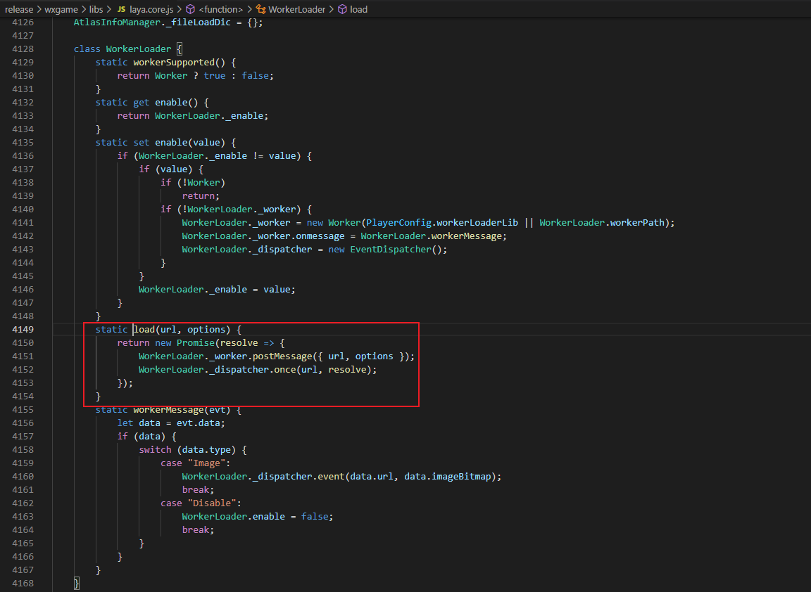

# The Use of WeChat Mini-Game Worker

Currently, there are still differences between the Worker function of WeChat mini-games and browsers. In browsers, the new Worker is used to initialize the Woker process. In WeChat mini-games, after specifying the configured worker path, the wx.createWorker method is needed to create the Worker. In the adaptation library, the class MiniWorkerLoader interface is used to custom implement the Worker content of WeChat mini-games, thereby integrating the use of Worker into the unified processing flow of the engine as much as possible, reducing the adaptation of Workers on each platform at the project level, and extending it to the use of Workers on other mini-game platforms.

Now, a simple project demo is provided to show the simple image loading usage and the extensible content of the worker.

```markdown
The example project incorporates the usage process of network images. Other types of files can be implemented in the root/build-templates/wxgame/workers/index.js template file
```

## 1. Worker Monitoring in the Adaptation Library

We have added the MiniWorkerLoader class in the WeChat mini-game adaptation library laya.wxmini.js, which inherits from Laya.WorkerLoader, and redirects the enable attribute of WorkerLoader to the enable attribute of the MiniWorkerLoader class for the initialization of WeChat Worker. The wx.createWorker method is used to create the Worker thread, as shown in the following figure:

 

And register as the workerMessage of the MiniWorkerLoader in the onMessage callback of the WeChat Worker thread. In the callback, we need to pass the local cache address of the downloaded network image into the created nativeImage and dispatch the completion event. In this step, we also write the cache address of the image into the resource mapping table.

During the loading process, the load method of the MiniWorkLoader base class in the following figure will be executed, and the url will be passed into the woker thread for processing:

 

## 2. Processing of WeChat Mini-Game Worker

We have added the configuration of the Worker path and the simple image processing logic in index.js within the Woker in the project publishing template. Since the Worker is a separate thread, the content under the Window scope in the main thread cannot be used. There is a globally exposed worker object in the Worker thread, including file management functions, download and upload functions, network communication functions, and audio playback functions, etc.

[wx.createWorker]: https://developers.weixin.qq.com/minigame/dev/api/worker/wx.createWorker.html "Create a Worker thread"

### 2.1 Project Publishing Template

We have added the worker directory in the example project directory and the configuration directory of the worker in game.json, as shown in the following figure:

 

### 2.2 Processing in index.js under the workers directory

Add event monitoring, image processing, and event dispatching in workers/index.js:

```js
console.log("worker/request/index.js")
// In the execution context of the Worker thread, a `worker` object is globally exposed. Just call worker.onMessage/postMessage directly
worker.onMessage(function (data) {
    console.log("worker ------------", worker);
    worker.downloadFile({
        url:data.url,
        success:function(res){
            console.log("worker downloadfile url:" + data.url);
            res.type = "Image"; // The resource type is processed in the workerMessage callback of MiniWorkerLoader. Currently, only the image type is simulated
            res.url = data.url;
            res.imageBitmap = res.tempFilePath; // Mini-games do not support ImageBitMap or any functions of window. Here, the cache address is passed in and then implemented using the native Image
            worker.postMessage({
                errCode:0,
                data:res,
                readyUrl:data.url
            });
        },
        fail:function(res){
            console.log("worker downloadfile url:" + data.url);
            res.type = "Image";
            worker.postMessage({
                errCode:1,
                data:res,
                readyUrl:data.url
            });
        }
    });
});
```

In the above code, onMessage is used to receive the url address sent from the load method of the MiniWorkerLoader in the engine layer. The image is downloaded to the local through the downloadFile interface and the local cache address of the image is sent to the workerMessage method of the main thread to create a native Image object for use. Here, functions such as audio, network connection, and local file processing can be extended according to requirements.