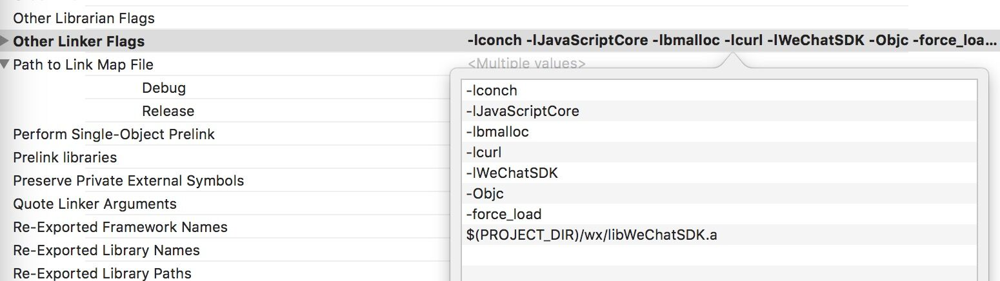

# Other instructions

## 1. About third-party maps

The underlying rendering of LayaNative uses openGLES rendering, using the GLSurfaceView control of Android and the GLKView control of iOS, so it cannot support third-party maps, such as Baidu Maps.

## 2. About file format

**Text format files in the project (for example: ini, xml, html, json, js, etc.) must be in utf8 encoding format, because iOS devices do not support files encoded in non-utf8 format. **

## 3. Debug mode and release mode

LayaNative's underlying LOG is divided into three types:

```java
LOGI common process log
LOGW warning log
LOGE error log
```

In js scripts, developers can set Debug mode through the following function:

```javascript
if( window.conch )
{
    //A value of 0 means turning off all log output
	//The value is 1: indicates that all LOGEs will pop up alerts.
	//The value is 2: indicates that all LOGE and LOGW will pop up alerts.
	window.conch.config.setDebugLevel(1);
}
```

**Tips**
*1. Conch can only be called in the LayaNative environment. There is no definition of conch in the web version, so you need to check whether it exists. *

## 4. About iOS docking with WeChat

When connecting to the WeChat SDK on the iOS platform, the -Objc parameter needs to be added after WeChat version 1.77. WeChat's official documentation allows you to add `-Objc -all_load` by default, but this will cause compilation errors.
If you encounter this situation, you can change the parameter to `-Objc -force_load libWeChatSDK.a`. After configuration, as shown in Figure 1:



## 5. About iOS Simulator

LayaNative supports the iOS simulator, but due to the low efficiency of the simulator, it is recommended that developers use iOS real machine debugging.

## 6. Obtain various information

| function name	| Function description	| Return value description	| Remarks	|
| -------------------- | ------------------ | ---------------------------------------- | -------------------------------- |
| getTotalMem()	| Get the total memory of the running device	| Unit is KB	|                              | getUsedMem()     	| Get the memory occupied by the current application	| Unit is KB	| The return value is not very accurate, but it can be used as a reference	|
| getAvalidMem()	| Get available memory	| Unit is KB	| The return value is not very accurate, but it can be used as a reference	|
| getNetworkType() 	| Get network status	| Return int value, NET_NO = 0;NET_WIFI = 1;NET_2G = 2;NET_3G = 3;NET_4G = 4;NET_UNKNOWN=5 |
| getRuntimeVersion() | Get the Runtime version	| The return value is a string, similar to ios-conch5-0.9.2, android-conch5-0.9 |
| getOS()	| Get the current system	| Return value is similar to "Conch-ios" "Conch-android" string	|
| getAppVersion()  	| Get the version number of iOS-App	| Return string 1.1	| iOS-app version number, through this version number, you can make APP update prompts. |
| getAppLocalVersion() | Get the Local version number of iOS-App | Return string 1.2	| iOS-app version number, through this version number, you can make APP update prompts. |

These functions all belong to the conch.config class. Calling examples:

```javascript
if( window.conch )
{
	window.conch.config.getRuntimeVersion();
}
```

**Tips**
*1. Conch can only be called in the LayaNative environment. There is no definition of conch in the web version, so you need to check whether it exists.*

## 7. Block error pop-up boxes in projects

Sometimes some error prompts will pop up during the running of the project. These prompts are caused by incorrectly written code in the project. Our suggestion is to resolve the errors in these error pop-ups, and then block them if they cannot be resolved. The error popup code is as follows:

```java
window.showAlertOnJsException(false);
```

## 8. Exception handling during engine initialization or startup script loading
In the LayaNative version, when the engine is initializing and loading the startup script, if an exception occurs (such as network instability), the engine will automatically call the window.onLayaInitError(error) function. This function is defined in config.js by default. The code is as follows :
```javascript
window.onLayaInitError=function(e)
{
    console.log("onLayaInitError error=" + e);
    alert("Loading the game failed, maybe because your network is unstable, please exit and re-enter");
}
```
Developers can modify error reporting information and error reporting methods according to their own needs.

## 9. Get device model
In LayaNative, iOS can obtain the device model by calling conch.config.getDeviceInfo(). It can be used for head curtain adaptation of iPhone X. The code is as follows:
```javascript
if( window.conch )
{
	var devInfo = JSON.parse(window.conch.config.getDeviceInfo());

	if (devInfo.devicename === 'iPhone10,3' || devInfo.devicename === 'iPhone10,6')
	{
    	// iPhone X Adaptation
	}
}
```

