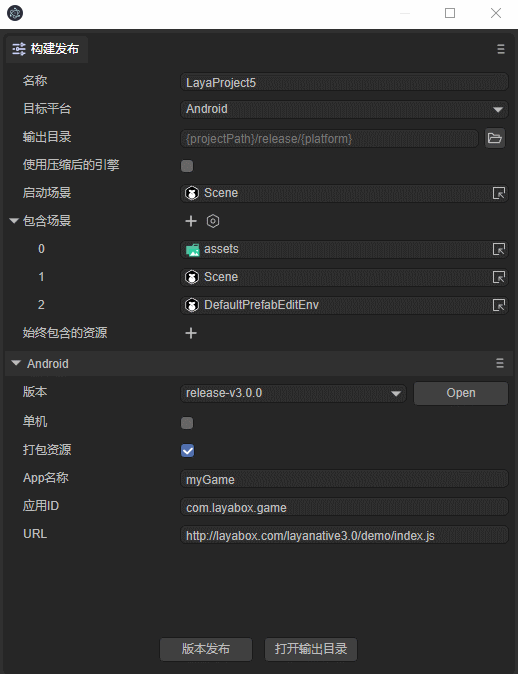

# LayaBox build tool
The build tool is used to generate LayaPlayer's mobile App project, which is equivalent to the App project wizard. Currently supports Android (Eclipse project, Android studio project) and iOS (XCode project).
**Notice:**
**LayaNative3.0-Android, the minimum system version required is 4.3**
**LayaNative3.0-iOS, the minimum system version required is 10.0**
## 1. Operational requirements
#### 1.1 Basic development environment

​ To build the project, you must prepare a development environment. For example: to build an iOS project, you need to prepare a Mac computer and XCode, and for android, you need to prepare Android studio.

## 2. User-oriented
Whether you are building an Android or iOS project, you must have the corresponding Android or iOS App development foundation. If you don't have it, please learn the relevant basic knowledge first.


## 3. Build the project in the IDE

To publish a project using an IDE, developers first open the "Build Project" option in the file menu, as shown in animation 1


(Animation 1)


Select iOS or Adroid as the target platform. Since the library files required to build the tool are relatively large, they are not directly included in LayaAirIDE. When you use this tool for the first time, you will first download the SDK package, as shown below:

  

​ (Figure 2)

**Notice**

This file is relatively large, so you need to be patient while downloading.

## 4. Project construction interface parameters

Open the project construction interface in LayaAirIDE, as shown in Figure 3:


(image 3)

*Target platform

   There are two options for the type of project generated by building: Android studio project and iOS project. If you need to generate an Android project, you can choose Android-studio. If you need to generate an XCode (iOS) project, select the iOS option.

* Version  
   The version of the Native project should be consistent with the LayaAir engine version, otherwise there may be version compatibility issues.

* Standalone

   If this option is checked, the App packaged by the built project is a stand-alone version, otherwise it is an online version. The stand-alone version does not require an Internet connection, there is no corresponding URL, and there is no need to provide a URL. However, game resources must be provided, otherwise it cannot be run after packaging. The address of the stand-alone version is fixed at http://stand.alone.version/index.js

* Package resources

   Resources are resources such as scripts, pictures, sounds, etc. For online games, as long as the game URL is available, it can run normally. However, if the resources are directly put into the App package, network downloading can be avoided and the resource loading speed can be accelerated. If it is a stand-alone game, since the game URL is not provided, a resource directory must be provided to package all the required resources into the App.

   Resources packaged into the App can still be updated through our dcc tool (resource cache management).
   If the resource path is not set at this time, you can still add resources manually after building the project. For the adding method, refer to [LayaDcc Tool](../LayaDcc_Tool/readme.md).

   **Notice:**  

   The disadvantage of packaging resources is that it increases the size of the package body.

   For online games that package resources, DCC must be run on the server side, otherwise the advantage of packaging will be lost and all resources will still be downloaded. How to type dcc, refer to [LayaDcc Tool](../LayaDcc_Tool/readme.md).

*App name

   The name of the App. It is also the output directory of the build project.

* Application ID

   The package name of the application is not visible under normal circumstances. Generally, anti-domain name naming rules are used (which is helpful for distinguishing and avoiding conflicts with existing APPs in the system).	 
   For example: com.layabox.runtime.demo	 
The package name must be in the format of xxx.yyy.zzz and must have at least two levels, namely xxx.yyy. Otherwise, packaging will fail.

* URL

   If the application to be packaged is an online project, you need to provide a startup URL that points to a js or json file, which is the entry point of the application. The project generated through LayaAir will output a startup page, usually index.js. During testing, for convenience, the local URL address is usually used for testing in the browser. When it is built into an Android App, there must be a real webserver address.

   For example:  

*LAN address:*

```
	http://10.10.20.19:8888/index.js
```
*Actual address:*
```
	http://nativetest.layabox.com/layaplayer/index.js
```


## 5. Use of built project projects

The built App project can be opened with the corresponding development tools for secondary development, packaging and other operations.
- Android-studio (android) projects can be imported and developed using the android-studio software.
- XCode (ios) projects can be imported and developed using xcode software. After opening the XCode (ios) project, you need to select the real ios device for build. (Note: The real devices are armv7, armv7s, arm64 architecture. If you use the ios Simulator, it is the X86 architecture. Currently, LayaNative does not support the X86 architecture on ios devices. If you use the simulator to compile, it will not pass.


**Reference resources:**

- [Usage and configuration of Android Studio](https://github.com/layabox/layaair-doc/tree/master/Chinese/LayaNative/AndroidStudio_ConfigurationAndApplication)

- [Detailed process of packaging and releasing App for IOS](https://github.com/layabox/layaair-doc/tree/master/Chinese/LayaNative/packagingReleases_IOS)

  ​

## 6. Manually switch between stand-alone version and network version

After the build is completed, you can switch between the stand-alone version and the network version by modifying the code directly in the project.

1. Android project

 	Open MainActivity.java in the built project and search for `mPlugin.game_plugin_set_option("localize","false");`
 	The stand-alone version needs to be set to "true", such as `mPlugin.game_plugin_set_option("localize","true");`
 	If you want to set it to the online version, you need to change it to: `mPlugin.game_plugin_set_option("localize","false");`, and set the correct address:
 	`mPlugin.game_plugin_set_option("gameUrl", "http://your address/index.js");`


2. iOS project

   After the iOS project is built, there is a function to execute loadUrl at the end of the resource/scripts/index.js script in the project directory. The home page address will be loaded here. Modifying the address here can switch between the stand-alone version and the online version. The address of the stand-alone version Fixed to `http://stand.alone.version/index.js`.

   For example, it starts with the online version, and the address is:

	`loadUrl(conch.presetUrl||"http://10.10.20.19:7788/index.js");`   
   If you want to change it to a stand-alone version, modify this sentence:
	`loadUrl(conch.presetUrl||"http://stand.alone.version/runtime.json");`  
   vice versa.

   **Notice**   
   Once the URL address is modified, the original packaged resources will become invalid. At this time, you need to manually delete the contents in the cache directory and reuse layadcc to generate packaged resources. See [LayaDCC Tool](../LayaDcc_Tool/readme.md).

## 7. Resource refresh

Build the project through the IDE, if you choose the stand-alone version and the packaged resource version. All h5 project resources (including scripts, pictures, html, sounds, etc.) will be packaged in the resource/cache directory.
``android directory: assets/cache/ ``
``iOS directory: resource/cache/ ``

However, during the development process, the h5 project has been changing. In order to avoid rebuilding the project every time, it can be refreshed through the command line.

Resource package version calling command: ``layanative3 refreshres -u http://testgame.layabox.com/index.js``
Stand-alone version calling command: ``layanative3 refreshres``

***Tips***  
**1. The command must be executed in the directory of the built app project. The most obvious sign is that it must be in the directory of navtie.json, as shown in the figure below: **
    

For information on how to install and use the layanative command line, please refer to [Using the layanative command line tool](../build_Cmd/readme.md)


## 8. Other issues to note
After the android studio is built, you need to modify the version number of the android sdk according to your own environment. The current setting is 23, which needs to be modified.
The file is app/build.gradle.

