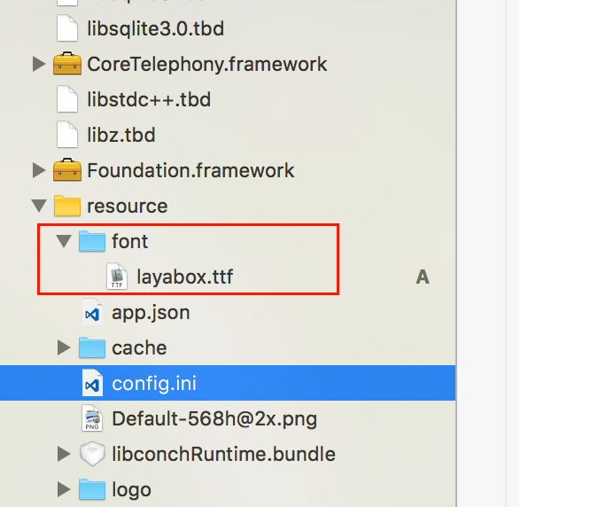

# Embed fonts

## 1. Font introduction

Due to the wide variety of Android devices, the non-uniform font files of Android, and the differences in the default Chinese font paths of each system (coupled with the customization of many domestic manufacturers), reading font.ttf is a difficult problem.

LayaNative's strategy is to enumerate the path to the font file based on the Android system version number. If the loading is successful, the system default font will be used. If the loading is unsuccessful, a font will be downloaded from the LayaBox website and stored locally. When entering for the second time , read local fonts directly.

When developers package apps, they must package fonts into the app by default. If a 4MB TTF font is downloaded on the Internet, it will affect the user experience.

## 2. How to embed fonts

1. Build the android project, find the assets directory, create a font directory, rename the font file to be implanted to "layabox.ttf" and place it in this directory. As shown in Figure 1:


**Tips:**

The template project embeds ttf fonts by default, which will increase the size of the apk. If you care about the apk size, you can delete the assets/font/layabox.ttf font file.

## 3. iOS embedded fonts

1. LayaNative supports iOS embedding default fonts. The specific method is the same as Android. Create a font directory under resource and rename the font to be embedded to layabox.ttf, as shown in Figure 2 below:




## Font modification after version 3.1

After version 3.1, the font system has been optimized, and system fonts are used first by default. If you need to embed custom fonts, you need to register them with the system before they can be used. The following examples show two embedding methods.


### 1. Read the font file in the local assets directory, then register the code through registerFont, and then use the associated font through the font name layabox passed in during registration.
```javascript
function registerFont() {
	var assetFontData = conch.readFileFromAsset('font/layabox.ttf', 'raw');
	if (assetFontData) {
    	if (conch.registerFont("layabox", assetFontData)) {
        	log('Font registration successful');
    	}
    	else {
        	log('Font registration failed');
    	}
	}
}
```


### 2. Download remote font files through ttfloader. The font name passed in during registration is the ttf file name.
```javascript
Laya.loader.load("res/maobi.ttf", Loader.TTF).then(() => {
    var label: Label = new Label();
    label.font = "maobi";
    label.text = "Custom embedded font";
    label.fontSize = 30;
    label.color = '#FFFFFF';
   	 
    this.Main.box2D.addChild(label);
    label.pos(30, 50)
});
```

